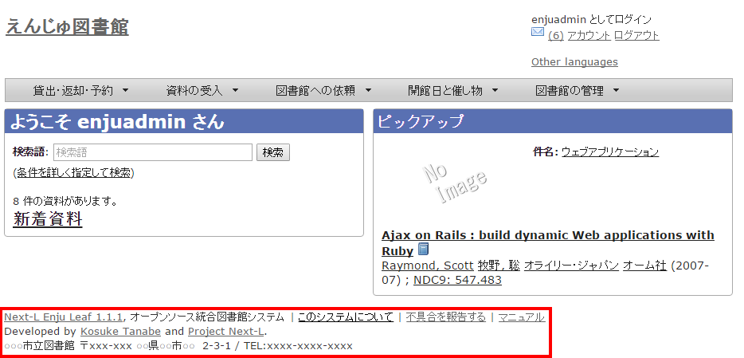

* Contents
{:toc}

{::comment} misc.md {:/comment}

第10章 その他（カスタマイズなど） {#section10}
========================

10-1 Enjuを運用するにあたっての留意点・注意点 {#section10-1}
-------------------------------------------------------------

Enjuサーバは，外部からネットワーク経由でアクセスすることができるサービスとして運用されます。したがって，そのセキュリティ管理などには十分に気を配る必要があります。Enjuサーバ自体は，配付時点での最新の状況に対応できるようにセキュリティ対策を講じていますが，日進月歩のネットワーク環境では，新しいネットワーク上の脅威が発生する可能性もあります。このような状況に対応するため，運用に際しては，特に以下の２つにご注意ください。

1. 最新の配付パッケージを使用すること：Enju仮想マシンファイルについても，今後，バージョンアップを重ねるたびに配付を予定しています。機能面での充実というだけではなく，セキュリティ面からも最新のパッケージを使用ください。
2. 不必要な外部からのアクセスを禁止すること：場合によっては，ファイアウォールの導入やリモートルータでのフィルタリングについても検討した方が良いこともあるでしょう。

10-2 トップ画面やヘルプなどに表示する画像を置く {#section10-2}
--------------------------------------------------------------

#### 1. 置きたい画像を用意します。（ここでは例として logo.png とします）

#### 2. インストールしてあるEnju の app/assets/images/ 以下に画像ファイルを置きます。

#### 3. 以下のコマンドを実行します。

        $ bundle exec rake assets:precompile

#### 4. 参照するURLについて

以下のようなURLになりますのでこのURLを使って参照することができます。

* 書式： ベースURL/assets/ファイル名
* URL例（デモサーバー）: http://enju.next-l.jp/assets/logo.png
* URL例（仮想マシン）: http://localhost:8080/assets/logo.png

<!-- 関連issue #1144  -->

10-3 フッターをカスタマイズする {#section10-3}
----------------------------------------------

図書館の所在地や電話番号、クレジットなどを書きたいときに使用します。
設定する画面がないため、これはサーバー上の作業をする必要があります。

#### 1. 念のため「[8-1 Enjuの停止](enju_install_vm_8.html#section8-1)」を実行します。

#### 2. 以下のファイルをダウンロードし、中身を編集します。

[https://raw.githubusercontent.com/next-l/enju_leaf/1.1/app/views/page/_footer.html.erb](https://raw.githubusercontent.com/next-l/enju_leaf/1.1/app/views/page/_footer.html.erb)

#### 3. インストールしてあるEnjuに app/views/page ディレクトリを作成します。

        $ mkdir -p app/views/page

#### 4. 2のファイルを3で作成したディレクトリにコピーします

#### 5. 「[8-3 Enjuを再起動](enju_install_vm_8.html#section8-3)」を実行します。

#### 6. 見栄えを確認します。修正が必要なら 4.のファイルを修正し、5と6 の手順を行います。

10-4 ヘッダーをカスタマイズする {#section10-4}
--------------------------------------------------------------

（現在準備中です）

10-5 「条件を詳しく指定して検索」の画面をカスタマイズする {#sction10-5}
-----------------------------------------------------------------------

Enju 「条件を詳しく指定して検索」の画面をカスタマイズする方法を説明します。
設定する画面がないため、これはサーバー上の作業をする必要があります。

#### 1. [10-3](#section10-3)節 の 1. と同様です

#### 2. 以下のファイルをダウンロードし、中身を編集します。

[https://github.com/next-l/enju_leaf/blob/1.1/app/views/page/advanced_search.html.erb](https://github.com/next-l/enju_leaf/blob/1.1/app/views/page/advanced_search.html.erb)

#### 3. インストールしてあるEnjuに、ディレクトリを作成します。

        $ mkdir -p app/views/page

#### 4. [10-3](#section10-3)節 の 4. ～　6. と同様です。

10-6 トップの画面の検索フォームをカスタマイズする {#sction10-6}
-----------------------------------------------------------------------

Enju トップの画面の検索フォームをカスタマイズする方法を説明します。
設定する画面がないため、これはサーバー上の作業をする必要があります。

#### 1. [10-3](#section10-3)節 の 1. と同様です

#### 2. 以下のファイルをダウンロードし、中身を編集します。

[https://github.com/next-l/enju_leaf/blob/1.1/app/views/page/_search_form.html.erb](https://github.com/next-l/enju_leaf/blob/1.1/app/views/page/_search_form.html.erb)

#### 3. インストールしてあるEnjuに、ディレクトリを作成します。

        $ mkdir -p app/views/page

#### 4. [10-3](#section10-3)節 の 4. ～　6. と同様です。

10-7 検索結果一覧画面の検索フォームをカスタマイズする {#sction10-7}
-----------------------------------------------------------------------

Enju 検索結果一覧画面の検索フォームをカスタマイズする方法を説明します。
設定する画面がないため、これはサーバー上の作業をする必要があります。

#### 1. [10-3](#section10-3)節 の 1. と同様です

#### 2. 以下のファイルをダウンロードし、中身を編集します。

<https://github.com/next-l/enju_flower/blob/1.1/app/views/manifestations/_index_form.html.erb>

#### 3. インストールしてあるEnjuに、ディレクトリを作成します。

        $ mkdir -p app/views/manifestations

#### 4. [10-3](#section10-3)節 の 4. ～　6. と同様です。


