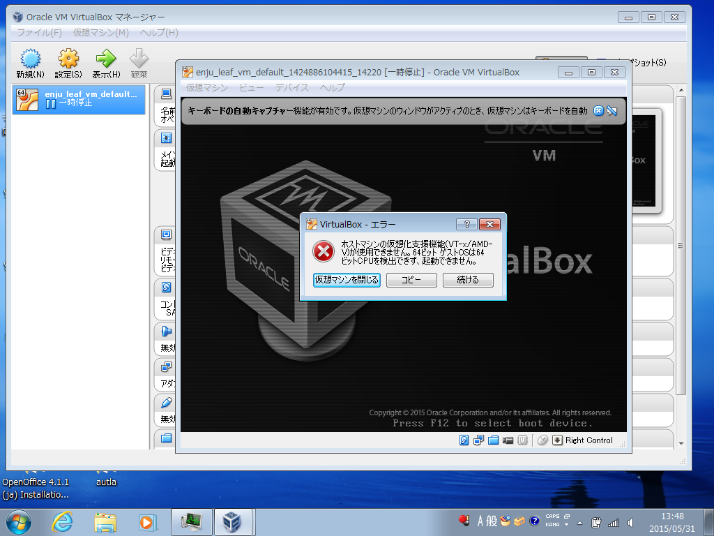

* Contents
{:toc}
{::comment} FAQ.md {:/comment}

第11章 トラブルシューティング {#section11}
===========================================

## Q. 仮想マシンにsshでアクセスする場合のIPアドレスとポート番号が分かりません。

仮想マシンのバージョンによってやり方が異なります。

1. Next-L Enju Leaf 1.1.0.rc12以降の場合：
   * IPアドレス：localhost
      * または 127.0.0.1 
      * または 「仮想マシンをインストールしたマシン自身のIPアドレス」(--> 参考：[3-1-3 IPアドレスの確認](enju_install_vm_3.html#section3-1-3)の 6. のIPv4のアドレス )
   * ポート番号：2222

2. Next-L Enju Leaf 1.1.0.rc7の場合：
   * IPアドレス：```ifconfig```で表示されるIPアドレス（--> [詳細へ](enju_install_vm_4.html#section4-5-rc7)）
   * ポート番号：22　（デフォルトのポート番号）

## Q. http://localhost:8080 にアクセスしたらすでに使われています？といったエラーがでて起動できません。

（工事中）

## Q. VirtualBoxでプロキシ環境でも使用できる方法をおしえてください。

#### 1. https へのアクセスは可能である必要があります。

#### 2. ~/enju/.envに以下の2行を追加してください。プロキシのホスト名とポートは適宜変更してください。EnjuがNDLサーチ検索など外部のサービスにアクセスするための設定です。

	export http_proxy=http://proxy.example.com:8080
	export https_proxy=$http_proxy

#### 3. ~/.profileに以下の2行を追加してください。プロキシのホスト名とポートは適宜変更してください。rubygems.orgからgemを取得するための設定です。

	export http_proxy=http://proxy.example.com:8080
	export https_proxy=$http_proxy

#### 4. ~/.gitconfig（無ければこのファイルを作成する） に以下を記入してください。プロキシのホスト名とポートは適宜変更してください。gitでプロキシを使用するための設定です。

	[https]
		proxy = http://proxy.example.com:8080
	[http]
		proxy = http://proxy.example.com:8080
	[url "https://"]
		insteadOf = git://

#### 5. ログアウトしてログインしなおしてください

#### 6. Enjuを再起動してください（--> [詳細へ](enju_install_vm_8.html#section8-3)）

<div class="alert alert-info memo">
【Memo】バージョン1.1.0rc15現在、認証機能付きプロキシ設定には対応していません。
</div>

## Q. VT機能が無効になっているというメッセージが表示されます。

VirtualBoxを起動した際，64bit CPUを使用していても，以下のような警告画面が表示されて起動できないことがあります。これは，Virtualization Technologyという機能が無効になっている場合などに表示されます。



各コンピュータのマニュアルを参照してBIOSのセットアップでVirtualization Technology機能を有効にしてから再起動してください。

Virtualization Technology機能を有効にしても，VirtualBoxを再起動した際，エラーが発生して正しく動作しないことがあります。その場合，再起動を何度か行う，再インストールを行うなどしてください。

## Q.「xxxx.vbox」というファイルが見つからない。

以下を確認してください。

1. 「仮想マシン(M)」→「追加(A))」を押していますか。
   * 「追加(A)」を押すと，「仮想マシンファイルを選択」というウィンドウが開いて，ファイルを選択することができるようにならないでしょうか？
2. 正しい場所を選択していますか。
   * 配布されているzipファイルを展開した時に作成されるフォルダを選択してください。展開したフォルダが見つからない場合は，zipファイルを展開するということ自体が正しくできているかどうか確認してください。

## Q. ネットワークの設定で，IPアドレスの割り当てが正常に行われません。

eth1に対するIPアドレスの割り当てが正常に行われず，ifconfigした場合にlo のみしか表示されなくなってしまう場合があります。このような場合においては，2.7に示す /etc/network/interfacesの指定時に，eth1 ではなく，全てeth0と指定して再度起動してみてください。

## Q. 大きなファイルをTSVインポートしようとすると"413 Request Entity Too Large　nginx/1.4.6 (Ubuntu)"といったエラーメッセージが表示されてできません。

配布している仮想マシンでは、
TSVインポートに使えるファイルサイズは、標準設定では、1MBになっています。
これは、仮想マシンで使っているWebサーバー：nginxの設定による制約です。
そのため、1MBを越えるファイルサイズの場合は、質問に挙げられたような状況になります。

たとえば20MBなど少し大きめのサイズまでできるようにするには、次のようにします。

#### 1. 設定ファイルのバックアップをとる（念のため）

	$ sudo cp /etc/nginx/nginx.conf /etc/nginx/nginx.conf.old

#### 2. 設定ファイルを編集する。

	$ sudo vi /etc/nginx/nginx.conf

として編集する。

	http {
		...
	}

の部分に、一行足して

	http {
		...
		client_max_body_size 20M;
	}

とします。

#### 3. Webサーバーを再起動する。

	$ sudo /etc/init.d/nginx restart

#### 4. OK が表示されるのを確認する。されなければ、 2. の編集を再度行い、3. 以降を実行する。

	　　* Restarting nginx nginx                                                [ OK ]

## Q. 504 Gateway Timeout というエラーメッセージが表示されて画面が表示されません。

配布仮想マシンでは、設定の誤り等により起動時にエラーが発生している場合、ログファイルを確認する必要があります。
エラーメッセージが出ていないか以下の場所等を確認すること。

[起動時のエラー]
* /var/log/upstart/enju_leaf-web-1.log
* /var/log/upstart/enju_leaf-solr-1.log
* /var/log/upstart/enju_leaf-resque-1.log

[稼働中のログ]
* enju/log/production.log
* sunspot-solr-production.log


