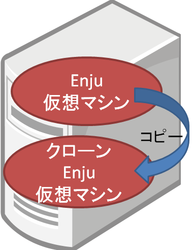
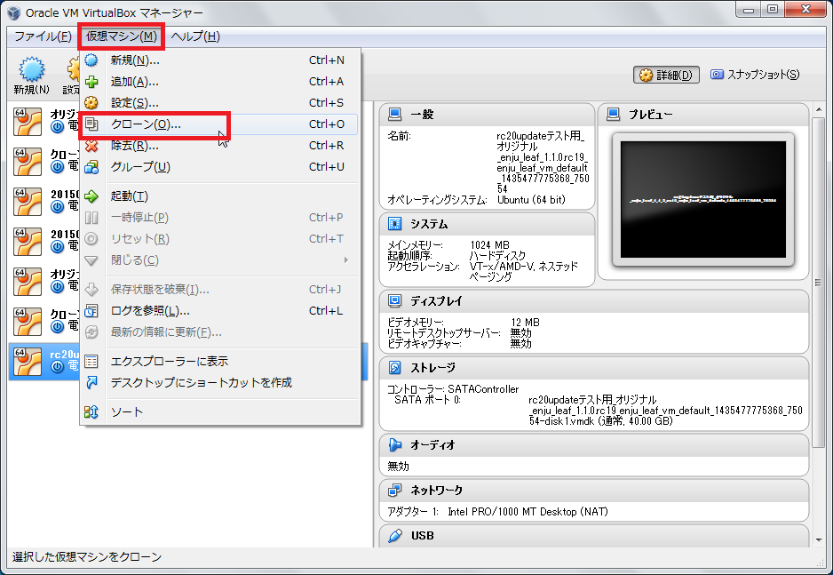
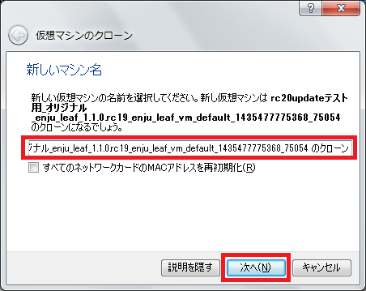
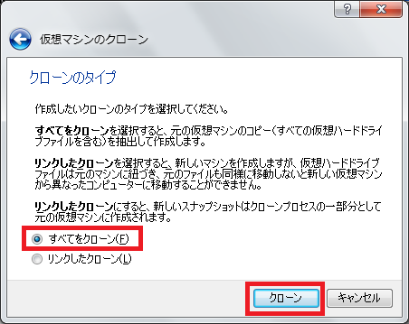
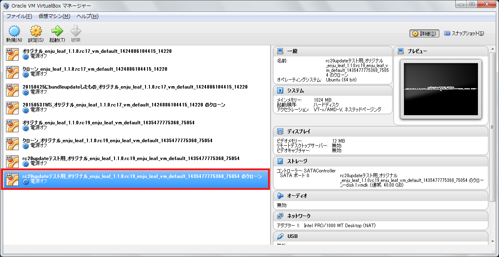
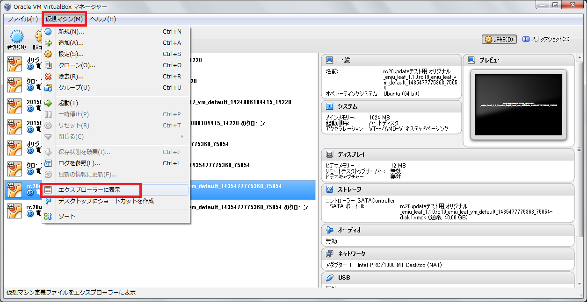
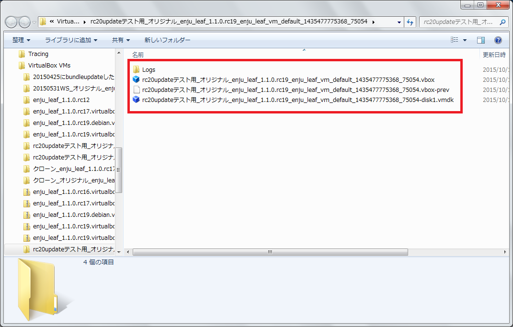

* Contents
{:toc}

第9章 データのバックアップとリストア {#section9}
================================================

{:toc}

以下の方法があります。

* 仮想マシンのクローンをつくる・使う
* 仮想マシンのWindows上のファイルのバックアップをとる・使う
* 仮想マシン上のデータのみのバックアップ・リストアする

9-1 仮想マシンのクローンを作成する・使う {#section9-1}
------------------------------------------------------

今使ってる仮想マシンとそっくりなコピー（＝クローン）を同じPC上に作る方法です。
enjuのアップデートを試すときなどに使います。

### 9-1-1 仮想マシンのクローンを作成する {#section9-1-1}

今使ってる仮想マシンとそっくりなコピー（＝クローン）を同じPC上に作る方法です。

#### 1. 現在、使っている仮想マシンをシャットダウンします。

[「Enju 仮想マシンのシャットダウン」](enju_install_vm_4.html#section4-6-1)を参照してください。

#### 2. VirtualBox の現在使っている仮想マシンをクリックします。

#### 3. 「仮想マシン」メニューの「クローン(O)...」をクリックします。

#### 4. 名前を入力し※、「次へ」をクリックします。

※とくに変更しなければ、 「_クローン」という名前になります。日付などをつけてわかりやすい名前にしておくことをお勧めします。

#### 5. 「すべてをクローン」になっていることをを確認し※、「クローン」をクリックします。

※なっていなければ、選択します。

#### 6. しばらく待ちます。時間がかかります。

以下のような、ウインドウがでます。

#### 7. クローンが作成されました。

### 9-1-2 仮想マシンのクローンを使用する {#section9-1-2}

[「4-3 Enju仮想マシンの起動とログイン」](enju_install_vm_4.html#section4-3)と同様の手順で使用できます。

9-2 仮想マシンごとバックアップをとる・使う {#section9-2}
--------------------------------------------------------

今使っている仮想マシンを外付けのHDDにコピーして、
マシンのハードウェア障害に備えたり、
別のマシンに仮想マシンごと移築したいときの方法です。

### 9-2-1 仮想マシンごとバックアップをとる {#section9-2-1}

#### 1. 現在、使っている仮想マシンをシャットダウンします。

[「Enju 仮想マシンのシャットダウン」](enju_install_vm_4.html#section4-6-1)を参照してください。

#### 2. VirtualBox の現在使っている仮想マシンをクリックします。

#### 3. 「仮想マシン」メニューの「エクスプローラーに表示」をクリックします。

#### 4. 表示されたファイルやフォルダを全て外付けHDDにコピーします。

### 9-2-2 バックアップをとったデータを使う {#section9-2-2}

バックアップをしたファイルを他のマシンにコピーし、
[「4-2 VirtualBoxを開く」](enju_install_vm_4.html#section4-2)と同様の手順で使用できます。

9-3 データのみのバックアップ {#section9-2}
------------------------------------------

仮想マシン以外マシンにサーバーを移したいとき、例えば、Amazon EC2に移植したい、
Macに移植したい、Cent OS に移植したいといった場合の方法です。
こちらについては、[他のサーバへの移行](https://github.com/next-l/enju_leaf/wiki/Backup)を参照してください。

{::comment}別ファイル名候補：backup.md{:/comment}


