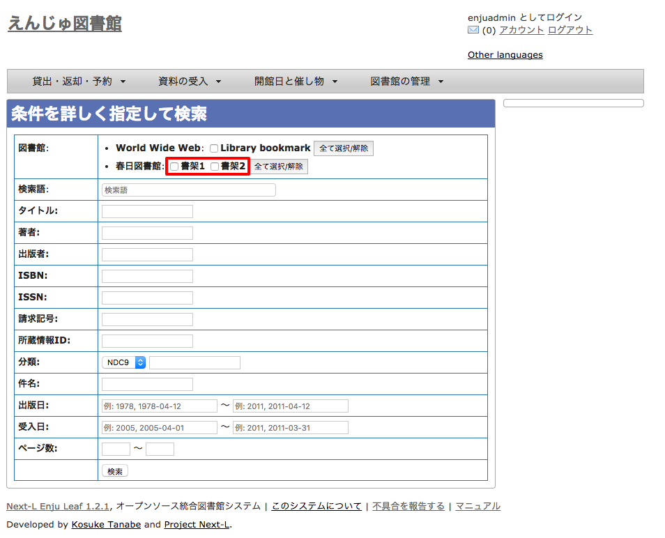

* Contents
{:toc}

第8章 資料を検索する {#section8}
================================

Enjuを利用した資料の検索方法には、演算子やフィールド名を直接入力して検索する方法と、該当のテキストボックスに検索語入力する方法があります。

基本的な使い方については、 [利用マニュアルの「第1章 資料を検索する」](enju_user_1.html) を
参照してください。

ここでは、Library権限とAdministrator権限でログインした時にのみ利用できる機能について説明します。

8-1 本棚を指定した検索 {#section8-1}
------------------------------------

[利用者マニュアル の「1-2 条件を詳しく指定して検索する」](enju_user_1.html#section1-2)の
「条件を詳しく指定して検索」の画面にて、本棚を指定して検索ができます（User権限やGuest権限の場合は本棚のチェックボックスは表示されません）。


