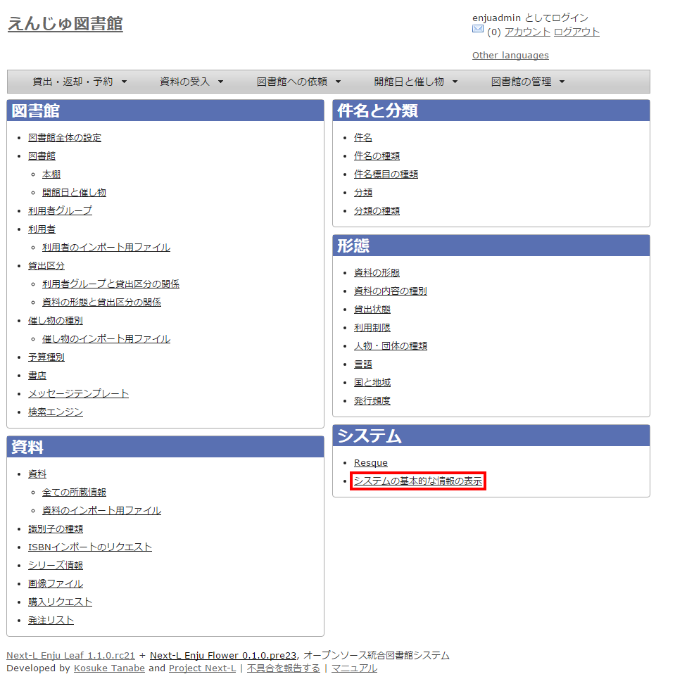
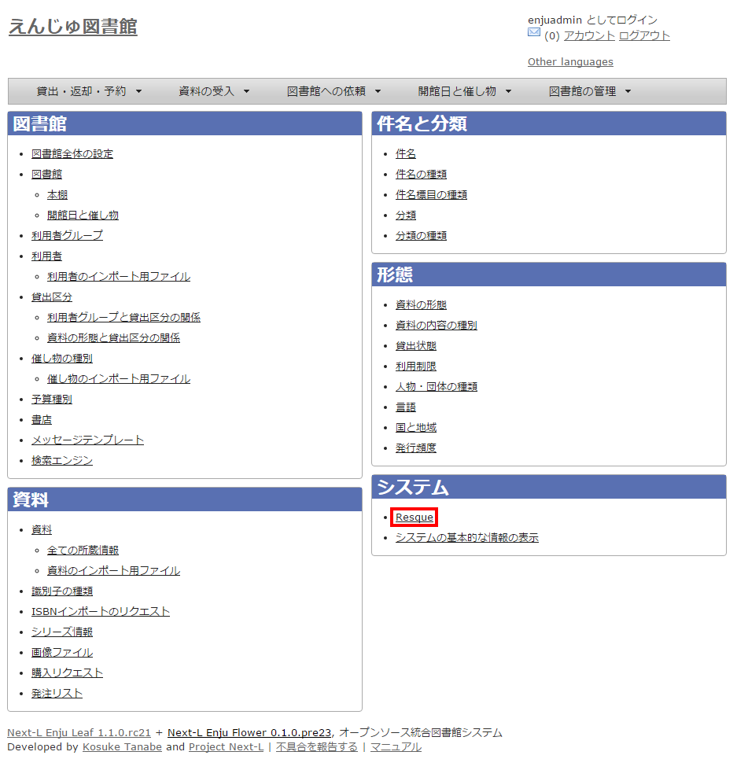
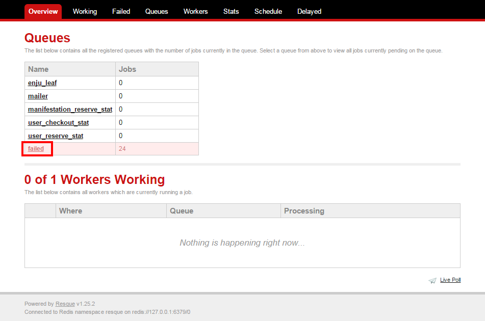
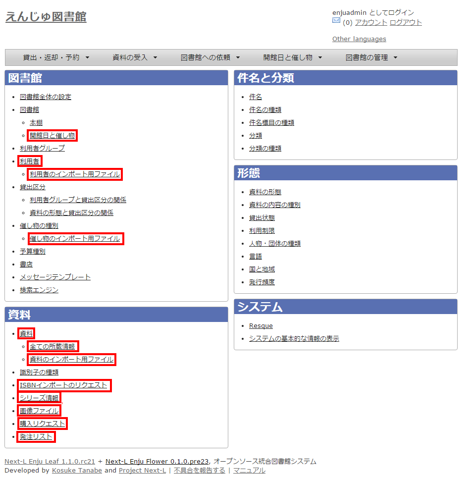

* Contents
{:toc}

第7章 その他 {#section7}
========================

7-1 システムの基本的な情報の表示機能 {#section7-1}
--------------------------------------------------

システムの基本的な情報を確認できる機能があります。不具合の報告時などに、こちらの情報をシステム担当者にお知らせください。

#### 1. ［図書館の管理］メニューから［システムの設定］を選択します。

#### 2. システムの[システムの基本的な情報の表示]リンクをたどります。

#### 3. システムの基本的な情報を確認できます。

* Ruby： Ruby のバージョンが表示されます。（例： ruby 2.2.2p95 (2015-04-13 revision 50295) [x86_64-linux-gnu])
* Environment: システムの環境が表示されます（例：production）
* Gems：Enju の詳細なバージョン等が表示されます（例：enju_leaf: 1.1.0.rc21，enju_circulation: 0.1.0.pre48）
* Languages：使用言語が表示されます（例：ja: 日本語 (既定の言語)）

7-2 非同期処理の状態確認機能（Resque） {#section7-2}
--------------------------------------------------------

資料等のインポートやエクスポート、自動メール送信などの非同期処理の状態を確認できる機能があります。

#### 1. ［図書館の管理］メニューから［システムの設定］を選択します。

 

#### 2. システムの[Resque]リンクをたどります。

#### 3. Resque の画面で非同期処理の状態を確認できます。エラーを確認するには[failed]リンクをたどります。

#### 4. 詳細なエラーを確認するために、閲覧したいエラーのリンクをたどります。

#### 5. 詳細なエラーが表示されます。

7-3 運用マニュアルにおいて説明する機能 {#section7-3}
----------------------------------------------------

［図書館の管理］メニューから［システムの設定］を選択し表示される画面のうち、
次にあげるメニューについては、運用時に使用するメニューですので、
運用マニュアルにて説明します。

* [開館日と催し物] 
    * [開館日と催し物]メニューから[全ての催し物]をたどっていける画面と同じ
    * 参照：運用マニュアル「[第7章 休館日と催し物を登録する](enju_operation_7.html)」
* [利用者]　
    * [図書館の管理]メニューから[利用者の管理]をたどっていける画面と同じ
    * 参照：運用マニュアル「[第3章 利用者情報を管理する](enju_operation_3.html)」
* [利用者のインポート用ファイル]
    * [図書館の管理]メニューから[インポート]をたどり、[利用者]リンクをたどっていける画面と同じ
    * 参照：運用マニュアル「[3-2 既存のデータから利用者情報をインポートする](enju_operation_3.html#section3-2)」
* [催し物のインポート用ファイルの新規作成]
    * [開催日と催し物]メニューから[インポート]をたどっていける画面と同じ
    * 参照：運用マニュアル「[7-2-2 催し物のデータをインポートする](enju_operation_7.html#section7-2-2)」
* [資料]
    * トップ画面において検索式を何もいれずに[検索]ボタンをクリックしたときにいける画面と同じ
    * 参照：運用マニュアル「[第9章 資料を検索する](enju_operation_9.html)」
* [全ての所蔵情報]
    * 参照：運用マニュアル「[4-3 所蔵情報を登録・一覧表示する](enju_operation_4.html#section4-3)」
* [資料のインポート用ファイル]
    * [資料の受入]メニューから「TSVファイルからのインポート]をたどり、右メニューの[資料のインポート用ファイルの一覧]をたどっていける画面と同じ
    * 参照：運用マニュアル「[4-2-1 TSVファイルを読み込んで登録する](enju_operation_4.html#section4-2-1)」
* [ISBNインポートのリクエスト]
    * [資料の受入]メニューから[ISBNを入力]をたどり、[ISBNインポートリクエストの一覧]リンクをたどっていける画面と同じ
    * 参照：運用マニュアル「[4-2-3 ISBNコードを入力して1件ずつ登録する](enju_operation_4.html#section4-2-3)」
* [シリーズ情報]
     * (現在、運用マニュアル作成中です）
* [画像ファイル]
     * 画像を登録した資料の「資料の表示」画面の右メニューにある[画像ファイルの一覧]リンクをたどっていける画面と同じ
     * 参照：運用マニュアル「[4-8-2 画像の一覧表示](enju_operation_4.html#section4-8-2)」
* [購入リクエスト]
     * [図書館への依頼]メニューから[購入リクエスト]をたどっていける画面と同じ
     * 参照：運用マニュアル「[4-1-2 発注したい図書（購入リクエスト）を発注リストに登録する](enju_operation_4.html#section4-1-2)」
* [発注リスト]
     * [図書館の管理]メニューから[発注リスト]をたどっていける画面と同じ
     * 参照：運用マニュアル「[4-1-1 発注リストを作成する](enju_operation_4.html#section4-1-1)」


