* Contents
{:toc}

第4章 資料を予約する {#section4}
=================================

予約の機能には次のようなものがあります。

* 資料の予約をする
* 予約した資料を確認する
* 予約の変更・取消をする
* 予約した資料が用意されたことを知る
* 予約の一覧をTSVでダウンロードする
* 予約の一覧のRSSを取得する

4-1 資料の予約をする {#section4-1}
----------------------------------

### 4-1-1 ログインせずに検索して後からログインして予約する場合 {#section4-1-1}

#### 1. 予約したい本の名前を検索語に入力し、[検索]をクリックします。

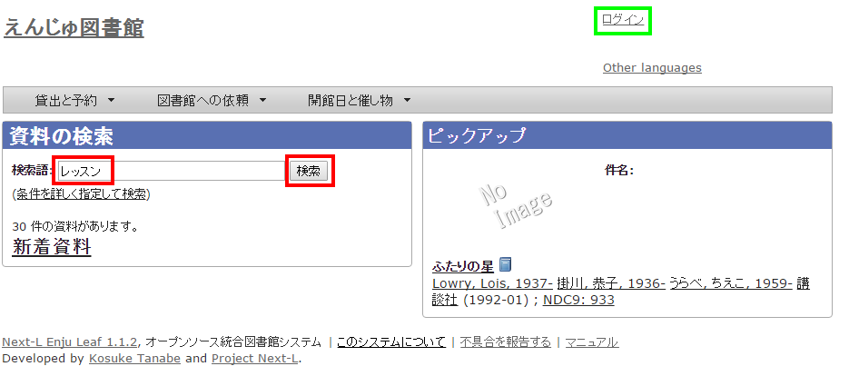

#### 2. 予約したい本が検索されたら、その本のタイトルをクリックします。

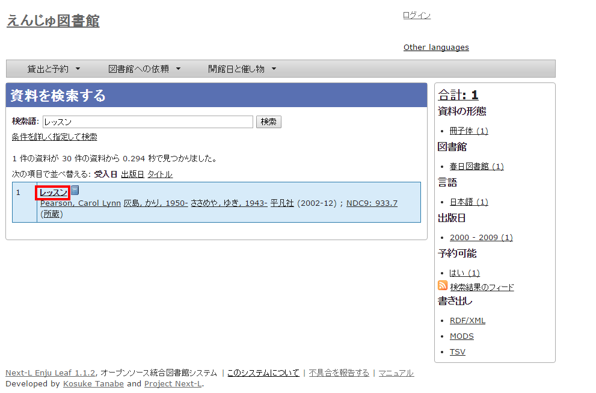

#### 3. 右メニューの[この資料を予約する]をクリック

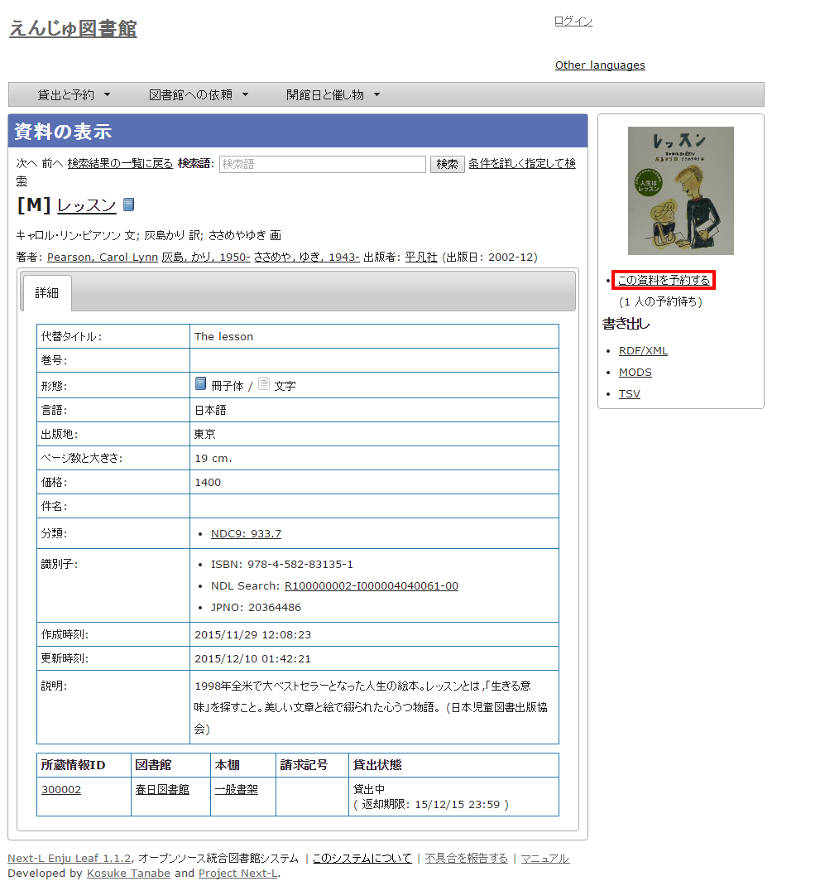

#### 4. 自分のユーザー名とパスワードを入力してログインをクリックします。

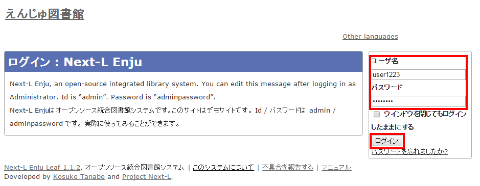

#### 5. 必要ならば、「有効期限（この日以降は不要）」と「受け取り館」を入力し、［登録する］ボタンをクリックします。

「有効期限（この日以降は不要）」を設定すると、その日を過ぎた予約はキャンセルされます。

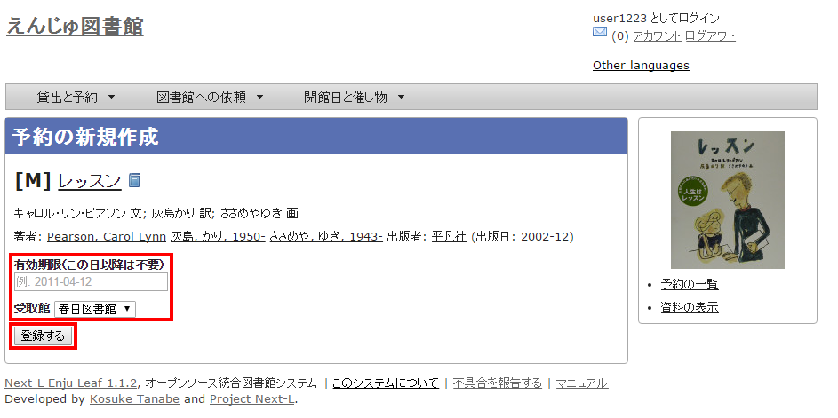

#### 6. 「予約が正常に作成されました」と表示され、予約が作成されます。

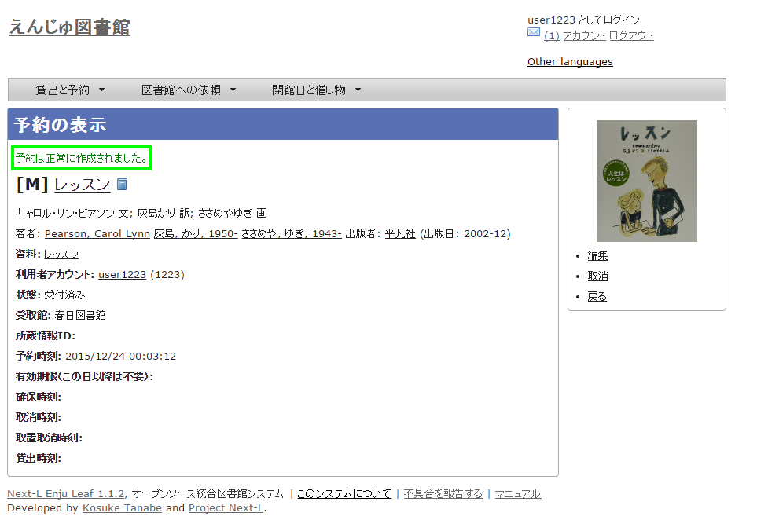

### 4-1-2 ログインした状態で検索した場合 {#section4-1-2}

#### 1. 予約したい本の名前を検索語に入力し、［検索］をクリックします。  

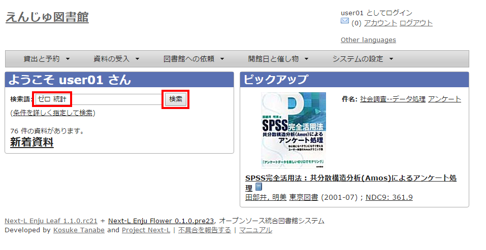

#### 2. 予約したい本が検索されたら、［予約］をクリックします。  

※ ログインしていないと[予約]リンクは表示されません

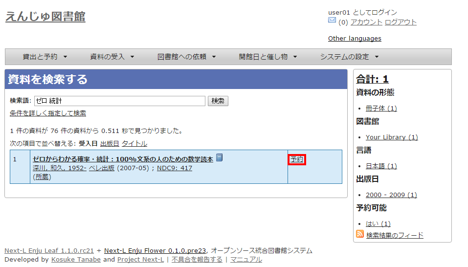

#### 3. 必要ならば、「有効期限（この日以降は不要）」と「受け取り館」を入力し、［登録する］ボタンをクリックします。  

「有効期限（この日以降は不要）」を設定すると、その日を過ぎた予約はキャンセルされます。

#### 4. 「予約が正常に作成されました」と表示され、予約が作成されます。

4-2 予約した資料を確認する {#section4-2}
----------------------------------------

#### 1. ［貸出と予約］メニューから［予約の一覧］を選択します。

#### 2. 予約の一覧が表示されます。右メニュー[取置済み]リンクをクリックします。

「状態」の列をみれば、「取置済み」や「受付済み」が分かります。「取置済み」や「受付済み」になった場合は、メッセージ機能やメールでお知らせがあります。
予約の詳細な情報を知りたい場合は、Id列のリンクか、資料のタイトルのリンクをクリックします。

#### 3. [取置済み]の予約だけが表示されます。右メニューの[この絞り込みを解除する]をクリックします。

#### 4. 最初に表示したように、すべての予約が表示されます。

4-3 予約の変更をする {#section4-3}
----------------------------------------

受取館を変えたり、有効期限を変えたりできます。

#### 1. ［貸出と予約］メニューから［予約の一覧］を選択します。

#### 2. [編集]をクリックします。

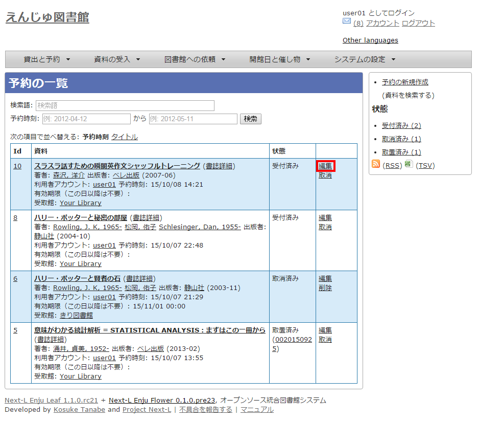

#### 3. 有効期限（この日以降は不要）や受取館を修正します。

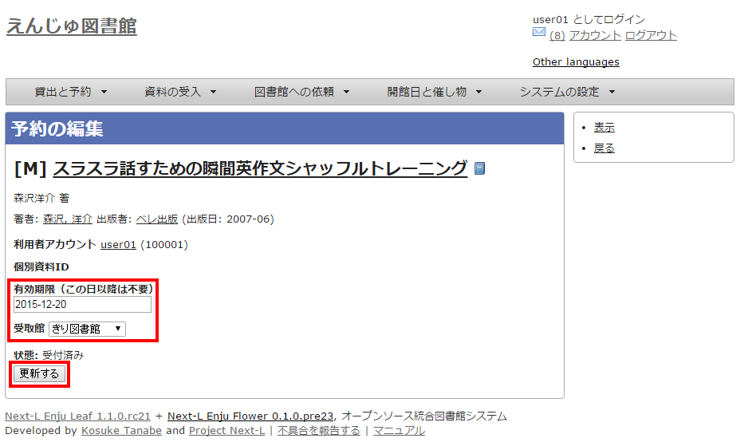

※現在、取置済みの予約でも編集できますが、いずれはできないようにする予定です（参照： [#839](https://github.com/next-l/enju_leaf/issues/839)）。

4-4 予約の取消（キャンセル）をする {#section4-4}
----------------------------------------

予約を取り消す（キャンセルする）ことができます。

#### 1. ［貸出と予約］メニューから［予約の一覧］を選択します。

#### 2. [取消]をクリックします。

#### 3. [OK]をクリックします。

#### 4. 予約が取り消されました。

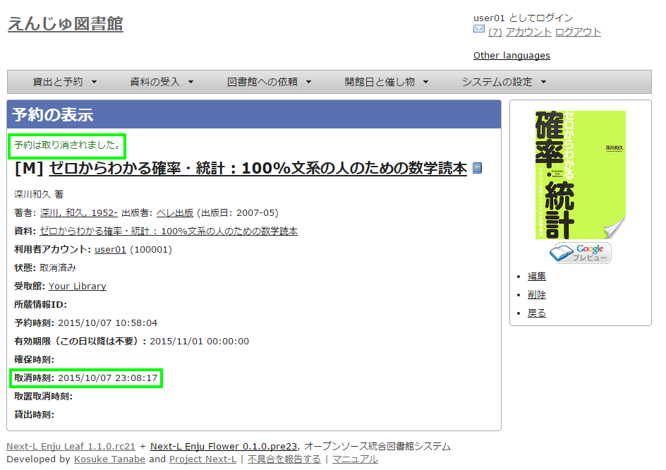

4-5 予約の記録を削除する {#section4-5}
----------------------------------------

既に完了したり、取り消したりした予約の記録を削除することができます。

#### 1. ［貸出と予約］メニューから［予約の一覧］を選択します。

#### 2. [削除]をクリックします。

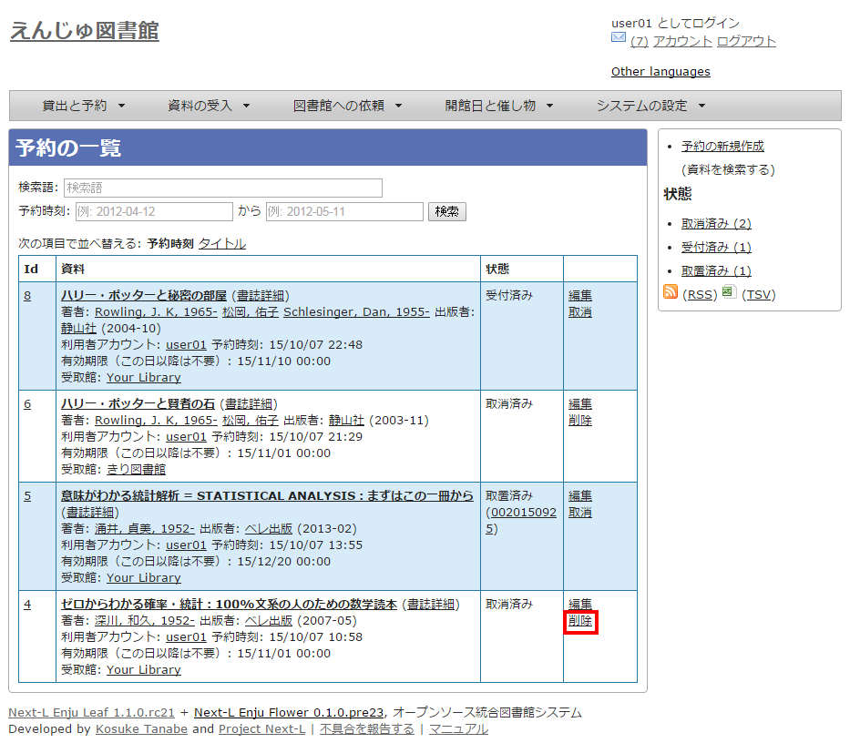

#### 3. [OK]をクリックします。

#### 4. 予約の記録1件分が削除されました。

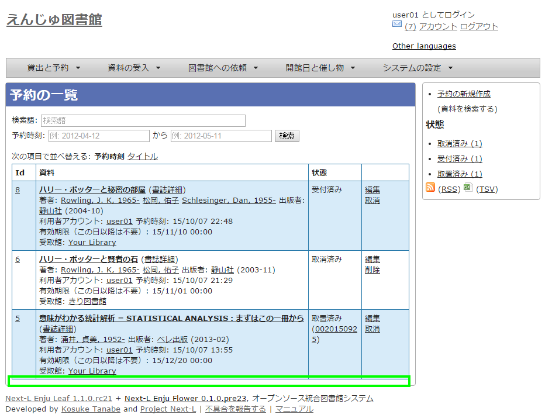

4-6 予約した資料が用意されたことを知る {#section4-6}
----------------------------------------------------

※ Enju Leaf 1.1.0 時点ではこの機能にバグがあり、メッセージ機能、メール通知機能ともに動作していません(詳細 [#1016](https://github.com/next-l/enju_leaf/issues/1016))。

* メッセージ機能を使って知ることができます。
* [メールアドレスを設定](enju_user_3.html#section3-2)している場合は、メールでも通知が来ます。

4-7 予約の一覧をTSVを表示する {#section4-7}
----------------------------------------------------

#### 1. ［貸出と予約］メニューから［予約の一覧］を選択します。

#### 2. 右メニューの[TSV]をクリックします。

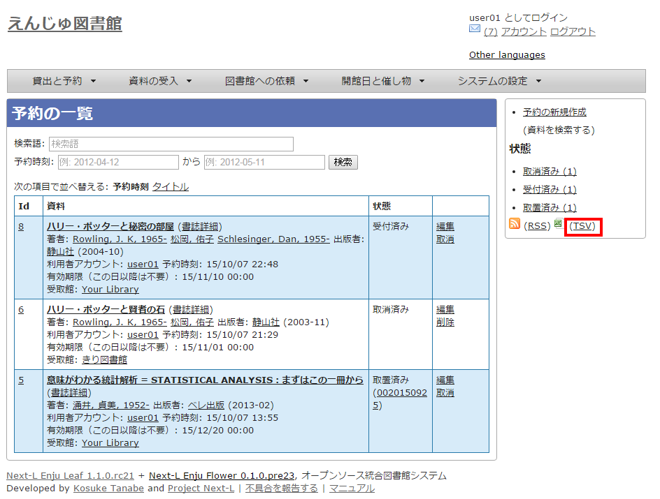

#### 3. TSVが表示されます。

4-8 予約の一覧のRSSを表示する {#section4-8}
----------------------------------------------------

#### 1. ［貸出と予約］メニューから［予約の一覧］を選択します。

#### 2. 右メニューの[RSS]をクリックします。

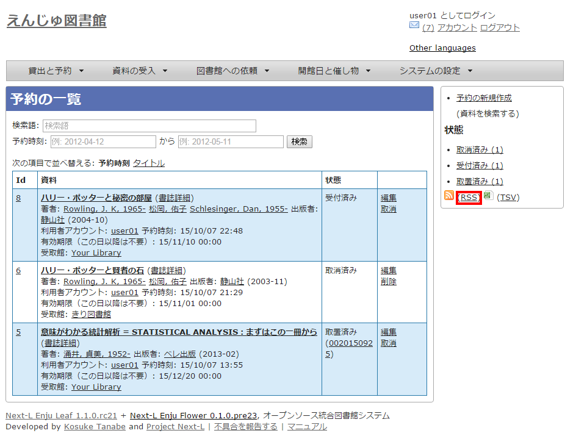

#### 3. RSSが表示されます。


