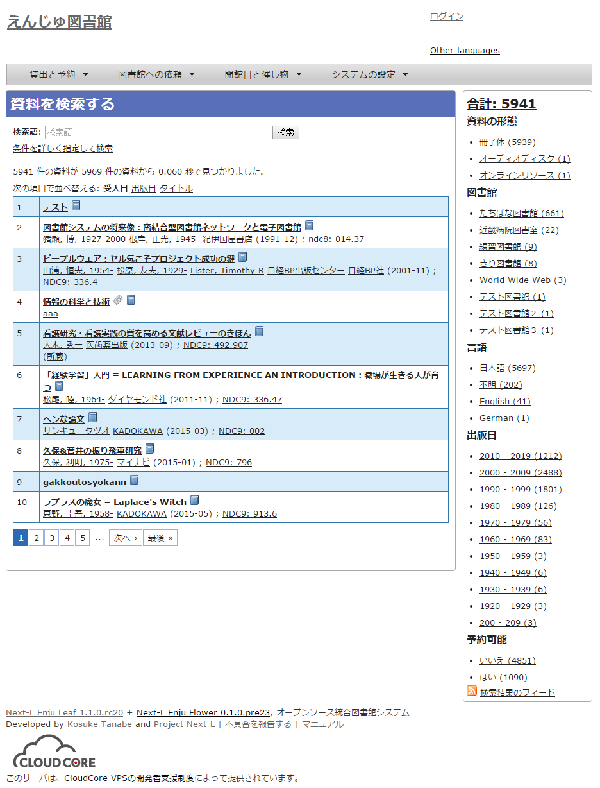
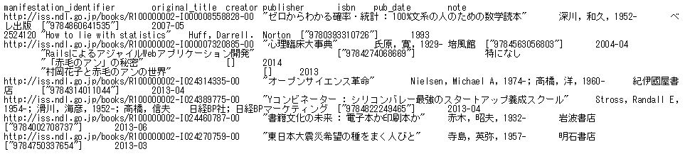

* Contents
{:toc}

第1章 検索結果一覧を取得する {#section1}
================================

Enju は検索結果一覧を好みのフォーマットで取得する機能があります。

* .txt
* .json
* .rdf
* .xml
* .mods
* .sru
* .html

などを取得できます。

1-1 TSVを取得する {#section1-1}
------------------------------------

#### 1. 検索結果を表示します。

#### 2. 検索結果のアドレス欄のURLのmanifestationsの後ろに.txtを追加します。

例：http://enju.next-l.jp/manifestations?utf8=%E2%9C%93&query=&commit=%E6%A4%9C%E7%B4%A2 → http://enju.next-l.jp/manifestations.txt?utf8=%E2%9C%93&query=&commit=%E6%A4%9C%E7%B4%A2
にします

#### 3. この画面の検索結果一覧が表示されます。

※現在、表示している検索結果のみを表示します。他の画面の検索結果は含みません。

(現在準備中です）


