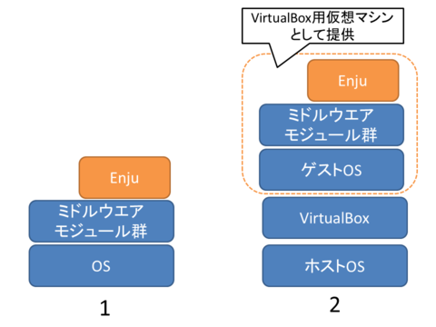
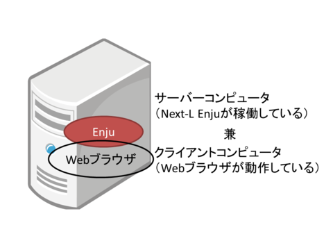
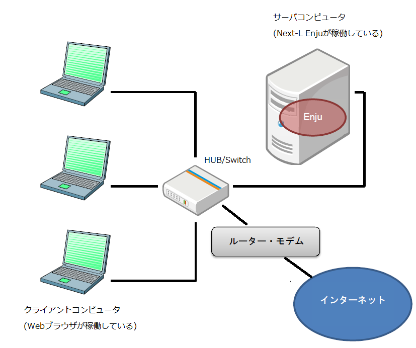

* Contents
{:toc}
{::comment} intro.md {:/comment}

第2章 Enjuを動作させる方法 {#section2}
========================

Enjuを動作させる方法について説明します。

2-1 概要 {#section2-1}
------------------------

Enjuを実行させるために，Project Next-LではGitHub上でソースコードを公開しているほか，VirtualBox環境用の仮想マシンも作成・提供しています。これに対応してEnjuをインストールする方法としては，いくつか方法がありますが，ここでは2つ紹介します(下図を参照)。

1. Enjuを動作させるのに必要な各種ミドルウェアやモジュール群をインストールし，Enjuのプログラムを実行
2. **VirtualBoxがインストールされたコンピュータに，VirtualBox用のEnju仮想マシンを読み込み仮想マシン内でEnjuを実行**

各図書館の状況や開発形態によって，これらの手法から最適な手法を選択することが必要となります。

1.の方法はEnjuが動作する環境整備から行っていこうとするもので，実行することができるコンピュータの範囲も広く，取り込むモジュールの選択なども行えるなど最も自由度が高い方法です。コンピュータの能力に応じたパフォーマンスも発揮することができます。その反面，インストールのためにはOSや，Ruby on Railsの開発環境，ネットワークに関わる比較的高度な知識などが必要となります。初心者には，かなりハードルが高いということもできます。各図書館の状況などにあわせ，Enjuの標準的な環境から大幅に手をいれる必要がある場合などには，この方法をとることが必要となることもあると思われます。

2.の方法はWindowsやLinuxなどのような普段使っているOSの上のアプリケーションのひとつとして動くOSの上でEnjuを動かそうとするものです。普段使っているOSの上でアプリケーションとしてもう一つのOSを実現するためのソフトウェアを動作させ(これがVirtualBoxということになります)，その上でEnjuを動作させることになります。VirtualBox上で動作するEnju(Enju仮想マシンと呼びます)は，Enju本体だけではなく動作環境まで含めた形で提供されるため，VirtualBoxさえ動作するようにすれば，**つまり，2.の方法を用いれば，高いITスキルがない人でも，比較的簡単な作業でEnjuを動かすことができます**。すなわち，VirtualBoxを利用することにより，基礎的なOS(Windowsなど)の操作と，初歩的なネットワークに関する知識があればインストールが可能です。また，普段は別の用途で使っているPCを必要な時だけEnjuが動作するサーバとして使用することもできます。

さらに，Windows上のWebブラウザ(Internet ExplorerやGoogle Chrome, Firefoxなど)からVirtualBox上のNext-L Enjuを利用することで，**2.の方法を用いれば使い慣れた１台のコンピュータのみで，統合図書館システムNext-L Enjuを運用する**こともできます。

ただし，OSの上にOSを重ねるような形になりますのでパフォーマンスは低下します。したがって，ある程度高性能なコンピュータ環境(高性能なCPUやある程度のメモリー量など)が必要となるほか，速度性能的などの点でも他の方法と比較して劣る状況となります。

**本マニュアルでは，「2. VirtualBoxを用いる方法」について述べます。**

まず，第4章において，簡便にNext-L Enjuを利用する手法として，１台のコンピュータ上のみでNext-L Enjuを利用する(同じコンピュータ上でサーバとクライアントの両方を動作させる)方法について述べます。もちろん，使用するコンピュータはデスクトップではなくノートブックでも問題ありません。 

さらに第5章において，設定したNext-L Enjuをネットワークを介して別のコンピュータからも利用する方法について説明していきます。

Next-L Enjuがインストールされたサーバコンピュータにクライアントコンピュータから接続して利用する際，クライアントコンピュータからはブラウザーソフトを利用してNext-L Enjuのデータにアクセスします。したがってクライアントコンピュータのOSは問わず，またEnjuの動作はクライアントコンピュータの環境に依存しません。

2-2 VirtualBoxについて {#section2-2}
------------------

VirtualBoxは，広く利用されている仮想マシン環境構築・運用ソフトウェアです。

### 2-2-1 VirtualBoxの概要 {#section2-2-1}

VirtualBoxは，Oracle社によって提供されている仮想マシン環境構築・運用ソフトウェアです。

仮想マシンとは，１台のコンピュータ上で見かけ上複数のコンピュータを稼働させたり，別の種類のオペレーティングシステム(OS)を同時に稼働させたりするための技術です。

たとえば，VirtualBoxをWindowsコンピュータにインストールし，同一のコンピュータでLinuxなど他のOSを起動します。この場合，LinuxはWindows上の１つのアプリケーションのように動作します。したがって，コンピュータを再起動することなく，WindowsとLinuxをいったりきたりしたり，両方のOS上で動作するソフトウェア間でデータを受け渡したりすることができます。その意味で，ハードディスクのパーティションを２分割した複数のOSをインストールした環境とはまったく異なります。このとき，WindowsをホストOS，Linux をゲストOSと呼びます。

### 2-2-2 VirtualBoxを利用するメリット {#section2-2-2}

VirtualBoxを用いた場合，その上で動作するゲストOSを各環境までセットアップ済みのファイルとして提供できるメリットがあります。これに対して仮想マシン環境を使用しない場合は，LinuxなどのOSのインストールからはじめて，Ruby, Ruby on Rails，さらにSolrのようなミドルウェアのインストールが必要になります。また仮想マシン環境では，他のパッケージシステムとの競合などに注意を払う必要もありません。比較的簡単に行えるVirtualBoxのインストールを行うだけで，Enjuの動作環境の構築を大幅に簡略化することができます。

またVirtualBoxは無償で提供されており，追加費用なしで動作環境を構築できることも大きなメリットです。

2-3 インストールの流れ {#section2-3}
------------------------------------

### 2-3-1 インストールの全体 {#section2-3-1}

VirtualBoxを使ったEnjuのインストールは以下の手順で行います。

1. 動作環境の確認
2. VirtualBoxのダウンロード
3. VirtualBoxのインストール
4. Enju仮想マシンのダウンロード
5. Enju仮想マシンのインストール
6. Enju仮想マシンの動作確認
7. Enju仮想マシンのネットワーク設定
8. Enju仮想マシンの起動

