本マニュアルは，オープンソース統合図書館システム Next-L Enjuのインストール方法について，説明しています。情報システム担当者がNext-L Enjuをインストール作業をするときに，お読みください。

本マニュアルの作成にあたっては，(株)三菱総合研究所の全面的な支援をいただきました。心より感謝いたします。

* TOC
{:toc}

第1章 Enju概要
==============

Enjuとはどのようなシステムなのか，概要を説明します。

1-1 Enjuとは
------------

Enjuは，国会図書館，公共図書館，大学図書館，専門図書館，学校図書館などにおける図書館業務で必要な全ての機能を提供する統合図書館管理用ソフトウェアです。図書館で働く人々の総意として必要と思われる機能を全て実装するほか，図書館利用者が求めるWebサービス機能についても実装していきます。

1-2 Enju開発の経緯
------------------

実際の社会に影響を与えるシステムの出現を目指すためには，実験用システムが作られれば良いというものではなく，実際に導入可能なシステムを考える必要があります。そのためには，実際の図書館業務で発生する様々な問題と解決法を，図書館員をはじめとして図書館に関わる様々な方々に提供いただき，細かなノウハウまで取り込んだ理想的な図書館システムを考えていくことが必要となります。

しかし，図書館員の方々をはじめとして，大勢の図書館に関わる方々は，皆さんそれぞれに忙しく，長期間継続して意見やノウハウの提供をいただくことは簡単なことではありません。ましてや，新しいアイディアを考えていただくという負担を過度におかけすることは，とてもできることではありません。

そこで，仕様の策定と並行して小規模図書館であれば導入可能な，統合図書館システムをプロトタイプ的に開発し，これを使っていただくことで，アイディアを出していただくことといたしました。このプロトタイプとして，統合図書館システムNext-L Enjuは開発が行われました。

こうして開発された統合図書館システム Next-L Enjuは，幾度かの改良が行われ，すぐれた開発環境の存在と開発者の技量の高さ，そして何よりも開発者および関係者の熱意によって，**現在では，単なるプロトタイプの枠組みを超えて，実際の図書館業務に使用することが可能なシステムへと進化しました。**2011年11月11日にリリースされた Next-L Enju Leaf Ver1.0.0 からは，正式名称も「Project Next-Lプロトタイプ Enju」からプロトタイプの文字を取り除き，**「Next-L Enju」を正式名称としています。**

1-3 Enjuを動作させる方法
------------------------

Enjuを実行させるために，Project Next-LではGutHUB上でソースコードを公開しているほか，VMWare環境用の仮想マシンも作成・提供しています。これに対応してEnjuをインストールする方法としては，以下の３つの方法があります。

1. Linux環境にEnjuを動作させるのに必要な各種ミドルウェアやモジュール群をインストールし，Enjuのスクリプトをコピー
2. **VMWare PlayerがインストールされたWindows環境などのコンピュータに，VMWare Player用のEnju仮想マシンを読み込む**
3. VMWare ESX/ESXiがインストールされたコンピュータに，VMWare ESX/ESXi用のEnju仮想マシンを読み込む

各図書館の状況や開発形態によって，これらの手法から最適な手法を選択することが必要となります。

1)の方法はLinuxの上でEnjuが動作する環境整備から行っていこうとするもので，実行することができるコンピュータの範囲も広く，取り込むモジュールの選択なども行えるなど最も自由度が高い方法です。コンピュータの能力に応じたパフォーマンスも発揮することができます。その反面，インストールのためにはLinux OSや，ruby on railsの開発環境，ネットワークに関わる比較的高度な知識などが必要となります。初心者には，かなりハードルが高いということもできます。各図書館の状況などにあわせ，Enjuの標準的な環境から大幅に手をいれる必要がある場合などには，この方法をとることが必要となることもあると思われます。

2)の方法はWindowsやLinuxなどのような普段使っているＯＳの上のアプリケーションのひとつとしてEnjuを動かそうとするものです。ただし，EnjuはWindows用のソフトウェアではありませんので，まずはWindows上などでLinux環境を実現するためのソフトウェアを動作させ(これがVMWare Playerということになります)，その上でさらにEnjuを動作させることになります。VMWare Player上で動作するEnju(Enju仮想マシンと呼びます)は，Enju本体だけではなく動作環境まで含めた形で提供されるため，VMWare Playerさえ動作するようにすれば，**2.の方法を用いれば，高いITスキルがない人ても，比較的簡単な作業でEnjuを動かすことができます**。すなわち，VMWare Playerを利用することにより，基礎的なＯＳ(Windowsなど)の操作と，初歩的なネットワークに関する知識があればインストールが可能です。また，普段は別の用途で使っているPCを必要な時だけEnjuが動作するサーバとして使用することもできます。

さらに，Windows上のWebブラウザ(Internet ExplorerやGoogle Chrome, Firefoxなど)からVMWare Player上のNext-L Enjuを利用することで，**2.の方法を用いれば使い慣れた１台のコンピュータのみで，統合図書館システムNext-L Enjuを運用する**こともできます。

ただし，ＯＳの上にＯＳを重ねるような形になりますのでパフォーマンスは低下します。したがって，ある程度高性能なコンピュータ環境(高性能なCPUやある程度のメモリー量など)が必要となるほか，速度性能的などの点でも他の方法と比較して劣る状況となります。

3)の方法はWindowsなどを介さずにEnju仮想マシンを動作させてしまおうとするもので，仮想化ソフトウェアに関する知識があれば，パフォーマンス良く比較的簡単にサーバを構築することができます。近年は，業務用に用いられている高性能サーバでも，このVMWare ESX/ESXiが標準的な仕組みとして取り入れられている例も多く，Enjuの標準環境に近い運用をする場合などでは長期間に渡って実際の業務に用いることも何ら問題ありません。1.と2.の良いとこ取りのような手法ですが，1.に比較すると自由度は低く，2.に比較すると少し高いスキルが必要となります。

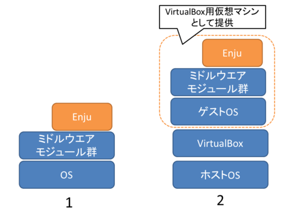

**本マニュアルでは，「2. VMWare Playerを用いる方法」について述べます。**

まず，第3章において，簡便にNext-L Enjuを利用する手法として，１台のコンピュータ上のみでNext-L Enjuを利用する(同じコンピュータ上でサーバとクライアントの両方を動作させる)方法について述べます。もちろん，使用するコンピュータはデスクトップではなくノートブックでも問題ありません。 

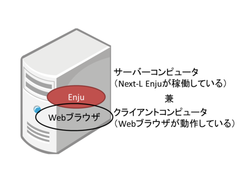

さらに第4章において，設定したNext-L Enjuをネットワークを介して別のコンピュータからも利用する方法について説明していきます。

Next-L Enjuがインストールされたサーバコンピュータにクライアントコンピュータから接続して利用する際，クライアントコンピュータからはブラウザーソフトを利用してNext-L Enjuのデータにアクセスします。したがってクライアントコンピュータのＯＳは問わず，またEnjuの動作はクライアントコンピュータの環境に依存しません。

1-4 VMWareについて
------------------

VMWareは，広く利用されている仮想マシン環境構築・運用ソフトウェアです。

### ■VMWareの概要

VMWareは，米国VMWare社によって提供されている仮想マシン環境構築・運用ソフトウェアです。

仮想マシンとは，１台のコンピュータ上で見かけ上複数のコンピュータを稼働させたり，別の種類のオペレーティングシステム(ＯＳ)を同時に稼働させたりするための技術です。

たとえば，VMWare製品群の１つであるVMWare Player4をWindowsコンピュータにインストールし，同一のコンピュータでLinuxなど他のＯＳを起動します。この場合，LinusはWindoes上の１つのアプリケーションのように動作します。したがって，コンピュータを再起動することなく，WindowsとLinuxをいったりきたりしたり，両方のＯＳ上で動作するソフトウェア間でデータを受け渡したりすることができます。その意味で，ハードディスクのパーティションを２分割した複数のＯＳをインストールした環境とはまったく異なります。このとき，WindowsをホストＯＳ，Linux をゲストＯＳと呼びます。

### ■VMWareを利用するメリット

VMware Player4を用いた場合，その上で動作するゲストＯＳを各環境までセットアップ済みのファイルとして提供できるメリットがあります。これに対して仮想マシン環境を使用しない場合は，LinuxなどのＯＳのインストールからはじめて，Ruby,Ruby on Rails，さらにSolrのようなミドルウェアのインストールが必要になります。また仮想マシン環境では，他のパッケージシステムとの競合などに注意を払う必要もありません。比較的簡単に行えるVMWare Playerのインストールを行うだけで，Enjuの動作環境の構築を大幅に簡略化することができます。

またVMware Player4は無償で提供されており，追加費用なしで動作環境を構築できることも大きなメリットです。

1-5 インストールの流れ
----------------------

### ■インストールの全体

VMWare Playerを使ったEnjuのインストールは以下の手順で行います。

第2章 動作環境の確認とVMWare Player4のインストール
==================================================

2-1 動作環境を確認する
----------------------

作業を開始する前に，Enjuをインストールするコンピュータの環境を確認します。また，コンピュータの環境に応じてEnju仮想マシンの64bit版を用いるか32bit版を用いるかを決めます。

### ■コンピュータの仕様の確認

64bit版の仮想マシンを使うためには，使っているコンピュータがハードウェアの仮想化に対応している必要があります。

コンピュータのCPUのメーカーであるIntelおよびAMDは，どちらもハードウェアの仮想化に対応していますが、使用する用語が異なります。Intelは「インテル バーチャライゼーション・テクノロジー(Intel VT)」と呼び，AMDは「AMD Virtualization(AMD-V)」と呼びます。このいずれかに対応しているかを，コンピュータのマニュアル，Webページなどで確認してください。

ただし，CPUが仮想化に対応していたとしても，BIOSの制約で仮想化が行えないようになっている場合や，BIOSの変更をしなければ初期状態では仮想化がオフになっている場合も多いです。この場合，起動時にBIOS設定でプロセッサの仮想化への対応を有効(Enable)に設定する必要があります。

### ■Windowsが64bit版であるかの確認，使用可能メモリ容量の確認

Windowsが64ビット版であるか，メモリ容量をシステムのプロパティで確認します。

1. ［スタート］ボタンをクリックし，［コンピュータ］を右クリックします。
2. ［プロパティ］をクリックします。  
   
3. 以下の項目を確認します。
   * システムの種類 : 64bitのオペレーティングシステム
   * 実装メモリ　　 : 使用可能容量が 2.00GB 以上
   

### ■ハードディスク空き容量の確認

Enju仮想マシンのインストールと動作に必要なハードディスクの空き容量を確認します。

1. ［スタート］ボタンをクリックし，［コンピュータ］を選択します。
   
2. 以下の項目を確認します。  
   * ドライブの空き容量 : 25.0GB以上を推奨  
   

Memo
ハードディスクに必要な空き容量は，蔵書規模により異なります。25.0GBは蔵書が20 万件の規模を想定しています。これよりも蔵書規模が大きい場合は，より多くの容量が必要となります。

### ■IPアドレスの確認

ホストＯＳのIPアドレスを確認します。

1. ［スタート］ボタンをクリックし，［コントロールパネル］を選択します。  
   
2. ［ネットワークとインターネット］をクリックします。  
   
3. ［ネットワークと共有センター］をクリックします。  
   
4. ［アクティブネットワークの表示］で［ローカルエリア接続］または［ワイヤレスネットワーク接続］をクリックします。  
   
5. ［詳細］をクリックします。  
   
6. 表示された画面で，以下の情報をメモなどに記録します。

   * DHCPの状態
   * IPv4アドレス
   * IPv4サブネットマスク
   * IPv4デフォルトゲートウェイ
   * IPv4 DNSサーバ

   

### ■動作環境による判定

VMWare Player用に用意された Next-L Enju仮想マシンには，64bit版と32bit版の２種類があります。64bit版の方が高速で制約事項も少なく，快適に利用することができますが，バーチャライゼーション・テクノロジー(Virtualization Technology / VT)に対応したCPUを搭載したコンピュータでないと動作しません。

基本的にはIntel VT-x または AMD-Vに対応したCPUを搭載したコンピュータであれば64bit版が動作する筈なのですが，さまざまな理由から，対応したCPUを搭載したコンピュータでも動作しない場合もあります。

#### 64bit版のEnju仮想マシンを利用する場合

* VMWare Player4が動作する x86またはx64pプロセッサ(64bitのCPU)を搭載したコンピュータ
* Windows XP/Vista/7の64bit版
* 2.0GB以上のメモリ
* 25GB以上のハードディスク空き容量
** 蔵書規模20万件の場合。蔵書規模によりさらに多くの空き容量が必要
* LANでネットワークに接続された環境

#### 32bit版のEnju仮想マシンを利用する場合

* VMWare Player4が動作する 64bit または 32bitのCPUを搭載したコンピュータ
* Windows XP/Vista/7の32bt または 64bit版
* 2.0GB以上のメモリ
* 25GB以上のハードディスク空き容量
** 蔵書規模20万件の場合。蔵書規模によりさらに多くの空き容量が必要
* LANでネットワークに接続された環境

**基本的には，新しいマシンであれば多くの場合，64bit版が動作すると思われます。マニュアルなどを参考に，バーチャライゼーション・テクノロジー機能を「有効」にし，64bit版をできるだけお使いください。もし，コンピュータの性能その他の問題で動作しない場合には，32bit版をお使いください。**

Next-L Enju仮想マシンは，VMWare Player4以降でないと動作しません。

2-2 VMWare Player4のダウンロードとインストール
----------------------------------------------

### ■VMWare Playerのダウンロード

VMWare PlayerはVMWare社のWebサイトからダウンロードします。ダウンロードURLは登録後にメールで送付されるため，メールアドレスが必要です。

1. 以下のVMWare社のWebページで［ダウンロード］をクリックします。
   [http://www.vmware.com/jp/products/player/](http://www.vmware.com/jp/products/player/)  
   
2. 必要な情報を入力し，登録を行います。  
   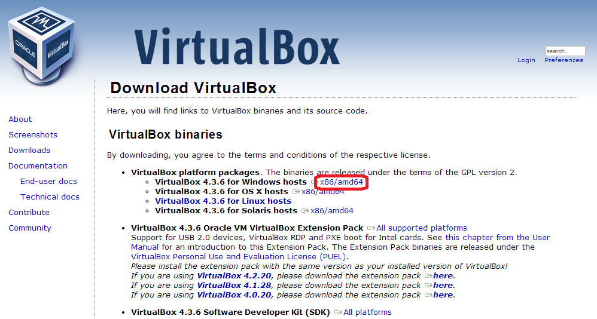
3. 登録したメールアドレスに対してダウンロードURLが送信されます。  
   
4. 受信したURLを開き，登録したメールアドレスを入力して［続行］をクリックします。  
   

   

   場合によってはメールアドレスの指定を求められないこともある。
   

5. VMWare PlayerのWindowsプロダクトをダウンロードします。保存する場所がどこであるのかわかりにくいことがあるので注意してください。  
   

   

   画面表示は，「Binaries」が「VMWare Player4」であったりと多少異なることがある。
   

### ■VMWare Playerのインストール

前項でダウンロードしたファイルを実行し，VMWare Playerをインストールします。

1. ダウンロードしたファイルを実行します。  
   
2. ウィザードに従ってVMWare Playerをインストールします。  
   

   

   ウィザードの途中，「ショートカットを作成するかどうか」「ソフトウェアの更新を確認するかどうか」「ユーザーエクスペリエンス改善プログラムに協力するか」などの確認画面が表示されることがある。いずれも「続行」を指定すればよい。
   

3. コンピュータを再起動します。  
   

【Memo】VMWare PlayerのインストールはCドライブに行います。フォルダーをはじめとする設定項目は任意ですが，デフォルトのままインストールを実行しても構いません。

第3章 Enjuのインストール(スタンドアロンで動作させる)
====================================================

3-1 Enju仮想マシンの入手
------------------------

Enjuのインストールに必要なパッケージは，すべてネットワーク上で提供されます。

### ■Enjuパッケージの提供場所

Enjuは，以下のURLで最新版が提供されています。インストールする環境に合わせ，必要なパッケージをダウンロードします。

* [http://www.next-l.jp/download/vm/](http://www.next-l.jp/download/vm/)

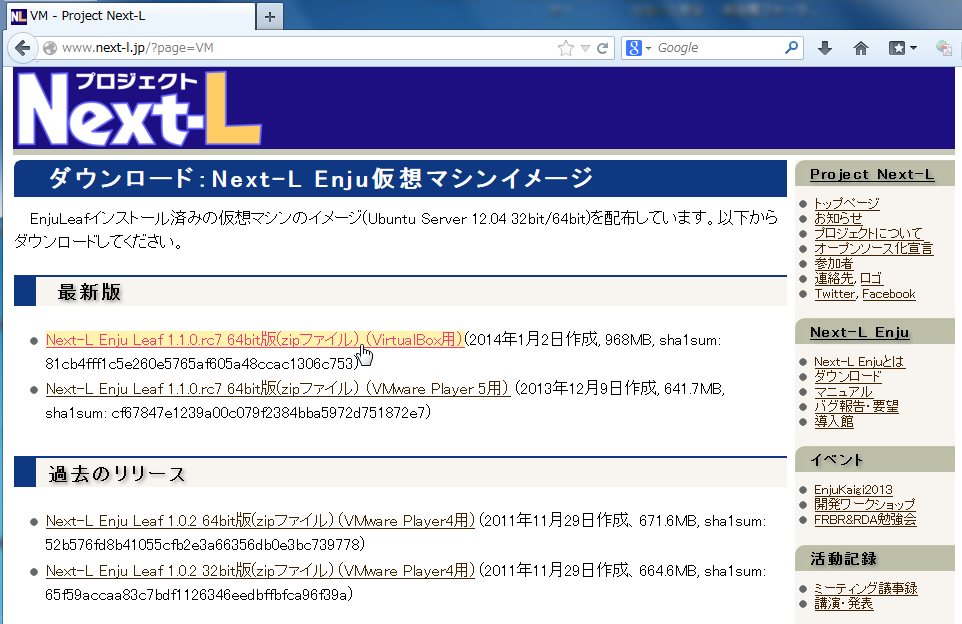

#### 64bit版のEnju仮想マシンを利用する場合

WindowsコンピュータにインストールしたVMware Player4上で64bit版のEnju仮想マシンをインストールする場合，「 64bit版Enju仮想マシン 」をダウンロードしてください。ダウンロードするファイルは，以下のファイル名です。

    enju_leaf_x.x.x_vmware.zip

【Memo】<code>x.x.x</code> にはバージョン番号が表示されます。複数のパッケージが存在する場合は，最新バージョンを利用してください。

#### 32bit版のEnju仮想マシンを利用する場合

WindowsコンピュータにインストールしたVMware Player4上で32bit版のEnju仮想マシンをインストールする場合，「 32bit版Enju仮想マシン 」をダウンロードしてください。ダウンロードするファイルは，以下のファイル名です。

    enju_leaf_x.x.x_vmware_x86.zip

【Memo】<code>x.x.x</code> にはバージョン番号が表示されます。複数のパッケージが存在する場合は，最新バージョンを利用してください。

### ■パッケージの展開

Enju仮想マシンは，ダウンロードしたパッケージを展開してインストールを行います。

1. Enjuをインストールするフォルダーを作成します。  
   
2. ダウンロードした zip ファイルパッケージを展開します。  
   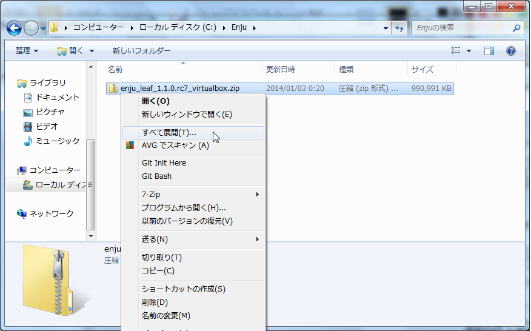

3-2 VMWare Playerの設定
-----------------------

VMWare Playerを起動し，Enju仮想マシンを開く環境を設定します。

1. VMWare Playerを起動します。
2. 使用許諾に同意します。  
   
3. ［仮想マシンを開く］をクリックします。  
   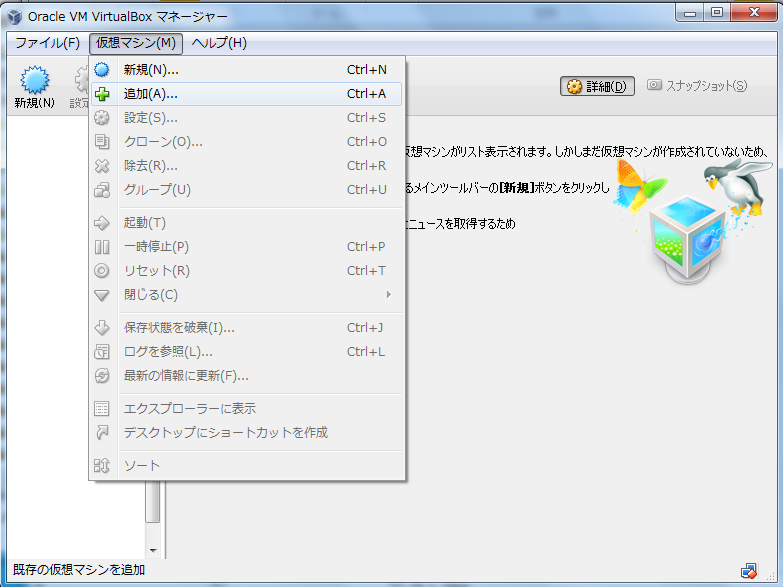
4. 前項で展開したフォルダーを選択します。
5. 「enju_ubuntu_xxxx.vmx」を選択します。  
   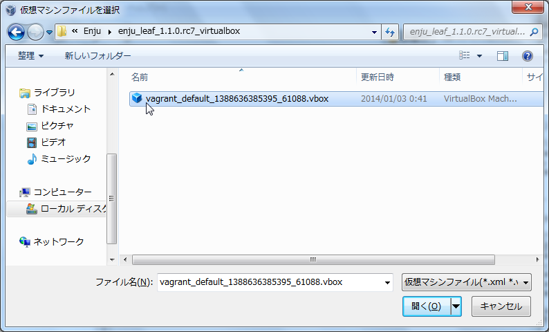

   

   ファイル名はEnju仮想マシンのバージョンによって異なります。
   

6. ［Enju_Ubuntu_xxxx］をクリックして，［ファイル］−［Playerの環境設定］を選択します。  
   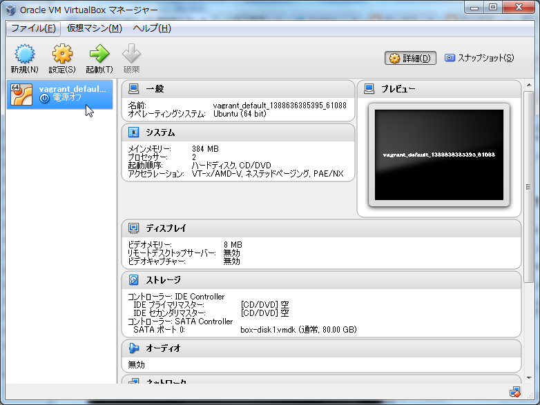
7. ［閉じるときの動作］を選択します。
   * Enju仮想マシンのウィンドウを閉じるときの動作を選択します。選択する項目は任意です。
8. ［仮想マシンを閉じるとき］を選択します。
   * Enju仮想マシンを閉じるときの動作を選択します。選択する項目は任意です。
9. ［ソフトウェアの更新］および［ユーザーエクスペリエンス改善プログラム］を設定します。
   * オン／オフは任意です。
10. ［OK］をクリックします。  
    

    

    【Memo】任意の設定項目が不明な場合，以下のように設定します。
    * ［閉じるときの動作］:［仮想マシンを閉じる前に確認画面を表示］
    * ［仮想マシンを閉じるとき］: ［パワーオフ］
    * ［ソフトウェアの更新］: オン
    * ［ユーザーエクスペリエンス改善プログラム］: オン
    

3-3 Enju仮想マシンの設定
------------------------

VMWareがEnju仮想マシンに割り当てるメモリ量などの動作環境を設定します。

1. ［Enju_Ubuntu_xxxx］をクリックして，［仮想マシン］−［仮想マシンの設定］を選択します。  
   

   

   仮想マシンの名前は，Enju仮想マシンのバージョンによって異なることがあります。
   

2. ［ハードウェア］タブを選択します。
3. 表示された画面で，以下の推奨値を参考に各項目を設定します。
   * メモリ　　　　　　　：コンピュータに搭載されている全メモリ容量から 1 〜 2GB を減じた値
   * プロセッサ　　　　　：コンピュータに搭載されている CPU のコア数
   * ハードディスク　　　：蔵書規模に応じた値
   * ネットワークアダプタ：［NAT］を選択
4. ［OK］をクリックします。  
   

3-4 Enju仮想マシンの起動
------------------------

Enju仮想マシンを起動し，Ubuntuにログインします。

1. ［Enju_Ubuntu____］をクリックして，［仮想マシンの再生］を選択します。  
   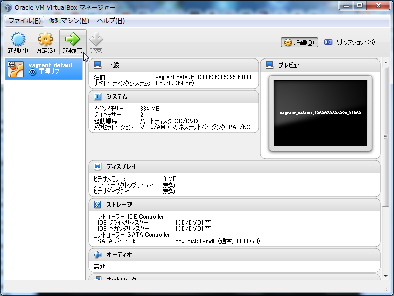
2. 以下のような画面が表示された場合，［コピーしました］を選択して［OK］をクリックします。  
   

   

   【Memo】このメッセージ画面は，初回起動時のみ表示される場合があります。また，取外し可能デバイスの選択などが求められる場合もあります。この場合「OK」を押して先に進んでください。
   

3. Ubuntuのプロンプトが表示されていることを確認します。
4. ［Ctrl］＋［G］を押して入力を仮想マシンに切り替えます。

   

   VMWare Player4の画面にマウスカーソルをあわせてクリックするだけでも仮想マシンに切替ができる場合もあります。
   

5. 以下の初期ユーザー名，初期パスワードでログインします。
   * 初期ユーザー名　：　enju
   * 初期パスワード　：　enjupassword  
   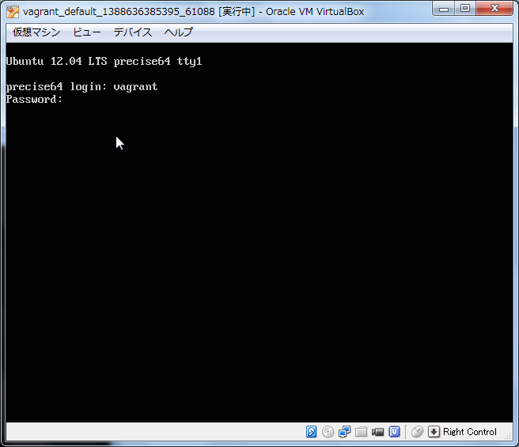
6. ログインし，プロンプトが表示されていることを確認します。  
   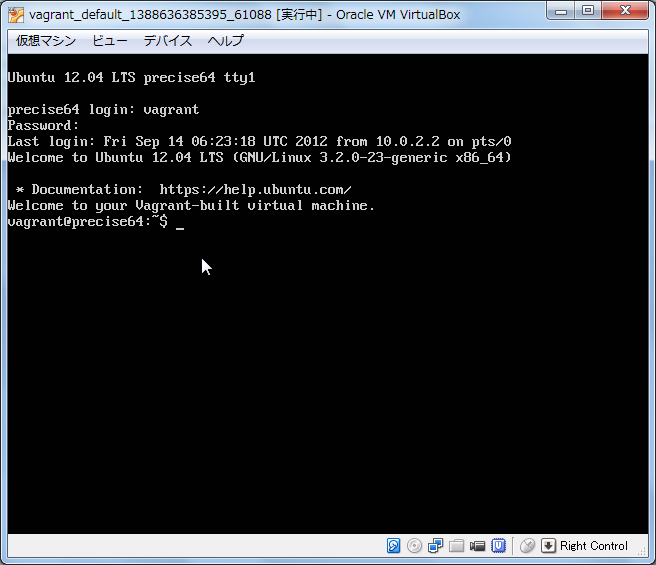

【Memo】VMWare Playerでキーボードから入力するときは，［Ctrl］＋［ G ］を押して仮想マシン（ゲストＯＳ）に，［Ctrl］＋［Alt］を押してホストＯＳに切り替えます。

### ■キーボードの設定

使用するキーボードの種類を登録します。

1. コンピュータに接続しているキーボードの種類によって， enju@enju:~$ に続いて以下のコマンドを入力します。

   * 日本語キーボード：
         sudo loadkeys jp
   * 英語キーボード　：
         sudo loadkeys us

   enju のパスワード入力が求められますので，パスワードを打ち込んでください(画面には出力されません)。

2. パスワード（初期パスワード：enjupassword）を入力します。  
   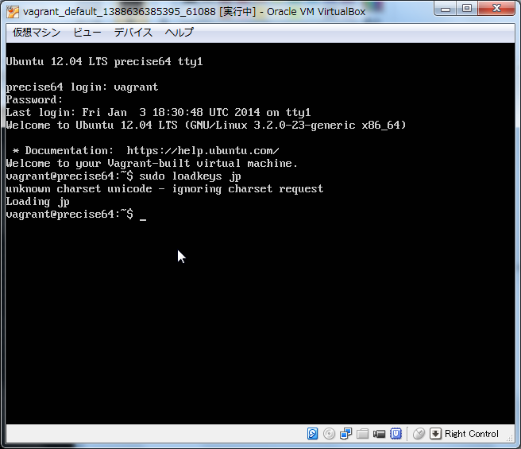

場合によっては，「<code>unknown charset unicode - ignoreing charset request</code>」などと表示され，キーボード上の配置が変更されないこともあるようです。ただし，サーバ上で記号を使うすることがなければ，大きな問題はありませんので，そのまま続けてください。ただし，キーボードの記号(!"#$%&'()など)が正しく入力されていない状況では，次項のパスワード中には記号は含めないようにしてください。

### ■パスワードの変更

初期ユーザー名「Enju」に対するパスワードを変更します。

1. enju@enju:~$ に続いて以下のコマンドを入力します。

       passwd

2. 現在のパスワード，新しいパスワード，新しいパスワード（確認）の順に入力します。  
   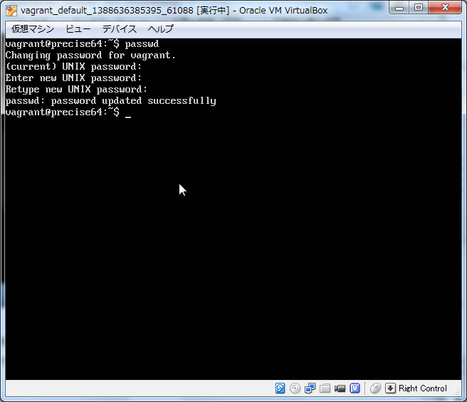

### ■IPアドレスの確認と設定

Enju仮想マシンの設定時に，ネットワークアダプタを「 NAT(ホストのIPアドレスを共有して使用) 」と設定しましたので，Enju仮想マシンに対しては自動的に適切なIPアドレスが割り当てられています。

そこで，まず割り当てられたIPアドレスを確認し，これを Enjuサーバが認識できるように設定する必要があります。

1. enju@enju:~$ に続いて以下のコマンドを入力します。

       ifconfig

   etho (または eth1)のところに書かれている inet addr: の値をメモします。以下の画面では，<code>192.168.112.128</code>です。  
   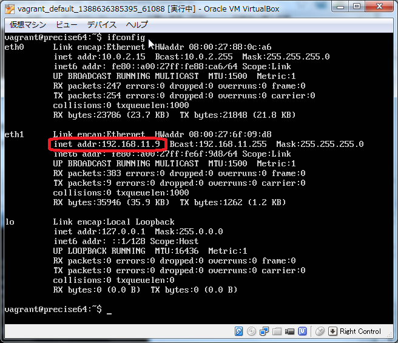

   

   もし，画面が流れていって，読めない場合には <kbd>ifconfig | more</kbd> と入力してください。
   

2. enju@enju:~$ に続いて以下のコマンドを入力します。

       ruby setip.rb IP_addr

   「IP_addr」に固定するIPアドレスの値として，前項でメモしたIPアドレスを入力します。下の画面では192.168.13.11を指定していますが，これをそのまま打ち込むのではなく，必ず前項でメモした値を指定してください。  
   

### ■Enju仮想マシンの起動

Enju仮想マシンを起動します。

1. enju@enju:~$ に続いて以下のコマンドを入力します。

       sudo enju start

   enju のパスワード入力が求められますので，パスワードを打ち込んでください(画面には出力されません)。  
   

2. 画面上に何か文字列が表示されただけで， enju@enju:~$ という文字列が表示され，本当に正しく動いているのかどうかわかりにくいですが，正しく動いている場合でも上記のようになります。

   **VMWare Player4上でNext-L Enjuが動作している間，VMWare Player4は閉じてはいけません。もし，画面上で邪魔だと感じる場合は，アイコン化(最小化)した状態としておいてください。**

3-5 Enju仮想マシンが正しく起動されているかの確認
------------------------------------------------

Next-L Enjuが正しく起動したかどうかは，サーバ上だけではわかりにくいので，ネットワークに接続された別のコンピュータから確認します。別のマシンといっても，物理的に別のマシンを使うのではなく，Next-L Enjuが動作している同じコンピュータのWebブラウザを用いて確認を行います。なすなわち，ゲストＯＳ(今回の場合はVMWare Player中のEnju仮想マシン)とホストＯＳ(ここではVMWareが動作しているWindows)とは論理的には別のマシンと見なすことができますので，Windows上のWebブラウザを使って確認すれば良いことになります。

1. ホストＯＳ(Windows)に制御を戻します。
   「Ctrl」 + 「Alt」 キーを押します。
   「Ctrl」 + 「Alt」キーを押すと，それまで表示されていなかったマウスカーソルが再度表示されます。
2. ブラウザからアクセスします。

   Windows上でWebブラウザを立ち上げ，アドレス欄に，「http://仮想マシンに割り当てたに割り当てたIPアドレス」と入力してください。たとえば，前項の例では 192.168.112.128 というIPアドレスを仮想マシンに割り当てていた場合には，アドレス欄に以下のように入力することになります。
       http://192.168.1.128

これで，同じPC上からも，また別のマシンからもEnjuサーバに対してアクセスすることが可能になったと思います。このようにアクセスしても正しく画面が表示されない場合には，何らかの設定ミスがあると思われますので，再度インストールしなおしてください。

3-6 Enjuサーバの停止と再起動
-----------------------------

### ■Enju サーバのシャットダウン

Enjuサーバを終了(シャットダウン)させる場合には，正しい手順でのシャットダウンを行う必要があり，VMWare Player4をいきなり終了させたり，PCの電源ボタンを押すなどして強制終了させると，使用中のデータベースファイルが壊れて，再起動できなくなるなどの問題が発生する可能性があります。

1. enju@enju:~$ に続いて以下のコマンドを入力します。

       sudo enju stop
2. enju@enju:~$ に続いて以下のコマンドを入力します。

       sudo shutdown -h now

   これらでenju のパスワード入力が求められますので，パスワードを打ち込んでください(画面には出力されません)。

Enjuサーバをシャットダウンするタイミングは，図書館の運用方針で決定することができます。システム的には，起動したら基本的にはずっと動作させ続けていても問題ありません。毎日システムをシャットダウンする，必要な時だけ稼働させるなど，ポリシーに応じた運用をすることができます。

### ■Enju サーバの再起動

1. VMWare Player4が終了していた場合，再度VMWare Player4を起動してください。  
   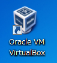
2. VMWare Player4が起動後，「 enju_ubuntu_xxxx 」を指定して「仮想マシンの再生」を選択してください。  
   
3. 再起動して，ユーザ名とパスワードの入力が求められますので，ユーザー名( enju )と，前に変更したパスワードを入力してログインしてください。  
   
4. enju@enju:~$ に続いて，以下のコマンドを入力します。パスワードの入力が求められることがあります。

       sudo enju start

これで，再度Enjuサーバが利用できるようになりました。

第4章 他のコンピュータからの利用設定
====================================

後日公開します。

第5章 Enjuのアップデートとデータのパックアップ
==============================================

5-1 Enjuのアップデート
----------------------

Enjuは，以下の手順で，Enjuのソースコードが公開されているGitHUBから変更されたファイルを取り込み最新版にすることができます。

### ■最新ソースコードの取り込み

1. enju@enju:~$ に続いて以下のコマンドを入力します。

       cd enju_leaf

2. enju@enju:~/enju_leaf$ に続いて以下のコマンドを入力します。

       git pull origin 1.0
   各種の処理が行われ，メッセージが出力されます。時間もかかります。

3. enju@enju:~/enju_leaf$ に続いて以下のコマンドを入力します。

       bundle

   各種の処理が行われ，メッセージが出力されます。時間もかかります。

4. enju@enju:~/enju_leaf$ に続いて以下のコマンドを入力します。

       rake db:migrate RAILS_ENV=production

   各種の処理が行われ，メッセージが出力されます。時間もかかります。

### ■コンピュータを再起動します。

1. enju@enju:~$ または enju@enju:~/enju_leaf$ に続いて以下のコマンドを入力します。

       sudo shutdown -r now

   enju のパスワード入力が求められますので，パスワードを打ち込んでください(画面には出力されません)。

### ■起動後の処理

1. 再起動して，ユーザ名とパスワードの入力が求められますので，ユーザー名( enju )と，前に変更したパスワードを入力してログインしてください。  
   

2. enju@enju:~$ に続いて以下のコマンドを入力します。

       $ sudo /etc/init.d/tomcat restart
       $ sudo /etc/init.d/apache restart

   enju のパスワード入力が求められますので，パスワードを打ち込んでください(画面には出力されません)。

5-2 データのバックアップ
------------------------
後日公開します。

第6章 その他
==============

Enjuサーバは，外部からネットワーク経由でアクセスすることができるサービスとして運用されます。したがって，そのセキュリティ管理などには十分に気を配る必要があります。Enjuサーバ自体は，配付時点での最新の状況に対応できるようにセキュリティ対策を講じていますが，日進月歩のネットワーク環境では，新しいネットワーク上の脅威が発生する可能性もあります。このような状況に対応するため，運用に際しては，特に以下の２つにご注意ください。

1. 最新の配付パッケージを使用すること:

   Enju仮想マシンファイルについても，今後，バージョンアップを重ねるたびに配付を予定しています。機能面での充実というだけではなく，セキュリティ面からも最新のパッケージを使用ください。

2. 不必要な外部からのアクセスを禁止すること:

   場合によっては，ファイアウォールの導入やリモートルータでのフィルタリングについても検討した方が良いこともあるでしょう。

第7章 トラブルシューティング
==============================

## Q. VT機能が無効になっているというメッセージが表示されます。

VMware Playerを起動した際，64bit CPUを使用していても，以下のような警告画面が表示されて起動できないことがあります。これは，Virtualization Technologyという機能が無効になっている場合などに表示されます。

各コンピュータのマニュアルを参照してBIOSのセットアップでVirtualization Technology機能を有効にしてから再起動してください。

Virtualization Technology機能を有効にしても，VMware Playerを再起動した際，エラーが発生して正しく動作しないことがあります。その場合，再起動を何度か行う，再インストールを行うなどしてください。

## Q.「ubuntu64-bitEnju.vmx」というファイルが見つからない。

以下を確認してください。

1. 「仮想マシンを開く(O)」を押していますか。

   「仮想マシンを開く(O)」を押すと，「仮想マシンを開く」というウィンドウが開いて，ファイルを選択することができるようにならないでしょうか？

2. 正しい場所を選択していますか。

   配布されているzipファイルを展開した時に作成されるフォルダを選択してください。展開したフォルダが見つからない場合は，zipファイルを展開するということ自体が正しくできているかどうか確認してください。

## Q. ネットワークの設定で，IPアドレスの割り当てが正常に行われません。

eth1に対するIPアドレスの割り当てが正常に行われず，ifconfigした場合にlo のみしか表示されなくなってしまう場合があります。このような場合においては，2.7に示す /etc/network/interfacesの指定時に，eth1 ではなく，全てeth0と指定して再度起動してみてください。

Appendix
========

■ Enju仮想マシン中の設定ファイル
---------------------------------

Enju仮想マシンのファイル中には，「Ubuntu 64-bit Enju.vmx」というファイルが存在しています。実は，この *.vmx ファイルはテキストファイルであり，VMware Playerの設定ファイルとなっています。ネットワークの設定や，仮想マシンへの割り当てメモリ量などが変更可能です。

数多くの設定項目のうち，Enju仮想マシンで特に重要なのは，以下の項目です。仮想マシンを作成している環境の都合上，配布されているパッケージは，必ずしも以下の設定になっていない部分がありますので，各自，自分の環境にあわせて修正してください。修正については，エディタと呼ばれるソフトウェアを用いることができます。たとえば，MS-Windowsに標準で付与されている「メモ帳」はエディタのひとつです。

なお，MS-Wordなどの日本語ワープロを用いた修正は，テキスト以外の記号が混じってしまい正しく設定されない可能性があるので，行わないでください。

1. 全般設定

       config.version = "8"
       virtualHW.version = "7"
       extendedConfigFile = "Ubuntu 64-bit Enju.vmxf"
       displayName = "Ubuntu 64-bit Enju"
       guestOS = "ubuntu-64"
       nvram = "Ubuntu 64-bit Enju.nvram"
       virtualHW.productCompatibility = "hosted"
       memsize = "2048"
                 # PCに搭載したメモリ量に応じて変更してください

2. 作成したディスクイメージファイルをSCSIディスクとして接続する設定

       scsi0.present = "TRUE"
       scsi0:0.present = "TRUE"
       scsi0:0.fileName = "Ubuntu 64-bit Enju.vmdk"
       scsi0.virtualDev = "lsilogic"
             # Fusion MPT SPI SCSI Host Adapter(Ultra320)のエミュレーションなので，うまく動作しなければ，lsilogic ではなく buslogicでも試してください

3. ネットワークの設定

       ethernet0.present = "TRUE"
       ethernet0.connectionType = "bridged"
       ethernet0.virtualDev = "e1000"
       ethernet0.wakeOnPcktRcv = "FALSE"
       ethernet0.addressType = "generated"
       ethernet0.linkStatePropagation.enable = "TRUE"

   

   ネットワークの設定については，設置者の状況によって大きく異なる可能性がある
   

4. その他のデバイスの設定

       usb.present = "TRUE"
       ehci.present = "TRUE"
       floppy0.present = "FALSE"
               # フロッピーディスクが存在する場合は"TRUE"としてください

これ以外の設定については，基本的には必要ありません(必要なものは，起動後に自動生成されます)が，自身の環境にあわせて設定する場合は，以下のような設定をすることもできます。詳細はご自身で確認ください。たとえば，サウンド機能が実装されているPCであれば，「sound.present = "TRUE"」と指定する，サーバに接続したプリンタを使用する場合には「printers.enabled = "TRUE"」と指定するなどがあります。ただし，Enjuの標準機能では，これらの機能は使用しませんので，Enjuを実行するためには不要です。

また，Enju仮想マシンファイルのバージョンによっては，以下の指定がされている場合があります。これらの指定がある場合，起動時にエラーが表示される場合もあり，また設定そのものも不必要ですので削除いただいて構いません。

    ide1:0.present = "TRUE"
    ide1:0.fileName = "/Users/kosuke/Downloads/ubuntu-10.04-server-amd64.iso"
    ide1:0.deviceType = "cdrom-image"
