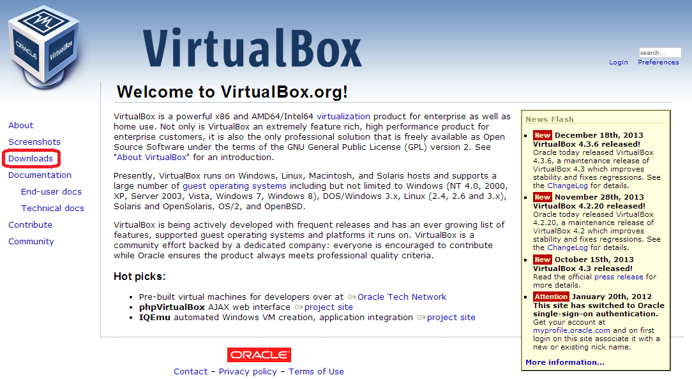
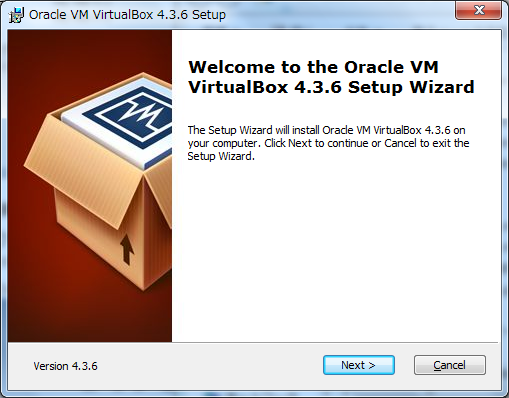
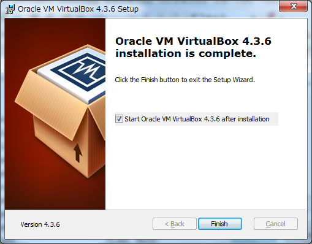

* Contents
{:toc}
{::comment} virtualbox.md {:/comment}

第3章 動作環境の確認とVirtualBoxのインストール {#section3}
==================================================

3-1 動作環境を確認する {#section3-1}
------------------------------------

作業を開始する前に，Enjuをインストールするコンピュータの環境を確認します。
この文書では，Windows7 でのやり方について説明します。

{::comment}

また，コンピュータの環境に応じてEnju仮想マシンの64bit版を用いるか32bit版を用いるかを決めます。

### 3-1-x コンピュータの仕様の確認 {#section3-1-x}

64bit版の仮想マシンを使うためには，使っているコンピュータがハードウェアの仮想化に対応している必要があります。

コンピュータのCPUのメーカーであるIntelおよびAMDは，どちらもハードウェアの仮想化に対応していますが、使用する用語が異なります。Intelは「インテル バーチャライゼーション・テクノロジー(Intel VT)」と呼び，AMDは「AMD Virtualization(AMD-V)」と呼びます。このいずれかに対応しているかを，コンピュータのマニュアル，Webページなどで確認してください。

ただし，CPUが仮想化に対応していたとしても，BIOSの制約で仮想化が行えないようになっている場合や，BIOSの変更をしなければ初期状態では仮想化がオフになっている場合も多いです。この場合，起動時にBIOS設定でプロセッサの仮想化への対応を有効(Enable)に設定する必要があります。

{:/comment}

### 3-1-1 Windowsが64bit版であるかの確認，使用可能メモリ容量の確認 {#section3-1-1}

Windowsが64ビット版であるか，メモリ容量をシステムのプロパティで確認します。※32bit版でも動くかとおもいますが，検証できていません

#### 1. ［スタート］ボタンをクリックし，［コンピュータ］を右クリックします。

#### 2. ［プロパティ］をクリックします。

   
#### 3. 以下の項目を確認します。

* システムの種類 : 64bitのオペレーティングシステム
* 実装メモリ　　 : 使用可能容量が 2.00GB 以上
   

### 3-1-2 ハードディスク空き容量の確認 {#section3-1-2}

Enju仮想マシンのインストールと動作に必要なハードディスクの空き容量を確認します。

#### 1. ［スタート］ボタンをクリックし，［コンピュータ］を選択します。

   
#### 2. 以下の項目を確認します。  

* ドライブの空き容量 : 25.0GB以上を推奨
   

Memo
ハードディスクに必要な空き容量は，蔵書規模により異なります。25.0GBは蔵書が20 万件の規模を想定しています。これよりも蔵書規模が大きい場合は，より多くの容量が必要となります。

### 3-1-3 IPアドレスの確認 {#section3-1-3}

ホストOSのIPアドレスを確認します。

#### 1. ［スタート］ボタンをクリックし，［コントロールパネル］を選択します。

   
#### 2. ［ネットワークとインターネット］をクリックします。

   
#### 3. ［ネットワークと共有センター］をクリックします。

   
#### 4. ［アクティブネットワークの表示］で［ローカルエリア接続］または［ワイヤレスネットワーク接続］をクリックします。

   
#### 5. ［詳細］をクリックします。

   
#### 6. 表示された画面で，以下の情報をメモなどに記録します。

* DHCPの状態
* IPv4アドレス
* IPv4サブネットマスク
* IPv4デフォルトゲートウェイ
* IPv4 DNSサーバ

{::comment}
   
### 3-1-y 動作環境による判定 {#section3-1-y}

VirtualBox用に用意された Next-L Enju仮想マシンには，64bit版と32bit版の２種類があります。64bit版の方が高速で制約事項も少なく，快適に利用することができますが，バーチャライゼーション・テクノロジー(Virtualization Technology / VT)に対応したCPUを搭載したコンピュータでないと動作しません。

基本的にはIntel VT-x または AMD-Vに対応したCPUを搭載したコンピュータであれば64bit版が動作する筈なのですが，さまざまな理由から，対応したCPUを搭載したコンピュータでも動作しない場合もあります。

#### 3-1-yy 64bit版のEnju仮想マシンを利用する場合 {#3-1-yy}

* VirtualBoxが動作する x86またはx64pプロセッサ(64bitのCPU)を搭載したコンピュータ
* Windows XP/Vista/7の64bit版
* 2.0GB以上のメモリ
* 25GB以上のハードディスク空き容量
** 蔵書規模20万件の場合。蔵書規模によりさらに多くの空き容量が必要
* LANでネットワークに接続された環境

#### 3-1-yyy 32bit版のEnju仮想マシンを利用する場合 {#section3-1-yyy}

* VirtualBoxが動作する 64bit または 32bitのCPUを搭載したコンピュータ
* Windows XP/Vista/7の32bt または 64bit版
* 2.0GB以上のメモリ
* 25GB以上のハードディスク空き容量
** 蔵書規模20万件の場合。蔵書規模によりさらに多くの空き容量が必要
* LANでネットワークに接続された環境

**基本的には，新しいマシンであれば多くの場合，64bit版が動作すると思われます。マニュアルなどを参考に，バーチャライゼーション・テクノロジー機能を「有効」にし，64bit版をできるだけお使いください。もし，コンピュータの性能その他の問題で動作しない場合には，32bit版をお使いください。**
{:/comment}

3-2 VirtualBoxのダウンロードとインストール {#section3-2}
--------------------------------------------------------

ここでは Windows の場合を説明しますが，Mac，Linuxなど様々なOS上で動きます。

### 3-2-1 VirtualBoxのダウンロード {#section3-2-1}

VirtualBoxはOracle社のWebサイトからダウンロードします。

#### 1. 次のWebページで［Downloads］をクリックします。 [https://www.virtualbox.org/](https://www.virtualbox.org/)

   
#### 2. 「VirtualBox 4.3.6 for Windows hosts」の横の［x86/amd64］のリンクをクリックするとダウンロードが開始します。保存する場所がどこであるのかわかりにくいことがあるので注意してください。

### 3-2-2 VirtualBoxのインストール {#section3-2-2}

前項でダウンロードしたファイルを実行し，VirtualBoxをインストールします。

#### 1. ダウンロードしたファイルを実行します。ウィザードに従ってVirtualBoxをインストールのための設定を開始します。「Next」をクリックします。

   
#### 2. 特に変更する必要はありませんので，このまま「Next」をクリックします

   
#### 3. 特に変更する必要はありませんので，このまま「Next」をクリックします

   
#### 4. (以降のセットアップ時にネットワークが一時的に切れる警告です。)「Yes」をクリックします
 

#### 5. インストールを開始します。「Install」をクリックします。

   
#### 6. インストールが終了しました。「Finish」をクリックします。

#### 7. VitualBoxが起動しました

   

【Memo】フォルダーをはじめとする設定項目は任意ですが，デフォルトのままインストールを実行しても構いません。


