本マニュアルは、オープンソース統合図書館システム　Enjuの運用について、説明しています。図書館員が、Enjuを使い、図書に関する各種の作業をするときにお読みください。

本マニュアルの作成にあたっては，(株)三菱総合研究所の全面的な支援をいただきました。心より感謝いたします。

* TOC
{:toc}

第1章 Enju概要
==============

Enjuとはどのようなシステムなのか，概要を説明します。

1-1 Enjuとは
------------

Enjuは，国会図書館，公共図書館，大学図書館，専門図書館，学校図書館などにおける図書館業務で必要な全ての機能を提供する統合図書館管理用ソフトウェアです。図書館で働く人々の総意として必要と思われる機能を全て実装するほか，図書館利用者が求めるWebサービス機能についても実装していきます。

1-2 Enju開発の経緯
------------------

実際の社会に影響を与えるシステムの出現を目指すためには，実験用システムが作られれば良いというものではなく，実際に導入可能なシステムを考える必要があります。そのためには，実際の図書館業務で発生する様々な問題と解決法を，図書館員をはじめとして図書館に関わる様々な方々に提供いただき，細かなノウハウまで取り込んだ理想的な図書館システムを考えていくことが必要となります。

しかし，図書館員の方々をはじめとして，大勢の図書館に関わる方々は，皆さんそれぞれに忙しく，長期間継続して意見やノウハウの提供をいただくことは簡単なことではありません。ましてや，新しいアイディアを考えていただくという負担を過度におかけすることは，とてもできることではありません。

そこで，仕様の策定と並行して小規模図書館であれば導入可能な，統合図書館システムをプロトタイプ的に開発し，これを使っていただくことで，アイディアを出していただくことといたしました。このプロトタイプとして，統合図書館システムNext-L Enjuは開発が行われました。

こうして開発された統合図書館システム Next-L Enjuは，幾度かの改良が行われ，すぐれた開発環境の存在と開発者の技量の高さ，そして何よりも開発者および関係者の熱意によって，**現在では，単なるプロトタイプの枠組みを超えて，実際の図書館業務に使用することが可能なシステムへと進化したしました。** 2011年11月11日にリリースされた Next-L Enju Leaf Ver1.0.0 からは，正式名称も「Project Next-Lプロトタイプ Enju」からプロトタイプの文字を取り除き，**「Next-L Enju」を正式名称としています。**

第2章 Enjuを利用する
====================

Enjuの利用を始めるにあたり、次のような作業を行います。

* ユーザーアカウントの作成
* ログイン／ログアウト
* ユーザーアカウントの編集

Enjuは、利用者同士のコミュニケーション機能も搭載されています。

* メッセージの送信
* メッセージのログの一覧表示・印刷

2-1 ユーザーアカウントの種類を知る
----------------------------------

### ■アカウント（ユーザー）の種類

Enjuを利用するには、アカウントを取得し、ログインします。アカウント（ユーザー）には次の3種類があります。

* Administrator（管理者）
* Librarian（図書館員）
* User（図書館利用者）

### ■Lirarian（図書館員）の権限で利用できる機能

Librarian（図書館員）の権限を持つアカウントでログインすると、Enjuで次のような機能を利用することができます。

* 図書館利用者としてのすべての機能
* 図書館利用者の登録
* 資料の受入
* 資料の貸出／返却／予約
* 催し物（お知らせ）の登録
* 開館日（休館日）の登録
* レファレンスの処理
* 統計機能
* 印刷その他の機能

【Memo】Librarian（図書館員）はアカウントの権限を変更することができません。権限の変更は、Administrator（管理者）権限を持つアカウントでログインして行います。

### ■アカウントを編集する

アカウントの権限以外の項目の編集はLibrarian（図書館員）でも行うことができます。操作の方法については、「[3-3 利用者のアカウント情報を変更する](#span3-3-)」を参照してください。

2-2 ログイン／ログアウトする
----------------------------

Enjuを利用するには、まずシステムにログインします。

### ■ログインする

1. Enjuにアクセスし、［ログイン］をクリックします。  
   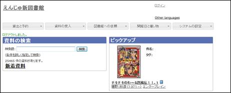
2. ユーザー名とパスワードを入力し［ログイン］をクリックします。  
   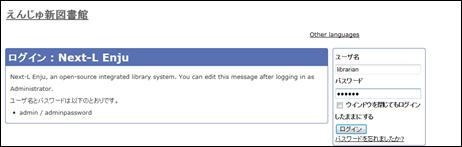

   
【Memo】ブラウザを閉じてもログイン状態を保持したい場合は、［ウィンドウを閉じてもログインしたままにする］をオンにします。
   

3. 自分のアカウントでログインされていることを確認します。  
   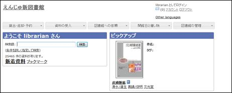

### ■ログアウトする

1. ［ログアウト］をクリックします。  
   
2. ログアウトされたこと（［ログイン］の表示に変わったこと）を画面で確認します。  
   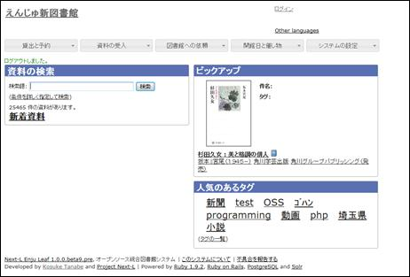

   
【Memo】時間の経過にともなって自動ログアウトする機能は用意されていません。Librarian（図書館員Librarian）は利用者の個人情報などを閲覧できる権限を持っているので、パソコンを共有する時や離席時などには、きちんとログアウトするよう心がけましょう。
   

2-3 メッセージをやり取りする
----------------------------

Enjuのメッセージ機能を利用して、利用者にメッセージを送信することができます。やり取りしたメッセージは、ログとして一覧表示したり、印刷したりすることもできます。

### ■メッセージを送信する

1. ［図書館の管理］メニューから［利用者の管理］を選択します。  
   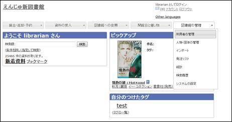
2. メッセージを送りたいユーザのユーザ名をクリックします。  
   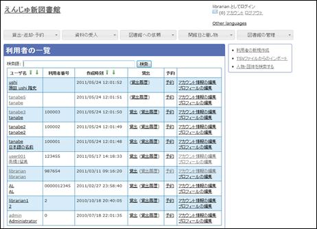

   
【Memo】［検索語］にユーザ名や利用者番号を入力して、ユーザを検索することもできます。
   

3. 右メニューの［メッセージを送信する］をクリックします。  
   
4. 件名、本文を入力し、［メッセージを送信する］ボタンをクリックします。  
   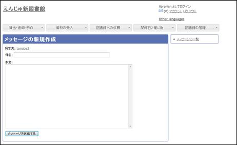

### ■受信したメッセージを読む

1. ［アカウント］の左にあるメールアイコンをクリックします。  
   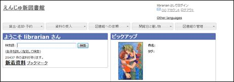

   
【Memo】未読メッセージがある場合は、メールアイコンの右に未読のメッセージ数が表示されるので、それをクリックすることもできます。
   

2. 読みたいメッセージの件名をクリックします。  
   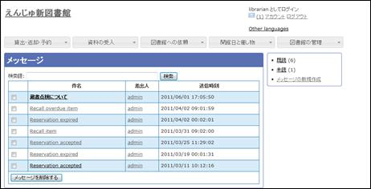
3. メッセージの内容が表示されます。返信したい場合は、右メニューの［メッセージに返信する］をクリックします。  
   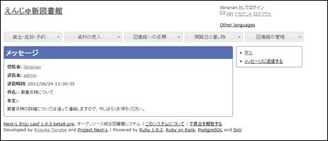
 
### ■メッセージを削除する

1. ［アカウント］の左にあるメールアイコンをクリックします。  
   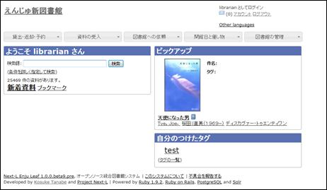
2. 削除したいメッセージのチェックボックスにチェックを入れ、［メッセージを削除する］ボタンをクリックします。  
   

   
【Memo】削除できるのは自分宛のメッセージだけです。削除可能なメッセージにのみ、チェックボックスが表示されます。
   

第3章 利用者情報を管理する
==========================

図書館の利用者情報管理には、次のような機能があります。

* 利用者情報を新規作成する
* 既存のデータから利用者情報をインポートする
* 利用者情報の属性を変更する
* 利用者情報を削除する
* 人物・団体を登録する

利用者情報の属性には、次のような情報が含まれます。

* アカウント情報  
  利用者券情報（利用者番号、ユーザ名、有効期限、利用者グループ、権限、所属図書館、情報参照権限、言語）
* プロフィール情報  
  姓名（漢字）、姓名（読み仮名）、生年月日、メールアドレス、住所等（郵便番号、住所、電話番号、FAX番号、メールアドレス）

3-1 利用者情報を新規作成する
----------------------------

利用者情報を１件ずつ登録するには、利用者の新規作成を行います。［図書館の管理］メニューから行います。
利用者情報の新規作成で登録する項目は次の通りです。

* ユーザ名	任意のユーザ名（半角英数）で入力
* メールアドレス	利用者の連絡先メールアドレス
* 利用者グループ	利用者グループを選択
* 図書館	図書館を選択
* 言語	言語を選択
* 利用者番号	利用者番号を入力（自動採番する設定も可能）

1. ［図書館の管理］メニューから［利用者の管理］を選択します。  
   
2. 右メニューの［利用者の新規作成］をクリックします。  
   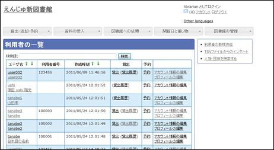
3. 必要事項を入力して［利用者を登録する（取り消しはできません）］ボタンをクリックします。  
   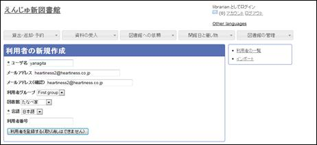

   
【Memo】「*」のマークが付いた項目は入力必須項目です。また、登録の取り消しはできません。取り消しを行いたい場合は、利用者の削除を行います。（参照：[3-5 利用者を削除する](#span3-5-)）
   

4. 利用者が作成され、仮パスワードが発行されます。  
   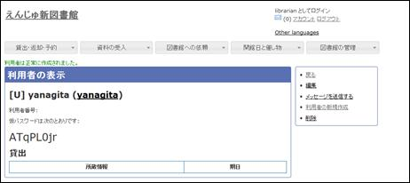

3-2 既存のデータから利用者情報をインポートする
----------------------------------------------

既存の利用者データがファイルで存在する場合は、インポートと呼ぶ読み込みを行い、利用者情報に取り込めます。インポートするには、あらかじめファイルをTSV形式で作成しておく必要があります。

1. ［図書館の管理］メニューから［利用者の管理］を選択します。  
   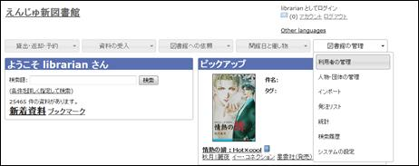
2. 右メニューの［TSVファイルからのインポート］をクリックします。  
   
3. ［参照］ボタンをクリックしてインポート用のファイルを選択し、［編集モード］で［作成］を選択して［人物・団体のインポート用ファイルを作成］ボタンをクリックします。  
   

   
【Memo】［編集］モードで［更新］を選択すると、TSVファイルで利用者情報をまとめて更新できます。TSVファイルに必要なのは、更新したい利用者の利用者番号（<code>user_number</code>）と、更新したいフィールドの内容になります。また、［削除］を選択すると、TSVファイルで利用者情報をまとめて削除できます。この場合は、TSVファイルに必要なのは、削除したい利用者の利用者番号（<code>user_number</code>）のみです。
   

4. 「人物・団体のインポート用ファイルは正常に作成されました。」のメッセージが表示され、利用者のデータがインポートされます。  
   

	
【Memo】インポートのタイミングは毎時0分に設定されています。インポートが始まるまでは「処理待ち」と表示されます。
	

<h4 class="alert-heading">【Column】TSVファイルの作り方</h4>
TSVファイルとは、項目をタブで区切ったテキストファイルです。Enjuで利用するTSVファイルでは、1行目にそれぞれの項目に関わるフィールド名を指定します。フィールド名および値は原則として " " で囲みます。
フィールド名とその意味については次の通りです。

### ■アカウントに関わる項目

 
### ■個人情報に関わる項目

3-3 利用者のアカウント情報を変更する
-------------------------------------------

登録した利用者のアカウント情報は、必要に応じてあとから変更できます。ただし、Librarian権限でログインしている場合は権限の変更は行えません。

変更できるアカウント情報は次の通りです。

<table border="1">
<tr><td>・メールアドレス</td><td>メールアドレス</td></tr>
<tr><td>・パスワード</td><td>自動生成したパスワードを設定するかどうか</td></tr>
<tr><td>・有効期限</td><td>アカウントの有効期限</td></tr>
<tr><td>・利用不可</td><td>アカウントの有効にするかどうか</td></tr>
<tr><td>・利用者グループ</td><td>貸出冊数や期間などの条件を設定した利用者グループ</td></tr>
<tr><td>・利用者番号</td><td>利用者番号</td></tr>
<tr><td>・図書館</td><td>利用者所属の図書館名</td></tr>
<tr><td>・参照に必要な情報</td><td>図書館員のプロフィールをどの権限の利用者にまで公開するか</td></tr>
<tr><td>・言語</td><td>使用する言語</td></tr>
<tr><td>・キーワードリスト</td><td>利用者に対しするSDIサービスなどのために登録できるキーワード</td></tr>
<tr><td>・貸出期限通知用のicalendarファイルのURLをリセットする</td><td>貸出期限通知に利用するicalendarのURL（リセットまたは削除）</td></tr>
<tr><td>・注記</td><td>注記</td></tr>
</table>

1. ［図書館の管理］メニューから［利用者の管理］を選択します。  
   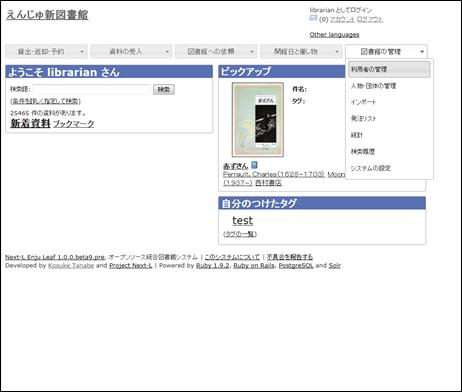
2. 属性を変更したい利用者の［アカウント情報の編集］をクリックします。  
   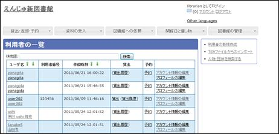

	
【Memo】右メニューで［TSVファイルからのインポート］を選択し、［編集］モードで［更新］を選択すると、TSVファイルで利用者情報をまとめて変更できます。この場合、TSVファイルでは更新したい利用者の利用者番号（user_number）と更新したいフィールドの内容のみを埋めておくようにします。
	

3. 属性を編集し［利用者を更新］をクリックします。  
   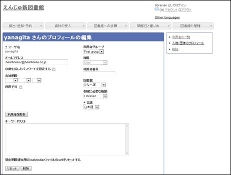

	
【Memo】「*」のマークが付いた項目は入力必須項目です。
	

4. 「利用者は正常に更新されました。」のメッセージが表示され、利用者の情報が変更されます。

3-4 利用者のプロフィール情報を変更する
--------------------------------------

登録した利用者のプロフィール情報は、必要に応じてあとから変更できます。変更できるプロフィール情報は次の通りです。

* 姓（漢字と読み）	姓と姓のよみ
* 名（漢字と読み）	名と名のよみ
* フルネーム（漢字と読み）	フルネームとフルネームのよみ
* 生年月日／没年月日	生年月日と没年月日
* 言語	使用する言語
* 国と地域	国と地域
* 電子メール	電子メールアドレス
* URL	ブログやホームページのURL
* 参照に必要な権限	参照に必要な権限
* 郵便番号（最大2つ）	［他の住所］をクリックすると、最大2つまで登録可能
* 住所（最大2つ）	［他の住所］をクリックすると、最大2つまで登録可能
* ファックス番号（最大2つ）	［他の住所］をクリックすると、最大2つまで登録可能
* 注記	注記

1. ［図書館の管理］メニューから［利用者の管理］を選択します。  
   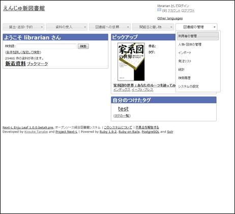
2. 属性を変更したいユーザの［プロフィールの編集］をクリックします。  
   
3. 姓、名などを編集します。  
   

	
【Memo】「*」のマークが付いた項目は入力必須項目です。生年月日や没年月日は「YY-MM-DD」の6桁の数字で入力します。
	

4. 住所などの情報も編集し、［利用者を更新］をクリックします。  
   

	
【Memo】Librarianがプロフィールを変更できるのはUser権限のユーザのみです。
	

5. 「人物・団体は正常に更新されました。」のメッセージが表示され、利用者のプロフィール情報が変更されます。  
   

	
【Memo】右メニューで［TSVファイルからのインポート］を選択し、［編集］モードで［更新］を選択すると、TSVファイルでプロフィール情報をまとめて変更できます。この場合、TSVファイルでは更新したい利用者の利用者番号（user_number）と更新したいフィールドの内容のみを埋めておくようにします。
	

3-5 利用者情報を削除する
------------------------

登録した利用者情報は、不要になった際に削除できます。

### ■利用者情報を削除する

1. ［図書館の管理］メニューから［利用者の管理］を選択します。  
   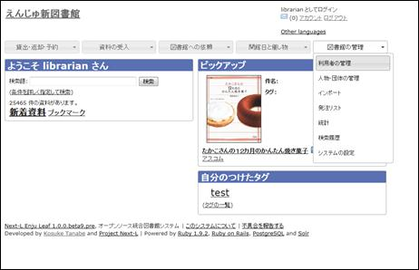
2. 削除したい利用者の［アカウント情報の編集］をクリックします。  
   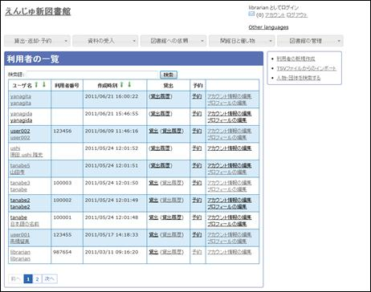
3. 右メニューの［削除］をクリックします。  
   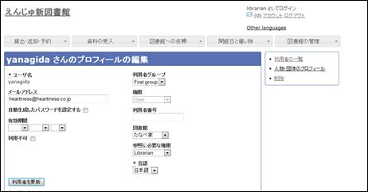

	
【Memo】利用者情報を削除しても、人物・団体としての情報は削除されません。いったん削除した利用者が新たに利用登録を行う場合は、利用者番号を再度割り振ります。利用者番号を再度割り振るには、再登録を行いたい人物のプロフィール情報を表示し、右メニューの［利用者として登録する］をクリックします。
	

4. メッセージが表示されたら［OK］をクリックします。  
   

	
【Memo】右メニューで［TSVファイルからのインポート］を選択し、［編集］モードで［削除］を選択すると、TSVファイルでプロフィール情報をまとめて変更できます。この場合、TSVファイルでは削除したい利用者の利用者番号（user_number）のみを埋めておくようにします。
	

3-6 利用者を検索する
--------------------

Enjuに登録されている利用者は、検索語（キーワード）で検索することができます。

### ■利用者で検索する

1. ［図書館の管理］メニューから［利用者の管理］を選択します。  
   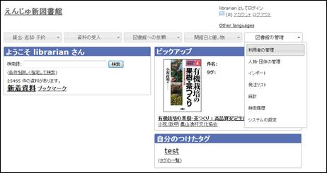
2. 検索語にユーザ名を入力して［検索］をクリックします。  
   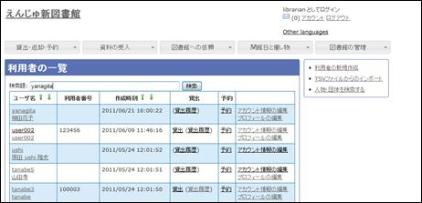
3. 該当する利用者が表示されます。  
   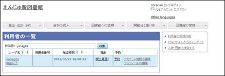

3-7 利用者一覧を表示する
------------------------

利用者の一覧を、画面上で表示し、印刷することができます。

1. ［図書館の管理］メニューから［利用者の管理］を選択します。  
   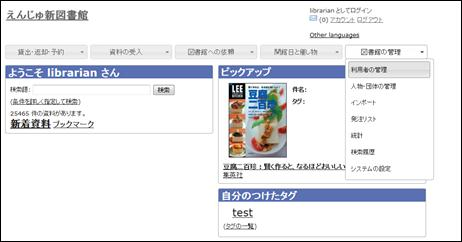
2. 利用者一覧が表示されます。  
   必要に応じて印刷します。  
   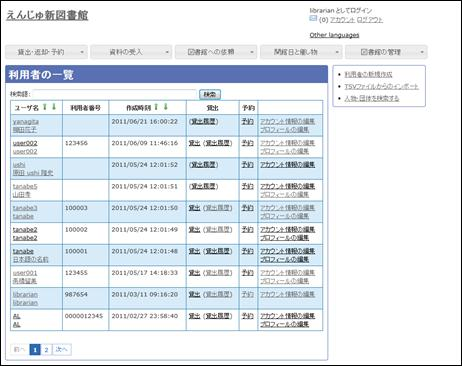
 
第4章 図書の受入をする
======================

図書の受入では、次のような作業を行えます。

* 図書を発注する
* 図書を登録する
* 蔵書情報を登録する
* 図書を除籍する
* 新着図書の一覧を表示・印刷する
* 所蔵目録の一覧を表示・印刷する

また、図書の受入に際し、次のような機能を利用することもできます。

* Webページを登録する  
  Webページを資料として受入します
* 画像を登録する表紙画像のデータを、受入した図書にリンクさせます。

4-1 図書を発注する
------------------

### ■発注リストを作成する

発注する図書を登録する前に、まずは発注リストを作成します。

1. ［図書館の管理］メニューから［発注リスト］を選択します。  
   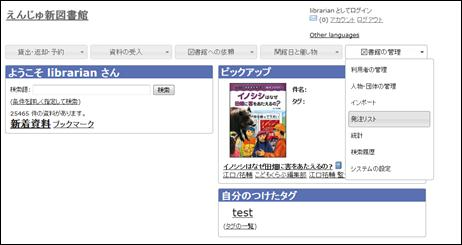
2. 右メニューの［発注リストの新規作成］をクリックします。  
   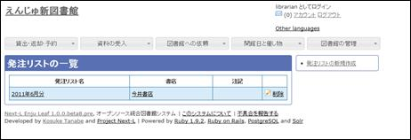
3. リストのタイトルを入力し、書店を選択したら［発注リストを作成］ボタンをクリックします。  
   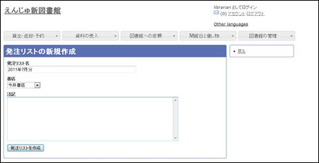

### ■発注したい図書発注リストに登録する

作成した発注リストに、発注したい図書を加えていきます。

1. ［図書館への依頼］メニューから［購入リクエスト］を選択します。  
   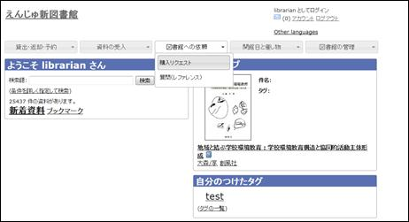
2. 右メニューの［購入リクエストの新規作成］をクリックします。  
   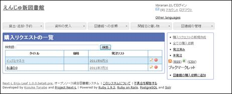
3. タイトルや著者を入力します。  
   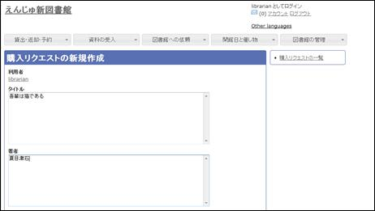
4. その他必要な項目を入力し、［購入リクエスト作成］ボタンをクリックします。  
   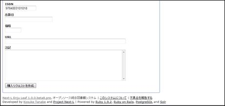
5. 購入リクエストの表示画面に切り替わったら、右メニューの［発注リストに追加する］をクリックします。  
   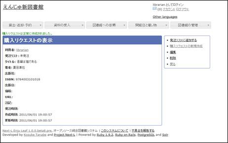
6. 発注リストを選択し、［発注を作成］ボタンをクリックします。  
   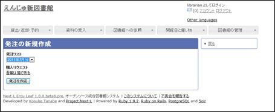

### ■発注リストを印刷する

作成した発注リストは、CSVファイルに書き出し、印刷することができます。

1. ［図書館の管理］メニューから［発注リスト］を選択します。  
   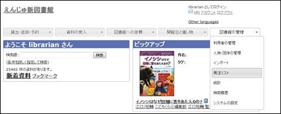
2. 印刷したい発注リストをクリックします。  
   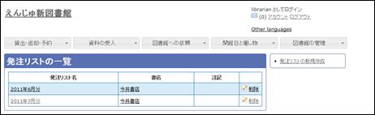
3. 右メニューの［購入リクエスト］ボタンをクリックします。  
   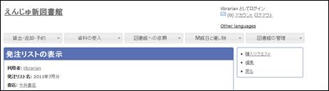
4. 右メニューの［CSV］をクリックし、名前を付けてCSVファイルを保存します。  
   
5. 必要に応じて、CSVファイルを印刷します。

4-2 図書を登録する
------------------

発注した図書が届いたら、資料としてEnjuに登録します。Enjuへの登録は、TSVファイルやMARCファイルを読み込んで一括登録する方法が、一般的かつ効率的です。ISBNコードで1件ずつ行うこともできます。

### ■TSVファイル、MARCファイルを読み込んで登録する

1. ［資料の受入］メニューから［TSVファイルからのインポート］を選択します。  
   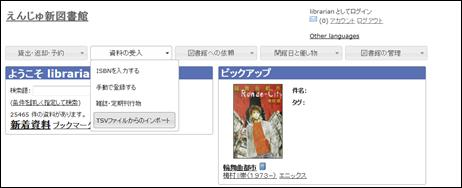
2. ［参照］ボタンをクリックしてインポート用のファイルを選択し、［編集モード］で［作成］を選択して［インポートされる資料のファイルを作成］ボタンをクリックします。  
   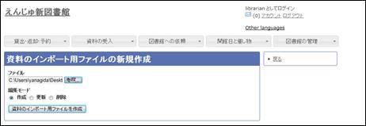
   
   
【Memo】［編集］モードで［更新］を選択すると、TSVファイルまたはMARCファイルで利用者情報をまとめて更新できます。TSVファイルを利用する場合は、更新したい資料の個別資料番号（item_identifier）と更新したいフィールドの内容が記述されたファイルを準備しておきます。また、［削除］を選択すると、TSVファイルやMARCファイルで利用者情報をまとめて削除できます。TSVファイルを利用して利用者情報を削除する場合は、削除したい資料の個別資料番号（item_identifier）のみ記述されたファイルを準備しておきます。
   

3. 「インポートされる資料のファイルは正常に作成されました。」のメッセージが表示され、資料のデータがインポートされます。

### ■ISBNファイルを読み込んで登録する

1. ISBNのフィールドだけ入力したTSVファイルを用意し、前述の操作に従ってTSVファイルを読み込んで登録します。

	
【Memo】ISBNコードが分かっている場合は、タイトルや著者などほかのフィールド情報をTSVファイルに入力しておかなくても、ISBNコードから国立国会図書館のデータを参照して、自動的に空白のフィールドが埋められます。データの誤りによって登録ができなかった資料は、［失敗］をクリックして表示を絞り込み、ISBNコードなどを確認して再登録します。
	

### ■手動で登録する

1. ［資料の受入］メニューから［手動で登録する］を選択します。  
   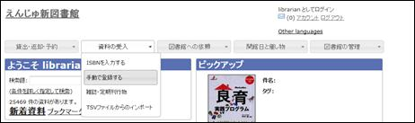
2. 原題のほか必要な項目を入力します。  
   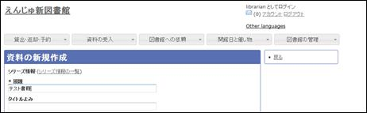
3. 入力が終了したら、［資料を作成］ボタンをクリックします。  
   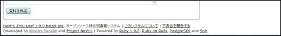

	
【Memo】「*」のマークが付いた項目は入力必須項目です。
	

4. 「資料は正常に作成されました。」のメッセージが表示され、図書が登録されます。

<h4 class="alert-heading">【Column】TSVファイルの作り方</h4>
1行目に、それぞれの項目に関わるフィールド名を（できれば " " で囲って）指定します。
フィールド名とその意味については次の通りです。

### ■図書の場合

### ■CD/DVDの場合

### ■定期刊行物の場合

内部的に存在するもの  

### ■ISBNコードを入力して1件ずつ登録する

1. ［資料の受入］メニューから［ISBNを入力する］を選択します。  
   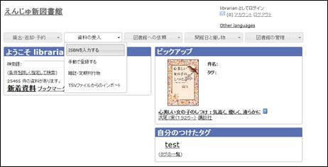
2. ISBNコードを入力し、［インポートのリクエストを作成］をクリックします。  
   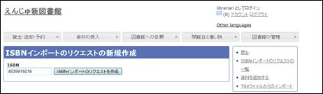
3. 「インポートのリクエストは正常に作成されました。」と表示され、登録が完了します。  
   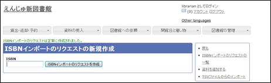

【Memo】右メニューの［インポートのリクエストの一覧］をクリックすると、リクエストが作成されているのを確認できます。

4-3 所蔵情報を登録・一覧表示する
--------------------------------

登録された資料を、図書館の蔵書として登録します。この作業が完了してはじめて資料の貸出が可能となります。

### ■所蔵情報を登録する

1. ［図書館の管理］メニューから［システムの設定］を選択します。  
   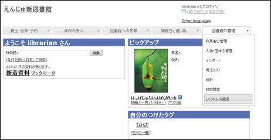
2. ［資料］グループの［資料］をクリックします。  
   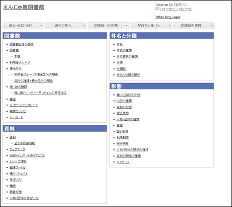
3. 所蔵情報を登録したい資料をクリックします。  
   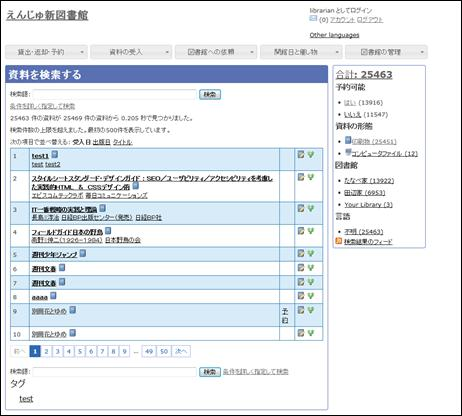
4. 右メニューの［所蔵を編集］をクリックします。  
   
5. 右メニューの［所蔵情報の新規作成］をクリックします。  
   
6. 図書館や貸出状態などを設定して、［所蔵情報を作成］ボタンをクリックします。  
   
7. 「所蔵情報は正常に作成されました。」のメッセージが表示され、所蔵情報が登録されます。

<h4 class="alert-heading">【Column】寄贈を受け付ける</h4>
資料が寄贈されたものであることを示したい場合は、［注記］に寄贈者などの情報を入力します。

### ■所蔵情報を一覧表示する

1. ［図書館の管理］メニューから［システムの設定］を選択します。  
   
2. ［資料］グループの［全ての所蔵情報］をクリックします。  
   
3. 所蔵情報の一覧が表示されます。  
   

4-4 図書を除籍・移管する
------------------------

所蔵情報が登録された図書を、除籍（削除）することもできます。

1. ［図書館の管理］メニューから［システムの設定］を選択します。  
   
2. ［資料］グループの［全ての所蔵情報］をクリックします。  
   
3. 削除したい図書の所蔵情報IDをクリックします。  
   
4. 右メニューの［削除］をクリックします。  
   
5. メッセージが表示されたら［OK］をクリックします。  
   

	
【Memo】削除を取りやめたい場合は［キャンセル］をクリックします。
	

4-5 新着資料の一覧を表示する
----------------------------

Enjuでは、新着資料の一覧を表示することができます。

1. トップページの［新着資料］をクリックします。  
	
2. 新着資料の一覧が表示されます。  
   

4-6 Webページを資料として登録する
---------------------------------

Enjuでは、ブックマークレットを利用してWebページやWeb上のPDFなどを資料として登録することができます。

1. トップページの［ブックマーク］をクリックします。  
   
2. 右メニューの［図書館のブックマークに追加する］を右クリックし、［お気に入りに追加］をクリックします。  
   
3. お気に入りに登録します。  
   
4. 資料として登録したいページを表示し、お気に入りから［図書館のブックマークに追加する］を選択します。  
   
5. Enjuのブックマークの新規作成画面が表示されるので、内容を確認して［ブックマークを作成］ボタンをクリックします。  
   
6. 「ブックマークは正常に作成されました。」のメッセージが表示され、資料が登録されます。
7. 次回以降は手順4.以降を行い、資料を登録します。

	
【Memo】登録されたWebページやPDFの一覧は、トップページの［ブックマーク］をクリックすると表示できます。
	

	ブックマークにはせず、ただの資料として登録しておきたい場合は、ブックマークの一覧で該当の資料の［削除］をクリックします。

4-7 画像を登録する
------------------

Enjuでは、画像（図書の表紙など）を登録し、資料に関連づけることができます。

1. ［図書館の管理］メニューから［システムの設定］を選択します。  
   
2. ［資料］グループの［資料］をクリックします。  
   
3. 画像をアップロードしたい資料をクリックします。  
   
4. 右メニューの［画像ファイルの新規作成］をクリックします。  
   
5. ［参照］ボタンをクリックしてアップしたい画像ファイルを選択し、［画像ファイルを作成］ボタンをクリックします。  
   
6. 「画像ファイルは正常に作成されました。」というメッセージが表示され、画像ファイルが登録されます。
 
第5章 雑誌の受入をする
======================

Enjuを使い、雑誌の受入に関して、次のような作業が行えます。

* 雑誌を登録する
* 雑誌の各号を登録する

5-1 雑誌（シリーズ）を登録する
------------------------------

雑誌を登録する場合は、まず雑誌のシリーズを登録しておきます。

1. ［資料の受入］メニューから［雑紙・定期刊行物］を選択します。  
   
2. 右メニューの［定期刊行物の記述の新規作成］をクリックします。  
   
3. シリーズ名などを入力して、［定期刊行物の記述を作成］ボタンをクリックします。  
   
4. 「定期刊行物の記述は正常に作成されました。」のメッセージが表示され、雑誌（シリーズ）が登録されます。

5-2 個々の雑誌を登録する
------------------------

雑誌（シリーズ）を登録したら、個々の雑誌を登録します。

1. ［資料の受入］メニューから［雑紙・定期刊行物］を選択します。  
   
2. 登録したい雑誌（シリーズ）の［資料の新規作成］をクリックします。  
   
3. 通号など必要な情報を入力します。  
   
4. ［資料を作成］ボタンをクリックします。  
   
5. 「資料は正常に作成されました。」のメッセージが表示され、雑誌が資料として登録されます。
6. 「[4-3 所蔵情報を登録・一覧表示する](#span4-3-)」の手順に従い、資料の所蔵情報を登録します。

   
【Memo】雑誌の場合、次の号を資料として登録しようとすると、「通号」などのデータが前回のデータを参照して自動的に更新されます。
   

 
第6章 貸出・返却・予約を処理する
================================

Enjuでは、図書の貸出・返却・予約の処理が行えます。次のような作業を行えます。

貸出には、次のような手続きがあります。

* 資料を貸し出す  
  カードを忘れた利用者への貸出を含む
* 貸出の延長手続きをする
* 未登録資料を貸し出す
* 貸出状況を確認する

返却には、次のような手続きがあります。

* 返却を受け付ける
* 予約されている資料を保管する

予約には、次のような手続きがあります。

* 予約を新規作成する
* 予約を確認する
  予約の現状の検索、予約一覧の表示／印刷
* 予約の変更・取消をする

6-1 貸出をする
--------------

Enjuでは、利用者カードと資料のバーコードを読み込むことにより貸出を行います。利用者カードを忘れた利用者にも、氏名などから利用者を検索し利用者番号を確認することにより、資料の貸出が可能です。貸出の延長や未登録資料の貸出、貸出状況の確認も行えます。

### ■資料を貸し出す

1. ［貸出・返却・予約］メニューから［貸出］を選択します。  
   
2. 利用者番号を入力し［読み込み］ボタンをクリックします。  
   

	
【Memo】通常は、利用者カードのバーコードを読み込みます。
	

3. 所蔵IDを入力し、［読み込み］ボタンをクリックします。  
   

	
【Memo】通常は、図書のバーコードを読み込みます。
	

4. ［上記の資料を貸し出す］ボタンをクリックします。  
   
5. 「貸出が完了しました。」のメッセージが表示され、貸出の手続きが完了します。

### ■利用者カードを忘れた利用者に資料を貸し出す

1. ［図書館の管理］メニューから［利用者の管理］を選択します。  
   
2. ユーザ名を検索語として入力し［検索］をクリックします。  
   
3. 該当するユーザの［アカウント情報の編集］をクリックします。  
   
4. 利用者番号を確認します。  
   

	
【Memo】利用者番号をコピーしておくと、後の操作がスムーズです。
	

5. ［貸出・返却・予約］メニューから［貸出］を選択します。  
   
6. 利用者番号を入力します。  
   

	
【Memo】利用者番号をコピーしておいた場合は、ここで貼り付けます。
	

7. 以降は、通常の貸出の手順に従います。

### ■貸出中の資料の一覧を表示する

1. ［貸出・返却・予約］メニューから［貸出履歴］を選択します。  
   
2. 右メニューの［全ての貸出］をクリックします。  
   
3. 貸出中の資料の一覧が表示されます。  
   

### ■貸出の延長手続きをする

1. 貸出の一覧で、貸出の延長手続きをしたい貸出項目の［貸出期間の延長］をクリックします。  
   
2. 貸出期限日などを編集して、［貸出を更新］ボタンをクリックします。  
   
3. 「貸出は正常に更新されました。」のメッセージが表示され、貸出期間が延長されます。

6-2 返却を受け付ける
--------------------

Enjuでは、返却資料を受け付けられると同時に、予約の入っている資料が返却された場合は、アラートを表示させることができます。アラートの表示に気付いたら、予約された本は書架に戻さずに特定の場所で管理しましょう。

1. ［貸出・返却・予約］メニューから［返却］を選択します。  
   
2. 所蔵情報IDを入力し、［返却（取り消しはできません）］ボタンをクリックします。  
   

	
【Memo】通常は、図書のバーコードを読み込みます。
	

3. 「この資料は正常に返却されました。」のメッセージが表示され、返却の手続きが完了します。

<h4 class="alert-heading">【Column】予約が入っている資料を取り置きする</h4>
予約が入っている資料が返却された場合、返却の完了時に「この資料は予約されています」というメッセージが表示されます。このメッセージが表示された場合は、その資料を所定の場所に取り置きします。

6-3 予約を受け付ける
--------------------

予約は利用者自身で行うのが主ですが、図書館員が予約を受け付けることもできます。

### ■予約を新規作成する

1. ［貸出・返却・予約］メニューから［予約の一覧］を選択します。  
   
2. 右メニューの［予約の新規作成］をクリックします。  
   
3. 予約したい本の名前を検索語に入力し、［検索］をクリックします。  
   
4. 予約したい本が検索されたら、［予約］をクリックします。  
   
5. 予約の内容を確認し、［作成］ボタンをクリックします。  
   
 
### ■予約の一覧を表示・印刷する

1. ［貸出・返却・予約］メニューから［予約の一覧］を選択します。  
   
2. 予約の一覧が表示されます。一覧を印刷したい場合は、右メニューの［CSV］をクリックしてCSVファイルを保存し、必要に応じてCSVファイルを印刷します。  
   
 
### ■予約の変更・取消をする

1. ［貸出・返却・予約］メニューから［予約の一覧］を選択します。  
   
2. 編集したい場合は予約の編集マークを、削除したい場合は削除マークをクリックします。  
   
3. 編集する場合は、有効期限などを変更して［予約を更新］ボタンをクリックします。  
   
 
### ■利用者に予約資料の到着を連絡する

1. その日に返却された予約資料の一覧を表示します。

   
【Memo】一覧には、ユーザが希望する連絡方法（メール、電話、FAX）などが表示されます。
   

2. メールで連絡したい場合は、メールでの連絡を希望しているユーザの［メール連絡］にチェックを入れ、［メールを送信］ボタンをクリックします。
3. メール以外の連絡方法を希望しているユーザについては、それぞれ個別に対応します。

6-4 督促の連絡をする
--------------------

資料の返却が遅れているユーザを一覧表示し、メールや電話で督促の連絡をすることができます。

1. ［貸出・返却・予約］メニューから［貸出履歴］をクリックします。  
   
2. 右メニューの［全ての貸出］をクリックします。  
   
3. 右メニューの［延滞］をクリックします。  
   
4. 何日延滞している人に督促の連絡をしたいのかにより、延滞日数に数値を入力して［検索］ボタンをクリックします。  
   

	
【Memo】たとえば、延滞日数に「7」と入力すると、1週間以上延滞している資料のみに絞り込まれます。
	

5. メールで督促の連絡をする人にチェックをして、［メールを送信］をクリックします。
6. 必要に応じて右メニューの［CSV］をクリックしてCSVファイルを保存し、ユーザの希望している連絡方法に従って督促の連絡をします。  
   

6-5 相互貸借をする
------------------

Enjuでは、NACSIS-ILL、ゆにかねっとの利用を検討しています。

第7章 休館日と催し物を登録する
==============================

Enjuでは、休館日の登録に関して、次のような機能があります。

* 休館日を登録する
  図書館の休館日を登録します。

催し物（お知らせ）の登録には、次のような機能があります。

* 催し物（お知らせ）を登録する
* カレンダーを表示する

7-1 休館日を登録する
--------------------

Enjuでは、図書館の休館日を登録することができます。

1. ［開館日と催し物］メニューから［全ての催し物］を選択します。  
   
2. 右メニューの［開催日と催し物の新規作成］をクリックします。  
   
3. 催し物の種類で「closed」を選択し、開始時刻で休館日を選択、名前に「休館日」と入力し、［終日］にチェックを入れて［開催日と催し物の新規作成］ボタンをクリックします。  
   
4. 「開館日と催し物は正常に作成されました。」のメッセージが表示され、休館日が登録されます。  
   

7-2 催し物を登録する
--------------------

Enjuでは、図書館で行われるさまざまな催し物を登録し、カレンダーに表示できます。

### ■手動で催し物を登録する

1. ［開館日と催し物］メニューから［全ての催し物］を選択します。  
   
2. 右メニューの［開催日と催し物の新規作成］をクリックします。  
   
3. 催し物の種類で「unknown」を選択し、名前や開始時刻、終了時刻などを設定して、［開催日と催し物の新規作成］ボタンをクリックします。  
   
4. 「開館日と催し物は正常に作成されました。」のメッセージが表示され、休館日が登録されます。  
   

### ■催し物のデータをインポートする

1. ［開館日と催し物］メニューから［インポート］を選択します。  
   
2. ［参照］ボタンをクリックしてインポートしたいファイルを選択し、［催し物ファイルのインポートを作成］ボタンをクリックします。  
   
3. 「催し物ファイルのインポートは正常に作成されました。」のメッセージが表示され、催し物のデータがインポートされます。  
   

7-3 カレンダーを利用する
------------------------

開館日や催し物などの情報を、カレンダーとして表示することができます。

1. ［開館日と催し物］メニューから［カレンダー］を選択します。  
   
2. カレンダーが表示されます。  
   

	
【Memo】カレンダーの日付部分をクリックすると、「開催日と催し物の新規作成」の画面が開き、開館日や催し物を新規で追加したり編集したりできます。
	

第8章 レファレンスを処理する
============================

利用者からのレファレンス（質問）にもEnjuで対応できます。

* レファレンスに回答する

Enjuに登録されていないレファレンスは、国立国会図書館のレファレンス協同データベースを検索することで、より多くのレファレンスを参照することができます。

* レファレンスを検索する
* 国立国会図書館のレファレンス協同データベースを検索する

8-1 レファレンスに回答する
--------------------------

Enjuでは、利用者から送られてきた質問（レファレンス）に、回答を付けることができます。

1. ［図書館への依頼］メニューから［質問（レファレンス）］を選択します。  
   
2. 検索語で質問（レファレンス）検索するか、右メニューの［全ての質問］をクリックします。  
   
3. 回答したい質問（レファレンス）をクリックします。  
   
4. 右メニューの［この質問に答える］をクリックします。  
   
5. 本文に回答を入力し、［回答を作成］ボタンをクリックします。  
   
6. 「回答は正常に作成されました。」のメッセージが表示され、回答が登録されます。  
   

8-2 レファレンスを検索する
--------------------------

Enjuに登録されたレファレンスを検索します。登録されていないレファレンスは、国立国会図書館のレファレンス協同データベースから検索できます。

1. ［図書館への依頼］メニューから［質問（レファレンス）］を選択します。  
   
2. 検索語を入力して［検索］ボタンをクリックします。  
   
3. 検索結果が表示されます。
4. さらに国立国会図書館カンファレンス協同データベースを検索する場合は、［カンファレンス共同データベースを検索］をクリックします。
5. 検索されたデータが表示されます。  
   

第9章 資料を検索する
====================

Enjuを利用した資料の検索方法には、演算子やフィールド名を直接入力して検索する方法と、該当のテキストボックスに検索語入力する方法があります。

* キーワードで検索する
* 条件を詳しく指定して検索する
* 演算子やフィールド名を使って検索をする

9-1 キーワードで検索する
------------------------

資料を指定したキーワードで検索できます。

1. トップページの検索語にキーワードを入力し、［検索］ボタンをクリックします。  
   
2. キーワードに該当する資料が検索されます。  
   

	
【Memo】スペースで区切りながらキーワードを入力すると、複数のキーワードに一致する資料を検索できます。
	

9-2 条件を詳しく指定して検索する
--------------------------------

条件を詳しく指定して、資料を検索することもできます。

1. トップページの［（条件を詳しく指定して検索）］をクリックします。  
   
2. 複数の条件を指定して［検索］ボタンをクリックします。  
   

9-3 フィールド名や演算子を使って検索する
----------------------------------------

「AND」や「OR」などの演算子と、フィールド名を組み合わせた検索式を作成すると、より高度な検索が行えます。

第10章 蔵書点検機能を利用する
=============================

書架のバーコードなどを読み込んで作成した蔵書点検用のファイルを、Enjuに登録されたデータと照合し、蔵書点検を行うことができます。

* 蔵書点検を行う

10-1 蔵書点検ファイルを取り込む
-------------------------------

書架のバーコードを読み込んで作成した蔵書点検用のファイルを、Enjuに取り込みます。

1. ［図書館の管理］メニューから［システムの設定］を選択します。  
   
2. ［資料］グループの［蔵書点検］をクリックします。  
   
3. 右メニューの［蔵書点検ファイルの新規作成］を選択します。  
   
4. ［参照］ボタンをクリックします。  
   
5. インポートしたいファイルを指定し、［開く］をクリックします。
6. ［蔵書点検ファイルを作成］ボタンをクリックします。  
   
7. 「蔵書点検ファイルは正常に作成されました。」のメッセージが表示され、蔵書点検ファイルが取り込まれます。

10-2 蔵書点検を行う
-------------------

取り込んだ蔵書点検用のファイルのデータを、Enjuのデータと照合します。

1. ［図書館の管理］メニューから［システムの設定］を選択します。  
   
2. ［資料］グループの［蔵書点検］をクリックします。  
   
3. 右メニューの［蔵書点検を行う］を選択します。
4. ［参照］ボタンをクリックします。
5. 蔵書点検ファイルを指定し、［開く］をクリックします。
6. 蔵書点検を行う書架の範囲を設定します。
7. ［蔵書点検を行う］ボタンをクリックします。
8. 蔵書点検の結果が表示されます。

第11章 統計機能を利用する
=========================

現在のEnjuでは、ブックマーク回数の統計を取ることができます

* ブックマーク回数統計

現在のEnjuでは、利用者別と資料別に、貸出の統計を取ることができます

* 利用者別貸出統計
* 資料別貸出統計

現在のEnjuでは、利用者別と資料別で予約の統計を取ることができます

* 利用者別予約統計
* 資料別予約統計

11-1 ブックマーク回数の統計を取る
---------------------------------

Enjuでは、ブックマークの回数の統計を取ることができます。

1. ［図書館の管理］メニューから［統計］を選択します。  
   
2. ［ブックマーク回数］をクリックします。  
   
3. 右メニューの［ブックマーク統計の新規作成］をクリックします。  
   
4. 統計期間を設定して［ブックマーク統計を作成］をクリックします。  
   
5. 「ブックマーク統計は正常に作成されました。」のメッセージが表示され、ブックマーク統計データが作成されます。
6. 右メニューの［CSV］をクリックし、統計データを保存します。  
   

11-2 貸出の統計を取る
---------------------

Enjuでは、利用者別と資料別で貸出の統計を取ることができます。

### ■利用者別貸出統計を取る

1. ［図書館の管理］メニューから［統計］を選択します。  
   
2. ［利用者の貸出回数］をクリックします。  
   
3. 右メニューの［利用者別貸出統計の新規作成］をクリックします。  
   
4. 統計期間を設定して［利用者別貸出統計を作成］をクリックします。  
   
5. 「利用者別貸出統計は正常に作成されました。」のメッセージが表示され、利用者別貸出統計データが作成されます。右メニューの［CSV］をクリックし、統計データを保存します。  
   

### ■資料別貸出統計を取る

1. ［図書館の管理］メニューから［統計］を選択します。  
   
2. ［資料の貸出回数］をクリックします。  
   
3. 右メニューの［資料別貸出統計の新規作成］をクリックします。  
   
4. 統計期間を設定して［資料別貸出統計を作成］をクリックします。  
   
5. 「資料別貸出統計は正常に作成されました。」のメッセージが表示され、資料別貸出統計データが作成されます。
   右メニューの［CSV］をクリックして統計データを保存します。

11-3 予約の統計を取る
---------------------

Enjuでは、利用者別と資料別に、予約の統計を取ることができます。

### ■利用者別貸出統計を取る

1. ［図書館の管理］メニューから［統計］を選択します。  
   
2. ［利用者の予約回数］をクリックします。  
   
3. 右メニューの［利用者別予約統計の新規作成］をクリックします。  
   
4. 統計期間を設定して［利用者別予約統計を作成］をクリックします。  
   
5. 「利用者別予約統計は正常に作成されました。」のメッセージが表示され、利用者別予約統計データが作成されます。
6. 右メニューの［CSV］をクリックし、統計データを保存します。  
   
 
### ■資料別貸出統計を取る

1. ［図書館の管理］メニューから［統計］を選択します。  
   
2. ［資料の予約回数］をクリックします。  
   
3. 右メニューの［資料別予約統計の新規作成］をクリックします。  
   
4. 統計期間を設定して［資料別予約統計を作成］をクリックします。  
   
5. 「資料別予約統計は正常に作成されました。」のメッセージが表示され、資料別予約統計データが作成されます。
   右メニューの［CSV］をクリックして統計データを保存します。
 
第12章 印刷その他の機能を利用する
=================================

Enjuではさまざまなバーコード印刷機能やブックマークなど、図書館の運用に便利な機能が搭載されています。

* バーコードや背表紙ラベルを印刷する
* ブックマークを活用する

12-1 印刷機能を利用する
-----------------------

Enjuでは、資料に貼るバーコードや背表紙ラベルを印刷できます。

### ■バーコード印刷する

Enjuでは、資料に貼るバーコードを印刷できます。

### ■背表紙ラベルを印刷する

Enjuでは、資料の背表紙に貼るラベルを印刷できます。

12-2 ブックマークを活用する
---------------------------

頻繁に閲覧する資料は、ブラウザの「ブックマーク」と同様に、Enjuでも「ブックマーク」として登録しておくことができます。

### ■ブックマークを追加する

1. ［図書館の管理］メニューの［システムの設定］を選択します。  
   
2. ［資料］グループの［資料］をクリックします。  
   
3. 検索機能を使うなどして、ブックマークしたい資料を探します。  
   
4. ブックマークしたい資料をクリックします。  
   
5. 目的の資料を表示し、右メニューの［ブックマークに追加する］をクリックします。  
   
6. 必要に応じてタグなどを入力し、［ブックマークを作成］ボタンをクリックします。  
   
7. 「ブックマークは正常に作成されました。」のメッセージが表示され、ブックマークが作成されます。

### ■ブックマークを表示する

1. トップページの［ブックマーク］をクリックします。  
   
2. ブックマークの一覧が表示されます。  
   

	
【Memo】ブックマークの数が多い場合は、検索語でブックマークを絞り込むことができます。また、登録されたブックマークを削除したい場合は、［削除］をクリックします。
	

