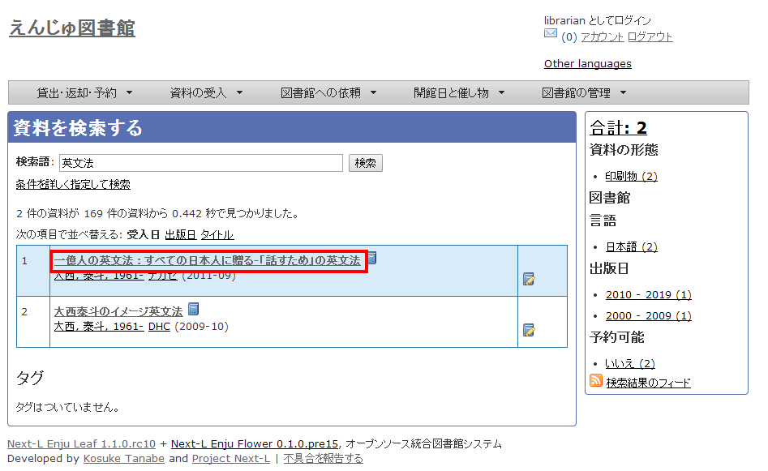
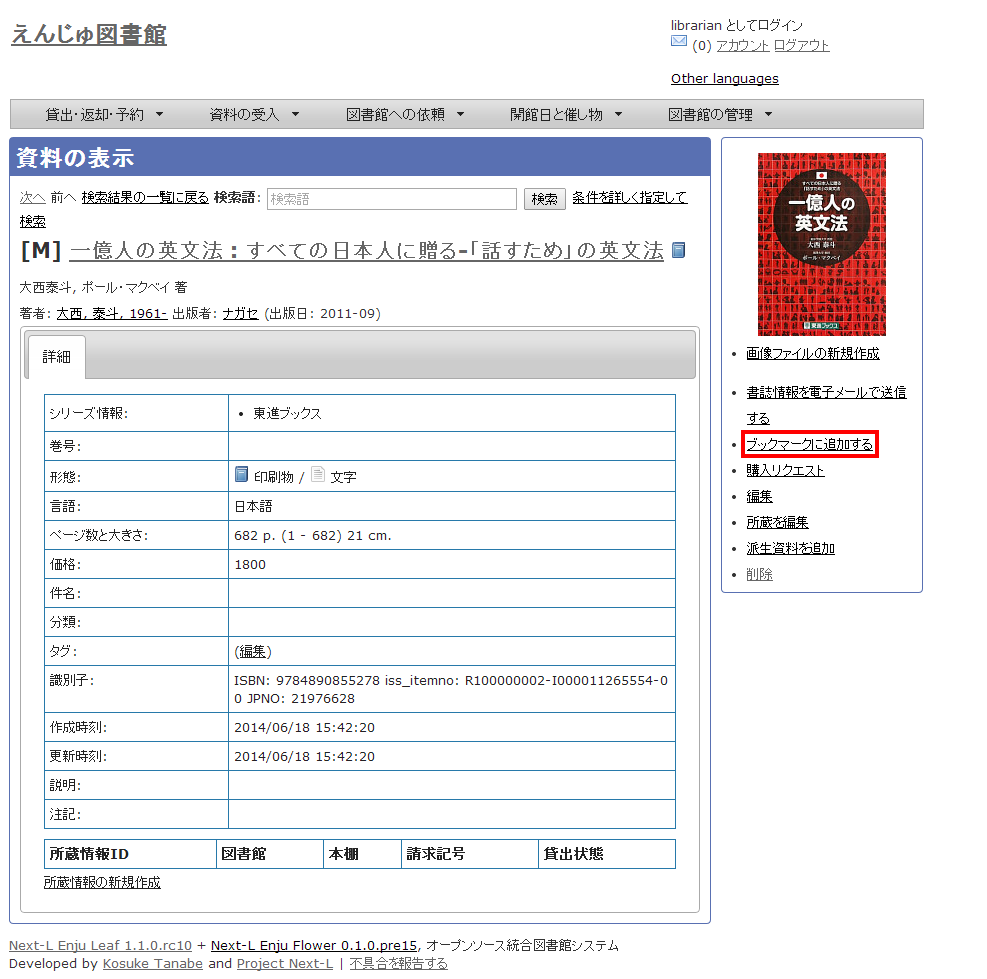
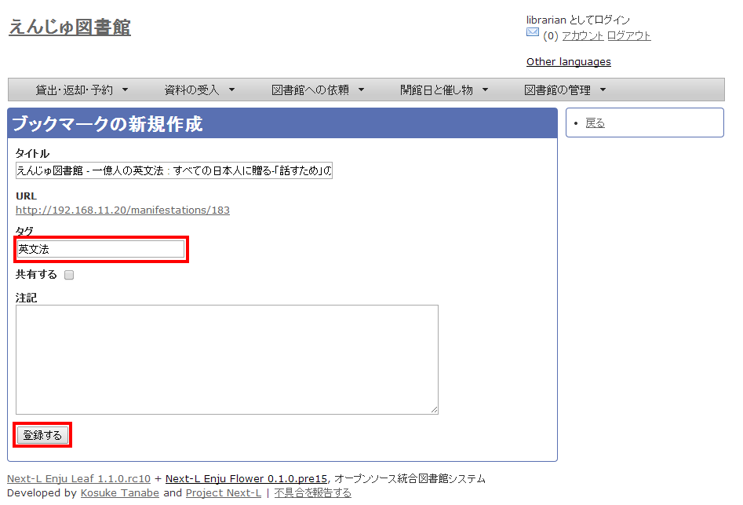
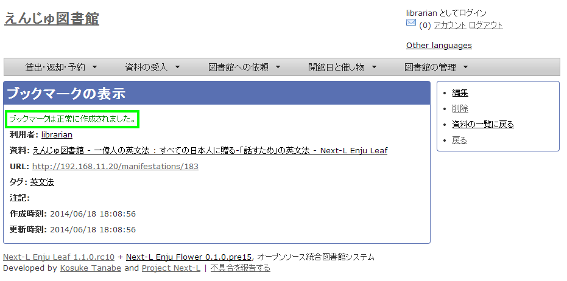
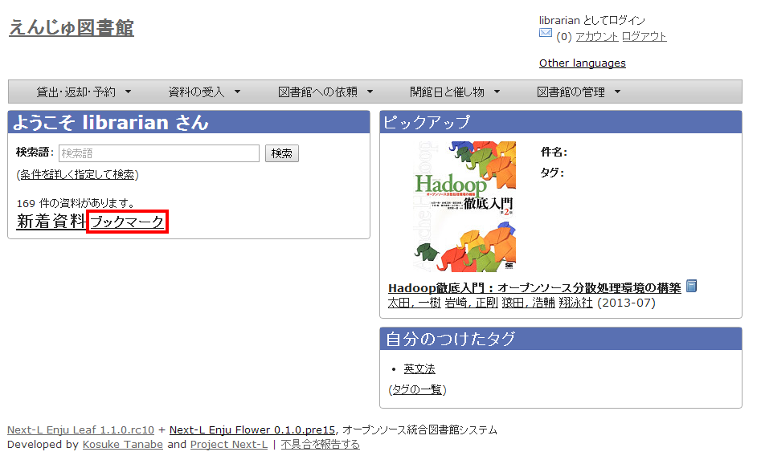
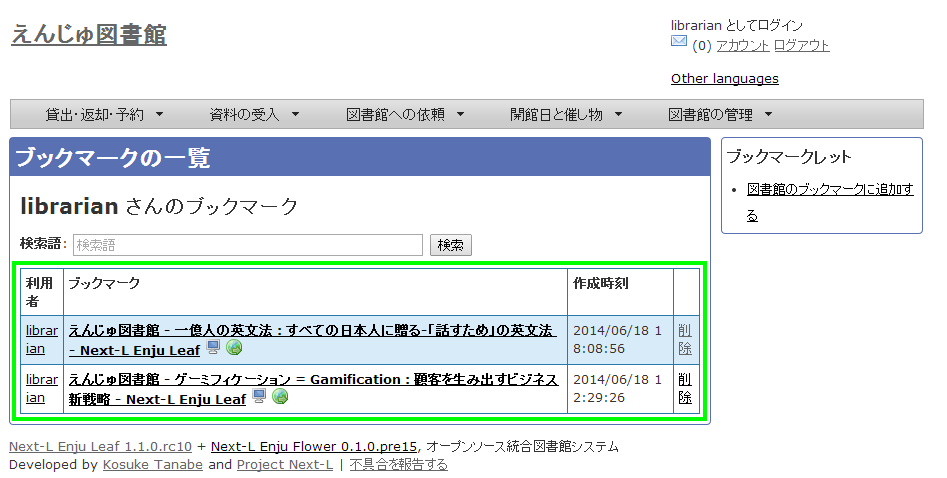

* Contents
{:toc}

第12章 その他の機能を利用する {#section12}
==============================================

Enjuではさまざまなバーコード印刷機能やブックマークなど、図書館の運用に便利な機能が搭載されています。

* バーコードや背表紙ラベルを印刷する
* ブックマークを活用する

{::comment}12-1  enju_operation/print.md {:/comment}
{::comment}12-2  enju_operation/bookmark.md {:/comment}

12-1 印刷機能を利用する {#section12-1}
--------------------------------------

【Memo】Next-L Enju Leaf 1.1.0.rc9 時点ではこの機能は未実装です。今のところ実装のめどは立っていません。

Enjuでは、資料に貼るバーコードや背表紙ラベルを印刷できます。

### 12-1-1 バーコード印刷する {#section12-1-1}

Enjuでは、資料に貼るバーコードを印刷できます。

### 12-1-2 背表紙ラベルを印刷する {#section12-1-2}

Enjuでは、資料の背表紙に貼るラベルを印刷できます。

12-2 ブックマークを活用する {#section12-2}
-------------------------------------------

【Memo】
この機能は現在開発中です。また、この機能は標準では使えない機能です。この機能を使うためには、インストールマニュアルの「[5-5 [enju_bookmark]モジュール（ブックマーク機能）](enju_install_vm_5.html#section5-5)」を参照してモジュールをインストールする必要があります。

頻繁に閲覧する資料は、ブラウザの「ブックマーク」と同様に、Enjuでも「ブックマーク
」として登録しておくことができます。

{::comment}

### 12-2-1 ブックマークを追加する {#section12-2-1}

#### 3. ブックマークしたい資料を検索します。
トップページの検索語に登録したい資料のキーワードを入力し、
［検索］ボタンをクリックします

#### 4. ブックマークしたい資料をクリックします。  

#### 5. 目的の資料を表示し、右メニューの［ブックマークに追加する］をクリックします。  

#### 6. 必要に応じてタグなどを入力し、［登録］ボタンをクリックします。  

#### 7. 「ブックマークは正常に作成されました。」のメッセージが表示され、ブックマークが作成されます。

### 12-2-2 ブックマークを表示する {#section12-2-2}

#### 1. トップページの［ブックマーク］をクリックします。  

#### 2. ブックマークの一覧が表示されます。  

【Memo】ブックマークの数が多い場合は、検索語でブックマークを絞り込むことができます。また、登録されたブックマークを削除したい場合は、［削除］をクリックします。

{:/comment}


