* Contents
{:toc}

第4章 図書の受入をする {#section4}
==================================

{:toc}

図書の受入では、次のような作業を行えます。

* 図書を発注する
* 図書を登録する
* 蔵書情報を登録する
* 図書を除籍する
* 新着図書の一覧を表示・印刷する
* 所蔵目録の一覧を表示・印刷する

また、図書の受入に際し、次のような機能を利用することもできます。

{::comment}
* Webページを登録する  
  Webページを資料として受入します
{:/comment}

* 画像を登録する表紙画像のデータを、受入した図書にリンクさせます。

{::comment}4-1  enju_operation/order.md {:/comment}
{::comment}4-2  enju_operation/create_manifestation.md {:/comment}
{::comment}4-3  enju_operation/create_item.md {:/comment}
{::comment}4-4  enju_operation/accept_item.md {:/comment}
{::comment}4-5  enju_operation/delete_item.md {:/comment}
{::comment}4-6  enju_operation/list_new_item.md {:/comment}
{::comment}4-7 old  include  enju_operation/create_web_page.md  {:/comment}
{::comment}4-7  enju_operation/add_image.md {:/comment}

4-1 図書を発注する {#section4-1}
---------------------------------

### 4-1-1 発注リストを作成する {#section4-1-1}

発注する図書を登録する前に、まずは発注リストを作成します。

もし、[発注リスト]がない場合は、[enju_purchase_request]モジュールをインストール必要があります。インストール方法についてはインストールマニュアルの「[第5章 モジュールの追加](enju_install_vm_5.html)」の章を参照ください。

#### 1. ［図書館の管理］メニューから［発注リスト］を選択します。  

   
#### 2. 右メニューの［発注リストの新規作成］をクリックします。  

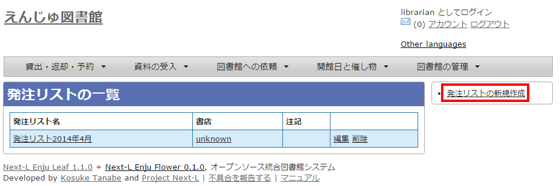

#### 3. リストのタイトルを入力し、書店を選択したら［登録する］ボタンをクリックします。  

#### 4. 「発注リストは正常に作成されました。」と表示され、発注リストが作成されます。

### 4-1-2 発注したい図書（購入リクエスト）を発注リストに登録する {#section4-1-2}

作成した発注リストに、発注したい図書（購入リクエスト）を加えていきます。

#### 1. ［図書館への依頼］メニューから［購入リクエスト］を選択します。  

#### 2. 右メニューの［購入リクエストの新規作成］をクリックします。  

#### 3. タイトルや著者などを入力し、［登録する］ボタンをクリックします。  

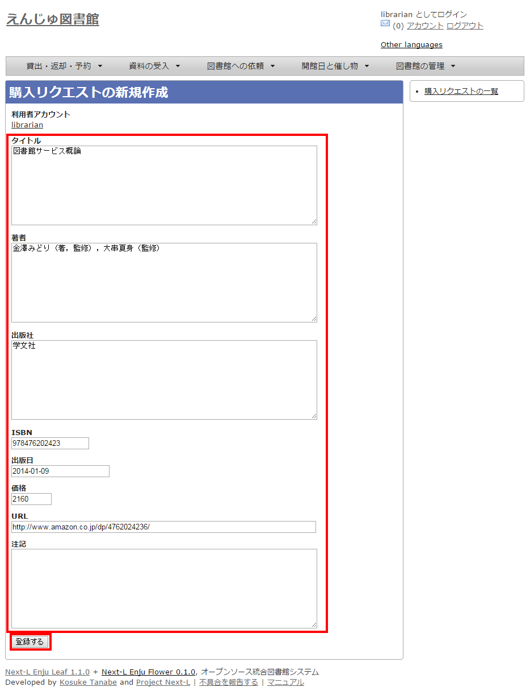

#### 4. 購入リクエストの表示画面に切り替わったら、右メニューの［発注リストに追加する］をクリックします。  

#### 5. 発注リストを選択し、［登録する］ボタンをクリックします。  

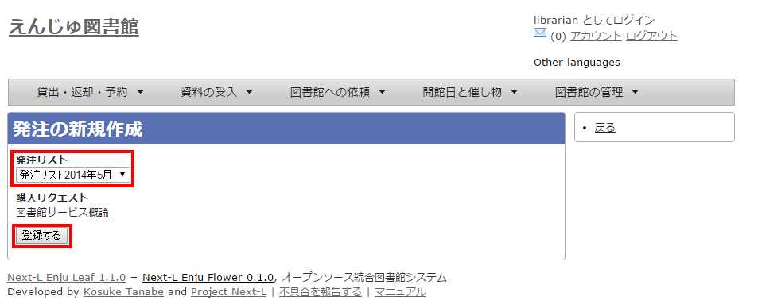

### 4-1-3 発注リストを印刷する

作成した発注リストは、CSVファイルに書き出し、印刷することができます。

#### 1. ［図書館の管理］メニューから［発注リスト］を選択します。  

#### 2. 印刷したい発注リストをクリックします。  

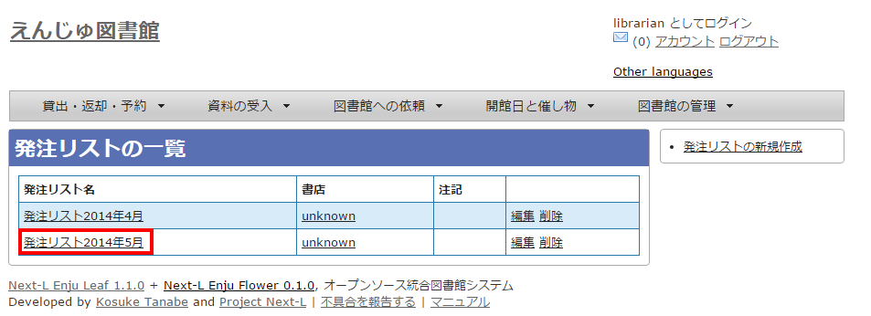

#### 3. 右メニューの［購入リクエスト］ボタンをクリックします。  

#### 4. 右メニューの［CSV］をクリックし、名前を付けてCSVファイルを保存します。  

#### 5. 必要に応じて、CSVファイルを印刷します。

4-2 図書を登録する {#section4-2}
--------------------------------

発注した図書が届いたら、資料としてEnjuに登録します。Enjuへの登録は、TSVファイルを読み込んで一括登録する方法、ISBNコードで1件ずつ行う方法、手動ですべての項目を入力する方法などがあります。

### 4-2-1 TSVファイルを読み込んで登録する {#section4-2-1}

#### 0. TSVファイルを用意します。TSVファイルの作り方の詳細については、「[4-2-7 TSVファイルの作り方](#section4-2-7) 」を参照してください。

#### 1. ［資料の受入］メニューから［TSVファイルからのインポート］を選択します。  

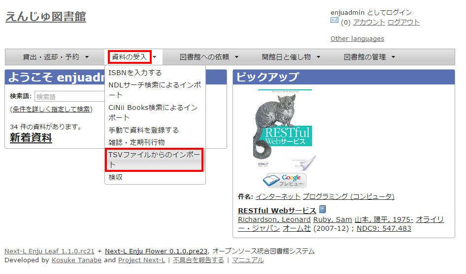

#### 2. ［ファイルを選択］ボタンをクリックしてインポート用のファイルを選択します。

#### 3. [編集モード]、[文字コード]、[既定の本棚]を選択して［インポートを開始］ボタンをクリックします。  

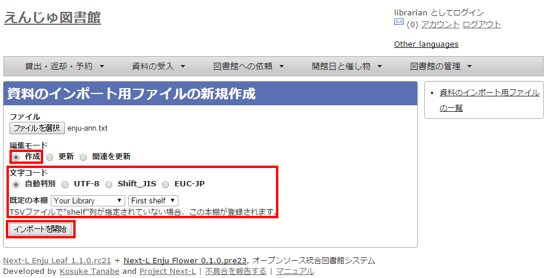
   

【Memo】[編集]モードで［更新］を選択すると、TSVファイルで資料の情報をまとめて更新できます。TSVファイルを利用する場合は、更新したい資料の個別資料番号（item_identifier）と更新したいフィールドの内容が記述されたファイルを準備しておきます。また、［削除］を選択すると、TSVファイルで資料の情報をまとめて削除できます。TSVファイルを利用して資料の情報を削除する場合は、削除したい資料の個別資料番号（item_identifier）のみ記述されたファイルを準備しておきます。[関連を更新]とするとxxxxxxxxxxxとなります。

【Memo】[文字コード]は基本的には自動判別でよいですが、うまくいかない場合は、文字コードを指定するようにしてください。

【Memo】[既定の本棚]は、TSVファイルに[本棚]を指定しない場合やTSVファイルで不正な本棚を指定していた場合に登録される本棚となります。TSVファイルに正しい[本棚]が指定されていた場合はTSVファイルを優先します。 

#### 4. 「資料のインポート用ファイルは正常に作成されました。」のメッセージが表示され、資料のデータインポートの準備が整いました。右の[資料のインポート用ファイルの一覧]をクリックします。  

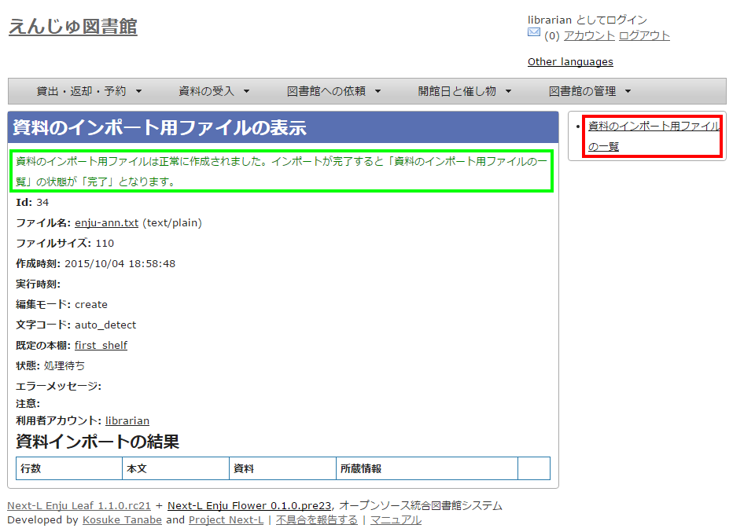

#### 5. 今までのインポート結果の一覧が表示されます。[状態]を見ると処理結果がわかります。インポートが完了したものは[完了]と表示されます。[処理待ち]のものは現在、実行中です。インポート完了時にはEnjuのメッセージ機能にてお知らせします（＊＊＊というメッセージが送られてきます）。注）Next-L Enju Leaf 1.1.0.rc12以前のバージョンの場合は毎時0分にインポート処理が開始します。

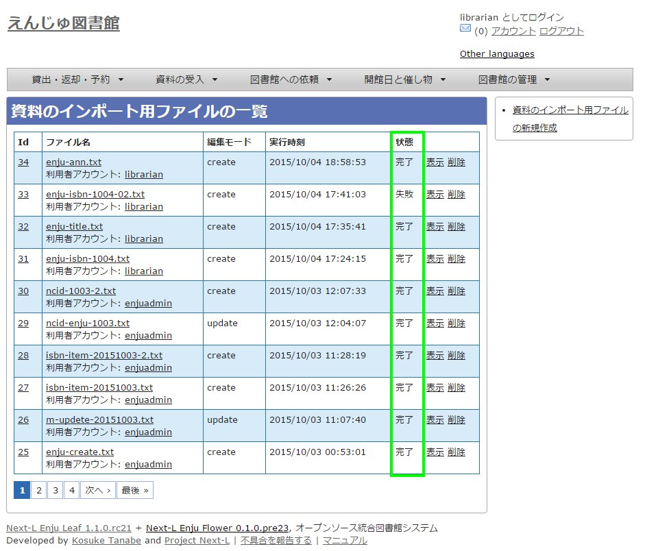

【Memo】この画面は[資料の受入]メニュー->[TSVファイルからのインポート]->右メニューの[資料のインポート用ファイルの一覧]とすればいつでも閲覧できます。
 

### 4-2-2 ISBNファイルを読み込んで登録する {#section4-2-2}

#### 1. ISBNのフィールドだけ入力したTSVファイルを用意し、前述の操作に従ってTSVファイルを読み込んで登録します。

【Memo】ISBNコードが分かっている場合は、タイトルや著者などほかのフィールド情報をTSVファイルに入力しておかなくても、ISBNコードから国立国会図書館のデータを参照して、自動的に空白のフィールドが埋められます。

#### 2. 個々のレコードの登録の成否を確認します。 [資料の受入］メニューから［ISBNを入力する］を選択します。

#### 3. 右メニューの［ISBNインポートリクエストの一覧］を選択します。

#### 4. ISBNインポートのリクエストの一覧が表示されます。[状態]の列をみれば、登録状況がわかります。[完了]となっていれば、登録されたことを示します。[処理待ち]は登録されていません。[失敗]の場合は、エラーのあった行以降のレコードが登録されていません。

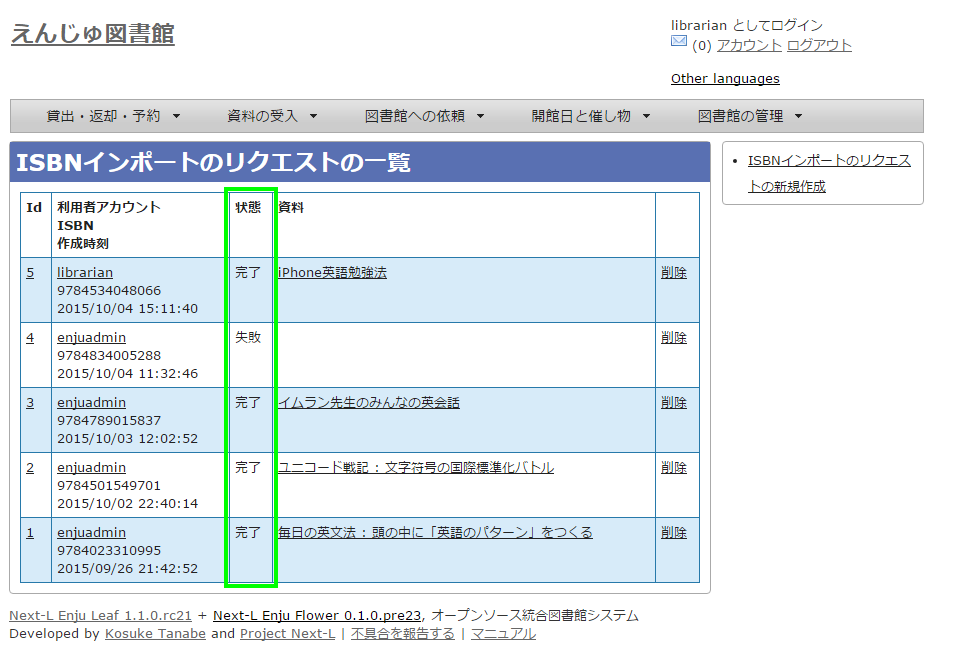

#### 5. 失敗や処理待ちとなっているレコードを個別に登録します。個別に登録する方法は次の「ISBNコードを入力して1件づつ登録する」「手動で資料を登録する」を参照してください。（失敗となっているものについては、エラー行以降のTSVインポートを再度実行する必要があります）

### 4-2-3 ISBNコードを入力して1件ずつ登録する {#section4-2-3}

ISBNコードから国立国会図書館のデータを参照して、資料を登録します。

#### 1. ［資料の受入］メニューから［ISBNを入力する］を選択します。

#### 2. ISBNコードを入力し、［登録する］をクリックします。

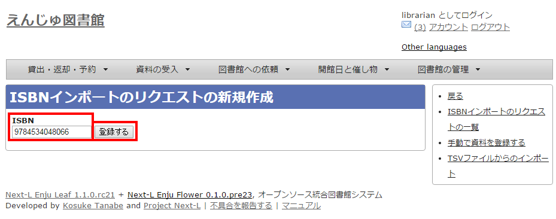

#### 3. 「インポートのリクエストは正常に作成されました。」と表示され、登録が完了します。

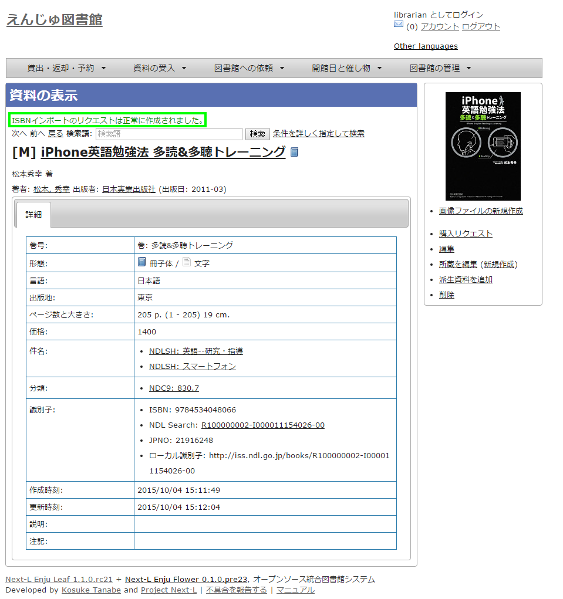

### 4-2-4 NDLサーチを検索して1件ずつ登録する {#section4-2-4}

NDLサーチ（国立国会図書館サーチ <http://iss.ndl.go.jp/>）で検索した資料を登録することができます。
ISBNが不明な場合やISBNで登録でできなかった場合などに使用します。
（ISBNで登録できない例：9784834005288）

#### 1. ［資料の受入］メニューから［NDLサーチ検索によるインポート］を選択します。

#### 2. 登録したい資料を検索します。検索語に登録したい資料のキーワードを入力し、［検索］ボタンをクリックします。

#### 3. 登録したい資料の[追加]をクリックします

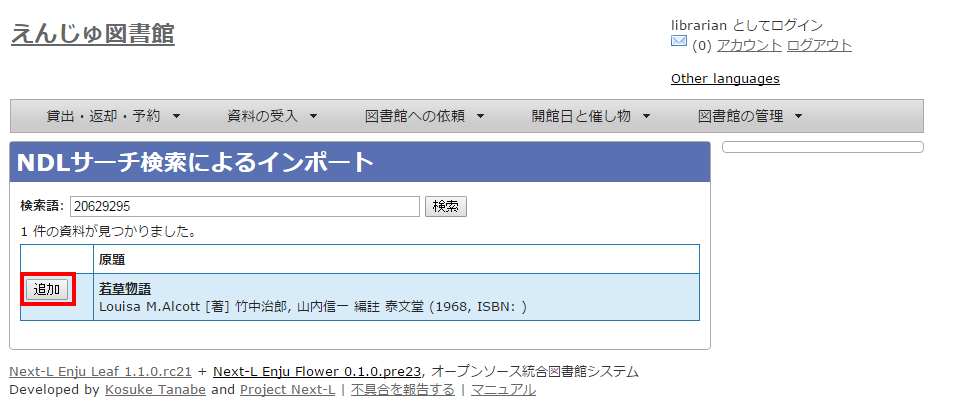

#### 4. 「資料は正常に作成されました。」と表示され、登録が完了します。

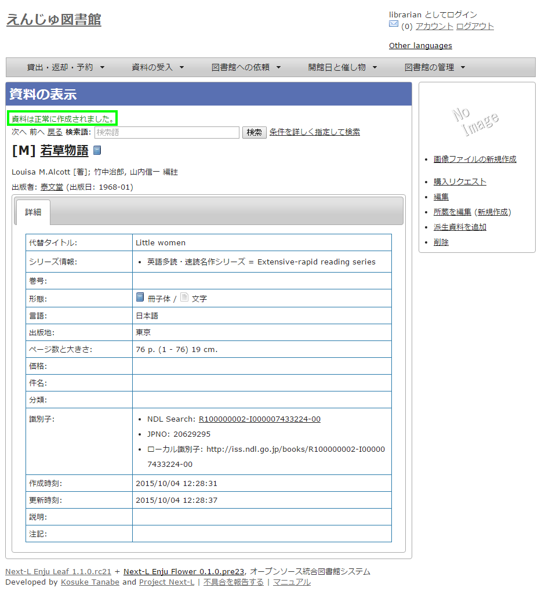

### 4-2-5 米国議会図書館を検索して1件ずつ登録する {#section4-2-5}

米国議会図書館（<http://catalog.loc.gov/>）の蔵書を検索した資料を
登録することができます。ISBNやキーワードなどで検索できます。

#### 1. ［資料の受入］メニューから［米国議会図書館検索によるインポート］を選択します。

#### 2. 以降は、[4-2-4 NDLサーチを検索して1件ずつ登録する](#section4-2-4) の 2 ～ 4の手順と同様です。

### 4-2-6 手動で資料を登録する {#section4-2-6}

#### 1. ［資料の受入］メニューから［手動で登録する］を選択します。

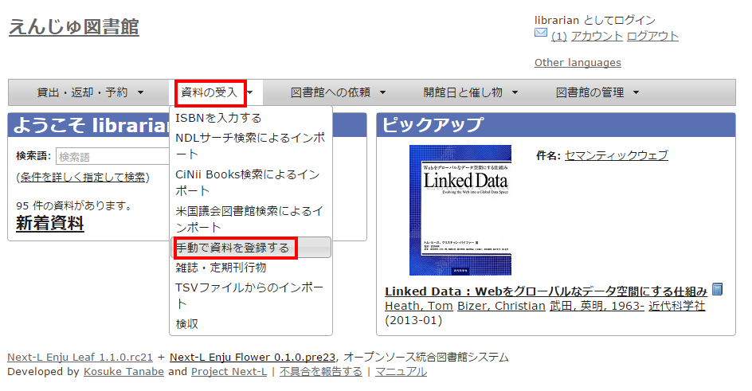

#### 2. 原題のほか必要な項目を入力し、[登録する]ボタンをクリックします。

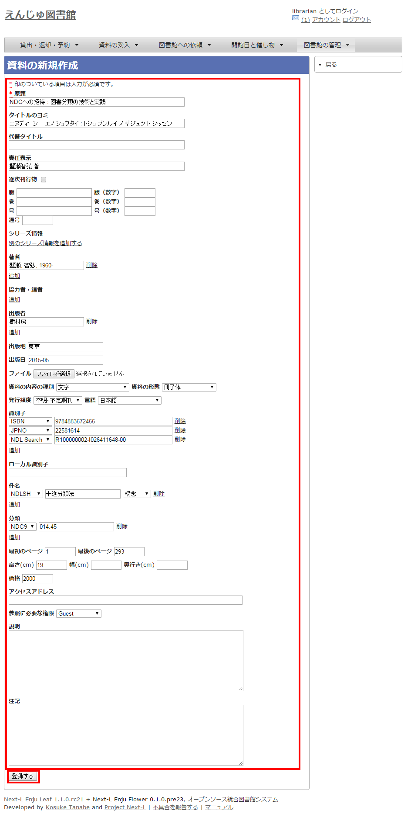

【Memo】「*」のマークが付いた項目は入力必須項目です。

#### 4. 「資料は正常に作成されました。」のメッセージが表示され、図書が登録されます。

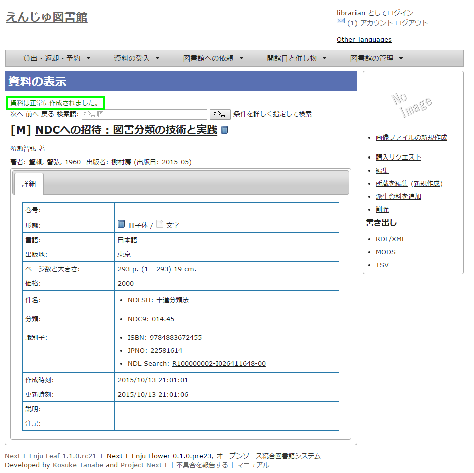

<h4 class="alert-heading">【Column】TSVファイルの作り方</h4>
1行目に、それぞれの項目に関わるフィールド名を指定します。
フィールド名とその意味については次の通りです。

### 4-2-7 TSVファイルの作り方（図書（書誌）） {#section4-2-7}

<table class="table table-bordered table-condensed table-striped">
<caption>図書のフィールド項目名と対応する内容</caption>
<thead>
<tr>
        <th>フィールド名</th>
        <th>日本語名称</th>
        <th>入力ルール及び説明</th>
        <th>例</th>
</tr>
</thead>
<tbody>
<tr>
	<td>manifestation_id</td>
	<td>Manifestation ID</td>
	<td>半角数字のみ, システムが自動付与するID, 「資料の表示」画面のURL末尾にある数値</td>
	<td>4</td>
</tr>
<tr>
	<td>manifestation_identifier</td>
	<td>書誌ID</td>
	<td>文字列、インポート時に付与する書誌に対する任意の識別子 <!--（#issue338）--></td>
	<td>999001</td>
</tr>
<tr>
	<td>original_title</td>
	<td>原題</td>
	<td>文字列</td>
	<td>Rによるやさしい統計学</td>
</tr>
<tr>
	<td>title_transcription</td>
	<td>タイトルのヨミ</td>
	<td>文字列</td>
	<td>R ニ ヨル ヤサシイ トウケイガク</td>
</tr>
<tr>
	<td>title_alternative</td>
	<td>代替タイトル</td>
	<td>文字列</td>
	<td>Rの操作手順と統計学の基礎が身に付く</td>
</tr>
<tr>
	<td>title_alternative_transcription</td>
	<td>代替タイトルのヨミ</td>
	<td>文字列</td>
	<td>R ノ ソウサテジュン ト トウケイガク ノ キソ ガ ミ ニ ツク</td>
</tr>
<tr>
	<td>statement_of_responsibility</td>
	<td>責任表示</td>
	<td>文字列</td>
	<td>山田剛史, 杉澤武俊, 村井潤一郎 共著</td>
</tr>
<tr>
	<td>periodical</td>
	<td>逐次刊行物フラグ</td>
	<td>フラグ（t または　TRUEなら真）</td>
	<td>TRUE</td>
</tr>
<tr>
	<td>edition_string</td>
	<td>版</td>
	<td>文字列</td>
	<td>初版</td>
</tr>
<tr>
	<td>edition</td>
	<td>版（数字）</td>
	<td>半角数字のみ</td>
	<td>1</td>
</tr>
<tr>
	<td>volume_number_string</td>
	<td>巻</td>
	<td>文字列</td>
	<td>一</td>
</tr>
<tr>
	<td>volume_number</td>
	<td>巻（数字）</td>
	<td>半角数字のみ</td>
	<td>1</td>
</tr>
<tr>
	<td>issue_number_string</td>
	<td>号</td>
	<td>文字列</td>
	<td>二</td>
</tr>
<tr>
	<td>issue_number</td>
	<td>号（数字）</td>
	<td>半角数字のみ</td>
	<td>3</td>
</tr>
<tr>
	<td>serial_number</td>
	<td>通号</td>
	<td>半角数字のみ</td>
	<td>2</td>
</tr>
<tr>
	<td>series_original_title</td>
	<td>シリーズ名</td>
	<td>文字列（複数ある場合は//で区切る）</td>
	<td>理工学専門書シリーズ//数学//1</td>
</tr>
<tr>
	<td>series_title_transcription</td>
	<td>シリーズ名のヨミ</td>
	<td>文字列（複数ある場合は//で区切る）, <a href="#tsv_series_title_transcription">（詳細）</a></td>
	<td>リコウガクセンモンショ シリーズ//スウガク//1</td>
</tr>
<tr>
	<td>series_volume_number_string</td>
	<td>シリーズ巻号</td>
	<td>文字列，<a href="#tsv_series_volume_number_string">（詳細）</a></td>
	<td>二</td>
</tr>
<tr>
	<td>series_creator_string</td>
	<td>シリーズ著者</td>
	<td>文字列，<a href="#tsv_series_creator_string">（詳細）</a></td>
	<td>統計</td>
</tr>
<tr>
	<td>creator</td>
	<td>著者（フルネーム）</td>
	<td>文字列<a href="#tsv_creator">（特定書式：別記）</a></td>
	<td>山田, 剛史, 1970-||author//杉澤, 武俊||author</td>
</tr>
<tr>
	<td>creator_transcription</td>
	<td>著者ヨミ（フルネームヨミ）</td>
	<td>文字列（複数ある場合は//で区切る）</td>
	<td>ヤマモト, タケシ//スギサワ, タケトシ</td>
</tr>
<tr>
	<td>contributor</td>
	<td>協力者・編者</td>
	<td>文字列</td>
	<td>山田, 剛史</td>
</tr>
<tr>
	<td>contributor_transcription</td>
	<td>協力者・編者(ヨミ)</td>
	<td>文字列</td>
	<td>ヤマモト, タケシ</td>
</tr>
<tr>
	<td>publisher</td>
	<td>出版者</td>
	<td>文字列</td>
	<td>オーム社</td>
</tr>
<tr>
	<td>publisher_transcription</td>
	<td>出版者のヨミ</td>
	<td>文字列</td>
	<td>オームシャ</td>
</tr>
<tr>
	<td>publication_place</td>
	<td>出版地</td>
	<td>文字列</td>
	<td>東京</td>
</tr>
<tr>
	<td>pub_date</td>
	<td>出版日</td>
	<td>ISO8601（年まで、月まででも可）</td>
	<td>2014-01</td>
</tr>
<tr>
	<td>content_type</td>
	<td>資料の内容の種類</td>
	<td>code<a href="#tsv_content_type">（詳細）</a></td>
	<td>text</td>
</tr>
<tr>
	<td>carrier_type</td>
	<td>資料の形態</td>
	<td>code<a href="#tsv_carrier_type">（詳細）</a></td>
	<td>volume</td>
</tr>
<tr>
	<td>frequency</td>
	<td>発行頻度</td>
	<td>code<a href="#tsv_frequency">（詳細）</a></td>
	<td>monthly</td>
</tr>
<tr>
	<td>language</td>
	<td>言語</td>
	<td>code<a href="#tsv_language">（詳細）</a></td>
	<td>jpn</td>
</tr>
<tr>
	<td>isbn</td>
	<td>ISBN</td>
	<td>半角文字のみ、ハイフンあり/なし/9桁/13桁はどの形式でも受け付ける。国際標準逐次刊行物番号</td>
	<td>9784274067105</td>
</tr>
<tr>
	<td>issn</td>
	<td>ISSN</td>
	<td>半角文字のみ, ハイフンはあってもなくてもよい。国際標準逐次刊行物番号</td>
	<td>0917-1436</td>
</tr>
<tr>
	<td>jpno</td>
	<td>JPNO</td>
	<td>半角文字のみ. 全国書誌番号</td>
	<td>21366221</td>
</tr>
<tr>
	<td>lccn</td>
	<td>LCCN</td>
	<td>半角文字のみ. 米国議会図書館管理番号</td>
	<td>1255667</td>
</tr>
<tr>
        <td>doi</td>
        <td>DOI</td>
        <td>文字列，http://dx.doi.org/は記入しない</td>
        <td>10.2964/jsik.23_219</td>
</tr>
<tr>
	<td>subject</td>
	<td>件名</td>
	<td>文字列<a href="#tsv_subject">（特定書式：別記）</a></td>
	<td>ndlsh: "ウェブアプリケーション"</td>
</tr>
<tr>
	<td>classification</td>
	<td>分類</td>
	<td>文字列<a href="#tsv_classification">（特定書式：別記）</a></td>
	<td>ndc: "007"</td>
</tr>
<tr>
	<td>start_page</td>
	<td>最初のページ</td>
	<td>半角数字のみ(#342)</td>
	<td>1</td>
</tr>
<tr>
	<td>end_page</td>
	<td>最後のページ</td>
	<td>半角数字のみ</td>
	<td>404</td>
</tr>
<tr>
	<td>extent_of_text</td>
	<td>ページ数</td>
	<td>文字列</td>
	<td>xi, 125 pages</td>
</tr>
<tr>
	<td>height</td>
	<td>高さ（cm）</td>
	<td>半角数字のみ</td>
	<td>20</td>
</tr>
<tr>
	<td>width</td>
	<td>幅（cm）</td>
	<td>半角数字のみ</td>
	<td>15</td>
</tr>
<tr>
	<td>depth</td>
	<td>奥行き（cm）</td>
	<td>半角数字のみ</td>
	<td>1.5</td>
</tr>
<tr>
	<td>manifestation_price</td>
	<td>販売価格</td>
	<td>半角数字のみ</td>
	<td>2000</td>
</tr>
<tr>
	<td>access_address</td>
	<td>アクセスアドレス</td>
	<td>半角文字のみ</td>
	<td>http://www.amazon.co.jp/dp/4274067106/</td>
</tr>
<tr>
	<td>fulltext_content</td>
	<td>リポジトリコンテンツ</td>
	<td>フラグ（t または　TRUEなら真）</td>
	<td>TRUE</td>
</tr>
<tr>
	<td>required_role_name</td>
	<td>参照に必要な権限</td>
	<td>code<a href="#tsv_required_role_name">（詳細）</a></td>
	<td>Guest</td>
</tr>
<tr>
	<td>description</td>
	<td>説明</td>
	<td>文字列</td>
	<td>本書は、統計学の理論を簡潔に解説しながら、Rの手順・アウトプットの解釈を丁寧に行う。具体的には...</td>
</tr>
<tr>
	<td>note</td>
	<td>注記</td>
	<td>文字列</td>
	<td>版表示は奥付より。付属資料: CD-ROM（1枚, 12cm）</td>
</tr>
<tr>
	<td>dummy</td>
	<td>インポート省略</td>
	<td>文字列。この列に入力されていると、その行全体をインポート対象から除外します。</td>
	<td></td>
</tr>
<tr>
	<td>series_statement_identifier</td>
	<td>シリーズステイトメントID</td>
	<td>半角数字のみ, <a href="#series_statement_identifier">（詳細）</a></td>
	<td>2</td>
</tr>
</tbody>
</table>

##### series_title_transcription {#tsv_series_title_transcription}

シリーズのタイトル(series_original_title)がTSVファイルで指定されている必要があります。指定されていない場合はこの項目の値は無視されます。

##### series_volume_number_string {#tsv_series_volume_number_string}

シリーズのタイトル(series_original_title)がTSVファイルで指定されている必要があります。指定されていない場合はこの項目の値は無視されます。

##### series_creator_string {#tsv_series_creator_string}

シリーズのタイトル(series_original_title)がTSVファイルで指定されている必要があります。指定されていない場合はこの項目の値は無視されます。

##### creator {#tsv_creator}

	書式: 著者名||役割//著者名||役割
	例：山田, 剛史, 1970-||author//杉澤, 武俊||author///大木, 太郎||illustrator

注：役割は入力可能になってはいますが、システムとして格納したり、表示できるようにしたりなどはまだできていません（開発予定ですが、開発時期は未定です）。

##### content_type {#tsv_content_type}

「資料の内容の種別」の[名前]を値とします(例：文字であれば"text"など）。見方については、[設定マニュアル 5-2 資料の内容の種別の作成](enju_setup_5.html#section5-2) を参照してください。

##### carrier_type {#tsv_carrier_type}

「資料の形態」の[名前]を値とします(例：冊子体であれば"volume"など）。見方については、[設定マニュアル 5-1 資料の形態の作成](enju_setup_5.html#section5-1) を参照してください。
未入力の場合は"text"が設定されます。

##### frequency {#tsv_frequency}

「発行頻度」の[名前]を値とします(例："daily", "monthly"など）。見方については、[設定マニュアル 5-6 発行頻度を編集する](enju_setup_5.html#section5-6) を参照してください。未入力の場合は"unknown"が設定されます。

##### language {#tsv_language}

日本語の場合は jpn, 英語の場合は、engになります。その他の言語については、「言語」の[Iso 639 2]を参照してください。見方については、[5-3 言語を編集する](enju_setup_5.html#section5-3) を参照してください。

##### subject {#tsv_subject}

YAML形式で記述します。具体的には以下のように記述します。

	書式(1語): 件名標目の種類: "標目"
	例：ndlsh: "ウェブアプリケーション"

	書式(2語): 件名標目の種類: ["標目1", "標目2"]
	例：ndlsh: ["ウェブアプリケーション", "インターネット"]

	書式(違う件名標目の種類がある): { 件名標目の種類: "標目", 件名標目の種類: "標目" }
	例：{ ndlsh: "ウェブアプリケーション", lcsh: "Internet" }

	その他の例：{ ndlsh: ["ウェブアプリケーション", "インターネット"], lcsh: "Internet" }

書式の件名標目の種類は、「件名標目の種類」の[名前]をさします。詳細は[4-3 件名標目の種類を設定する](enju_setup_4.html#section4-3) を参照してください。

注意："（ダブルクオーテーション）をエスケープする必要があるため、テキストエディタで直接TSVファイルを作成する場合は、以下のような記述になります

	"ndlsh: ""ウェブアプリケーション"""
	"ndlsh: [""ウェブアプリケーション"", ""インターネット""]"	
	"{ ndlsh: ""ウェブアプリケーション"", lcsh: ""Internet"" }"
	"{ ndlsh: [""ウェブアプリケーション"", ""インターネット""], lcsh: ""Internet"" }"

##### classification {#tsv_classification}

YAML形式で記述します。具体的には以下のように記述します。

	書式（1語）: 分類の種類: "分類"
	例：ndc9: "007"

	書式（2分類）：分類の種類: ["分類", "分類"]
	例：ndlc: ["AZ-463", "AZ-418"]

	書式（違う分類の種類がある）: { 分類の種類: "分類", 分類の種類: "分類" }
	例：{ ndc9: "212", ddc: "223" }

	その他の例：
	{ ndc9: "212", ndlc: ["AZ-463", "AZ-418"] }

書式の分類の種類は、「分類の種類」の[名前]をさします。詳細は[4-5 分類の種類を設定する](enju_setup_4.html#section4-5) を参照してください。

注意："（ダブルクオーテーション）をエスケープする必要があるため、テキストエディタで直接TSVファイルを作成する場合は、以下
のような記述になります

	"ndc9: ""007"""
	"ndlc: [""AZ-463"", ""AZ-418""]"
	"{ ndc9: ""212"", ddc: ""223"" }"
	"{ ndc9: ""212"", ndlc: [""AZ-463"", ""AZ-418""] }"

##### required_role_name {#tsv_required_role_name}

この書誌を参照可能な権限を設定します。
以下の4つから選びます。なにも記入しなければ、Guest になります。
 
* Administrator（管理者）
* Librarian（図書館員）
* User（図書館利用者）
* Guest （誰でも）

##### series_statement_identifier {#series_statement_identifier}

（工事中）

「xxxxx」の[xxx]を値とします。見方については、[xx-xx xxxxxxx](enju_setup_x.html#sectionxx-xx) を参照してください。

4-3 所蔵情報を登録・一覧表示する {#section4-3}
--------------------------------

登録された資料を、図書館の蔵書として登録します。この作業が完了してはじめて資料の貸出が可能となります。

### 4-3-1 所蔵情報を新規登録する {#section4-3-1}

#### 1. 登録したい資料を検索します。トップページの検索語に登録したい資料のキーワードを入力し、［検索］ボタンをクリックします。  

#### 2. 所蔵情報を登録したい資料をクリックします。  

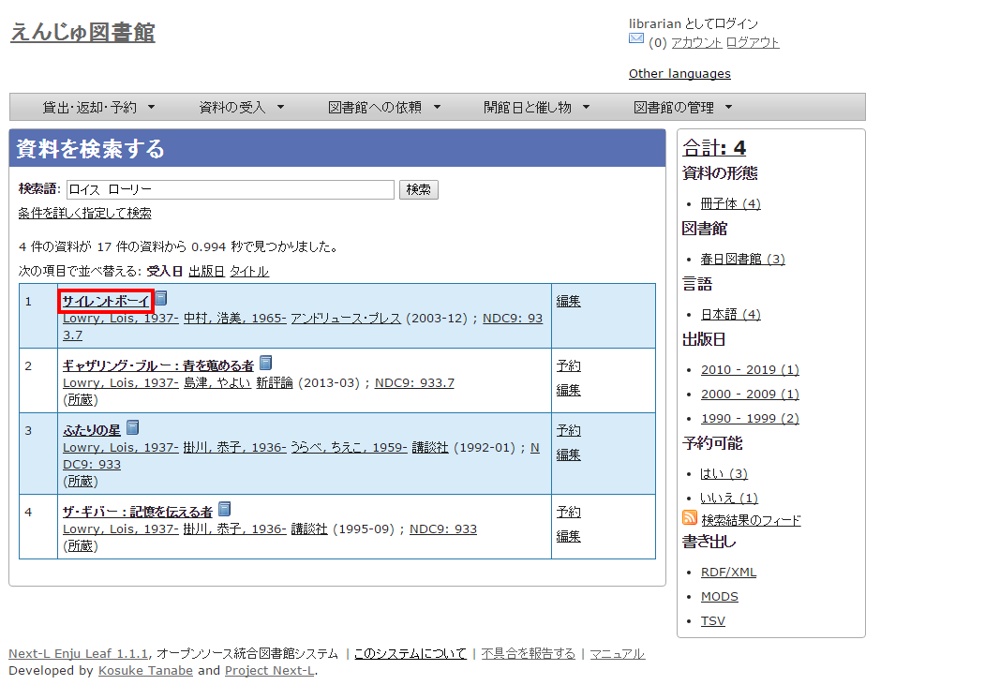

#### 3. 最下部の［所蔵情報の新規作成］をクリックします。  

#### 4. 図書館や貸出状態などを設定して、［登録する］ボタンをクリックします。  

<h4 class="alert-heading">【Column】寄贈を受け付ける</h4>
資料が寄贈されたものであることを示したい場合は、［予算種別］に「寄贈」種別を登録し、選ぶことで区別できるようになります。予算種別の登録方法は「[3-9 予算種別を設定する](enju_setup_3.html#section3-9)」を参照してください。寄贈者などの情報を残したい場合は注記に入力します。

#### 5. 「所蔵情報は正常に作成されました。」のメッセージが表示され、所蔵情報が登録されます。

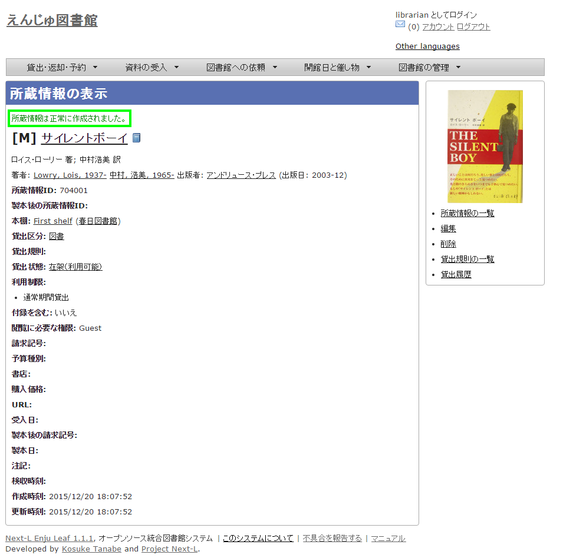

### 4-3-2 すでに登録された所蔵情報を修正登録する {#section4-3-2}

#### 1. 登録したい資料を検索します。トップページの検索語に登録したい資料のキーワードを入力し、［検索］ボタンをクリックします。

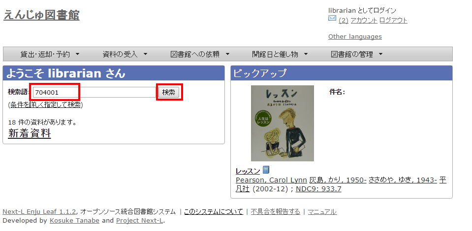

#### 2. 所蔵情報を登録したい資料の[（所蔵）]リンクをクリックします。

#### 3. 所蔵情報を修正したい資料の[所蔵情報ID]のリンクをクリックします。

 

#### 4. 右メニューの［編集］をクリックします。

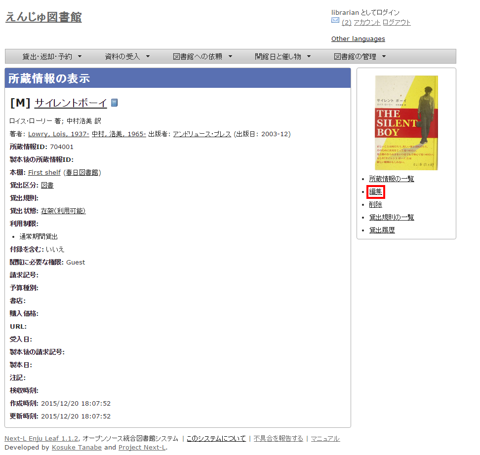

#### 5. 図書館や貸出状態など修正したい部分を修正して、［登録する］ボタンをクリックします。

#### 6. 「所蔵情報は正常に更新されました。」のメッセージが表示され、所蔵情報が登録されます。

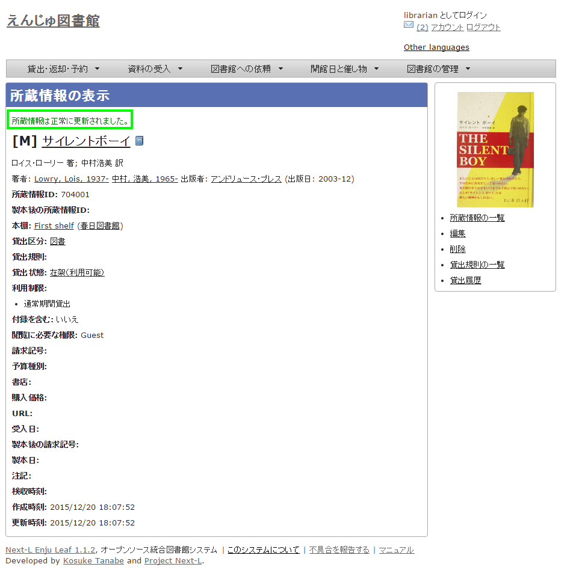

### 4-3-3 所蔵情報を一覧表示する {#section4-3-3}

#### 1. ［図書館の管理］メニューから［システムの設定］を選択します。  

#### 2. ［資料］グループの［全ての所蔵情報］をクリックします。  

#### 3. 所蔵情報の一覧が表示されます。  

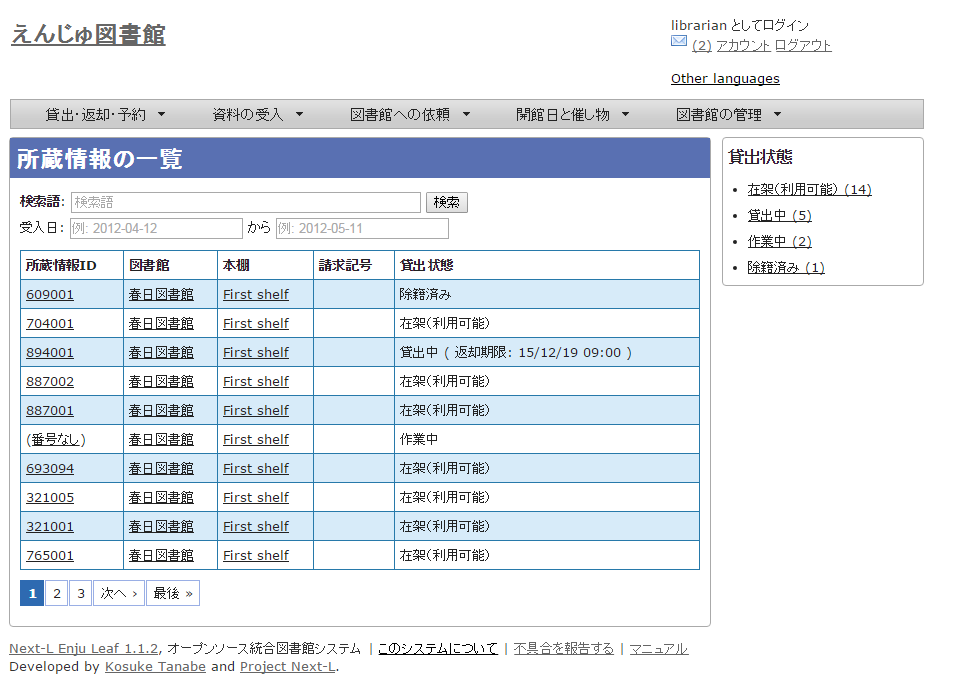

### 4-3-4 TSVファイルを読み込んで登録する {#section4-3-4}

所蔵情報は、TSVファイルを読み込んで一括登録することもできます。

#### 1. TSVファイルを用意します。

例えば、ISBN と　所蔵情報（所蔵情報のTSVの詳細：[4-3-5 TSVファイルの作り方（所蔵情報）](#section4-3-5) ）を書いたTSVを用意します。

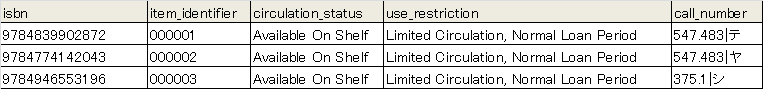

ISBNの場合は、書誌が未登録の資料の場合は、国立国会図書館蔵書検索の結果から書誌データをインポートし、かつ所蔵情報を登録することになります。

ISBNの代わりに、manifestation_idやmanifestation_identifierでも可能です。この場合は、既にシステムに登録済みの書誌に対して所蔵情報を追加します。

所蔵情報と書誌情報を同時に登録することも可能です。 その場合は、所蔵情報と[4-2-7 TSVファイルの作り方（図書（書誌））](#section4-2-7)のフィールドを書いたTSVを用意します。

#### 2. 「[4-2-1 TSVファイルを読み込んで登録する](#section4-2-1)」の 1. 以降と同じ手順を実行し、所蔵情報を登録できます。

<h4 class="alert-heading">【Column】TSVファイルの作り方</h4>
1行目に、それぞれの項目に関わるフィールド名を指定します。
フィールド名とその意味については次の通りです。

### 4-3-5 TSVファイルの作り方（所蔵情報） {#section4-3-5}

<table class="table table-bordered table-condensed table-striped">
<caption>所蔵情報のフィールド項目名と対応する内容</caption>
<thead>
<tr>
        <th>フィールド名</th>
        <th>日本語名称</th>
        <th>入力ルール及び説明</th>
        <th>例</th>
</tr>
</thead>
<tbody>
<tr>
	<td>item_id</td>
	<td>所蔵データID(自動付与）</td>
	<td>半角数字のみ, システムが自動付与するID, 「所蔵情報の表示」画面のURLにある数値</td>
	<td></td>
</tr>
<tr>
	<td>shelf</td>
	<td>本棚</td>
	<td>code<a href="#tsv_shelf">（詳細）</a></td>
	<td>first_shelf</td>
</tr>
<tr>
	<td>checkout_type</td>
	<td>貸出区分</td>
	<td>code<a href="#tsv_checkout_type">（詳細）</a></td>
	<td>book</td>
</tr>
<tr>
	<td>circulation_status</td>
	<td>貸出状態</td>
	<td>code<a href="#tsv_circulation_status">（詳細）</a></td>
	<td>Available On Shelf</td>
</tr>
<tr>
	<td>use_restriction</td>
	<td>利用制限</td>
	<td>code<a href="#tsv_use_restriction">（詳細）</a></td>
	<td>Limited Circulation, Normal Loan Period</td>
</tr>
<tr>
	<td>include_supplements</td>
	<td>付録を含む</td>
	<td>真偽値（t または　TRUEなら真）</td>
	<td>TURE</td>
</tr>
<tr>
	<td>call_number</td>
	<td>請求記号</td>
	<td>文字列</td>
	<td>547.483||A||ル</td>
</tr>
<tr>
	<td>budget_type</td>
	<td>予算種別</td>
	<td>code<a href="#tsv_budget_type">（詳細）</a></td>
	<td>資料費</td>
</tr>
<tr>
	<td>bookstore</td>
	<td>書店</td>
	<td>code<a href="#tsv_bookstore">（詳細）</a></td>
	<td>今井書店</td>
</tr>
<tr>
	<td>item_price</td>
	<td>購入価格</td>
	<td>半角数字のみ</td>
	<td>2</td>
</tr>
<tr>
	<td>item_url</td>
	<td>URL（item）</td>
	<td>文字列</td>
	<td>http://www.amazon.co.jp/dp/4274067106/</td>
</tr>
<tr>
	<td>required_role</td>
	<td>参照に必要な権限</td>
	<td>code<a href="#tsv_required_role">（詳細）</a></td>
	<td>User</td>
</tr>
<tr>
	<td>acquired_at</td>
	<td>受入日</td>
	<td>ISO8601</td>
	<td>2014-06-20</td>
</tr>
<tr>
	<td>binding_call_number</td>
	<td>製本後の請求記号</td>
	<td>文字列</td>
	<td>547.483||A||ルs</td>
</tr>
<tr>
	<td>binded_at</td>
	<td>製本日</td>
	<td>ISO8601</td>
	<td>2014-08-15</td>
</tr>
<tr>
	<td>binding_item_identifier</td>
	<td>製本後の所蔵情報ID</td>
	<td>文字列</td>
	<td>999501</td>
</tr>
<tr>
	<td>item_note</td>
	<td>注記（item)</td>
	<td>文字列</td>
	<td>汚れあり</td>
</tr>
<tr>
	<td>item_identifier</td>
	<td>所蔵情報ID</td>
	<td>半角の数値とアルファベットのみ</td>
	<td>100502</td>
</tr>
<tr>
	<td>dummy</td>
	<td>インポート省略</td>
	<td>文字列（ここになにかあれば無視する行）</td>
	<td>t</td>
</tr>
</tbody>
</table>

##### shelf {#tsv_shelf}

「本棚」の[名前]を値とします(例："first_shelf"や"web"など）。見方については、[3-3 本棚を設定する](enju_setup_3.html#section3-3) を参照してください。

##### checkout_type {#tsv_checkout_type}

「貸出区分」の[名前]を値とします(例："book"）。見方については、[3-5 貸出区分を設定する](enju_setup_3.html#section3-5) を参照してください。

##### circulation_status {#tsv_circulation_status}

「貸出状態」の[名前]を値とします(例：[在架（利用可能）]なら"Available On Shelf"）。見方については、[5-3 貸出状態を編集作成する](enju_setup_5.html#section5-3) を参照してください。

##### use_restriction {#tsv_use_restriction}

以下の2種類です。

* Not For Loan
  * 貸出不可
* Limited Circulation, Normal Loan Period
  * 通常期間貸出

##### budget_type {#tsv_budget_type}

「予算種別」の[名前]を値とします。見方については、[3-9 予算種別を設定する](enju_setup_3.html#section3-9) を参照してください。

##### bookstore {#tsv_bookstore}

「書店」の[名前]を値とします。見方については、[3-10 書店を設定する](enju_setup_3.html#section3-10) を参照してください。

##### required_role {#tsv_required_role}

所蔵情報を見るために必要な権限を設定します。
以下の4つから選びます。なにも記入しなければ、Guest になります。
 
* Administrator（管理者アカウント）
* Librarian（図書館員アカウント）
* User（図書館利用者アカウント）
* Guest （誰でも：ログイン不要）

4-4 図書を検収する {#section4-4}
--------------------------------

図書を検収する機能です。 
検収すると、該当資料の以下の所蔵情報が変更になります。

* [貸出状態]が「作業中」から「在架（利用可能）」に変更される 
* [利用制限]が「貸出不可」から「通常期間貸出」に変更される
* [検収時刻]が記録される（システムで自動的に[検収]ボタンをクリックした日時を記録します）

書誌情報や所蔵情報を作業中のステータスとしていったん登録したのちに、
複数の資料をまとめて利用可能なステータスに変更にする機能です。
書誌情報や所蔵情報を登録してから、
書架に並べるまで時間がかかる場合などに便利な機能です。
書架に並べる直前にこの検収機能を使うことになります。

#### 1. ［資料の受入］メニューから［検収］を選択します。  

#### 2. ［所蔵情報ID］を入力し（所蔵情報IDのバーコードをスキャンなど）、[検収]ボタンをクリックします。  

#### 3. 「この資料は正常に検収されました」と表示され検収が完了します。2 を繰り返すことで、続けて他の資料を検収できます。詳しい内容を確認したい場合は、[所蔵情報ID]のリンクをクリックします。

#### 4. [貸出情報]、[利用制限]、[検収時刻]が変わったことを確認できます。 

【Memo】利用者の検索結果一覧で「（所蔵）」や[予約]リンク（User権限以上のみ）が表示されるようになります。
   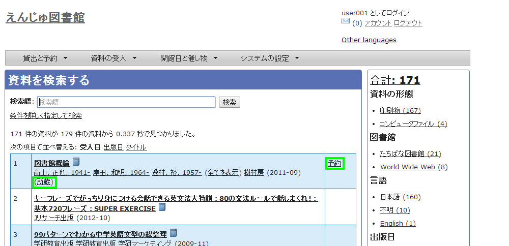

4-5 図書を除籍・移管する {#section4-5}
--------------------------------------

所蔵情報が登録された図書を、除籍（削除）することもできます。

#### 1. ［図書館の管理］メニューから［システムの設定］を選択します。  

#### 2. ［資料］グループの［全ての所蔵情報］をクリックします。  

#### 3. 検索語に、除籍する資料の「所蔵情報ID」を入力し（バーコードで読み込むなど）、「検索」ボタンをクリックします。
  
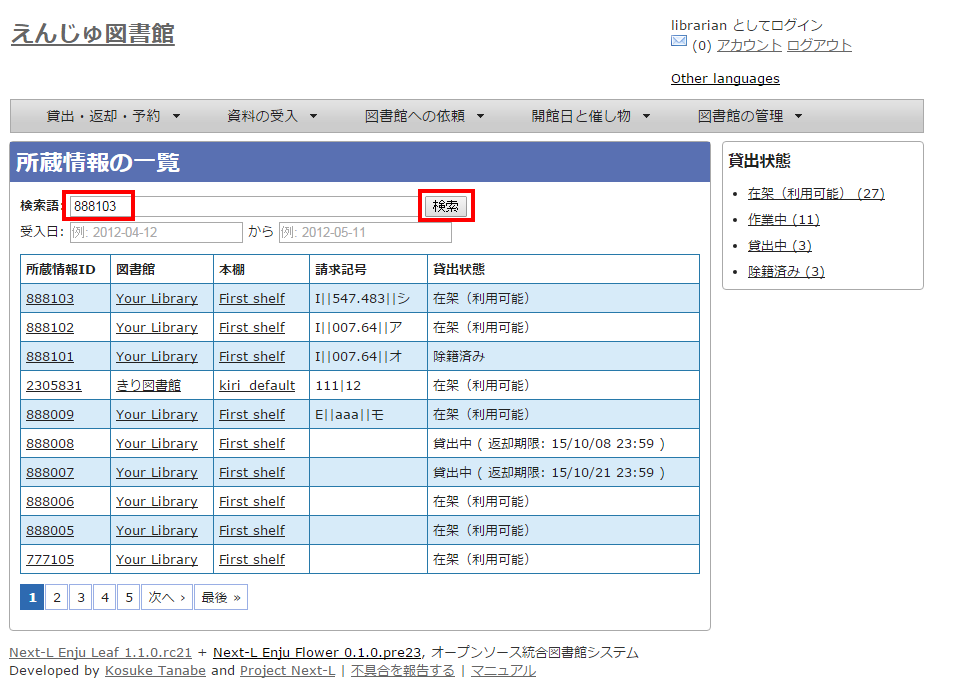

#### 4. 除籍したい図書の所蔵情報IDをクリックします。

#### 5. 右メニューの［編集］をクリックします。  

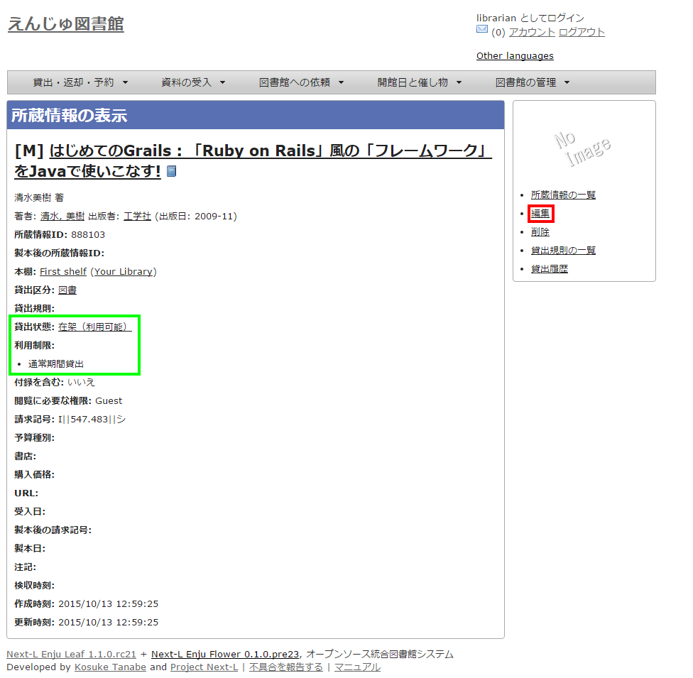

注意！「削除」してしまうと、所蔵がもともとなかったことに（完全に削除されてしまう）ので、除籍したという記録が残りません。「削除」は所蔵を間違えてつけてしまったときなどに利用します。

#### 6. 貸出状態を「除籍済み」に変更し、利用制限を「貸出不可」に変更し、「更新する」をクリックします。

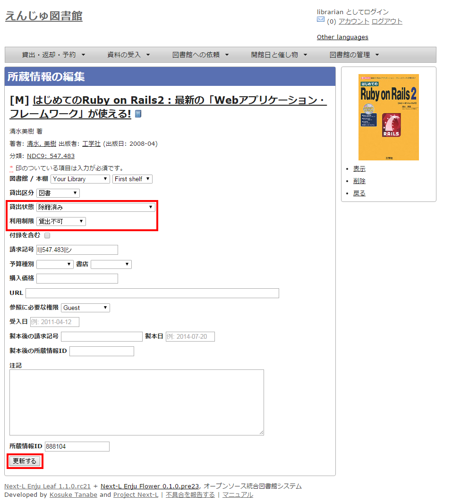

#### 7. 参考：除籍済みの検索結果一覧での表示のされ方

AdministoratorやLibrarian権限でログインしている場合は、貸出状態が「除籍済み」と表示されるようになり、除籍した資料がわかるようになります。

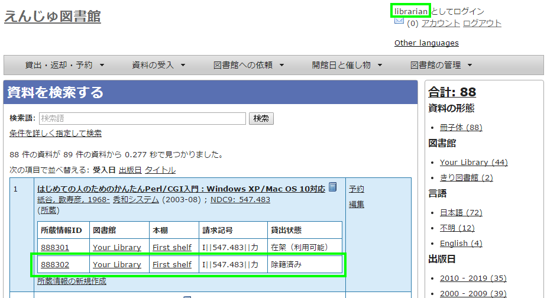

ログインしていない、User権限でログインしている場合は、除籍したものは所蔵が表示されないようになります。

#### 8. 参考：除籍した資料のリストアップをする。

「[4-8 書誌と所蔵のエクスポートをする](enju_operation_4.html#section4-8)」を使って全ての書誌と所蔵の情報がTSV形式のテキストファイルとして、エクスポートができます。このファイルの「circulation_status」（貸出状態）の列の「Removed」の行を抜き出すことによって除籍した資料をリストアップすることができます。

4-6 新着資料の一覧を表示する {#section4-6}
------------------------------------------

Enjuでは、新着資料の一覧を表示することができます。

#### 1. トップページの［新着資料］をクリックします。  

#### 2. 新着資料の一覧が表示されます。  

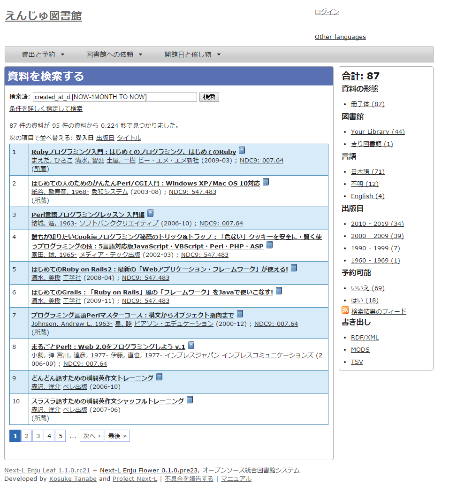

{::comment}

4-7 Webページを資料として登録する {#section4-7}
-----------------------------------------------

Enjuでは、ブックマークレットを利用してWebページやWeb上のPDFなどを資料として登録することができます。

#### 1. トップページの［ブックマーク］をクリックします。  

【Memo】もし、[ブックマーク]がない場合は、[enju_bookmark]モジュールを
インストール必要があります。
インストール方法についてはインストールマニュアルの
「[5-2 [enju_bookmark]モジュール（ブックマーク機能）](enju_install_vm.html#section5-2)」
の章を参照ください。

#### 2. 右メニューの［図書館のブックマークに追加する］を右クリックし、［お気に入りに追加］をクリックします。  

【Memo】ここから4までの手順については、ブラウザによって多少やり方が異なります。例えば、ここの手順については、FireFoxであれば、右メニューの［図書館のブックマークに追加する］を右クリックし、［このリンクをブックマーク]をクリックします。Chromeであれば、[図書館のブックマークに追加する]をメニューバーにドラックアンドドロップします。2～4の手順では、Internet Explorer11でのやり方を示しています。

#### 3. お気に入りに登録します。  

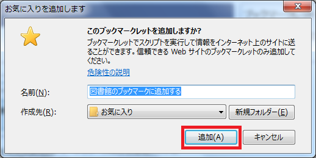

#### 4. 資料として登録したいページを表示し、お気に入りから［図書館のブックマークに追加する］を選択します。  

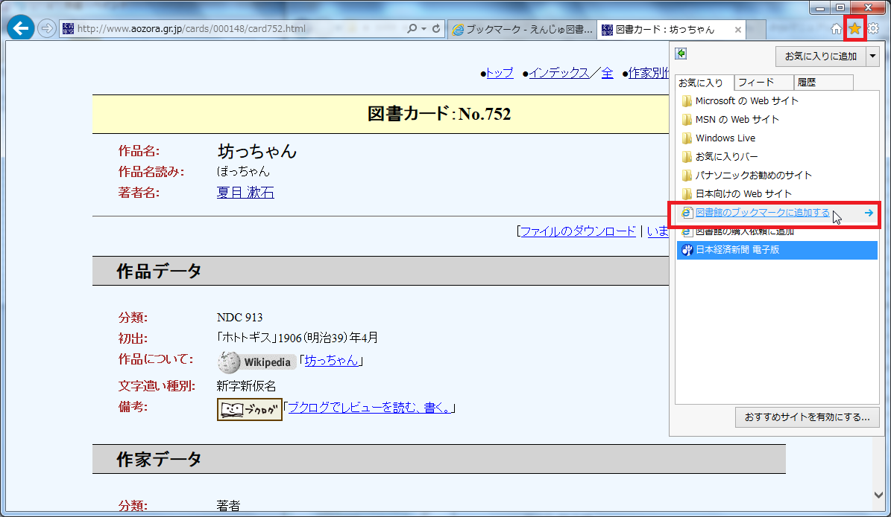

#### 5. Enjuのブックマークの新規作成画面が表示されるので、内容を確認して必要であれば適宜修正して、［登録する］ボタンをクリックします。  

#### 6. 「ブックマークは正常に作成されました。」のメッセージが表示され、資料が登録されます。

#### 7. 次回以降は手順4.以降を行い、資料を登録します。

【Memo】登録されたWebページやPDFの一覧は、トップページの［ブックマーク］をクリックした先の「ブックマークの一覧」画面で表示されます。

#### 8. ブックマークにはせず、ただの資料として登録しておきたい場合は、「ブックマークの一覧」で該当の資料の［削除］をクリックします。

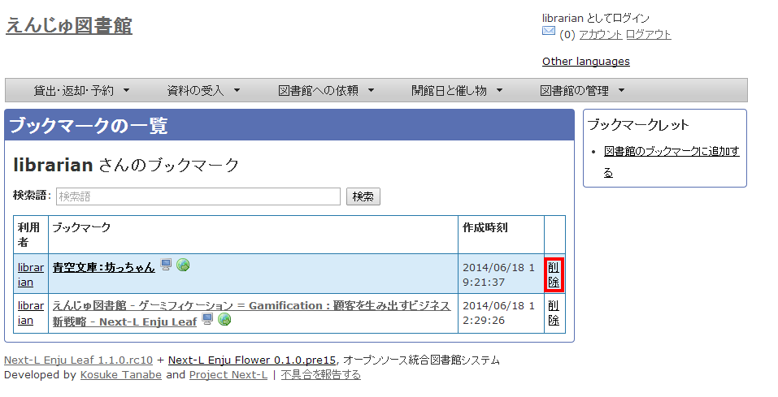

{:/comment}

4-7 画像を登録する {#section4-7}
------------------------------

Enjuでは、画像（図書の表紙など）を登録し、資料に関連づけることができます。

### 4-7-1 画像の登録 {#section4-7-1}

#### 1. 画像を登録したい資料を検索します。トップページの検索語に登録したい資料のキーワードを入力し、［検索］ボタンをクリックします。

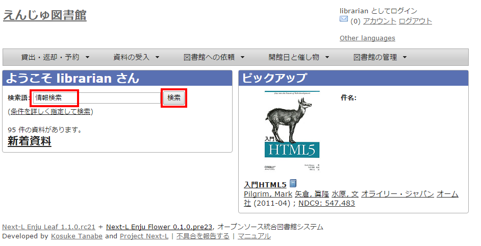 

#### 2. 画像をアップロードしたい資料をクリックします。  

#### 3. 右メニューの［画像ファイルの新規作成］をクリックします。  

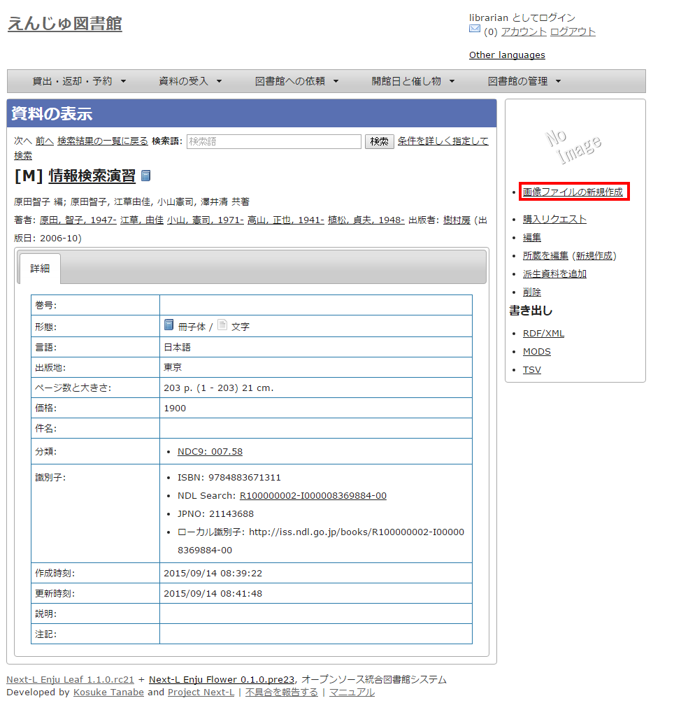

#### 4. ［ファイルを選択］ボタンをクリックしてアップしたい画像ファイルを選択します。

#### 5.［登録する］ボタンをクリックします。  

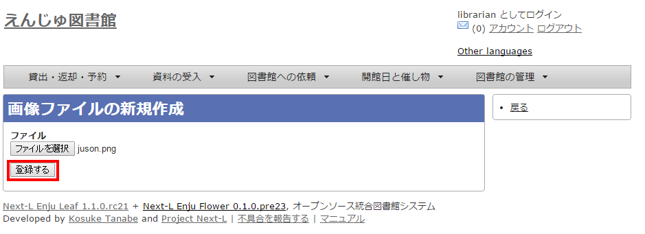

#### 6. 「画像ファイルは正常に作成されました。」というメッセージが表示され、画像ファイルが登録されます。[添付先]のリンク(Manifestation/xxx）をクリックします。

#### 7. 追加した画像が資料の表示の画面に表示されます。

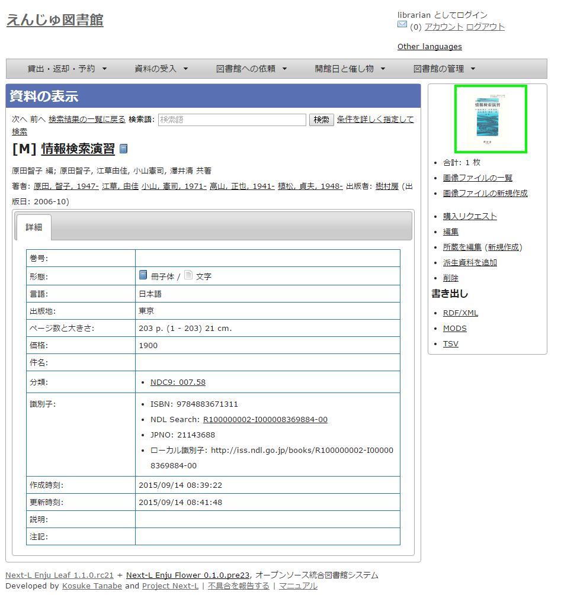

### 4-7-2 画像の一覧表示 {#section4-7-2}

#### 1. ［図書館の管理］メニューから［システムの設定］を選択します。

#### 2. [資料]グループの[画像ファイル]をクリックします。

#### 3. 画像ファイルの一覧が表示されます。添付した画像ファイルの一覧が閲覧できます。

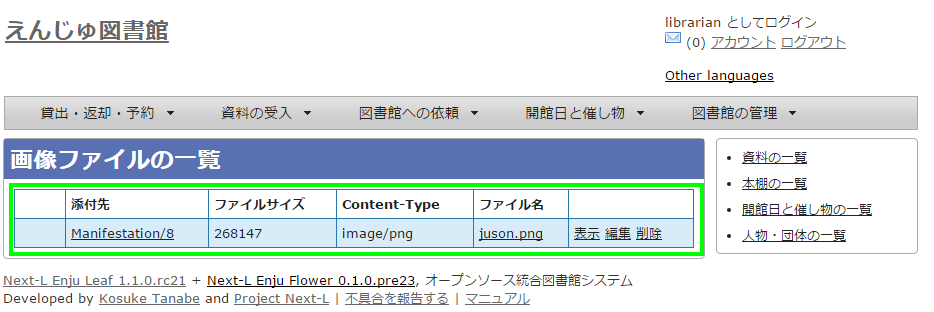

【Memo】設定内容を変更する場合は［編集］を，削除する場合は［削除］をクリックします。[添付先]のリンクをたどれば、添付した資料の「資料の表示」画面にいきます。[ファイル名]をクリックすると画像ファイルが閲覧できます。

4-8 書誌と所蔵のエクスポートをする {#section4-8}
-------------------------------------------------

登録されている全ての資料の書誌や所蔵情報をTSVとしてエクスポートすることができます。

#### 1. ［図書館の管理］メニューから［エクスポート］を選択します。  

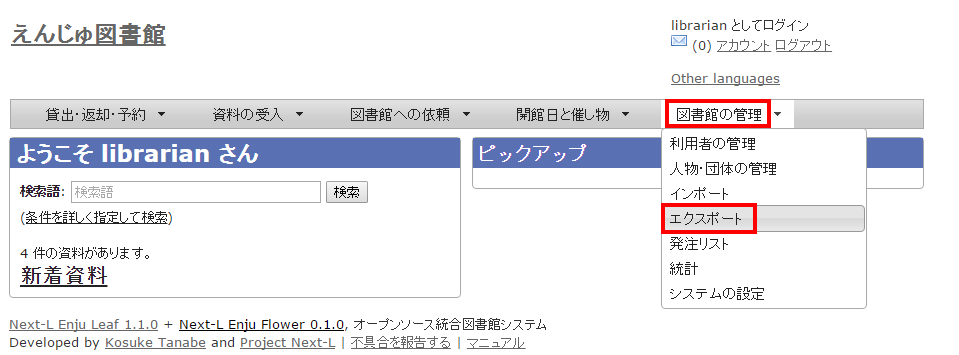

#### 2. [書誌と所蔵のエクスポート]リンクをクリックします。

#### 3. 右メニューの[書誌と所蔵のエクスポートの新規作成]リンクをクリックします。

#### 4. [エクスポート]ボタンをクリックします。

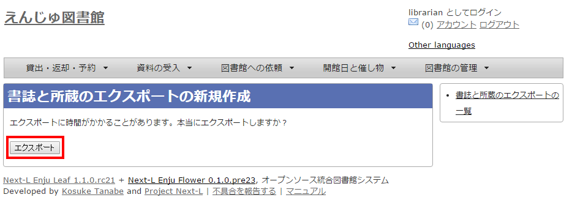

#### 5. 「書誌と所蔵のエクスポート処理は正常に作成されました」のメッセージが表示され、書誌と所蔵のデータエクスポートの準備が整いました。右の[書誌と所蔵のエクスポートの一覧]をクリックします。 

#### 6. 今までのエクスポート結果の一覧が表示されます。[状態]を見ると処理結果がわかります。エクスポートが完了したものは[完了]と表示されます。[開始]のものは現在、実行中です。エクスポート完了時にはEnjuのメッセージ機能にてお知らせします（＊＊＊というメッセージが送られてきます）。

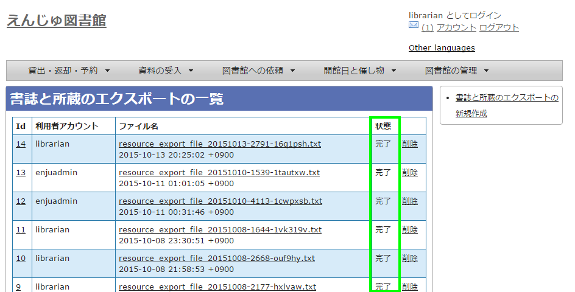

【Memo】この画面は[図書館の管理]メニュー->[エクスポート]->[書誌と所蔵のエクスポート]とすればいつでも閲覧できます。
 

#### 7. ファイル名のリンクから作成されたTSVファイルをダウンロードすることができます。

<h4 class="alert-heading">【Column】TSVファイル</h4>

次の項目が入っています(Enju Leaf 1.1.0.rc13)。

* manifestation_id: 書誌ID
* original_title: 原題
* creator: 著者
* publisher: 出版者
* pub_date: 出版日
* price: 価格
* isbn： ISBN
* item_identifier: 所蔵情報ID
* call_number: 請求記号
* item_price: 購入価格
* acquired_at: 受入日
* bookstore: 書店
* budget_type: 予算種別
* circulation_status: 貸出状態
* shelf: 本棚
* library: 図書館


