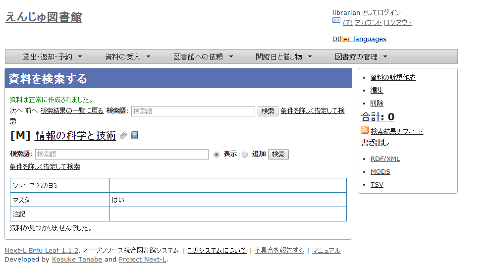
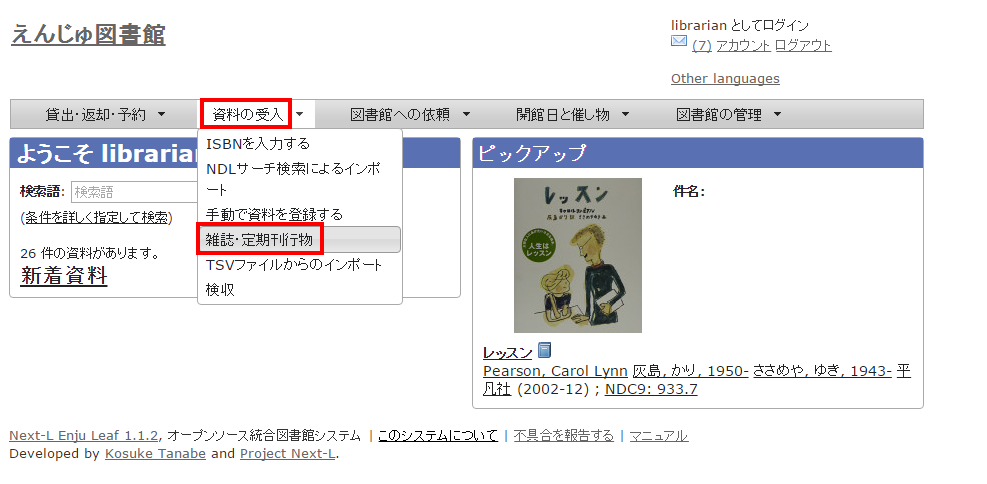
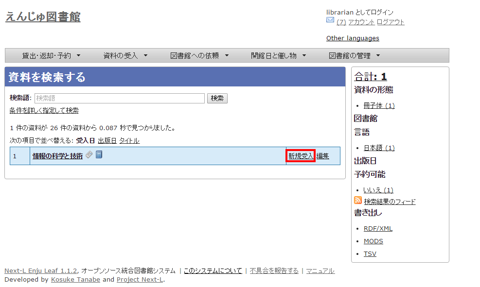
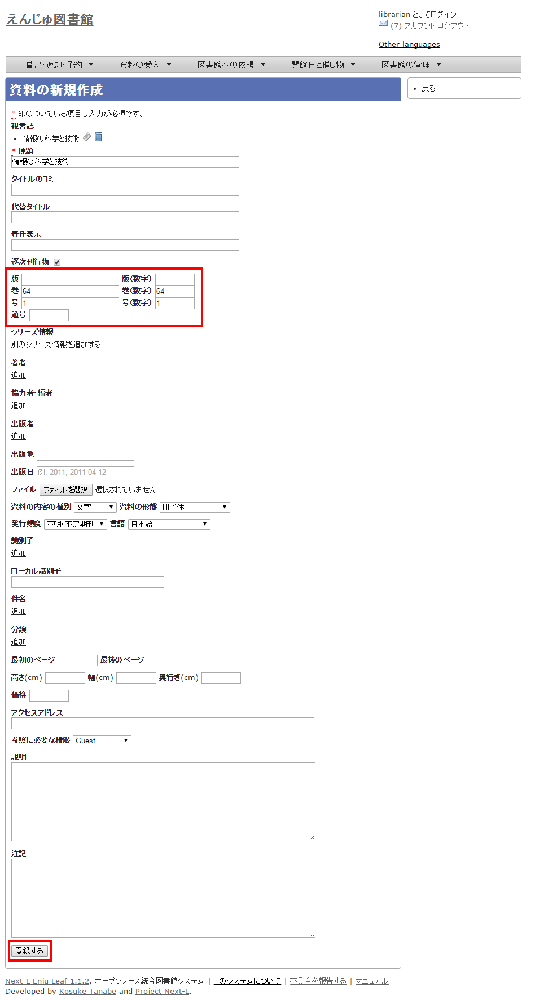
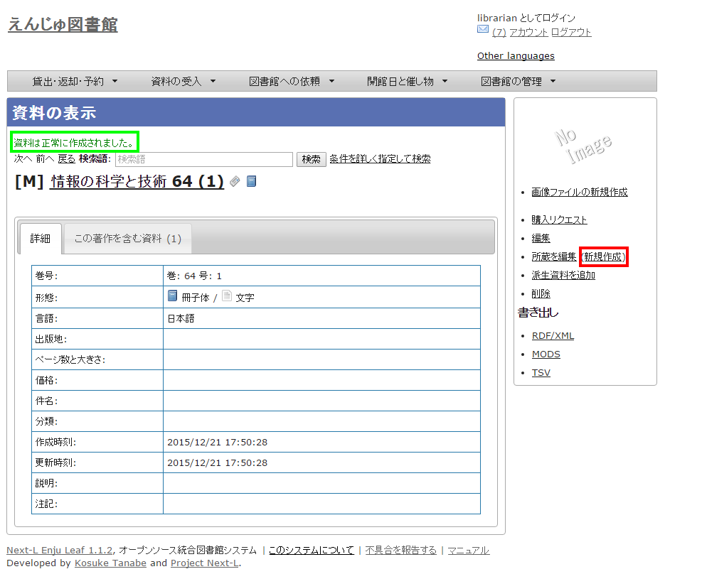

第5章 雑誌の受入をする
======================

{::comment}5-1  enju_operation/create_serials.md {:/comment}
{::comment}5-2  enju_operation/create_serials_manifestation.md {:/comment}
{::comment}5-3  enju_operation/create_serials_import.md {:/comment}

Enjuを使い、雑誌の受入に関して、次のような作業が行えます。

* 雑誌のタイトル単位の書誌を登録する
* 雑誌の各号の書誌を登録する
* 雑誌の各号の所蔵を登録する

Enjuにおける雑誌情報は，「逐次刊行物」フラッグと「シリーズ情報」の2つで管理しています。

書誌を登録する際に「逐次刊行物」フラグが付いた雑誌の各号にあたる書誌は，検索結果において各号単位ではなく，雑誌タイトル単位で表示されることになります。
雑誌タイトル単位の情報は，各号にあたる書誌情報では「シリーズ情報」として追加登録されます。
Enjuへの雑誌登録を行う際はこれらの基本的な仕組みを理解しておく必要があります。

<a name="5-0" />

5-0 雑誌登録の基本的な仕組み
----------------------------

1. 次の図は，検索結果一覧を示しています。検索結果一覧では，雑誌タイトル単位でまとめて一行として表示されます（例：「情報知識学会誌」「週刊文春」「週刊朝日」）。ここである雑誌タイトルを選んでみます(「週刊朝日」)。

2. すると選んだ雑誌タイトルの各号単位の書誌が一覧されます(例：週刊朝日の120号と121号が表示されている)。どれか特定の号のリンクをクリックしてみます(例：週刊朝日120号)。

3. 各号の情報が表示されます(例：週刊朝日 120号)

<a name="5-1" />

5-1 雑誌（シリーズ）を登録する
------------------------------

雑誌を登録する場合は、まず雑誌タイトル単位のシリーズ情報を登録しておきます。

1. ［資料の受入］メニューから［手動で登録する］を選択します。  
   
2. 原題にタイトル名称等を入力し、[逐次刊行物]にチェックを入れます。ここで入力した原題は検索結果一覧で表示されるものになります。[シリーズ情報]下の[別のシリーズ情報を追加する]リンクをクリックします。
   
3. シリーズ情報を入力するためのテキストボックスが表示されるので、[シリーズ情報]内の[シリーズ名]等を入力し(シリーズ名は基本的には原題と同じものを入力します)、「マスタ」にチェックを入れ、[更新する]ボタンをクリックします。
   
4. 雑誌タイトル単位のシリーズ情報が作成されます。
   

<a name="5-2" />

5-2 個々の雑誌を登録する
------------------------

雑誌マスタ（シリーズ）を登録したら、各号単位の雑誌を登録します。
ここでは例として，雑誌「情報の科学と技術」の64巻1号を登録するものとして説明します。

追加したい雑誌のマスタレコードを探します。

1. ［資料の受入］メニューから［雑誌・定期刊行物］を選択します。

   
   
2. 登録したい雑誌（シリーズ）をクリックします(ここでの例は「情報の科学と技術」)。

   
   
3. 右メニュー上部の［資料の新規作成］をクリックします。

   
   
3. シリーズ名や原題などは雑誌マスタの情報がコピーされるので、巻数や号など追加で必要な情報を入力し、[登録する]ボタンをクリックします。

   
   
5. 「資料は正常に作成されました。」のメッセージが表示され、雑誌が資料として登録されます。最下部の「所蔵情報の新規作成」のリンクをクッリクして所蔵情報の登録に進みます。

   
   
6. 「[4-3 所蔵情報を登録・一覧表示する](enju_operation_4.html#4-3)」の「5. 図書館や貸出状態などを設定して、［登録する］ボタンをクリックします。」からの手順に従い、資料の所蔵情報を登録します。

{::comment}
   
【Memo】雑誌の場合、次の号を資料として登録しようとすると、「通号」などのデータが前回のデータを参照して自動的に更新されます。
   

{:/comment}
 
5-3 TSVファイルを読み込んで登録する
------------------------------

1. 「4-2 図書を登録する」の「[4-2-1 TSVファイルを読み込んで登録する](enju_operation_4.html#4-2-1)」の手順に従い、TSVファイルを使った一括インポートを行います。

<h4 class="alert-heading">【Column】TSVファイルの作り方</h4>
1行目に、それぞれの項目に関わるフィールド名を（できれば " " で囲って）指定します。
フィールド名とその意味については次の通りです。

内部的に存在するもの


