* Contents
{:toc}

第6章 貸出・返却・予約を処理する {#section6}
============================================

Enjuでは、図書の貸出・返却・予約の処理が行えます。次のような作業を行えます。

貸出には、次のような手続きがあります。

* 資料を貸し出す  
  カードを忘れた利用者への貸出を含む
<!-- * 未登録資料を貸し出す -->
* 貸出状況を確認する
* 貸出の延長手続きをする

返却には、次のような手続きがあります。

* 返却を受け付ける
* 予約されている資料を保管する

予約には、次のような手続きがあります。

* 予約を新規作成する
* 予約を確認する
  予約の現状の検索、予約一覧の表示／印刷
* 予約の変更・取消をする

また、その他にも、次のような手続きがあります。

* 延滞情報を表示する

{::comment}6-1  enju_operation/checkout.md {:/comment}
{::comment}6-2  enju_operation/checkin.md {:/comment}
{::comment}6-3  enju_operation/reserve.md {:/comment}
{::comment}6-4  enju_operation/reminder.md {:/comment}
{::comment}6-5  enju_operation/ill.md {:/comment}

6-1 貸出をする {#section6-1}
-----------------------------

Enjuでは、利用者カードと資料のバーコードを読み込むことにより貸出を行います。利用者カードを忘れた利用者にも、氏名などから利用者を検索し利用者番号を確認することにより、資料の貸出が可能です。貸出の延長や未登録資料の貸出、貸出状況の確認も行えます。

### 6-1-1 資料を貸し出す {#section6-1-1}

#### 1. ［貸出・返却・予約］メニューから［貸出］を選択します。  

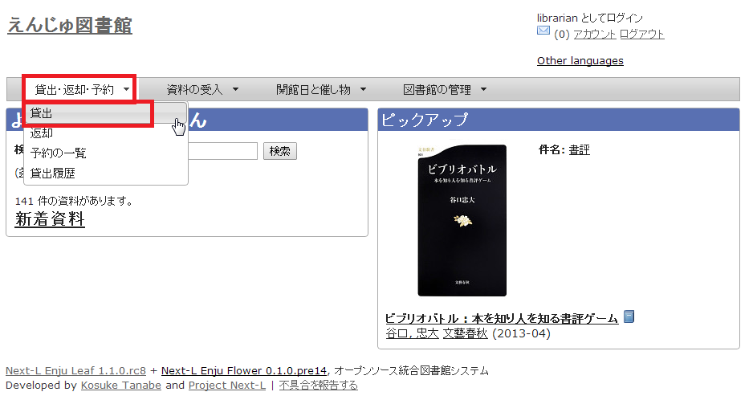

#### 2. 利用者番号を入力し［読み込み］ボタンをクリックします。  

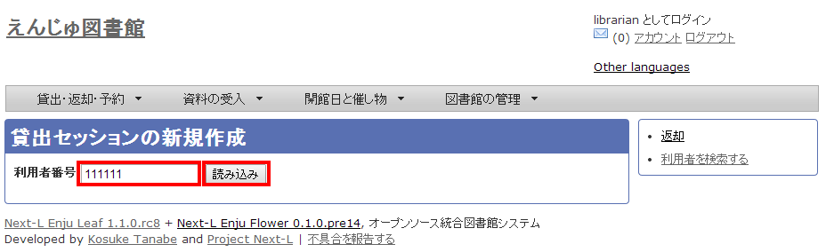

【Memo】

* 通常は、利用者カードのバーコードを読み込みます。
* 右メニューの[返却]リンクをクリックすると返却の新規作成の画面に遷移します。
* 右メニューの[利用者の検索する]をクリックすると、利用者を検索できる画面に遷移します。利用者カードを忘れた利用者がいた場合などに使用します。

#### 3. 所蔵IDを入力し、［読み込み］ボタンをクリックします。  

【Memo】

* 通常は、図書のバーコードを読み込みます。
* この画面で、この利用者が現在貸出中の資料が、画面下部に「現在貸出中の資料」として表示されますので確認できます。
* 右メニューの一番上のリンクをクリックすると当該利用者の利用者情報の画面に遷移します。
* 右メニューにある「図書 : 1/ 10」は、「借りている本の数 / 借りられる上限数」を表しています。
* 右メニューの[返却]リンクをたどると、全ての利用者分の返却の一覧画面へ遷移します。
* 右メニューの[予約]リンクをたどると、この利用者分の予約の一覧画面へ遷移します。

#### 4. ［上記の資料を貸し出す］ボタンをクリックします。  

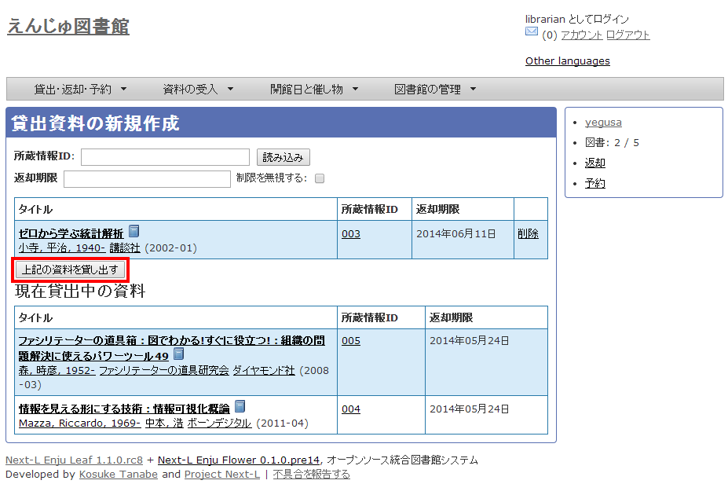

#### 5. 「貸出が完了しました。」のメッセージが表示され、貸出の手続きが完了します。

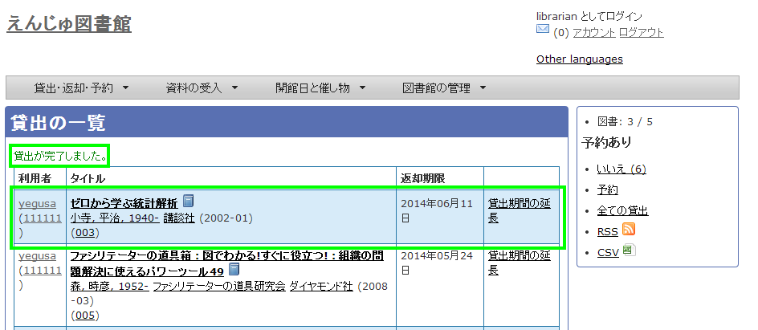

【Memo】

* 右メニューにある「図書 : 2/ 10」は、「借りている本の数 / 借りられる上限数」を表しています。
* 右メニューの[予約]リンクをたどると、この利用者分の予約の一覧画面へ遷移します。
* 右メニューの[全ての貸出]リンクをたどると、全ての利用者分の貸出の一覧画面へ遷移します。
* 予約ありの[はい]をたどると予約がはいっている資料のみを表示します。※Enju Leaf 1.1.0では、バグがあり、正常に動作しません（参照： [issue #982](https://github.com/next-l/enju_leaf/issues/982)）
* 予約ありの[いいえ]をたどると予約がはいっていない資料のみを表示します。※Enju Leaf 1.1.0では、バグがあり、正常に動作しません（参照： [issue #982](https://github.com/next-l/enju_leaf/issues/982)）
* [RSS]をたどるとこの利用者の貸出履歴をRSSでダウンロードできます
* [TSV]をたどるとこの利用者の貸出履歴をTSVでダウンロードできます。

### 6-1-2 利用者カードを忘れた利用者に資料を貸し出す {#section6-1-2}

#### 1. ［図書館の管理］メニューから［利用者の管理］を選択します。  

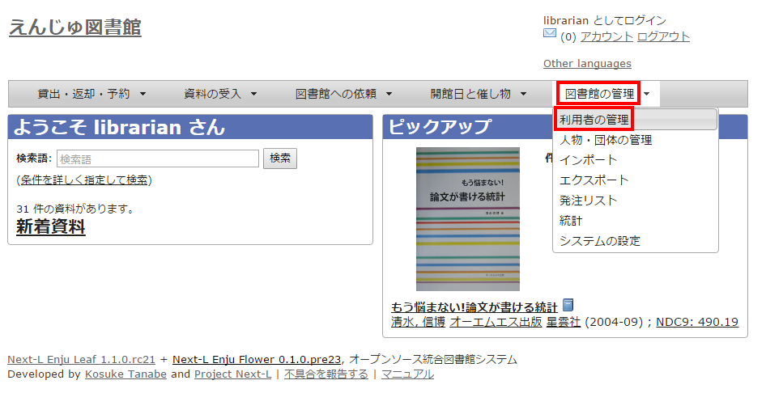

【Memo】[貸出・返却・予約]→[貸出]した後の画面の右メニュー[利用者を検索する]でもよいです。

#### 2. フルネームやユーザ名などを検索語として入力し［検索］をクリックします。  

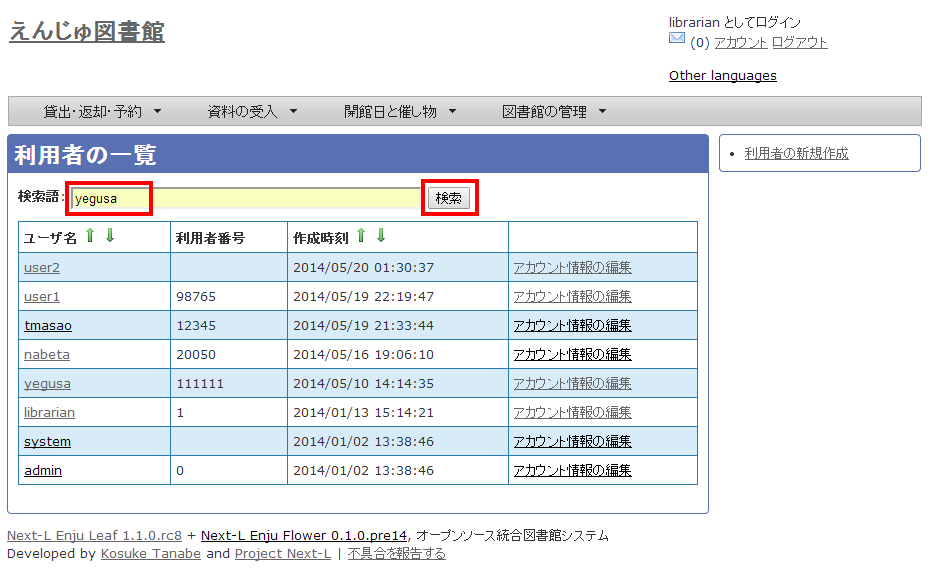

#### 3. 該当するユーザの［利用者番号］のリンクをクリックします。  

※　ここで利用者番号が確認できますが、念のため利用者情報を確認します。

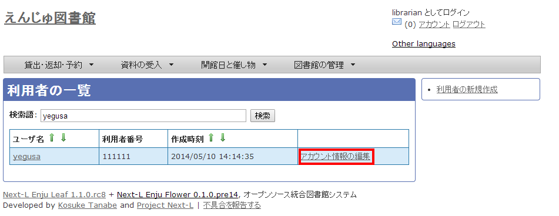

#### 4. 利用者情報を確認し、利用者番号をメモしておきます。もしくは、コピーしておきます。  

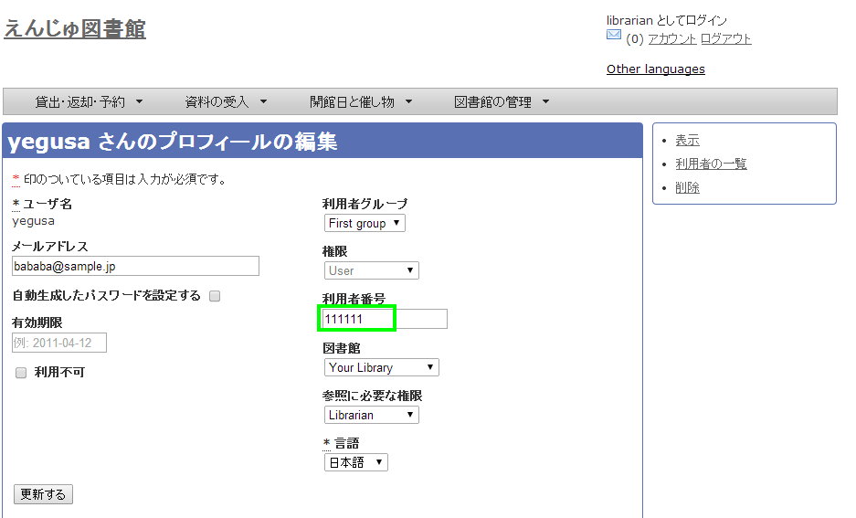

【Memo】この利用者のさらに詳細な情報（利用者グループや権限など）を知りたい場合は右メニューの[編集]リンクをクリックすると確認できます。

#### 5. ［貸出・返却・予約］メニューから［貸出］を選択します。  

#### 6. 利用者番号を入力します。  

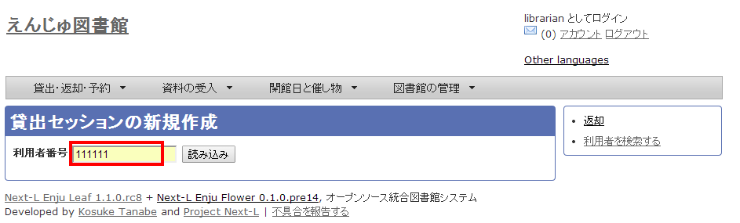

【Memo】利用者番号をコピーしておいた場合は、ここで貼り付けます。

#### 7. 以降は、通常の貸出の手順に従います。

### 6-1-3 貸出履歴を表示する {#section6-1-3}

ここでは、全員分の貸出履歴を表示する方法と
ログインユーザ自身の貸出履歴を表示する方法を説明します。

個々の利用者の貸出履歴を確認したい場合は、利用者情報の表示画面やその画面の右メニューのリンクから辿れる画面で確認できます
（詳細：[「3-5 利用者情報を表示する」](enju_operation_3.html#section3-5)）。

#### 1. ［貸出・返却・予約］メニューから［貸出履歴］を選択します。  

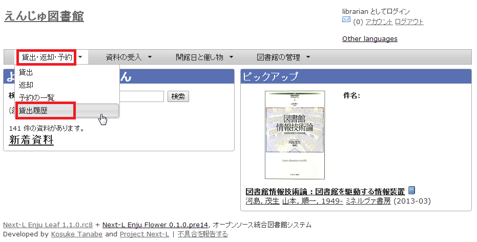

#### 2. 貸出履歴が表示されます。現在、貸出中の資料とともに返却済みの資料も含めて表示されます。[自分の貸出]をクリックします。

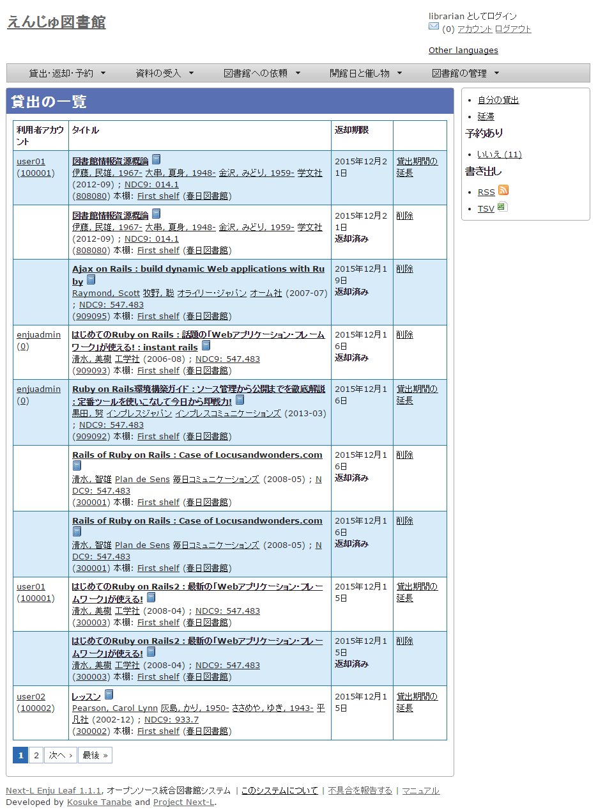

【Memo】

* 返却済みの貸出履歴は「返却期限」列に「返却済み」と書いてあります。※Enju Leaf 1.1.0, 1.1.1ではログインしているユーザ自身が「貸出の履歴を保存する」にチェックを入れていない場合、返却済みの貸出履歴が表示されないバグがあります。1.1.2からは解消されています。
* 「利用者アカウント」列は空白になっているのは、「貸出の履歴を保存する」にチェックの入っていない利用者アカウントの返却済みのレコードの場合です。
* 右メニューの[自分の貸出]をクリックするとログインユーザ自身の貸出のみを表示します。
* 右メニューの[延滞]リンクをたどると、延滞している資料の貸出履歴のみを表示します。
* 予約ありの[はい]をたどると予約がはいっている資料のみを表示します。※Enju Leaf 1.1.0では、バグがあり、正常に動作しません（参照： [issue #982](https://github.com/next-l/enju_leaf/issues/982)）
* 予約ありの[いいえ]をたどると予約がはいっていない資料のみを表示します。※Enju Leaf 1.1.0では、バグがあり、正常に動作しません（参照： [issue #982](https://github.com/next-l/enju_leaf/issues/982)）
* [RSS]をたどると全利用者の貸出履歴の最新の10件をRSSでダウンロードできます（詳細 [#issue 984](https://github.com/next-l/enju_leaf/issues/984)）。
* [TSV]をたどると全利用者の貸出履歴を最新の10件をTSVでダウンロードできます（詳細 [#issue 983](https://github.com/next-l/enju_leaf/issues/983)）。

#### 3. ログインユーザ自身の貸出履歴のみが表示されます。

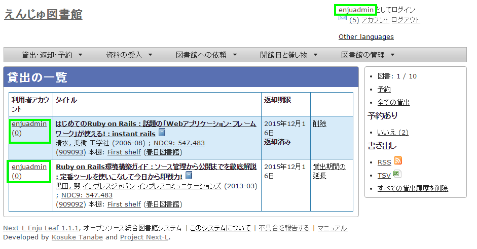

#### 【Column】RSSの例

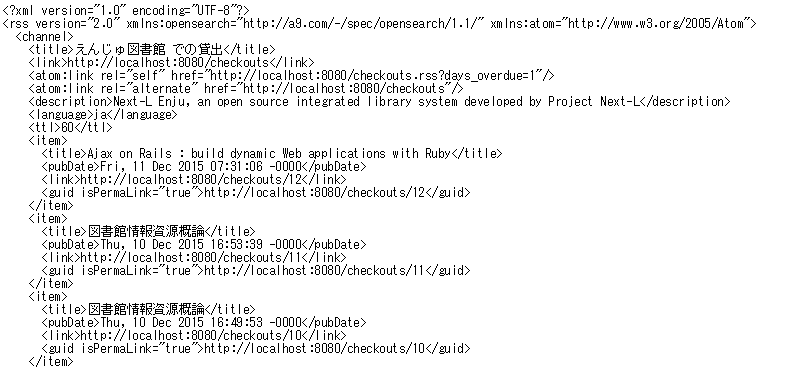

#### 【Column】TSVの例

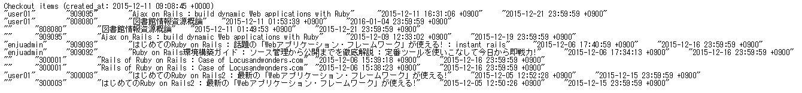

### 6-1-4 貸出の延長手続きをする {#section6-1-4}

#### 1. 貸出の一覧で、貸出の延長手続きをしたい貸出項目の［貸出期間の延長］をクリックします。  

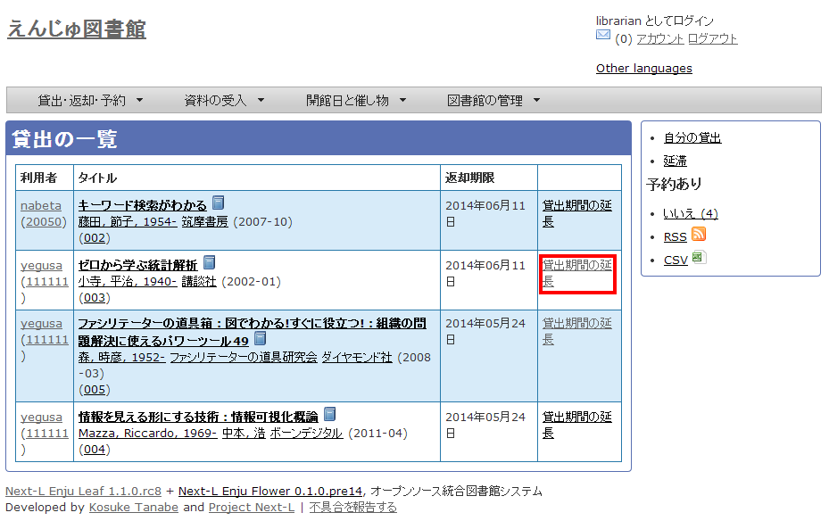

#### 2. 貸出期限日などを編集して、［更新する］ボタンをクリックします。  

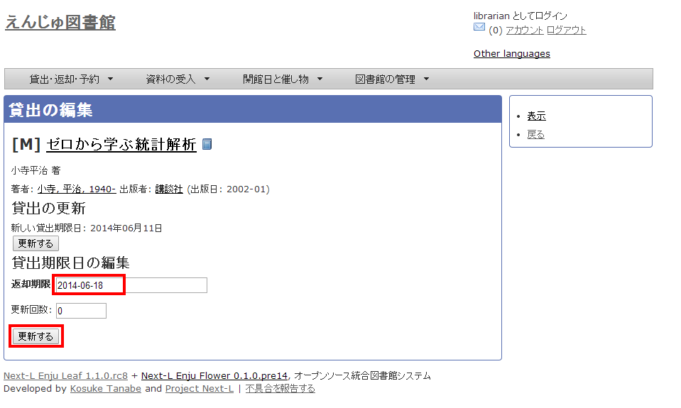

【Memo】

* 注：「新しい貸出期限日」は新しい貸出期限日ではありません。（詳細 [#1004](https://github.com/next-l/enju_leaf/issues/1004)）
* 注：「更新回数」は修正できるようなフォームがありますが修正できません（詳細 [#1005](https://github.com/next-l/enju_leaf/issues/1005)）
* 右メニューの[表示]をクリックすると、この編集画面の表示画面に遷移します。
* 右メニューの[戻る]をクリックすると、この資料を借りている利用者の貸出一覧が表示されます。（詳細 [#996](https://github.com/next-l/enju_leaf/issues/996)
）

#### 3. 「貸出は正常に更新されました。」のメッセージが表示され、貸出期間が延長されます。

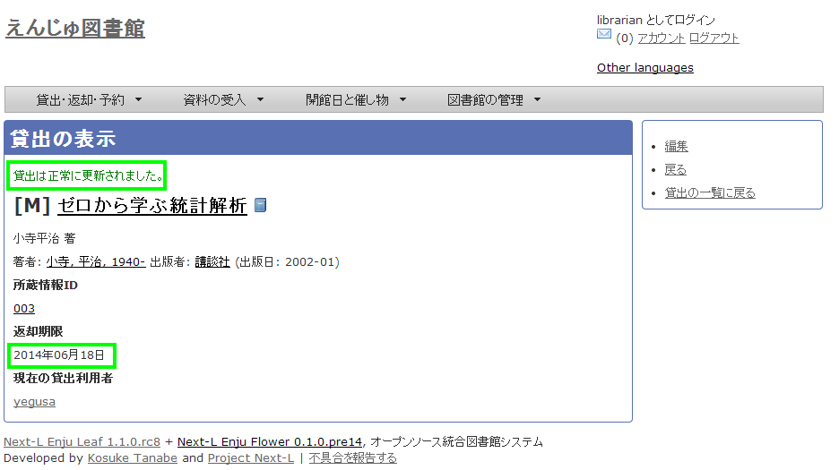

【Memo】

* 右メニューの[編集]をクリックすると、編集画面に遷移します。
* 右メニューの[戻る]をクリックすると、この資料を借りている利用者の貸出一覧が表示されます。（詳細 [#996](https://github.com/next-l/enju_leaf/issues/995)）
* 右メニューの[貸出の一覧に戻る]をクリックすると全利用者分の貸出履歴に遷移します。

6-2 返却を受け付ける {#section6-2}
-------------------------------

Enjuでは、返却資料を受け付けられると同時に、予約の入っている資料が返却された場合は、アラートを表示させることができます。アラートの表示に気付いたら、予約された本は書架に戻さずに特定の場所で管理しましょう。

#### 1. ［貸出・返却・予約］メニューから［返却］を選択します。  

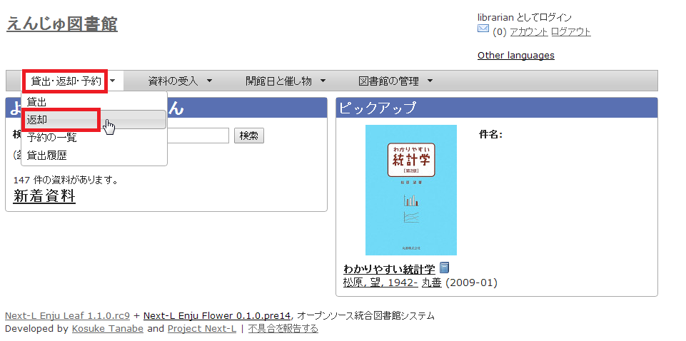

#### 2. 所蔵情報IDを入力し、［返却（取り消しはできません）］ボタンをクリックします。  

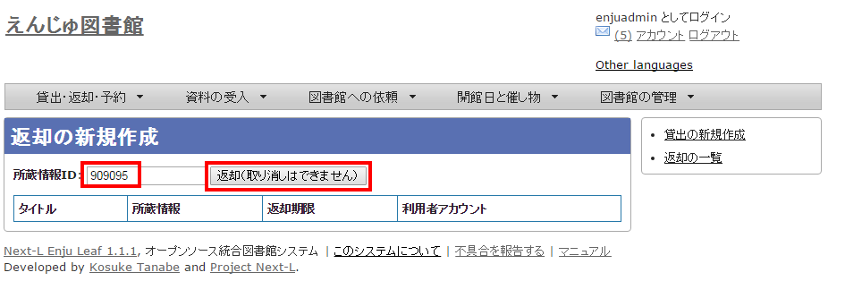

【Memo】

* 通常は、図書のバーコードを読み込みます。
* 右メニューの[返却の新規作成]リンクをたどると返却の新規作成の画面（同じ画面）が表示されます。
* 右メニューの[返却の一覧]リンクをたどると全利用者分のこれまでの返却履歴の一覧が表示されます。

#### 3. 「この資料は正常に返却されました。」のメッセージが表示され、返却の手続きが完了します。

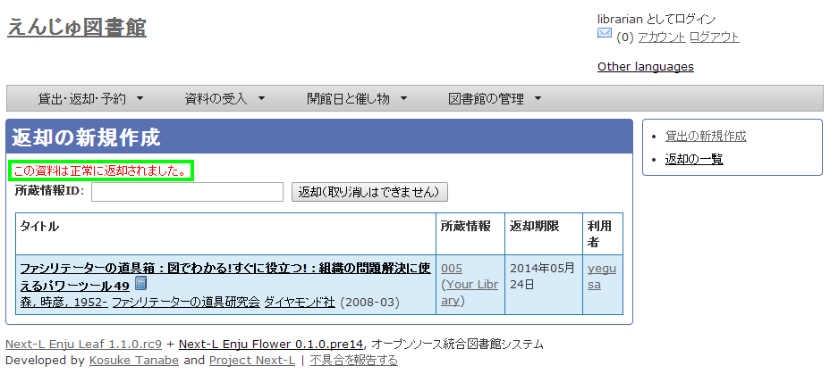

【Memo】

* 右メニューの[返却の新規作成]リンクをたどると返却の新規作成の画面が表示されます。
* 右メニューの[返却の一覧]リンクをたどると全利用者分のこれまでの返却履歴の一覧が表示されます。

#### 4. もし、予約がはいった資料であれば、「この資料は予約されています！」と表示されます。このメッセージが表示された場合は、その資料を所定の場所に取り置きします。

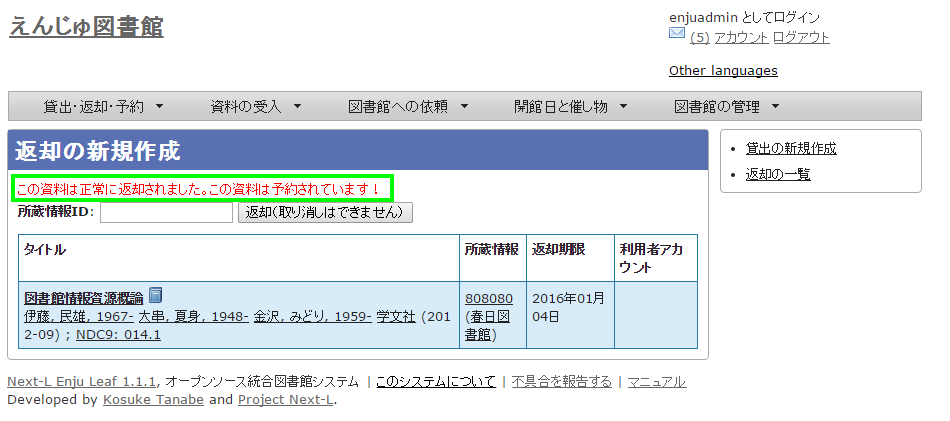

<h4 class="alert-heading">【Column】予約情報</h4>
予約資料が返却された場合、予約情報が修正されます。予約情報に取り置きした資料の[所蔵情報ID]と[請求記号]が記録され、[予約状態]が「受付済み」から「取置済み」に変更されます。予約情報の確認は「6-3予約を受け付ける」の「
[6-3-2 予約の一覧を表示・印刷する](#section6-3-2)
」や「[6-3-3 取置済みの資料を表示する](#section6-3-4)」を参照してください。

6-3 予約を受け付ける {#section6-3}
----------------------------------

予約は利用者自身で行うのが主ですが、図書館員が利用者の予約を受け付けることもできます。

### 6-3-1 予約を新規作成する {#section6-3-1}

#### 1. 予約したい本の名前を検索語に入力し、［検索］をクリックします。  

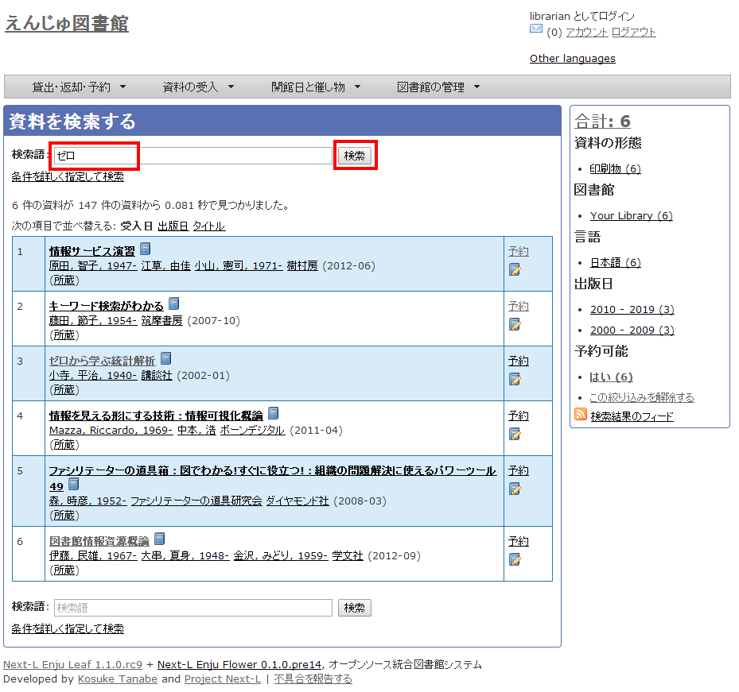

#### 2. 予約したい本が検索されたら、［予約］をクリックします。  

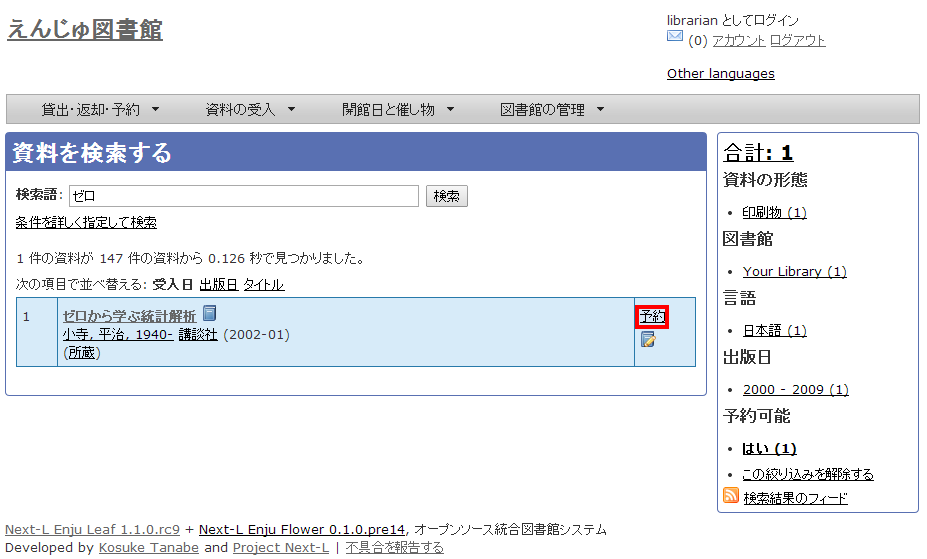

#### 3. 予約者の利用者番号等を入力し、［登録する］ボタンをクリックします。  

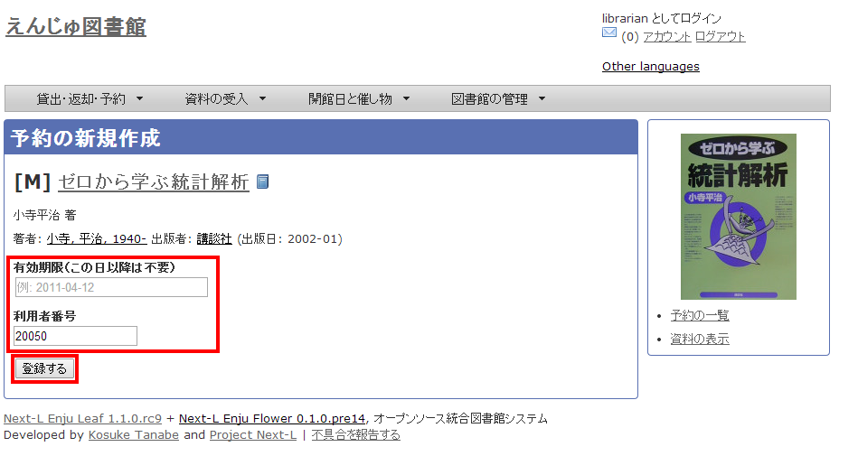

【Memo】

* 右メニューの[予約の一覧]リンクをたどると全利用者の予約の一覧の画面が表示されます。
* 右メニューの[資料の表示]リンクをたどるとこの資料の書誌詳細が表示されます。

#### 4. 「予約が正常に作成されました」と表示され、予約が作成されます。

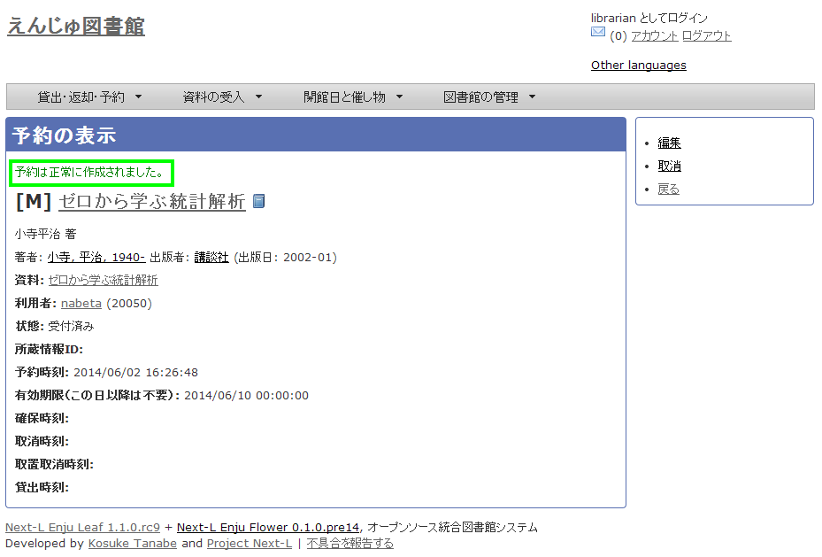

【Memo】

* 右メニューの[編集]リンクをたどると予約の編集画面が表示されます。
* 右メニューの[取消]リンクをたどるとこの予約を取り消せます。
* 右メニューの[戻る]リンクをたどると予約の一覧画面が表示されます。（詳細 [#997](https://github.com/next-l/enju_leaf/issues/997)）

### 6-3-2 予約の一覧を表示・印刷する {#section6-3-2}

#### 1. ［貸出・返却・予約］メニューから［予約の一覧］を選択します。  

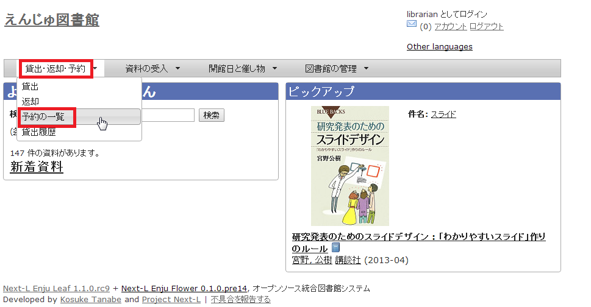

#### 2. 予約の一覧が表示されます。一覧を印刷したい場合は、右メニューの［TSV］をクリックしてTSVファイルを保存し、必要に応じてTSVファイルを印刷します。  

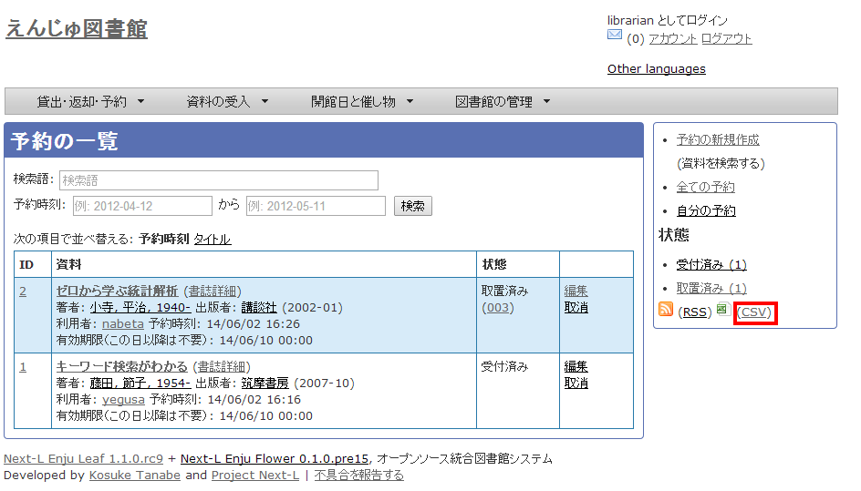

【Memo】

* 「Id」列の当該Idをクリックするとその予約の詳細情報が表示されます。
* [編集]リンクをクリックすると、その予約情報を編集できます。
* [取消]リンクをクリックすると、その予約情報を取消できます。
* 取消した予約情報には[削除]リンクが表示されますので、削除できます。
* ※ 状態が、「取置済み」の場合、右の[編集]、[取消]リンクが表示されないことがあるというバグが確認されています。 (詳細 [#1014](https://github.com/next-l/enju_leaf/issues/1014)）
* 右メニューの[予約の新規作成]リンクをたどると、予約が可能な資料のみに絞り込んだ資料検索画面へ遷移しますので、その画面で検索して、予約の新規作成にすすむことができます。
* 右メニューの[全ての予約]リンクをクリックすると、利用者全員分の予約の一覧画面に遷移します。
* 右メニューの[自分の予約]リンクをクリックすると、ログインユーザーの分の予約の一覧画面に遷移します。
* 右メニューの状態の下のリンク[受付済み]、[取置き済み]、[取消済み]などのリンクをクリックするとその状態に絞り込んだ予約が表示されます。
* 右メニューの[RSS]リンクをクリックすると予約の一覧の情報がRSSで表示されます。常に最新の10件のみを表示します。
* 右メニューの[TSV]リンクをクリックすると予約の一覧の情報がTSVで表示されます。常に全件（最大65,534件）を表示します。

### 【Column】TVS形式のデータファイル

TSV形式のデータファイル（TSVファイル）とは、
      項目をタブで区切ったテキストファイルです。
      1行目にそれぞれの項目に関わるフィールド名が記入されています。
      フィールド名とその意味については次の通りです。

  <table class="table table-bordered table-condensed table-striped">
    <caption>予約一覧のエクスポートTSVの項目</caption>
    <thead>
      <tr>
        <th>フィールド名</th>
        <th>データ形式</th>
        <th>内容</th></tr>
    </thead>
    <tbody>
      <tr>
        <td>id</td>
        <td>int</td>
        <td>予約ID</td></tr>
      <tr>
        <td>title</td>
        <td>utf8</td>
        <td>予約資料のタイトル</td></tr>
      <tr>
        <td>isbn</td>
        <td>ascii</td>
        <td>予約資料のISBN</td></tr>
      <tr>
        <td>item_identifier</td>
        <td>ascii</td>
        <td>取置資料の所蔵情報ID（取置済みの場合のみ表示）</td></tr>
      <tr>
        <td>call_number</td>
        <td>utf8</td>
        <td>取置資料の請求記号（取置済みの場合のみ表示）</td></tr>
      <tr>
        <td>username</td>
        <td>ascii</td>
        <td>利用者名</td></tr>
      <tr>
        <td>created_at</td>
        <td>ISO8601</td>
        <td>予約時刻（例：2014-06-24 15:00:00 +0900）</td></tr>
      <tr>
        <td>expired_at</td>
        <td>ISO8601</td>
        <td>有効期限（例：2014-06-24 15:00:00 +0900）</td></tr>
      <tr>
        <td>state</td>
        <td>utf8</td>
        <td>状態（取置済み、受付済みetc）</td></tr>
    </tbody>
  </table>

  <table class="table table-bordered table-condensed table-striped">
    <caption>予約一覧のエクスポートTSVの例</caption>
    <thead>
      <tr>
	<th>id</th>
	<th>title</th>
	<th>isbn</th>
	<th>item_identifier</th>
	<th>call_number</th>
	<th>username</th>	
	<th>created_at</th>	
	<th>expired_at</th>
	<th>state</th></tr>
    </thead>
    <tbody>
      <tr>
	<td>2</td>
	<td>ゼロから学ぶ統計解析</td>
	<td>9784061546561</td>
	<td>003</td>
	<td>417||K||お</td>
	<td>nabeta</td>
	<td>2014-06-02 16:26:48 +0900</td>
	<td>2014-06-10 00:00:00 +0900</td>
	<td>取置済み</td></tr>
      <tr>
	<td>1</td>
	<td>キーワード検索がわかる</td>
	<td>9784480063854</td>
	<td></td>
	<td></td>
	<td>yegusa</td>
	<td>2014-06-02 16:16:31 +0900</td>
	<td>2014-06-10 00:00:00 +0900</td>
	<td>受付済み</td></tr>
      </tbody>
    </table>

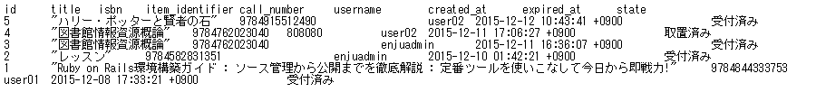

### 【Column】予約の一覧のRSSの例

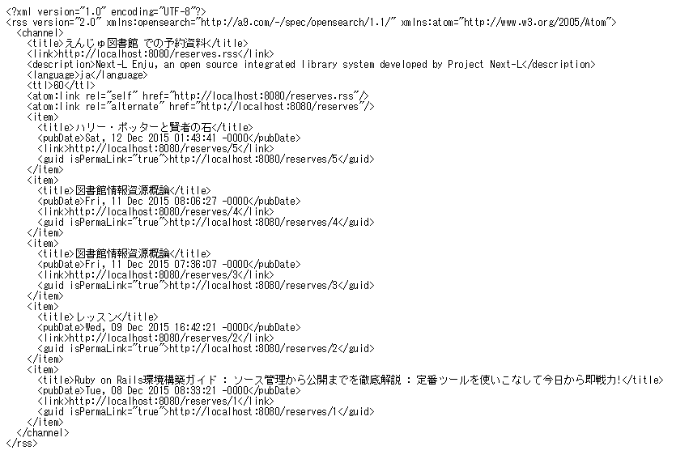

### 6-3-3 予約資料を取置済みにする {#section6-3-3}

受け付けた予約資料の資料を確保できた場合、状態を[取置済み]にする必要があります。
予約資料の状態を取置状態にするには以下の2つの方法があります。

1. 返却処理を行う
2. 予約情報を編集する

返却処理による方法は[6-2 返却を受け付ける](#section6-2)を参照してください。
ここでは、予約情報を編集する方法について説明します。

#### 1. [貸出・返却・予約］メニューから［予約の一覧］を選択します。

#### 2. 該当する予約資料の横の[編集]リンクをクリックします。

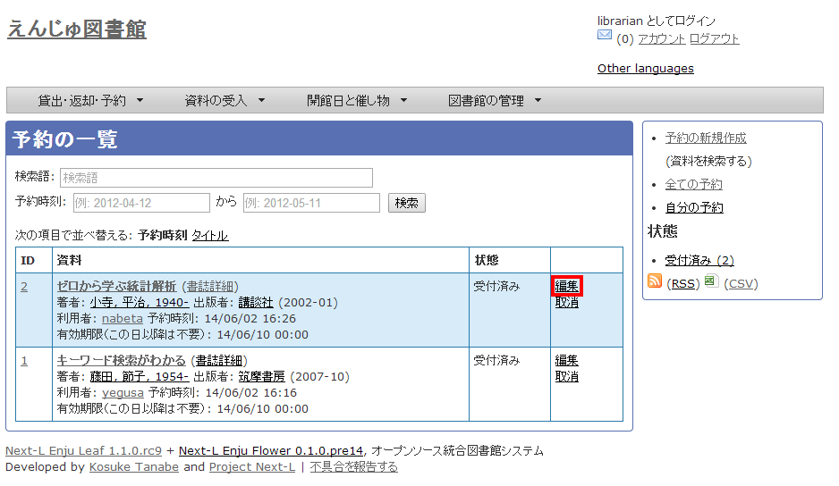

#### 3. 状態が[受付済み]の予約資料の編集画面が表示されます。[個別資料ID]の欄に取置済みとしたい資料の所蔵IDを入力し、[更新する]ボタンをクリックします。

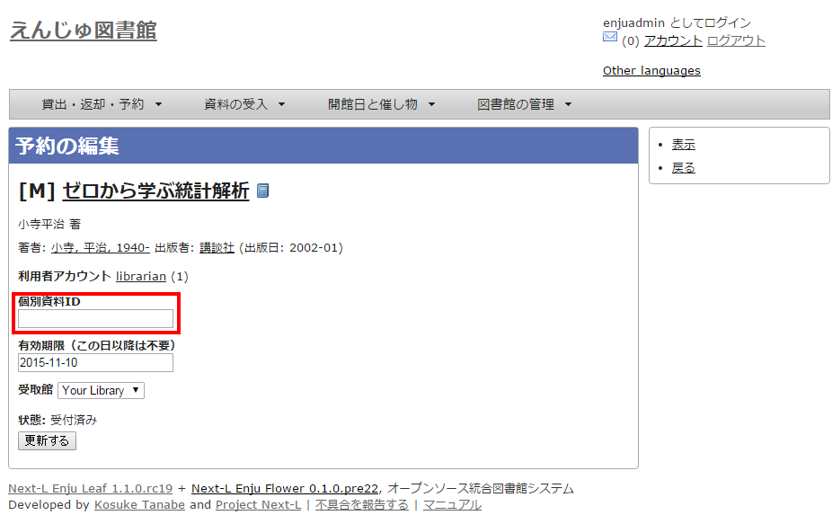

【Memo】

* 右メニューの[表示]をクリックすると予約の表示画面に遷移します。
* 右メニューの[戻る]をクリックすると予約の一覧の画面に遷移します。（詳細 [#997](https://github.com/next-l/enju_leaf/issues/997)）

#### 4. 予約情報が更新できると「予約は正常に更新されました」というメッセージが表示され、状態が[取置済み]になります。

【Memo】

* 右メニューの[編集]リンクをたどると予約の編集画面が表示されます。
* 右メニューの[取消]リンクをたどるとこの予約を取り消せます。
* 右メニューの[戻る]リンクをたどると予約の一覧画面が表示されます。（詳細 [#997](https://github.com/next-l/enju_leaf/issues/997)）

### 6-3-4 取置済みの資料を表示する {#section6-3-4}

状態が[取置済み]の予約資料のみを表示することができます。

#### 1. ［貸出・返却・予約］メニューから［予約の一覧］を選択します。

#### 2. 右メニューの[取り置き済み(n)]リンクをクリックします。

#### 3. 状態が[取置済み]の予約資料のみが表示されます

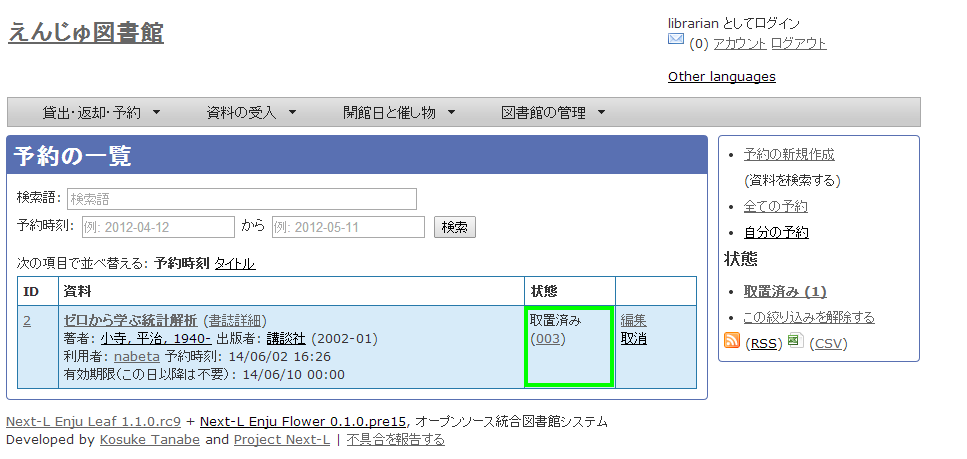

【Memo】右メニューの[この絞り込みを解除する]をクリックすると全予約が表示されます。

### 6-3-5 利用者に予約資料の到着を連絡する {#section6-3-5}

【Memo】Next-L Enju Leaf 1.1.0 現在、この機能は未実装です(開発予定はあります）（詳細 [#1016](https://github.com/next-l/enju_leaf/issues/1016)）

<!-- 

#### 1. その日に返却された予約資料の一覧を表示します。

【Memo】一覧には、ユーザが希望する連絡方法（メール、電話、FAX）などが表示されます。

#### 2. メールで連絡したい場合は、メールでの連絡を希望しているユーザの［メール連絡］にチェックを入れ、［メールを送信］ボタンをクリックします。

#### 3. メール以外の連絡方法を希望しているユーザについては、それぞれ個別に対応します。

-->

### 6-3-6 予約の変更・取消をする {#section6-3-6}

#### 1. ［貸出・返却・予約］メニューから［予約の一覧］を選択します。

#### 2. 編集したい場合は予約の[編集]を、取消したい場合は[取消]を、削除したい場合は[削除]をクリックします。

※　取消済みの予約は[削除]ができます。

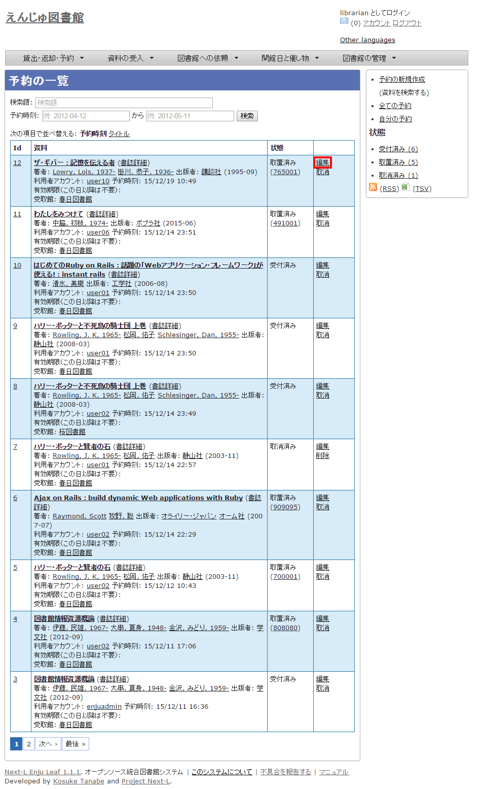

#### 3. 編集する場合は、個別資料ID、有効期限、受取館などを変更して［予約を更新］ボタンをクリックします。 

※個別資料IDを他のものに変更する場合は取り置いておいた本を他の本に変えたいときに使用します。

※User権限の場合はできることが異なります（詳細　利用者マニュアル[「4-3 予約の変更をする」](https://next-l.github.io/manual/enju_user_4.html#section4-3)）。

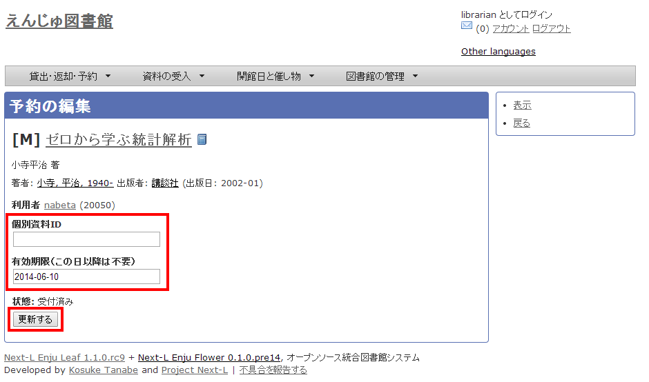

【Memo】

* 右メニューの[表示]をクリックすると予約の表示画面に遷移します。
* 右メニューの[戻る]をクリックすると予約の一覧の画面に遷移します。（詳細 [#997](https://github.com/next-l/enju_leaf/issues/997)）

6-4 延滞情報を表示する {#section6-4}
------------------------------------------------------

[利用者グループの設定](enju_setup_3.html#section3-4)で、設定した時期・頻度で
システムから自動的に貸出期限を過ぎていることを知らせるメッセージやメールが送られます
（※メールの送信には[メールサーバー](enju_install_vm_4.html#section4-4-3)の設定が必要です）。

この機能とは別に、個別にメールや電話の督促の連絡をするために、
資料の返却が遅れている資料や借りているユーザを一覧表示する機能について説明します。

【Memo】

この画面からメールの督促を手動で送る機能を開発する予定がありますが、
Next-L Enju Leaf 1.1.0 現在、未実装です( [issue #159](https://github.com/next-l/enju_leaf/issues/159)）。

#### 1. ［貸出・返却・予約］メニューから［貸出履歴］をクリックします。  

#### 2. 右メニューの［延滞］をクリックします。  

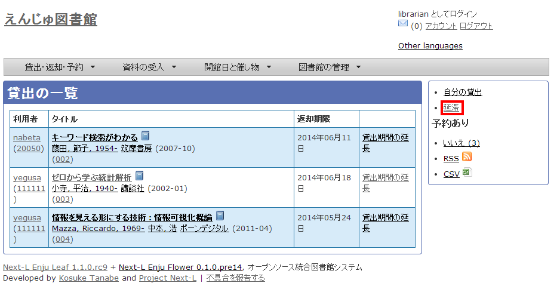

#### 3. 何日延滞している人に督促の連絡をしたいのかにより、延滞日数に数値を入力して［検索］ボタンをクリックします。  

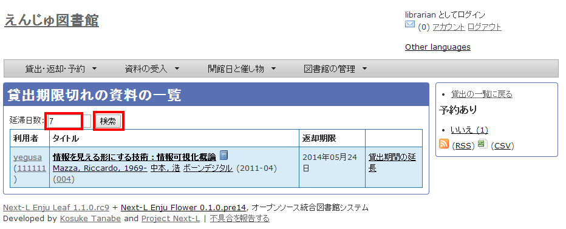

【Memo】

* たとえば、延滞日数に「7」と入力すると、1週間以上延滞している資料のみに絞り込まれます。
* 右メニューの[貸出の一覧に戻る]をクリックすると貸出履歴の一覧の画面に遷移します。
* 右メニューの予約ありの[はい]や[いいえ]をクリックすると予約のあるもののみもしくは予約のないもののみを表示します ※ Enju Leaf 1.1.0 ではバグがあり、うまく機能しません　詳細 [issue #1037](https://github.com/next-l/enju_leaf/issues/1037)

<!--

#### 4. メールで督促の連絡をする人にチェックをして、［メールを送信］をクリックします。

-->

#### 4. 必要に応じて右メニューの［TSV］をクリックしてTSVファイルを保存します。 

※　注意!　この画面で見えている延滞日数にかかわらず、すべての延滞日数の資料をTSVに出力します([issue #990](https://github.com/next-l/enju_leaf/issues/990))。

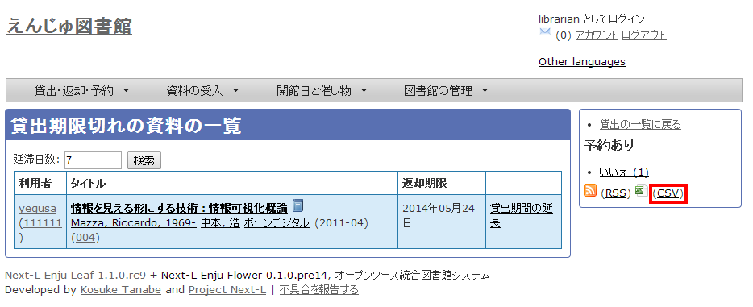

【Column】TSVの例

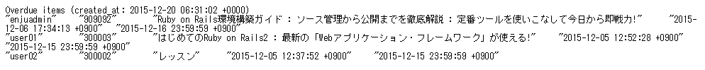

【Memo】

* 右メニューの[RSS]をクリックすると延滞しているすべての資料の貸出履歴をRSS表示します。

【Column】RSSの例

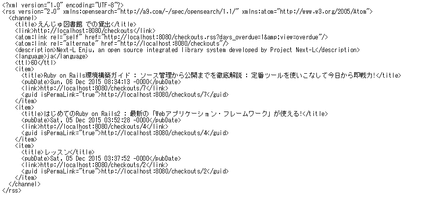

6-5 相互貸借をする {#section6-5}
---------------------------------

Enjuでは、NACSIS-ILL、ゆにかねっとの利用を検討しています（[issue #617](https://github.com/next-l/enju_leaf/issues/617)）。


