* Contents
{:toc}

第6章 貸出・返却・予約を処理する {#section6}
============================================

Enjuでは、図書の貸出・返却・予約の処理が行えます。次のような作業を行えます。

貸出には、次のような手続きがあります。

* 資料を貸し出す  
  カードを忘れた利用者への貸出を含む
* 貸出の延長手続きをする
* 未登録資料を貸し出す
* 貸出状況を確認する

返却には、次のような手続きがあります。

* 返却を受け付ける
* 予約されている資料を保管する

予約には、次のような手続きがあります。

* 予約を新規作成する
* 予約を確認する
  予約の現状の検索、予約一覧の表示／印刷
* 予約の変更・取消をする

{::comment}6-1  enju_operation/checkout.md {:/comment}
{::comment}6-2  enju_operation/checkin.md {:/comment}
{::comment}6-3  enju_operation/reserve.md {:/comment}
{::comment}6-4  enju_operation/reminder.md {:/comment}
{::comment}6-5  enju_operation/ill.md {:/comment}

6-1 貸出をする {#section6-1}
-----------------------------

Enjuでは、利用者カードと資料のバーコードを読み込むことにより貸出を行います。利用者カードを忘れた利用者にも、氏名などから利用者を検索し利用者番号を確認することにより、資料の貸出が可能です。貸出の延長や未登録資料の貸出、貸出状況の確認も行えます。

### 6-1-1 資料を貸し出す {#section6-1-1}

#### 1. ［貸出・返却・予約］メニューから［貸出］を選択します。  

#### 2. 利用者番号を入力し［読み込み］ボタンをクリックします。  

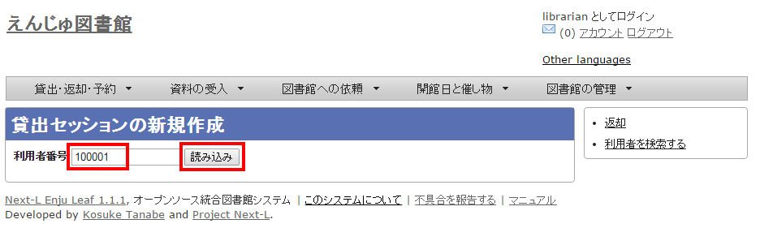

【Memo】通常は、利用者カードのバーコードを読み込みます。

#### 3. 所蔵IDを入力し、［読み込み］ボタンをクリックします。  

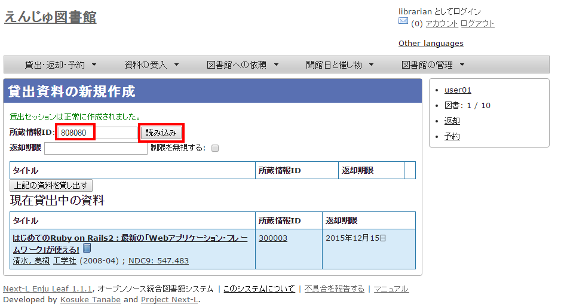

【Memo】通常は、図書のバーコードを読み込みます。

#### 4. ［上記の資料を貸し出す］ボタンをクリックします。  

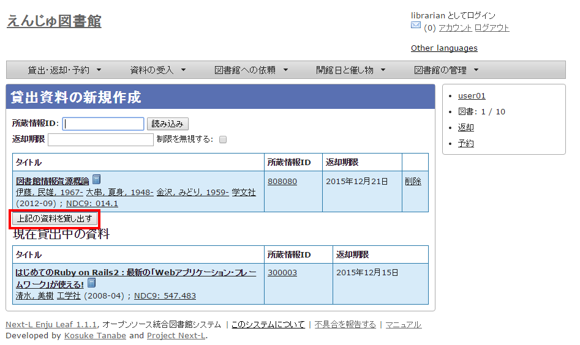

#### 5. 「貸出が完了しました。」のメッセージが表示され、貸出の手続きが完了します。

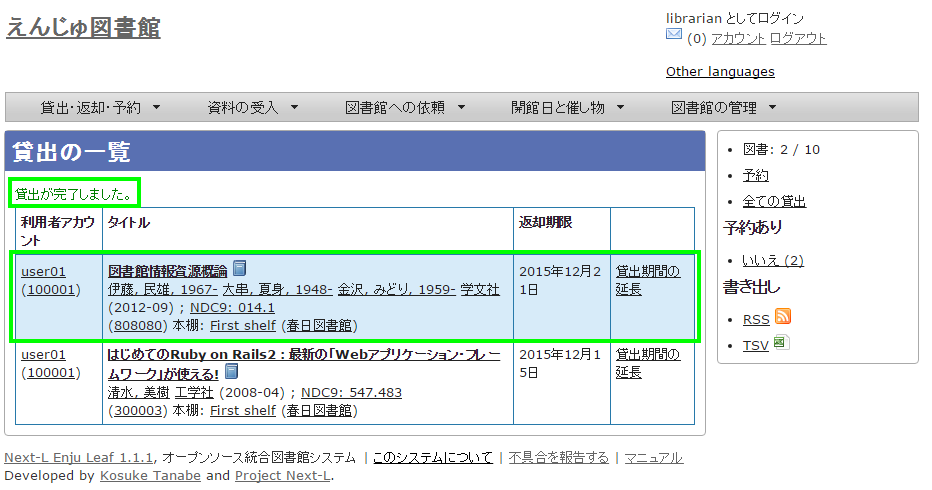

### 6-1-2 利用者カードを忘れた利用者に資料を貸し出す {#section6-1-2}

#### 1. ［図書館の管理］メニューから［利用者の管理］を選択します。  

#### 2. ユーザ名を検索語として入力し［検索］をクリックします。  

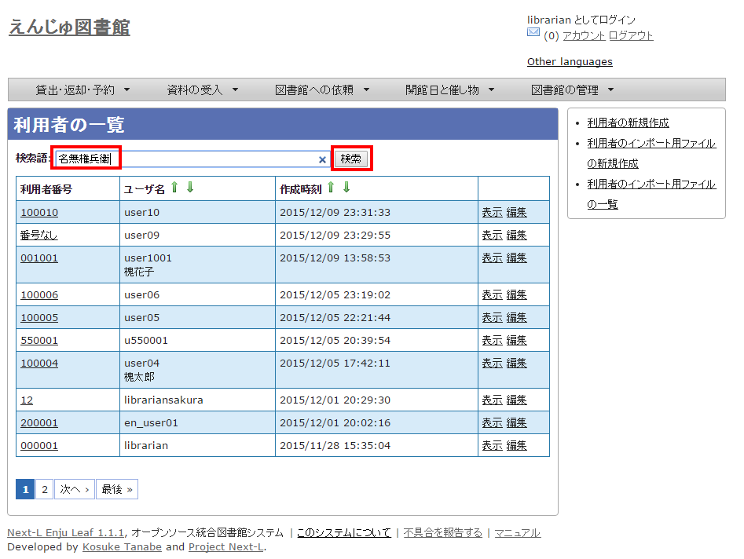

#### 3. 該当するユーザの［アカウント情報の編集］をクリックします。  

#### 4. 利用者番号を確認します。  

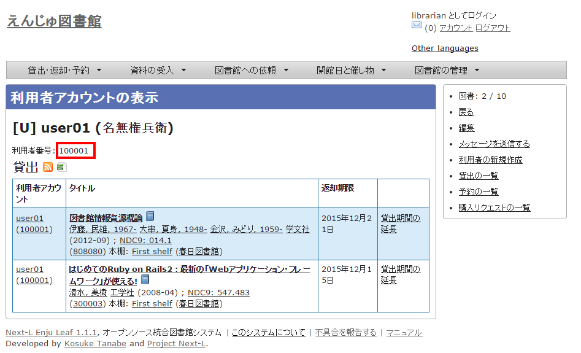

【Memo】利用者番号をコピーしておくと、後の操作がスムーズです。

#### 5. ［貸出・返却・予約］メニューから［貸出］を選択します。  

#### 6. 利用者番号を入力します。  

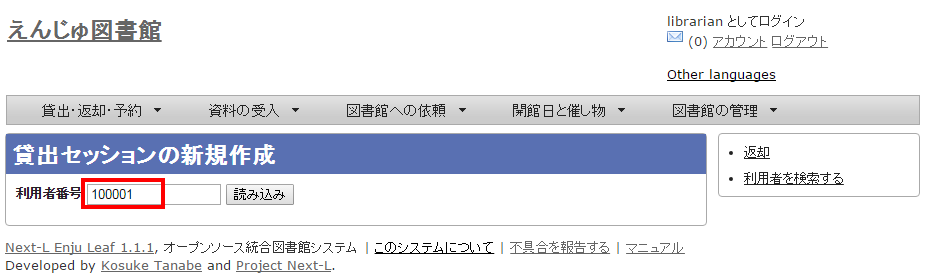

【Memo】利用者番号をコピーしておいた場合は、ここで貼り付けます。

#### 7. 以降は、通常の貸出の手順に従います。

### 6-1-3 貸出中の資料の一覧を表示する {#section6-1-3}

#### 1. ［貸出・返却・予約］メニューから［貸出履歴］を選択します。  

#### 2. 貸出中の資料の一覧が表示されます。  

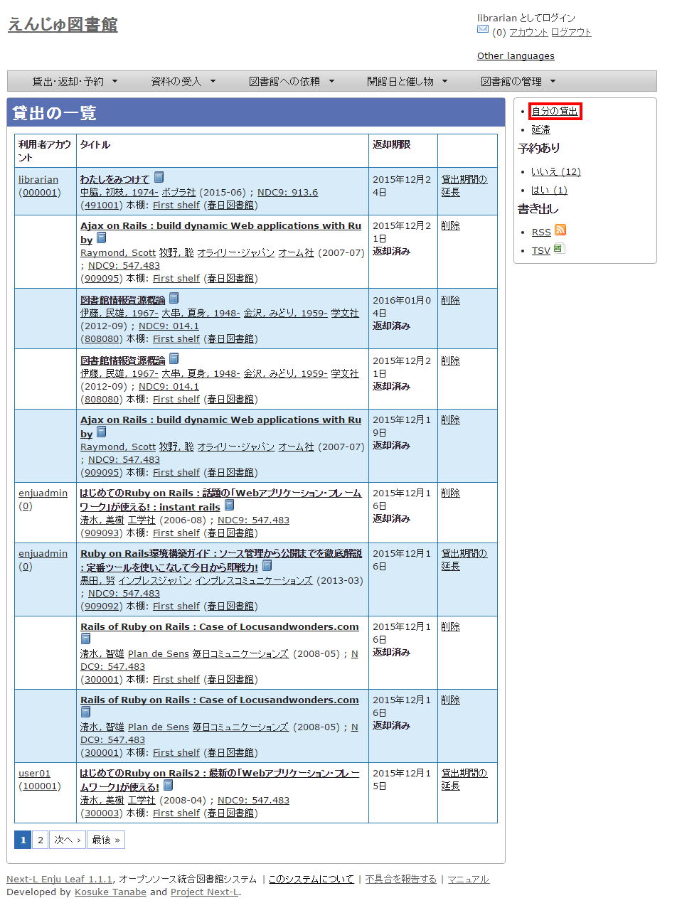

### 6-1-4 貸出の延長手続きをする {#section6-1-4}

#### 1. 貸出の一覧で、貸出の延長手続きをしたい貸出項目の［貸出期間の延長］をクリックします。  

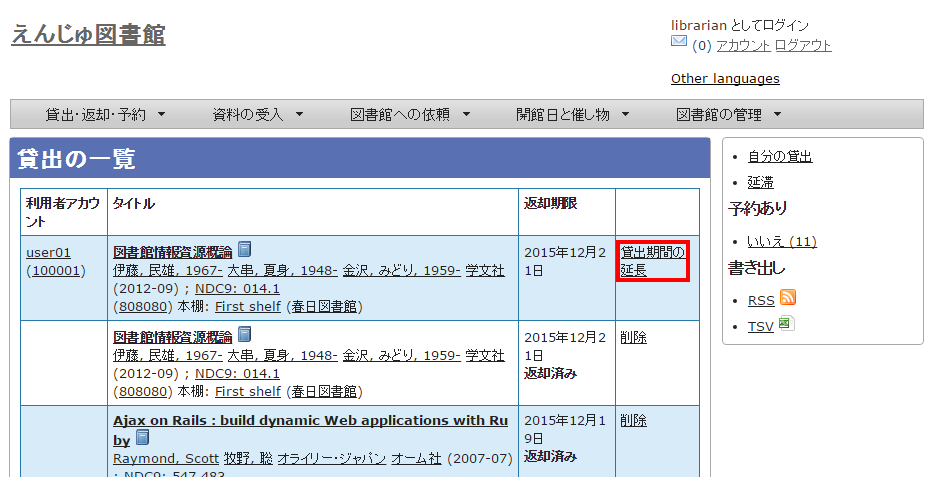

#### 2. 貸出期限日などを編集して、［更新する］ボタンをクリックします。  

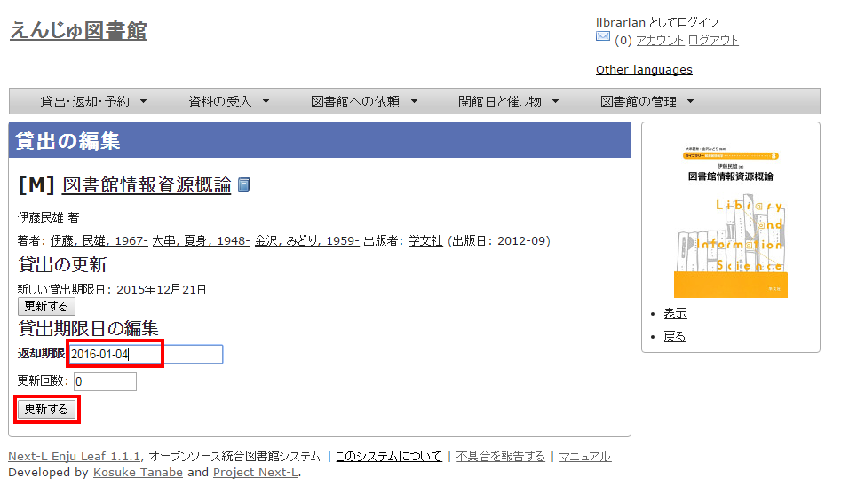

#### 3. 「貸出は正常に更新されました。」のメッセージが表示され、貸出期間が延長されます。

6-2 返却を受け付ける {#section}
-------------------------------

Enjuでは、返却資料を受け付けられると同時に、予約の入っている資料が返却された場合は、アラートを表示させることができます。アラートの表示に気付いたら、予約された本は書架に戻さずに特定の場所で管理しましょう。

#### 1. ［貸出・返却・予約］メニューから［返却］を選択します。  

#### 2. 所蔵情報IDを入力し、［返却（取り消しはできません）］ボタンをクリックします。  

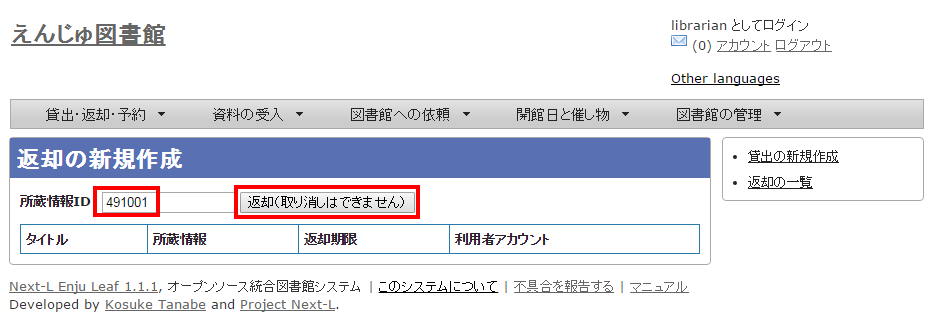

【Memo】通常は、図書のバーコードを読み込みます。

#### 3. 「この資料は正常に返却されました。」のメッセージが表示され、返却の手続きが完了します。

#### 4. もし、予約がはいった資料であれば、「この資料は予約されています！」と表示されます。このメッセージが表示された場合は、その資料を所定の場所に取り置きします。

<h4 class="alert-heading">【Column】予約情報</h4>
予約資料が返却された場合、予約情報が修正されます。予約情報に取り置きした資料の[所蔵情報ID]と[請求記号]が記録され、[予約状態]が「受付済み」から「取置済み」に変更されます。予約情報の確認は「6-3予約を受け付ける」の「
[6-3-2 予約の一覧を表示・印刷する](#6-3-2)
」や「[6-3-3 取置済みの資料を表示する](#6-3-3)」を参照してください。

6-3 予約を受け付ける {#section6-3}
----------------------------------

予約は利用者自身で行うのが主ですが、図書館員が利用者の予約を受け付けることもできます。

### 6-3-1 予約を新規作成する {#section6-3-1}

#### 1. ［貸出・返却・予約］メニューから［予約の一覧］を選択します。  

#### 2. 右メニューの［予約の新規作成］をクリックします。  

#### 3. 予約したい本の名前を検索語に入力し、［検索］をクリックします。  

#### 4. 予約したい本が検索されたら、［予約］をクリックします。  

#### 5. 予約者の利用者番号等を入力し、［登録する］ボタンをクリックします。  

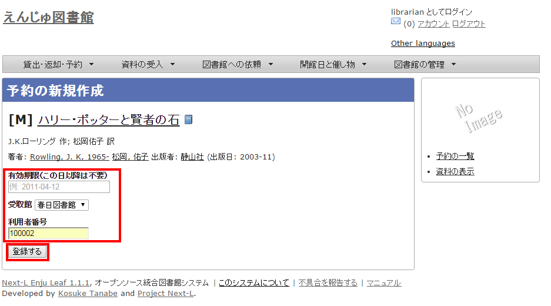

#### 6. 「予約が正常に作成されました」と表示され、予約が作成されます。

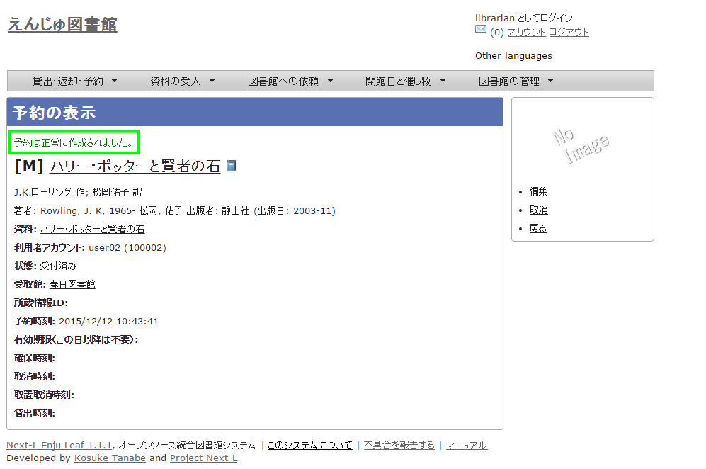

### 6-3-2 予約の一覧を表示・印刷する {#section6-3-2}

#### 1. ［貸出・返却・予約］メニューから［予約の一覧］を選択します。  

#### 2. 予約の一覧が表示されます。一覧を印刷したい場合は、右メニューの［CSV］をクリックしてCSVファイルを保存し、必要に応じてCSVファイルを印刷します。  

    <h4 class="alert-heading">【Column】CVS形式のデータファイル</h4>
    
CSV形式のデータファイル（CSVファイル）とは、
      項目をカンマで区切ったテキストファイルです。
      1行目にそれぞれの項目に関わるフィールド名が記入されています。
      フィールド名とその意味については次の通りです。

  <table class="table table-bordered table-condensed table-striped">
    <caption>予約一覧のエクスポートCSVの項目</caption>
    <thead>
      <tr>
        <th>フィールド名</th>
        <th>データ形式</th>
        <th>内容</th></tr>
    </thead>
    <tbody>
      <tr>
        <td>id</td>
        <td>int</td>
        <td>予約ID</td></tr>
      <tr>
        <td>title</td>
        <td>utf8</td>
        <td>予約資料のタイトル</td></tr>
      <tr>
        <td>isbn</td>
        <td>ascii</td>
        <td>予約資料のISBN</td></tr>
      <tr>
        <td>item_identifier</td>
        <td>ascii</td>
        <td>取置資料の所蔵情報ID（取置済みの場合のみ表示）</td></tr>
      <tr>
        <td>call_number</td>
        <td>utf8</td>
        <td>取置資料の請求記号（取置済みの場合のみ表示）</td></tr>
      <tr>
        <td>username</td>
        <td>ascii</td>
        <td>利用者名</td></tr>
      <tr>
        <td>created_at</td>
        <td>ISO8601</td>
        <td>予約時刻（例：2014-06-24 15:00:00 +0900）</td></tr>
      <tr>
        <td>expired_at</td>
        <td>ISO8601</td>
        <td>有効期限（例：2014-06-24 15:00:00 +0900）</td></tr>
      <tr>
        <td>state</td>
        <td>utf8</td>
        <td>状態（取置済み、受付済みetc）</td></tr>
    </tbody>
  </table>

  <table class="table table-bordered table-condensed table-striped">
    <caption>予約一覧のエクスポートCSVの例</caption>
    <thead>
      <tr>
	<th>id</th>
	<th>title</th>
	<th>isbn</th>
	<th>item_identifier</th>
	<th>call_number</th>
	<th>username</th>	
	<th>created_at</th>	
	<th>expired_at</th>
	<th>state</th></tr>
    </thead>
    <tbody>
      <tr>
	<td>2</td>
	<td>ゼロから学ぶ統計解析</td>
	<td>9784061546561</td>
	<td>003</td>
	<td>417||K||お</td>
	<td>nabeta</td>
	<td>2014-06-02 16:26:48 +0900</td>
	<td>2014-06-10 00:00:00 +0900</td>
	<td>取置済み</td></tr>
      <tr>
	<td>1</td>
	<td>キーワード検索がわかる</td>
	<td>9784480063854</td>
	<td></td>
	<td></td>
	<td>yegusa</td>
	<td>2014-06-02 16:16:31 +0900</td>
	<td>2014-06-10 00:00:00 +0900</td>
	<td>受付済み</td></tr>
      </tbody>
    </table>

### 6-3-3 取置済みの資料を表示する {#section6-3-3}

状態が[取置済み]の予約資料のみを表示することができます。

#### 1. ［貸出・返却・予約］メニューから［予約の一覧］を選択します。

#### 2. 右メニューの[取り置き済み(n)]リンクをクリックします。

#### 3. 状態が[取置済み]の予約資料のみが表示されます

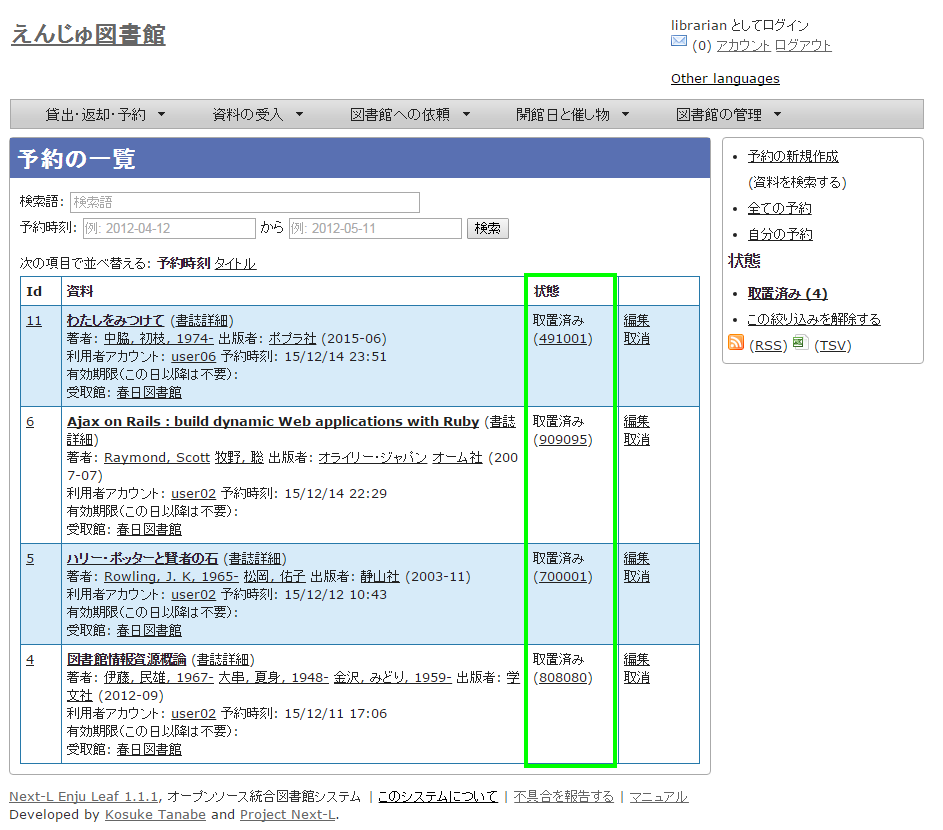

### 6-3-4 利用者に予約資料の到着を連絡する {#section6-3-4}

【Memo】Next-L Enju Leaf 1.1.0.rc9 以前のバージョンではこの機能は未実装です(開発予定はあります）。

#### 1. その日に返却された予約資料の一覧を表示します。

【Memo】一覧には、ユーザが希望する連絡方法（メール、電話、FAX）などが表示されます。

#### 2. メールで連絡したい場合は、メールでの連絡を希望しているユーザの［メール連絡］にチェックを入れ、［メールを送信］ボタンをクリックします。

#### 3. メール以外の連絡方法を希望しているユーザについては、それぞれ個別に対応します。

### 6-3-5 予約の変更・取消をする {#section6-3-5}

#### 1. ［貸出・返却・予約］メニューから［予約の一覧］を選択します。

#### 2. 編集したい場合は予約の[編集]を、削除したい場合は[削除]をクリックします。

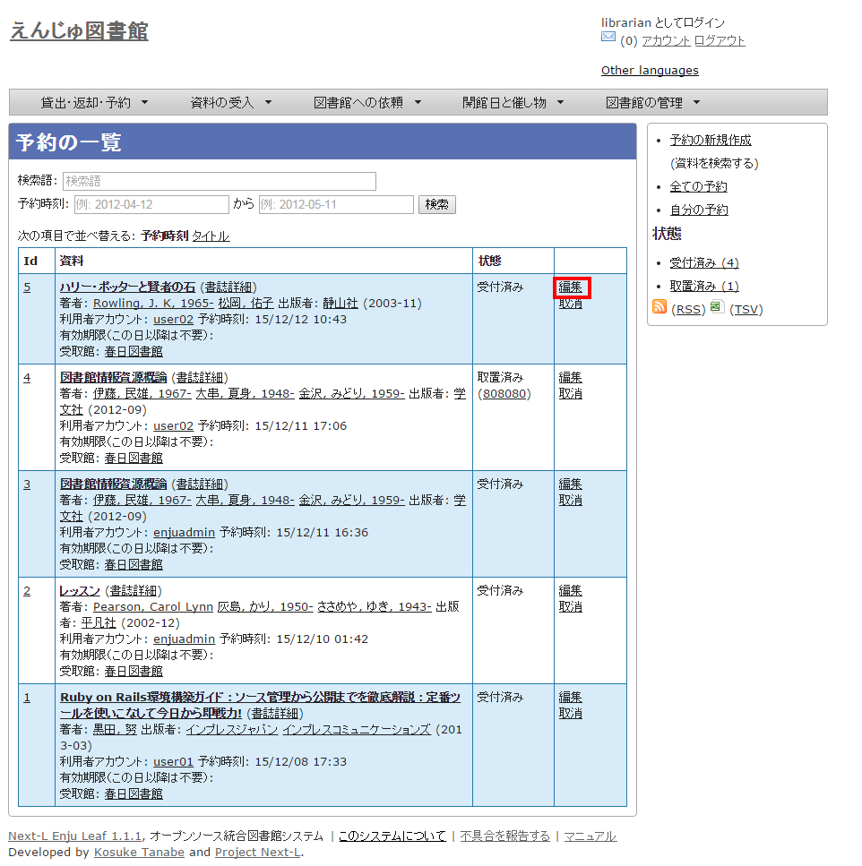

#### 3. 編集する場合は、有効期限などを変更して［予約を更新］ボタンをクリックします。 

6-4 督促の連絡をする {#section6-4}
----------------------------------

資料の返却が遅れているユーザを一覧表示し、メールや電話で督促の連絡をすることができます。

【Memo】Next-L Enju Leaf 1.1.0.rc9 以前のバージョ>ンではメールの督促を送る機能は未実装です(開発予定はあります）。

#### 1. ［貸出・返却・予約］メニューから［貸出履歴］をクリックします。  

#### 2. 右メニューの［延滞］をクリックします。  

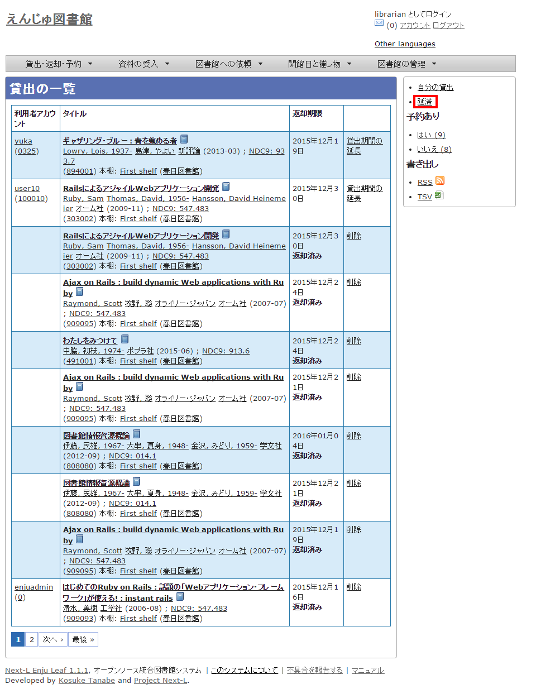

#### 3. 何日延滞している人に督促の連絡をしたいのかにより、延滞日数に数値を入力して［検索］ボタンをクリックします。  

【Memo】たとえば、延滞日数に「7」と入力すると、1週間以上延滞している資料のみに絞り込まれます。

#### 4. メールで督促の連絡をする人にチェックをして、［メールを送信］をクリックします。

#### 5. 必要に応じて右メニューの［CSV］をクリックしてCSVファイルを保存し、ユーザの希望している連絡方法に従って督促の連絡をします。  

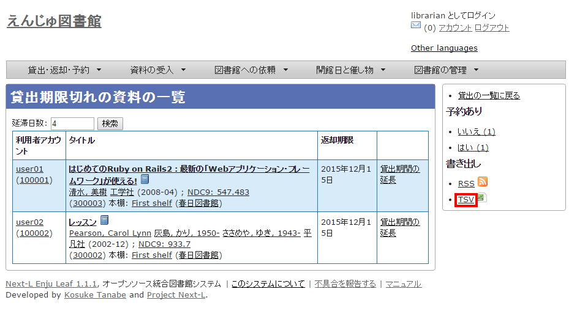

6-5 相互貸借をする {#section6-5}
---------------------------------

Enjuでは、NACSIS-ILL、ゆにかねっとの利用を検討しています。


