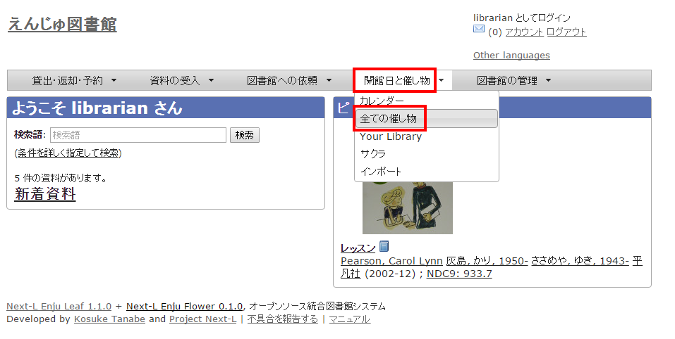
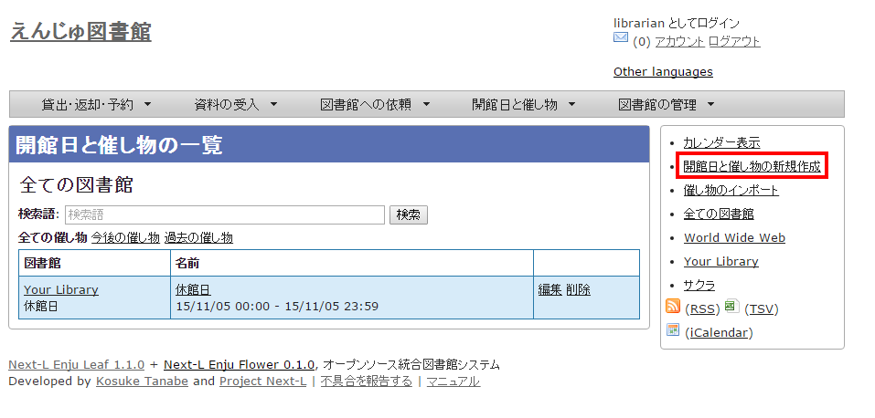
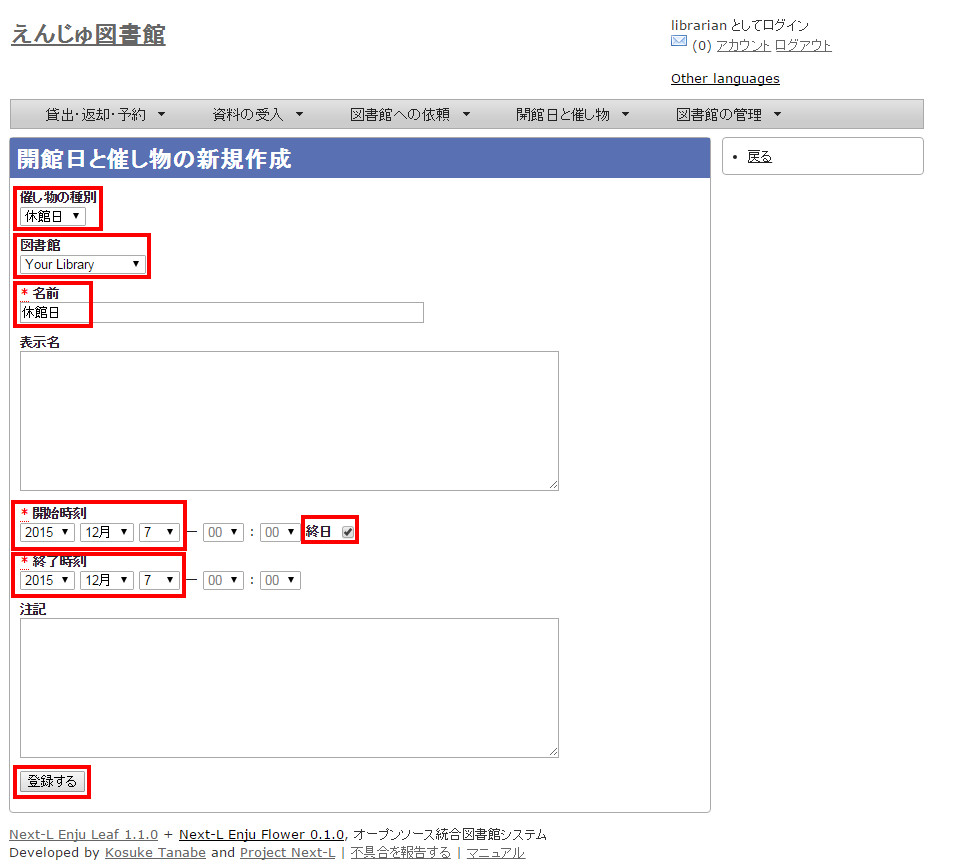
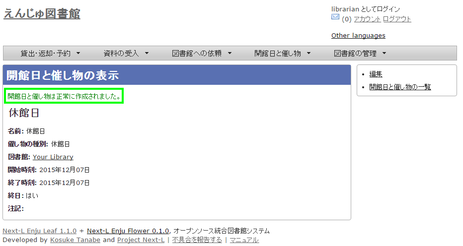
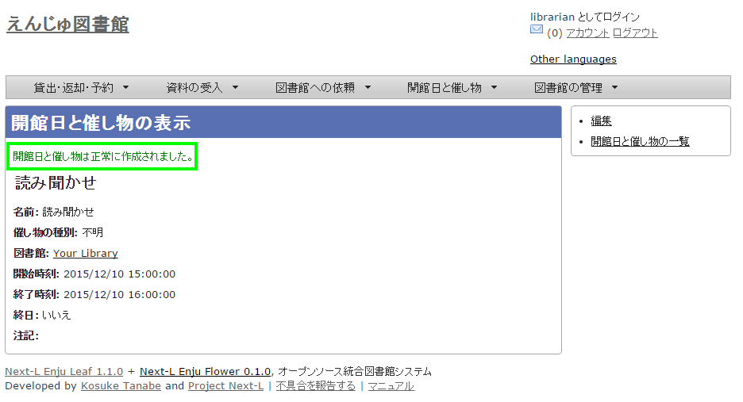
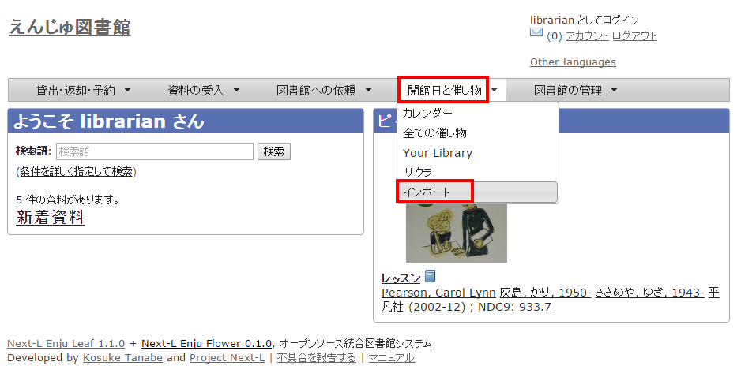
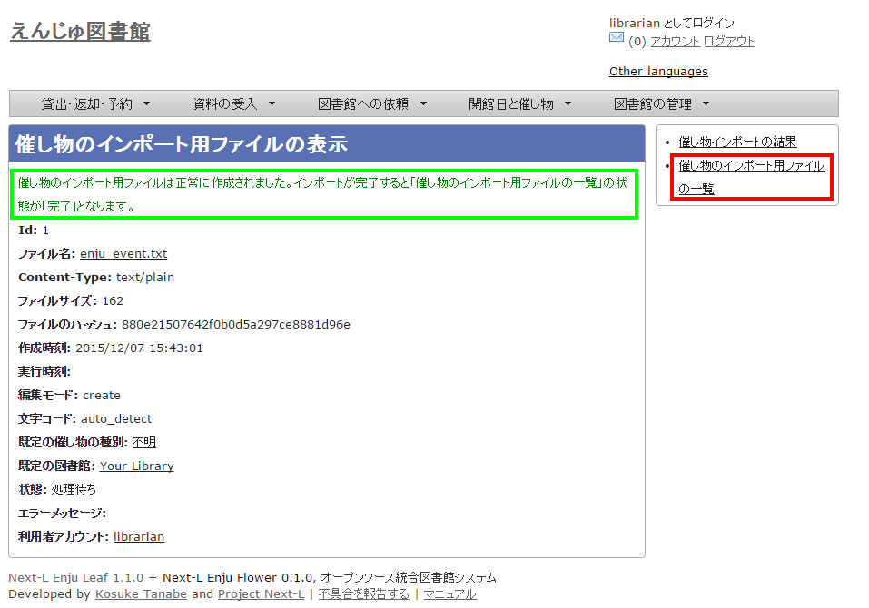

* Contents
{:toc}

第7章 休館日と催し物を登録する {#section7}
==========================================

Enjuでは、休館日の登録に関して、次のような機能があります。

* 休館日を登録する
  図書館の休館日を登録します。

催し物（お知らせ）の登録には、次のような機能があります。

* 催し物（お知らせ）を登録する
* カレンダーを表示する

{::comment}7-1  enju_operation/holiday.md {:/comment}
{::comment}7-2  enju_operation/event.md {:/comment}
{::comment}7-3  enju_operation/calendar.md {:/comment}

7-1 休館日を登録する {#section7-1}
----------------------------------

Enjuでは、図書館の休館日を登録することができます。

#### 1. ［開館日と催し物］メニューから［全ての催し物］を選択します。  

   

【Memo】他の行き方：［図書館の管理］メニューから［システムの設定］を選択し、[開館日と催し物]のリンクをクリックでも可。

   
#### 2. 右メニューの［開催日と催し物の新規作成］をクリックします。  

#### 3. 催し物の種別で「休館日」を選択し、開始時刻で休館日の年・月・日を選択、名前に「休館日」と入力し、［終日］にチェックを入れて［登録する］ボタンをクリックします。  

#### 4. 「開館日と催し物は正常に作成されました。」のメッセージが表示され、休館日が登録されます。  

7-2 催し物を登録する {#section7-2}
----------------------------------

Enjuでは、図書館で行われるさまざまな催し物を登録し、カレンダーに表示できます。

### 7-2-1 手動で催し物を登録する {#section7-2-1}

#### 1. ［開館日と催し物］メニューから［全ての催し物］を選択します。  

【Memo】他の行き方：［図書館の管理］メニューから［システムの設定］を選択し、[開館日と催し物]のリンクをクリックでも可。

#### 2. 右メニューの［開催日と催し物の新規作成］をクリックします。  

#### 3. 催し物の種別で「不明」を選択し、名前や開始時刻、終了時刻などを設定して、［登録する］ボタンをクリックします。  

#### 4. 「開館日と催し物は正常に作成されました。」のメッセージが表示され、休館日が登録されます。  

【Memo】催し物の種別を追加する方法は初期設定マニュアル「<a href="enju_setup_3.html#section3-8">3-8 催し物の種類を設定する</a>」をご覧ください。

### 7-2-2 催し物のデータをインポートする {#section7-2-2}

既存のデータファイルを指定して読み込む「インポート」を行うと，一度に複数のデータを登録することができます。インポートするには，あらかじめデータファイルをTSV形式で作成しておきます。

#### 1. ［開館日と催し物］メニューから［インポート］を選択します。  

#### 2. ［ファイルを選択］ボタンをクリックしてインポートしたいファイルを選択します。  

#### 3. [編集モード]、[文字コード]、[既定の利用者グループ]、[既定の図書館]を選択して［インポートを開始］ボタンをクリックします。

【Memo】［編集］モードで［更新］を選択すると、TSVファイルで催し物情報をまとめて更新できます。また、［削除］を選択すると、TSVファイルで催し物情報をまとめて削除できます。この場合は、TSVファイルに必要なのは、削除したい催し物のID（<code>id</code>）のみです。

【Memo】[文字コード]は基本的には自動判別でよいですが、うまくいかない場合は、文字コードを指定するようにしてください。

【Memo】[既定の図書館]は、TSVファイルに[図書館]（library列）の値がない場合やTSVファイルで当該値に無効な値を指定していた場合に登録される値となります。TSVファイルに有効な値が指定されていた場合はTSVファイルを優先します。プルダウンメニューのデフォルト値は、現在ログイン中のユーザの図書館です。 

#### 4. 「催し物のインポート用ファイルは正常に作成されました。」のメッセージが表示され、催し物のデータがインポート準備が整います。右の[催し物のインポート用ファイルの一覧] をクリックします。  

#### 5. 今までのインポート結果の一覧が表示されます。[状態]を見ると処理結果がわかります。インポートが完了したものは[完了]と表示されます。[処理待ち]のものは現在、実行中です。インポート完了時にはEnjuのメッセージ機能にてお知らせします（＊＊＊というメッセージが送られてきます）。注）Next-L Enju Leaf 1.1.0.rc12以前のバージョンの場合は毎時0分にインポート処理が開始します。 

【Memo】この画面は[図書館の管理]メニュー→[インポート]→[開催日と催し物]とすればいつでも閲覧できます。

  <h4 class="alert-heading">【Column】TSV形式のデータファイルの作り方</h4>
  
TSV形式のデータファイル（TSVファイル）とは、項目をタブで区切ったテキストファイルです。Enjuで利用するTSVファイルでは、1行目にそれぞれの項目に関わるフィールド名を指定します。フィールド名および値は原則として &ldquo; &ldquo; で囲みます。
フィールド名とその意味については次の通りです。

  <table class="table table-bordered table-condensed table-striped">
    <caption>開館日や催し物などの情報に関わる項目</caption>
    <thead>
      <tr>
        <th>必須/任意</th>
        <th>フィールド名</th>
        <th>データ形式</th>
        <th>内容</th>
        <th>未入力の場合（確認中）</th>
      </tr>
    </thead>
    <tbody>
      <tr>
        <td>任意</td>
        <td>id</td>
        <td>int</td>
        <td>ID(新規作成のときは無視される、更新・削除では必須)</td>
        <td>自動設定</td>
      </tr>
      <tr>
        <td>必須</td>
        <td>name</td>
        <td>utf8</td>
        <td>名前（イベントの名称）</td>
        <td>インポートが「失敗」になる</td>
      </tr>
      <tr>
        <td>任意</td>
        <td>display_name</td>
        <td>utf8</td>
        <td>イベントの表示名</td>
        <td>nameに入力したものが使用される</td>
      </tr>
      <tr>
        <td>任意</td>
        <td>event_category</td>
        <td>ascii</td>
        <td>催し物の種別（休館日はclosed）</td>
        <td>インポート時に「既定の催し物の種別」として指定した種別</td>
      </tr>
      <tr>
        <td>任意</td>
        <td>library</td>
        <td>ascii</td>
        <td>図書館</td>
        <td>インポート時に「既定の図書館」として指定した図書館</td>
      </tr>
      <tr>
        <td>必須</td>
        <td>start_at</td>
        <td>ISO8601</td>
        <td>開始時刻（例：2014-06-24 15:00:00 +0900 もしくは 2014-06-24）、all_dayがTRUEの場合は時刻が無視される。</td>
        <td>インポートが「失敗」になる</td>
      </tr>
      <tr>
         <td>必須</td>
         <td>end_at</td>
         <td>ISO8601</td>
         <td>終了時刻（例：2014-06-24 15:00:00 +0900 もしくは 2014-06-24）、all_dayがTRUEの場合時刻は無視される。</td>
         <td>インポートが「失敗」になる</td></tr>
      <tr>
         <td>任意</td>
         <td>all_day</td>
         <td>真偽</td>
         <td>TRUE or FALSE 終日かどうか</td>
         <td>FALSE</td>
      </tr>
      <tr>
         <td>任意</td>
         <td>note</td>
         <td>utf8</td>
         <td>注記</td>
         <td>未設定</td>
      </tr>
      <tr>
         <td>任意</td>
         <td>dummy</td>
         <td>utf8</td>
         <td>ダミー行（なにかを書いていると無視する行）</td>
         <td>(読み込む行だと判定される）</td>
      </tr>
    </tbody>
  </table>
  
  <table class="table table-bordered table-condensed table-striped">
    <caption>＊設定例</caption>
    <tbody>
      <tr>
        <td>"name"      </td>
        <td>"event_category"</td>
        <td>"library"</td>
        <td>"start_at"</td>
        <td>"end_at"</td>
        <td>"all_day"</td>
        <td>"note"</td>
        <td>"dummy"</td></tr>
      <tr>
        <td>"名前（イベントの名称）"</td>
        <td>"催し物の種別"</td> 
        <td>"図書館"</td>
        <td>"開始時刻"</td>
        <td>"終了時刻"</td>
        <td>"終日"</td>
        <td>"注記"</td>
        <td>この行はダミー行</td></tr>
      <tr>
        <td>必須</td>
        <td>任意</td>
        <td>任意</td>
        <td>必須</td>
        <td>必須</td>
        <td>任意</td>
        <td>任意</td>
        <td>任意</td></tr>
      <tr>
        <td>"おはなし会"  </td>
        <td>"story_telling"     </td>
        <td>"kiri"</td>
        <td>"2009-04-05 15:00:00 +0900"</td>
        <td>"2009-04-05 16:00:00 +0900"</td>
        <td>FALSE</td>
        <td>短めのお話会です</td>
        <td>　</td></tr>
      <tr>
        <td>"蔵書点検"  </td>
        <td></td>
        <td>"tachibana"</td>
        <td>"2009-04-01"</td>
        <td>"2009-04-02"</td>
        <td>  </td>
        <td>  </td>
        <td>　</td></tr>
      <tr>
        <td>"休館日"    </td>
        <td>"closed"         </td>
        <td>"tachibana"</td>
        <td>"2011-04-01"</td>
        <td>"2011-04-03"</td>
        <td>  </td>
        <td>蔵書点検のため長めです</td>
        <td>　</td></tr>
    </tbody>
  </table>

7-3 カレンダーを利用する {#section7-3}
--------------------------------------

開館日や催し物などの情報を、カレンダーとして表示することができます。

#### 1. ［開館日と催し物］メニューから［カレンダー］を選択します。  

#### 2. カレンダーが表示されます。  

   

【Memo】カレンダーの日付部分をクリックすると、「開催日と催し物の新規作成」の画面が開き、開館日や催し物を新規で追加したり編集したりできます。


