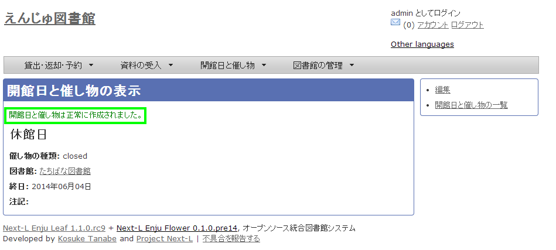
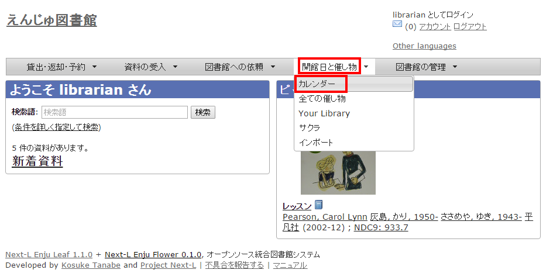
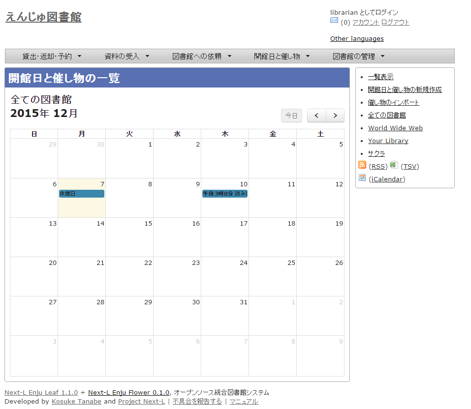

第7章 休館日と催し物を登録する
==============================

Enjuでは、休館日の登録に関して、次のような機能があります。

* 休館日を登録する
  図書館の休館日を登録します。

催し物（お知らせ）の登録には、次のような機能があります。

* 催し物（お知らせ）を登録する
* カレンダーを表示する

{::comment}7-1  enju_operation/holiday.md {:/comment}
{::comment}7-2  enju_operation/event.md {:/comment}
{::comment}7-3  enju_operation/calendar.md {:/comment}

<a name="7-1" />

7-1 休館日を登録する
--------------------

Enjuでは、図書館の休館日を登録することができます。

1. ［開館日と催し物］メニューから［全ての催し物］を選択します。  
   
   
   
【Memo】他の行き方：［図書館の管理］メニューから［システムの設定］を選択し、[開館日と催し物]のリンクをクリックでも可。
   

   
2. 右メニューの［開催日と催し物の新規作成］をクリックします。  
   
3. 催し物の種類で「closed」を選択し、開始時刻で休館日の年・月・日を選択、名前に「休館日」と入力し、［終日］にチェックを入れて［登録する］ボタンをクリックします。  
   
4. 「開館日と催し物は正常に作成されました。」のメッセージが表示され、休館日が登録されます。  
   

<a name="7-2" />

7-2 催し物を登録する
--------------------

Enjuでは、図書館で行われるさまざまな催し物を登録し、カレンダーに表示できます。

<a name="7-2-1" />

### 7-2-1 手動で催し物を登録する

1. ［開館日と催し物］メニューから［全ての催し物］を選択します。  
   

   
【Memo】他の行き方：［図書館の管理］メニューから［システムの設定］を選択し、[開館日と催し物]のリンクをクリックでも可。
   

2. 右メニューの［開催日と催し物の新規作成］をクリックします。  
   
3. 催し物の種類で「unknown」を選択し、名前や開始時刻、終了時刻などを設定して、［登録する］ボタンをクリックします。  
   
4. 「開館日と催し物は正常に作成されました。」のメッセージが表示され、休館日が登録されます。  
   

<a name="7-2-2" />

### 7-2-2 催し物のデータをインポートする

既存のデータファイルを指定して読み込む「インポート」を行うと，一度に複数のデータを登録することができます。インポートするには，あらかじめデータファイルをTSV形式で作成しておきます。

#### 1. ［開館日と催し物］メニューから［インポート］を選択します。  

#### 2. ［ファイルを選択］ボタンをクリックしてインポートしたいファイルを選択します。  

#### 3. 編集モードの[作成]を選択し、［登録する］ボタンをクリックします。

#### 4. 「催し物のインポート用ファイルは正常に作成されました。」のメッセージが表示され、催し物のデータがインポート準備が整います。右の[催し物のインポート用ファイルの一覧] をクリックします。  

#### 5. 今までのインポート結果の一覧が表示されます。[状態]を見ると処理結果がわかります。インポートが完了したものは[完了]と表示されます。[処理待ち]のものは毎時0分にインポート処理が開始します。

【Memo】この画面は[図書館の管理]メニュー→[インポート]→[開催日と催し物]とすればいつでも閲覧できます。

  <h4 class="alert-heading">【Column】TSV形式のデータファイルの作り方</h4>
  
TSV形式のデータファイル（TSVファイル）とは、項目をタブで区切ったテキストファイルです。Enjuで利用するTSVファイルでは、1行目にそれぞれの項目に関わるフィールド名を指定します。フィールド名および値は原則として &ldquo; &ldquo; で囲みます。
フィールド名とその意味については次の通りです。

  <table class="table table-bordered table-condensed table-striped">
    <caption>開館日や催し物などの情報に関わる項目</caption>
    <thead>
      <tr>
        <th>必須/任意</th>
        <th>フィールド名</th>
        <th>データ形式</th>
        <th>内容</th>
        <th>未入力の場合（確認中）</th>
      </tr>
    </thead>
    <tbody>
      <tr>
        <td>任意</td>
        <td>id</td>
        <td>int</td>
        <td>ID(新規作成のときは無視される、更新・削除では必須)</td>
        <td>自動設定</td>
      </tr>
      <tr>
        <td>必須</td>
        <td>name</td>
        <td>utf8</td>
        <td>名前（イベントの名称）</td>
        <td>インポートが「失敗」になる</td>
      </tr>
      <tr>
        <td>任意</td>
        <td>category</td>
        <td>ascii</td>
        <td>催し物の種類（閉館日はclosed）</td>
        <td>unknown</td>
      </tr>
      <tr>
        <td>任意</td>
        <td>library</td>
        <td>ascii</td>
        <td>図書館</td>
        <td>Your library ※</td>
      </tr>
      <tr>
        <td>必須</td>
        <td>start_at</td>
        <td>ISO8601</td>
        <td>開始時刻（例：2014-06-24 15:00:00 +0900 もしくは 2014-06-24）、all_dayがTRUEの場合は時刻が無視される。FALSEの場合に時刻がなければ「失敗」になる</td>
        <td>インポートが「失敗」になる</td>
      </tr>
      <tr>
         <td>必須</td>
         <td>end_at</td>
         <td>ISO8601</td>
         <td>終了時刻（例：2014-06-24 15:00:00 +0900 もしくは 2014-06-24）、all_dayがTRUEの場合時刻は無視される。FALSEの場合、時刻がなければ「失敗」になる。</td>
         <td>インポートが「失敗」になる</td></tr>
      <tr>
         <td>任意</td>
         <td>all_day</td>
         <td>真偽</td>
         <td>TRUE or FALSE 終日かどうか</td>
         <td>TRUE</td>
      </tr>
      <tr>
         <td>任意</td>
         <td>note</td>
         <td>utf8</td>
         <td>注記</td>
         <td>未設定</td>
      </tr>
      <tr>
         <td>任意</td>
         <td>dummy</td>
         <td>utf8</td>
         <td>ダミー行（なにかを書いていると無視する行）</td>
         <td>(読み込む行だと判定される）</td>
      </tr>
    </tbody>
  </table>
  
  <table class="table table-bordered table-condensed table-striped">
    <caption>＊設定例</caption>
    <tbody>
      <tr>
        <td>"name"      </td>
        <td>"category"</td>
        <td>"library"</td>
        <td>"start_at"</td>
        <td>"end_at"</td>
        <td>"all_ay"</td>
        <td>"note"</td>
        <td>"dummy"</td></tr>
      <tr>
        <td>"名前（イベントの名称）"</td>
        <td>"催し物の種類"</td> 
        <td>"図書館"</td>
        <td>"開始時刻"</td>
        <td>"終了時刻"</td>
        <td>"終日"</td>
        <td>"注記"</td>
        <td>この行はダミー行</td></tr>
      <tr>
        <td>必須</td>
        <td>任意</td>
        <td>任意</td>
        <td>必須</td>
        <td>必須</td>
        <td>任意</td>
        <td>任意</td>
        <td>任意</td></tr>
      <tr>
        <td>"おはなし会"  </td>
        <td>"story_telling"     </td>
        <td>"kiri"</td>
        <td>"2009-04-05 15:00:00 +0900"</td>
        <td>"2009-04-05 16:00:00 +0900"</td>
        <td>FALSE</td>
        <td>短めのお話会です</td>
        <td>　</td></tr>
      <tr>
        <td>"蔵書点検"  </td>
        <td></td>
        <td>"tachibana"</td>
        <td>"2009-04-01"</td>
        <td>"2009-04-02"</td>
        <td>  </td>
        <td>  </td>
        <td>　</td></tr>
      <tr>
        <td>"休館日"    </td>
        <td>"closed"         </td>
        <td>"tachibana"</td>
        <td>"2011-04-01"</td>
        <td>"2011-04-03"</td>
        <td>  </td>
        <td>蔵書点検のため長めです</td>
        <td>　</td></tr>
    </tbody>
  </table>

※初期設定での場合です。図書館の設定で一番上にしたものとなりますので、ダミーデータを登録してみるなどして確認をおねがいします。

<a name="7-3" />

7-3 カレンダーを利用する
------------------------

開館日や催し物などの情報を、カレンダーとして表示することができます。

1. ［開館日と催し物］メニューから［カレンダー］を選択します。  
   
2. カレンダーが表示されます。  
   
   
   
【Memo】カレンダーの日付部分をクリックすると、「開催日と催し物の新規作成」の画面が開き、開館日や催し物を新規で追加したり編集したりできます。
   


