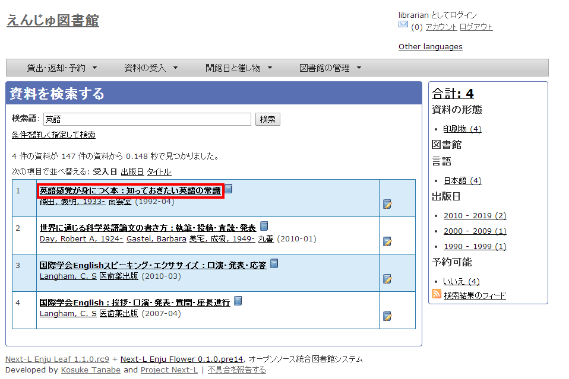
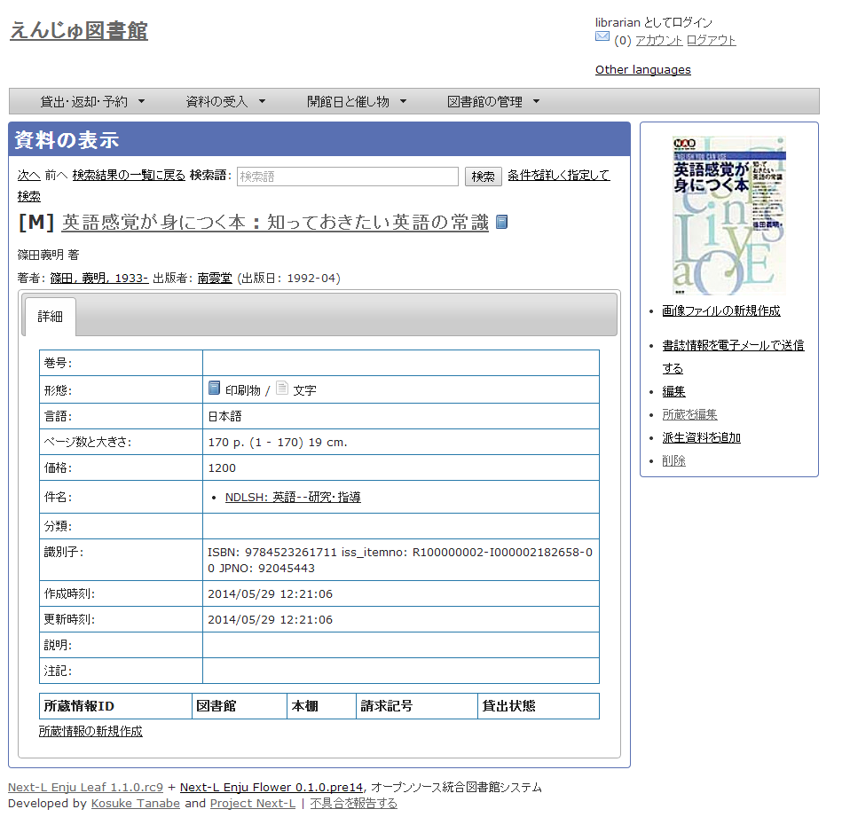
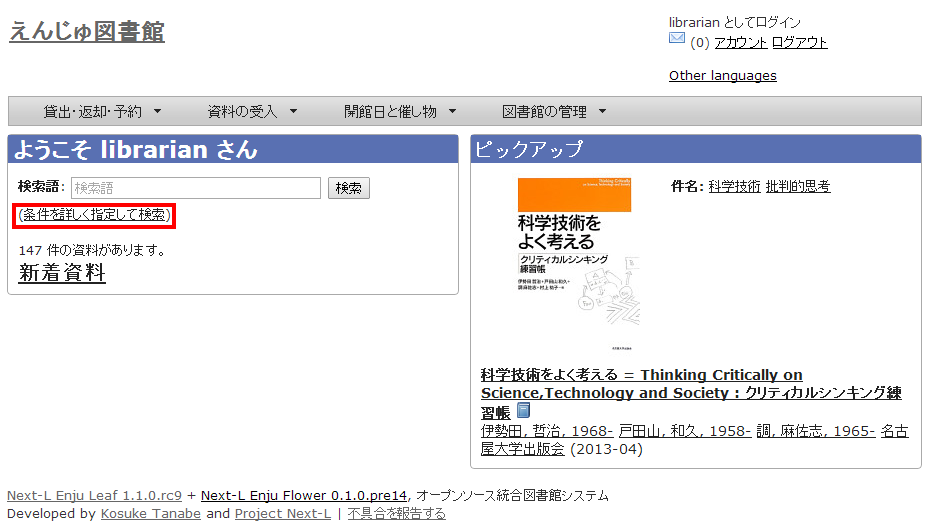
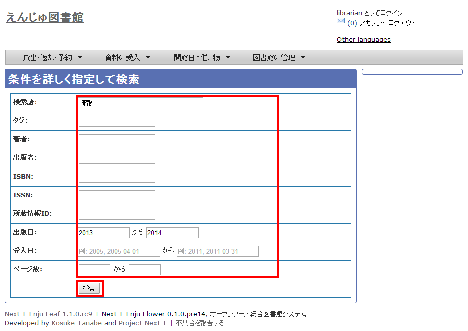

第9章 資料を検索する {#section9}
================================

Enjuを利用した資料の検索方法には、演算子やフィールド名を直接入力して検索する方法と、該当のテキストボックスに検索語入力する方法があります。

* キーワードで検索する
* 条件を詳しく指定して検索する
* 演算子やフィールド名を使って検索をする

{::comment}9-1  enju_operation/simple_search.md {:/comment}
{::comment}9-2  enju_operation/advanced_search.md {:/comment}
{::comment}9-3  enju_operation/search_query.md {:/comment}

9-1 キーワードで検索する {#section9-1}
---------------------------------------

資料を指定したキーワードで検索できます。

#### 1. トップページの検索語にキーワードを入力し、［検索］ボタンをクリックします。  

#### 2. キーワードに該当する資料が検索されます。詳細を知りたい資料のタイトルをクリックします。  

   

【Memo】スペースで区切りながらキーワードを入力すると、複数のキーワードに一致する資料を検索できます。

#### 3. 資料の詳細が表示されます。

9-2 条件を詳しく指定して検索する {#section9-2}
----------------------------------------------

条件を詳しく指定して、資料を検索することもできます。

#### 1. トップページの［（条件を詳しく指定して検索）］をクリックします。  

#### 2. 複数の条件を指定して［検索］ボタンをクリックします。  

9-3 フィールド名や演算子を使って検索する {#section9-3}
-------------------------------------------------------

「AND」や「OR」などの演算子と、フィールド名を組み合わせた検索式を作成すると、より高度な検索が行えます。


