本マニュアルは，オープンソース統合図書館システム　Enju　のシステム設定について，説明しています。管理者がEnjuを使うために，システム設定をするときにお読みください。

本マニュアルの作成にあたっては，(株)三菱総合研究所の全面的な支援をいただきました。心より感謝いたします。

* TOC
{:toc}

第1章 Enju概要
==============

Enjuとはどのようなシステムなのか，概要を説明します。

1-1 Enjuとは
------------

Enjuは，国会図書館，公共図書館，大学図書館，専門図書館，学校図書館などにおける図書館業務で必要な全ての機能を提供する統合図書館管理用ソフトウェアです。図書館で働く人々の総意として必要と思われる機能を全て実装するほか，図書館利用者が求めるWebサービス機能についても実装していきます。

1-2 Enju開発の経緯
------------------
実際の社会に影響を与えるシステムの出現を目指すためには，実験用システムが作られれば良いというものではなく，実際に導入可能なシステムを考える必要があります。そのためには，実際の図書館業務で発生する様々な問題と解決法を，図書館員をはじめとして図書館に関わる様々な方々に提供いただき，細かなノウハウまで取り込んだ理想的な図書館システムを考えていくことが必要となります。

小規模な図書館では，「公共図書館」「大学図書館」「専門図書館」「学校図書館」といった館種による違いを意識することなく，共通して備えるべき機能を少し拡張するだけで，運用可能な図書館システムを開発することが可能であるとも考えられます。

しかし，図書館員の方々をはじめとして，大勢の図書館に関わる方々は，皆さんそれぞれに忙しく，長期間継続して意見やノウハウの提供をいただくことは簡単なことではありません。ましてや，新しいアイディアを考えていただくという負担を過度におかけすることは，とてもできることではありません。

そこで，仕様の策定と並行して小規模図書館であれば導入可能な，統合図書館システムをプロトタイプ的に開発し，これを使っていただくことで，アイディアを出していただくことといたしました。そのために作成された統合図書館システムのプロトタイプが統合図書館システムNext-L Enjuです。

第2章 Enjuを利用する
====================

Enjuの利用を始めるには，次の作業をします。

* ユーザーアカウントの作成
* ログイン／ログアウト
* ユーザーアカウントの編集

Enjuは，利用者同士のコミュニケーション機能も搭載されています。

* メッセージの送信
* メッセージのログの一覧表示・印刷

2-1 ユーザーアカウントの種類を知る
----------------------------------

### ■アカウント（ユーザー）の種類

Enjuを利用するには，アカウントを取得し，ログインします。アカウント（ユーザー）には次の3種類があります。

* Administrator（管理者）
* Librarian（図書館員）
* User（図書館利用者）

### ■Administrator（管理者）の権限で利用できる機能

Administrator（管理者）の権限を持つアカウントでログインすると，Enjuで次の機能を利用することができます。

* 図書館利用者としてのすべての機能
* 図書館利用者の登録
* 資料の受入
* 資料の貸出／返却／予約
* 催し物（お知らせ）の登録
* 開館日（休館日）の登録
* レファレンスの処理
* 統計機能
* 印刷その他の機能
* アカウントの権限の変更

### ■アカウントを編集する

アカウントの権限以外の項目の編集は，Librarian（図書館員）でも行うことができます。操作の方法については，「[運用マニュアル　3-3　利用者のアカウント情報を変更する](enju_operation.html)」を参照してください。

2-2 ログイン／ログアウトする
----------------------------

Enjuを利用するには，まずシステムにログインします。インストール直後の場合には，Enjuのユーザとしては 「 admin 」 だけが登録されており，その初期パスワードは「 adminpassword 」です。

### ■ログインする

1. Enjuにアクセスし，［ログイン］をクリックします。  
   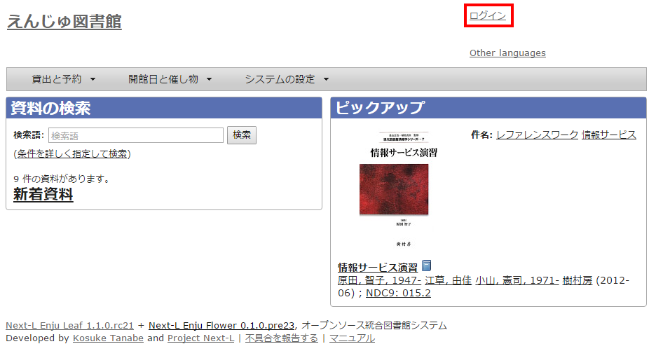

2. ユーザ名とパスワードを入力し［ログイン］をクリックします。  
   

   

   【Memo】ブラウザを閉じてもログイン状態を保持したい場合は，［ウィンドウを閉じてもログインしたままにする］をオンにします。
   

3. 自分のアカウントでログインされていることを確認します。  
   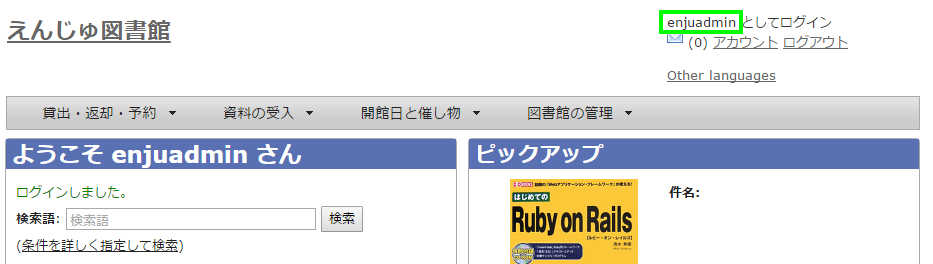

### ■パスワードを変更する

1. ［アカウント］をクリックします。  
   
2. ［編集］をクリックします。  
   
3. ［現在のパスワード］と「パスワード」「パスワード(確認)」を入力します。パスワードは画面には表示されません。また「パスワード」と「パスワード(確認)」は同じものを入れてください。  
   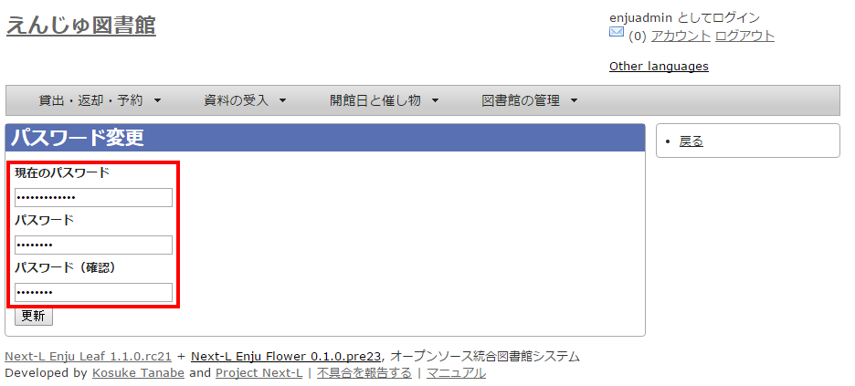
4. ［利用者の更新］ボタンを押します。  
   

### ■ログアウトする

1. ［ログアウト］をクリックします。
   

2. ログアウトされたこと（［ログイン］の表示に変わったこと）を画面で確認します。
   

   

   【Memo】時間の経過にともなって自動ログアウトする機能は用意されていません。Administrator（管理者）は利用者の個人情報などを閲覧できる権限を持っているので，パソコンを共有する時や離席時などには，必ずログアウトしてください。
   

2-3 メッセージをやり取りする
----------------------------

Enjuのメッセージ機能を利用して，利用者にメッセージを送信することができます。やり取りしたメッセージは，ログとして一覧表示したり，印刷したりすることもできます。

### ■メッセージを送信する

1. ［図書館の管理］メニューから［利用者の管理］を選択します。
   

2. メッセージを送りたいユーザのユーザ名をクリックします。
   

   

   【Memo】［検索語］にユーザ名や利用者番号を入力して，ユーザを検索することもできます。
   

3. 右メニューの［メッセージを送信する］をクリックします。
   

4. 件名，本文を入力し，［メッセージを送信する］ボタンをクリックします。
   

### ■受信したメッセージを読む

1. ［アカウント］の左にあるメールアイコンをクリックします。
   

   

   【Memo】未読メッセージがある場合は，メールアイコンの右に未読のメッセージ数が表示されるので，それをクリックすることもできます。
   

2. 読みたいメッセージの件名をクリックします。
   

3. メッセージの内容が表示されます。返信したい場合は，右メニューの［メッセージに返信する］をクリックします。
   

### ■メッセージを削除する
1. ［アカウント］の左にあるメールアイコンをクリックします。
   
2. 削除したいメッセージのチェックボックスにチェックを入れ，［メッセージを削除する］ボタンをクリックします。
   

   

   【Memo】削除できるのは自分宛のメッセージだけです。削除可能なメッセージにのみ，チェックボックスが表示されます。
   

第3章　図書館のシステム設定を行う
=================================

Enjuの利用を始めるにあたり，図書館のシステム設定として，次のような設定作業を行います。入力にはひらがな，カタカナ，漢字，英数字などの文字が利用できます。ただし，半角カナは使用できません。

* 図書館全体の設定
* 個々の図書館の設定
* 本棚
* 利用者情報・貸出区分とその関係
* 資料の種類と貸出区分との関係
* 催し物の種類
* 書店
* 検索エンジン
* バーコード

3-1 図書館全体の設定をする
--------------------------

### ■設定項目

* 名前：図書館の全体名称を入力します。
* 表示名：画面に表示する名称を入力します。
* メール：図書館のメールアドレスを入力します。
* Url：図書館のUrlを入力します。
* ログイン画面でのメッセージ：表示したいメッセージを入力します。
* 外部サイトのUrlをブックマークできるようにする：クリックでon/offを切り替えます。
* LANとして扱うネットワーク：ネットワークの名称を入力します。
* 管理用として扱うネットワーク：ネットワークの名称を入力します。
* DSBLを使用する：クリックでon/offを切り替えます。
* DSBLの一覧：DSBLを入力します。
* 注記：注意事項や特記事項などを入力します。
* 国と地域：▼をクリックし，リストから選択します。

### ■設定方法

1. ［図書館の管理］メニューから［システムの設定］を選択します。  
   
2. ［図書館全体の設定］をクリックします。  
   
3. ［編集］をクリックします。  
   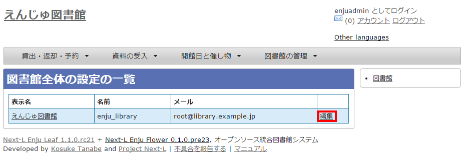

   

   【Memo】インストール直後は，仮の図書館名が入っています。［編集］をクリックして，情報を変更します。
   

4. 設定項目に必要事項を入力します。
   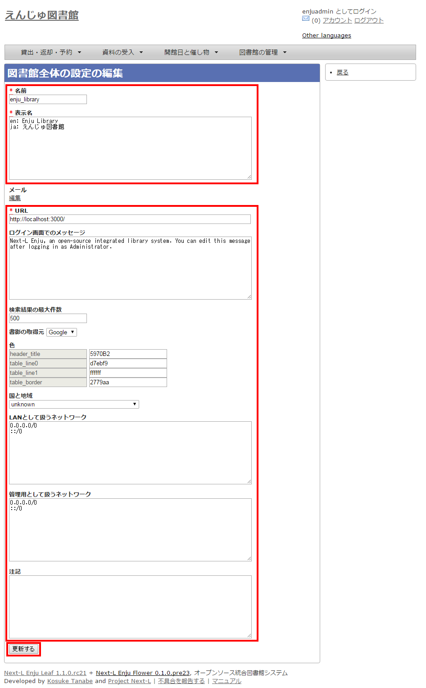  

   

   【Memo】［表示名］の前には，日本語名ならば「ja:」，英語名ならば「en:」というように，言語がわかるように先頭に文字を付記します。
   

5. ［図書館全体の設定を更新］ボタンをクリックして，設定内容を更新します。  
   
6. 設定が登録され，［図書館全体の設定の表示］画面が表示されます。  
   

   

   【Memo】さらに編集を加える場合は，右メニューの［編集］をクリックします。
   

3-2 個々の図書館を設定する
--------------------------

### ■設定項目
* 名前：図書館の名称を入力します。
* 短縮表示名：短縮した名称を入力します。
* 表示名：画面に表示する名称を入力します。
* 国と地域：▼をクリックし，リストから選択します。
* 郵便番号：図書館の所在地の郵便番号を入力します。
* 都道府県：図書館の所在地の都道府県名を入力します。
* 市町村：図書館の所在地の市町村名を入力します。
* 番地：図書館の所在地の番地を入力します。
* 電話番号１：図書館の電話番号を入力します。
* 電話番号２：図書館の電話番号を入力します。
* ファックス番号：図書館のファックス番号を入力します。
* 請求記号の列数：請求記号で利用する列数を入力します
* 請求番号の区切り文字：請求記号に利用する区切り文字を入力します。
* 開館時間：図書館の開館時間を選択します。
* 注記：注意事項や特記事項などを入力します。

### ■設定方法
1. ［図書館の管理］メニューから［システムの設定］を選択します。  
     
2. ［図書館］をクリックします。  
     
3. ［図書館の新規作成］をクリックします。  
   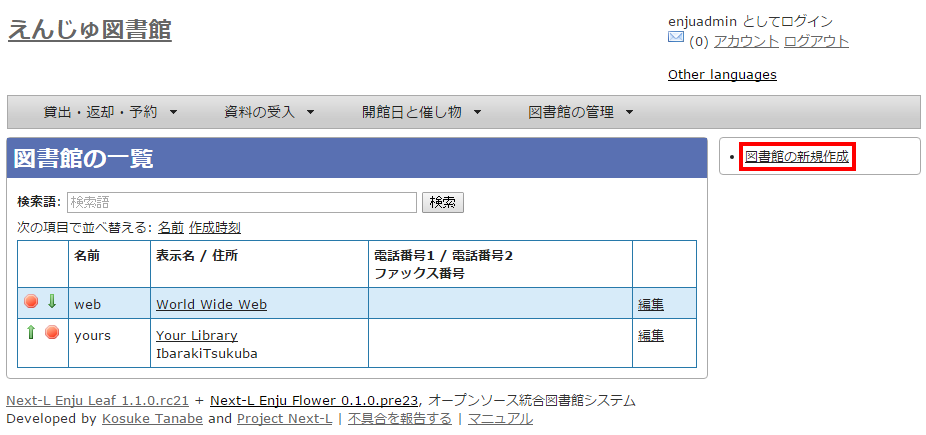

   

   【Memo】入力済みの本棚の設定内容を変更する場合は，［<i class="icon-pencil"> </i> 編集］をクリックします。
   

4. 設定項目に必要事項を入力します。  
   

   

   【Memo】「＊」のマークが付いた項目は入力必須項目です。
   

5. ［図書館を作成］ボタンをクリックして，設定内容を登録します。  
   

3-3 本棚を設定する
------------------

### ■設定項目

* 名前：本棚の名称を入力します。
* 表示名：画面に表示する名称を入力します。
* 注記：注意事項や特記事項などを入力します。
* 図書館：▼をクリックし，リストから選択します。

ここで表示されるリストは，「[3-2 個々の図書館を設定する](#span3-2-)」で設定します。

### ■設定方法

1. ［図書館の管理］メニューから［システムの設定］を選択します。  
   
2. ［本棚］をクリックします。  
   
3. ［本棚の新規作成］をクリックします。  
   

   

   【Memo】入力済みの本棚の設定内容を変更する場合は，［編集］をクリックします。

4. 設定項目に必要事項を入力します。
5. ［本棚を作成］ボタンをクリックして，設定内容を登録します。  
   

   

   【Memo】「＊」のマークが付いた項目は入力必須項目です。
   

3-4 利用者グループを設定する
----------------------------

### ■設定項目

* 名前：利用者グループ名を入力します。
  * 「[3-6 利用者グループと貸出区分の関係を設定する](#span3-6-)」で，利用者グループごとに貸出の設定などを設定することができます。  
  * 貸出については「[3-5 貸出区分を設定する](#span3-5-)」「[5-2 貸出状態を作成する](#span5-2-)」などで設定します。
* 表示名：画面に表示する名称を入力します。
* 新規ユーザの有効日数：図書館カードの有効日数を数値で入力します。
* Number of day to notify due date：「何日後に返却日を通知するか」を数値で入力します。
* Number of day to notify overdue：「返却日を何日過ぎたら通知するか」を数値で入力します。
* Number of time to send overdue notification：「返却日を過ぎた通知を何回送るか」を数値で入力します。
* 注記：注意事項や特記事項などを入力します。

### ■設定方法

1. ［図書館の管理］メニューから［システムの設定］を選択します。  
   
2. ［利用者グループ］をクリックします。  
   
3. ［利用者グループの新規作成］をクリックします。  
   

   

   【Memo】入力済みの利用者グループの設定内容を変更する場合は，［編集］をクリックします。
   

4. 設定項目に必要事項を入力します。
5. ［利用者グループを作成］ボタンをクリックして，設定内容を登録します。  
   

3-5 貸出区分を設定する
----------------------

### ■設定項目

* 名前：貸出区分名を入力します。
* 表示名：画面に表示する名称を入力します。
* 注記：注意事項や特記事項などを入力します。

### ■設定方法

1. ［図書館の管理］メニューから［システムの設定］を選択します。  
   
2. ［貸出区分］をクリックします。  
   
3. 右メニューの［貸出区分の新規作成］をクリックします。  
     

   

   【Memo】入力済みの貸出区分の設定内容を変更する場合は［編集］を，削除する場合は［削除］をクリックします。一覧表示の表示順序を変更するには，表の1列目に表示されている↑または↓をクリックして行を入れ替えます。
   

4. 設定項目に必要事項を入力します。
5. ［貸出区分を作成］ボタンをクリックして，設定内容を登録します。  
   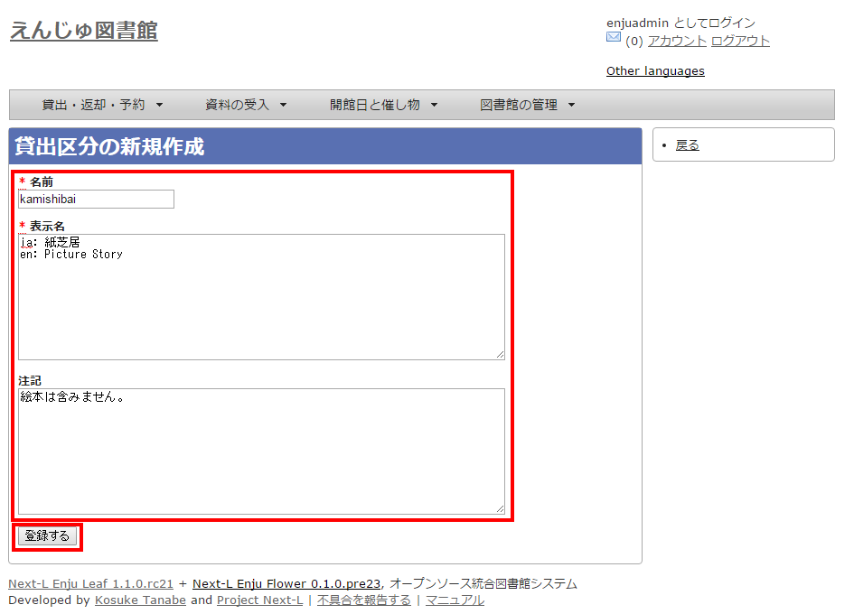

3-6 利用者グループと貸出区分の関係を設定する
--------------------------------------------

### ■設定項目

* 利用者グループ：▼をクリックし，リストから選択します。
ここで表示されるリストは，「[3-4 利用者グループを設定する](#span3-4-)」で設定します。
* 貸出区分：▼をクリックし，リストから選択します。
ここで表示されるリストは，「[3-5 貸出区分を設定する](#span3-5-)」で設定します。
* 貸出数の上限：貸出数を数値で設定します。
* 貸出期間：期間を数値で設定します。
* 貸出更新回数の上限：回数を数値で設定します。
* 予約冊数の上限：冊数を数値で設定します。
* 予約の期限切れまでの期間：期間を数値で設定します。
* 返却日を閉館日の前日にする：クリックしてon/offを切り替えます
* 注記：注意事項や特記事項などを入力します。

### ■設定方法

1. ［図書館の管理］メニューから［システムの設定］を選択します。  
   
2. ［利用者グループと貸出区分の関係］をクリックします。  
   
3. 右メニューの［利用者グループと貸出区分の関係の新規作成］をクリックします。  
   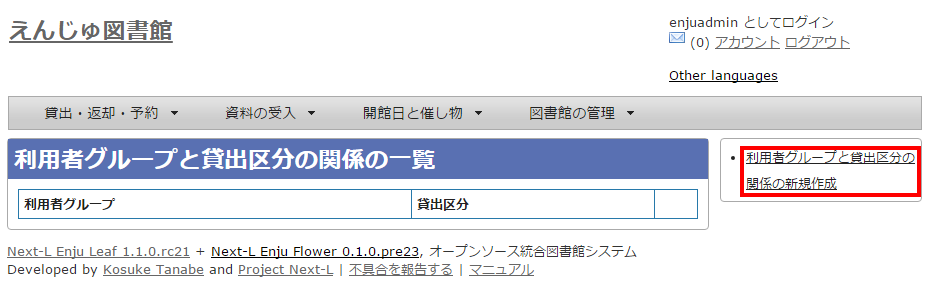

   

   【Memo】入力済みの設定内容を変更する場合は［編集］を，削除する場合は［削除］をクリックします。
   

4. 設定項目に必要事項を入力します。
5. ［利用者グループと貸出区分の関係を作成］ボタンをクリックして，設定内容を登録します。  
   

3-7 資料の種類と貸出区分の関係を設定する
----------------------------------------

### ■設定項目

* 資料の種類：▼をクリックし，リストから選択します。
ここで表示されるリストは，「[5-1 資料の形態を作成する](#span5-1-)」で設定します。
* 貸出区分：▼をクリックし，リストから選択します。
ここで表示されるリストは，「[3-5 貸出区分を設定する](#span3-5-)」で設定します。
* 注記：注意事項や特記事項などを入力します。

### ■設定方法

1. ［図書館の管理］メニューから［システムの設定］を選択します。  
   
2. ［資料の種類と貸出区分の関係］をクリックします。  
   
3. 右メニューの［資料の種類と貸出区分の関係の新規作成］をクリックします。  
   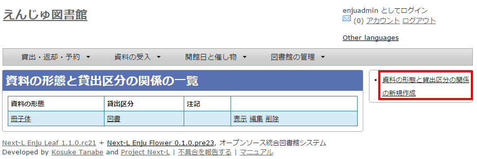

   

   【Memo】入力済みの設定内容を変更する場合は［編集］を，削除する場合は［削除］をクリックします。
   

4. 設定項目に必要事項を入力します。
5. ［資料の種類と貸出区分の関係を作成］ボタンをクリックして，設定内容を登録します。  
   

3-8 催し物の種類を設定する
--------------------------

### ■設定項目

* 名前：催し物名を入力します。
* 表示名：画面に表示する名称を入力します。
* 注記：注意事項や特記事項などを入力します。  
  ＊催し物については，既存のデータファイルを指定して読み込むインポート機能が利用できます。「[3-9 既存のデータから催し物情報をインポートする](#span3-9-)」を参照してください。

### ■設定方法

1. ［図書館の管理］メニューから［システムの設定］を選択します。  
   
2. ［催し物の種類］をクリックします。  
   
3. 右メニューの［催し物の種類の新規作成］をクリックします。  
     

   

   【Memo】入力済みの設定内容を変更する場合は［編集］を，削除する場合は［削除］をクリックします。  
   一覧表示の表示順序を変更するには，表の1列目に表示されている↑または↓をクリックして行を入れ替えます。
   

4. 設定項目に必要事項を入力します。
5. ［催し物の種類を作成］ボタンをクリックして，設定内容を登録します。  
   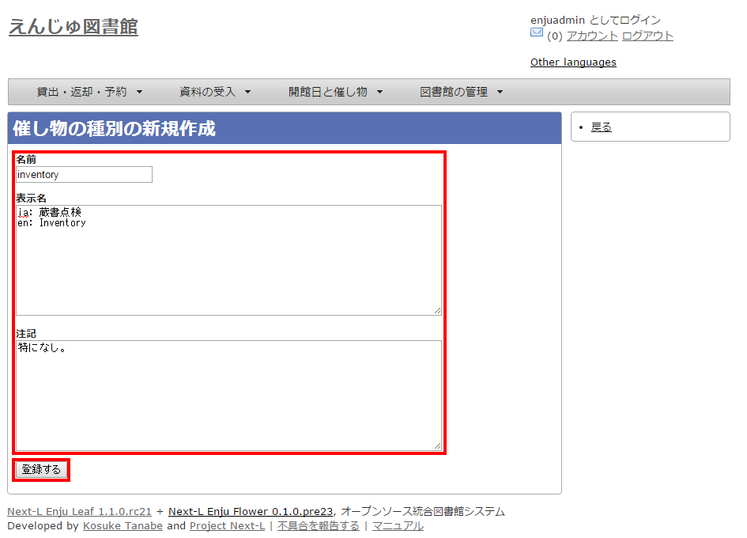

3-9 既存のデータから催し物情報をインポートする
----------------------------------------------

### ■設定項目

既存のデータファイルを指定して読み込む「インポート」を行うと，一度に複数のデータを登録することができます。インポートするには，あらかじめデータファイルをTSV形式で作成しておきます。

TSV形式とは，データの項目をタブで区切って記述したテキストファイルです。
  
TSV形式のファイルには，次のフィールドとそれに対応した項目を作成します。  

* name：イベント名
* category：カテゴリ
* library_shortname：図書館名短縮表示
* start_at：開始日。西暦で，年月日の間にハイフンを入力します。
* end_at：終了日。西暦で，年月日の間にハイフンを入力します。
* dummy ：ダミーデータを示しています。この行をインポートしない場合は，"1"と入力します。

<table border="2">
<caption>＊設定例</caption>
<tr><td>"name"      </td><td>"category"</td><td>"library_shortname"</td><td>"start_at"</td><td>"end_at"</td><td>"dummy"</td></tr>
<tr><td>"イベント名"</td><td>"カテゴリ（休館日の場合はclosed）"</td><td>"図書館名"</td><td>"開始日"</td><td>"終了日"</td><td>　</td></tr>
<tr><td>"hogehoge"  </td><td>"おはなし会"     </td><td>"kamata"</td><td>"2009-04-01"</td><td>"2009-04-03"</td><td>　</td></tr>
<tr><td>"hogehoge"  </td><td>　</td><td>"hachioji"</td><td>　</td><td>　</td><td>　</td></tr>
<tr><td>"休館日"    </td><td>"closed"         </td><td>"kamata"</td><td>"2011-04-01"</td><td>"2011-04-03"</td><td>　</td></tr>
</table>
１行目にはフィールド名，２行目には表示名を記述します。レコードは３行目以降に記述します。

### ■設定方法
1. ［図書館の管理］メニューから［システムの設定］を選択します。  
   
2. ［催し物ファイルのインポートの新規作成］をクリックします。  
   
3. ［参照］をクリックします。  
   
4. インポートしたいファイルを指定し，［開く］をクリックします。
5. ［催し物ファイルのインポートの新規作成］ボタンをクリックして，データをインポートします。  
   

3-10 書店を設定する
-------------------

### ■設定項目

* 名前：書店名を入力します。
* 郵便番号：書店の所在地の郵便番号を入力します。
* 住所：書店の所在地の住所を入力します。
* 電話番号：書店の電話番号を入力します。
* ファックス番号：書店のファックス番号を入力します。
* URL：書店のWebサイトのURLを入力します。
* 注記：注意事項や特記事項などを入力します。

### ■設定方法

1. ［図書館の管理］メニューから［システムの設定］を選択します。  
   
2. ［書店］をクリックします。  
   
3. 右メニューの［書店の新規作成］をクリックします。  
   

   

   【Memo】入力済みの設定内容を変更する場合は，表の最終列に表示されている［］を，削除する場合は［ ］をクリックします。
一覧表示の表示順序を変更するには，表の1列目に表示されている↑または↓をクリックして行を入れ替えます。
   

4. 設定項目に必要事項を入力します。
5. ［書店を作成］ボタンをクリックして，設定内容を登録します。  
   

3-11 メッセージテンプレートを設定する
-------------------------------------

### ■設定項目

* 状態：メッセージの内容を示す状態を入力します。
* 言語：▼をクリックし，リストから選択します。
* タイトル：メッセージを表示するときのタイトルを入力します。
* 本文：メッセージの本文を入力します。

  

  ＊メッセージの本文には資料名やユーザー名などの変数を組み込み，送信時に本文中の変数に値を代入して送信できます。
  

### ■設定方法

1. ［図書館の管理］メニューから［システムの設定］を選択します。  
   
2. ［メッセージテンプレート］をクリックします。  
   
3. 設定したい項目の［編集］をクリックします。  
     

   

   【Memo】一覧表示の表示順序を変更するには，表の1列目に表示されている↑または↓をクリックして行を入れ替えます。
   

4. 設定項目に必要事項を入力します。
5. ［メッセージテンプレートを更新］ボタンをクリックして，設定内容を更新します。  
     

3-12 検索エンジンを設定する
---------------------------

### ■設定項目

* 名前：検索エンジンの名称を入力します。
* URL：URLを入力します。（入力必須）
* ベースURL：ベースURLを入力します。
* HTTPメソッド：▼をクリックし，リストから選択します。
* クエリパラメータ：URLに追加するパラメータを入力します。
* 追加のパラメータ：URLに追加するパラメータを入力します。
* 注記：注意事項や特記事項などを入力します。

### ■設定方法

1. ［図書館の管理］メニューから［システムの設定］を選択します。  
   
2. ［書店］をクリックします。  
   
3. ［図書館の管理］メニューから［システムの設定］を選択します。
4. ［検索エンジン］をクリックします。
5. 右メニューの［検索エンジンの新規作成］をクリックします。
6. 設定項目に必要事項を入力します。
7. ［検索エンジンを作成］ボタンをクリックして，設定内容を登録します。

3-13 バーコードを設定する
-------------------------

### ■設定項目

* コードワード

### ■設定方法

1. ［図書館の管理］メニューから［システムの設定］を選択します。  
   
2. ［バーコード］をクリックします。  
   
3. 右メニューの［バーコードの新規作成］をクリックします。  
   

   

   【Memo】入力済みの設定内容を変更する場合は［編集］を，削除する場合は［削除］をクリックします。
   

4. 設定項目に必要事項を入力します。
5. ［バーコードを作成］ボタンをクリックして，バーコードを作成します。  
     

   

   【Memo】バーコードを印刷する操作手順については，別添の「[Enju運用マニュアル](enju_operation.html)」をご覧ください。
   

3-14 その他の機能
-----------------

Enjuでは，システムの設定は管理者権限を持つアカウントで設定します。システムの設定以外にも，個人情報に関わることなどは，管理者権限で行うように設定されています。

管理者権限では，次のような設定・閲覧機能を持っています。

### ■システムの設定以外でも管理者権限で設定・閲覧する機能

* 返却済み貸出履歴の一覧
* 図書館員のプロフィール変更
* 権限変更
* 操作履歴一覧の表示

第4章　件名のシステム設定を行う
===============================
Enjuの利用を始めるにあたり，件名のシステム設定として，次のような設定作業を行います。

* 件名
* 件名の種類
* 件名標目
* 分類
* 分類型

4-1 件名を設定する
------------------

### ■設定項目

* 件名の種類：▼をクリックして一覧から選びます。
ここで表示されるリストは，「[4-2 件名の種類を設定する](#span4-2-)」で設定します。
* 用語：件名に利用する用語を入力します。
* 注記：注意事項や特記事項などを入力します。

### ■設定方法

1. ［図書館の管理］メニューから［システムの設定］を選択します。  
   
2. ［件名］をクリックします。  
   
3. 右メニューの［件名の新規作成］をクリックします。  
   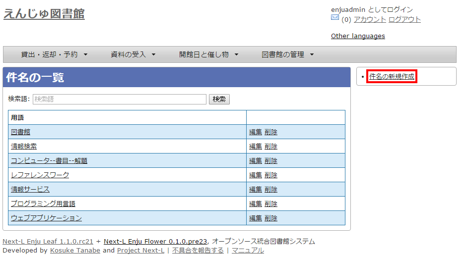  

   

   【Memo】入力済みの設定内容を変更する場合は，［編集］をクリックします。
   

4. 設定項目に必要事項を入力します。
5. ［件名を作成］ボタンをクリックして，設定内容を登録します。  
   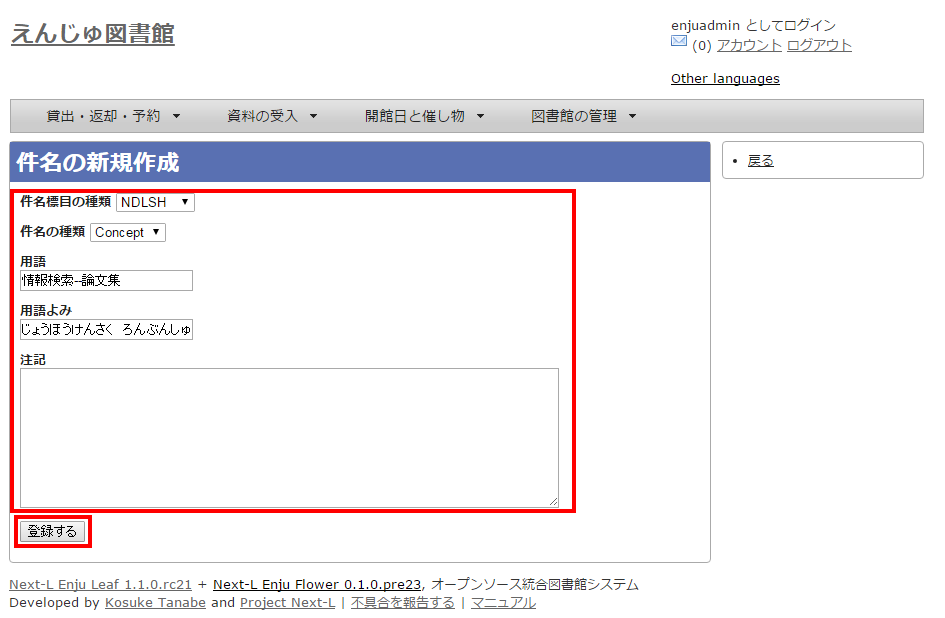  

4-2 件名の種類を設定する
------------------------

### ■設定項目

* 名前：件名の名称を入力します。
* 表示名：画面に表示する名称を入力します。
* 注記：注意事項や特記事項などを入力します。

### ■設定方法

1. ［図書館の管理］メニューから［システムの設定］を選択します。  
   
2. ［件名の種類］をクリックします。  
   
3. 右メニューの［件名の種類の新規作成］をクリックします。  
     

   

   【Memo】入力済みの設定内容を変更する場合は［編集］を，削除する場合は［削除］をクリックします。  
   一覧の表示順序を変更するには，表の1列目に表示されている↑または↓をクリックして行を入れ替えます。
   

4. 設定項目に必要事項を入力します。
5. ［件名の種類を作成］ボタンをクリックして，設定内容を登録します。  
   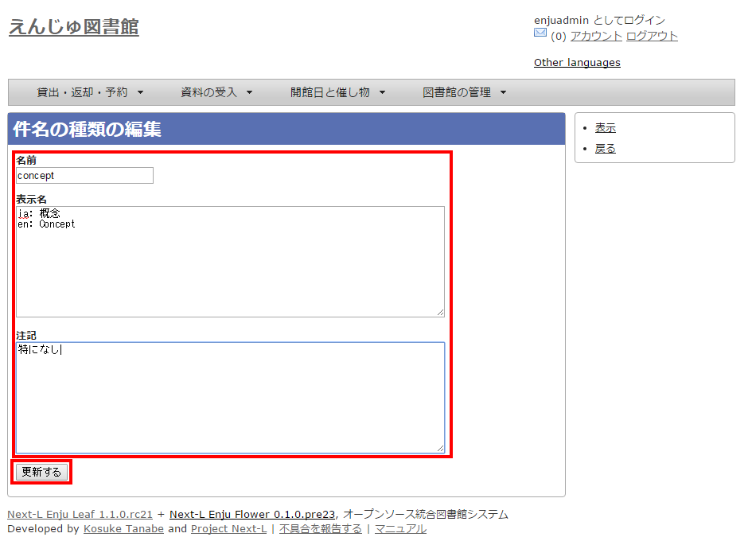  

4-3 件名標目を設定する
----------------------

### ■設定項目

* 名前：件名標目を入力します。
* 表示名：画面に表示する名称を入力します。
* 注記：注意事項や特記事項などを入力します。

### ■設定方法

1. ［図書館の管理］メニューから［システムの設定］を選択します。  
   
2. ［件名標目の種類］をクリックします。  
   
3. 右メニューの［件名標目の種類の新規作成］をクリックします。  
     

   

   【Memo】入力済みの設定内容を変更する場合は［編集］を，削除する場合は［削除］をクリックします。  
   一覧の表示順序を変更するには，表の1列目に表示されている↑または↓をクリックして行を入れ替えます。
   

4. 設定項目に必要事項を入力します。
5. ［件名標目の種類を作成］ボタンをクリックして，設定内容を登録します。  
     

4-4 分類を設定する
-------------------

### ■設定項目

* カテゴリー：カテゴリーを入力します。
* 注記：注意事項や特記事項などを入力します。
* 分類：▼をクリックし，リストから選択します。  
  ここで表示されるリストは，「[4-5 分類型を設定する](#span4-5-)」で設定します。

### ■設定方法

1. ［図書館の管理］メニューから［システムの設定］を選択します。  
   
2. ［分類］をクリックします。  
   
3. 右メニューの［分類の新規作成］をクリックします。  
     

   
【Memo】入力済みの設定内容を変更する場合は［編集］を，削除する場合は［削除］をクリックします。

4. 設定項目に必要事項を入力します。
5. ［分類を作成］ボタンをクリックして，設定内容を登録します。  
   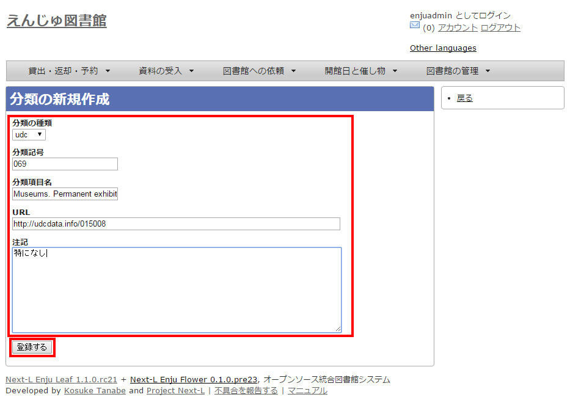  

4-5 分類型を設定する
--------------------

### ■設定項目

* 名前：分類型を入力します。
* 表示名：画面に表示する名称を入力します。
* 注記：注意事項や特記事項などを入力します。

### ■設定方法

1. ［図書館の管理］メニューから［システムの設定］を選択します。  
   
2. ［分類型］をクリックします。  
   
3. 右メニューの［分類型の新規作成］をクリックします。  
     

   
【Memo】入力済みの設定内容を変更する場合は［編集］を，削除する場合は［削除］をクリックします。  
   一覧の表示順序を変更するには，表の1列目に表示されている↑または↓をクリックして行を入れ替えます。

4. 設定項目に必要事項を入力します。
5. ［分類型を作成］ボタンをクリックして，設定内容を登録します。  
     

4-6 その他の機能
----------------

Enjuでは，その他，次の機能が利用できます。

### ■件名と分類の関係を設定する

* ［図書館の管理］メニューから［システムの設定］を選択します。
* ［件名と分類の関係］をクリックして，設定します。

第5章 各種形態や状態等に関するシステム設定を行う
================================================

Enjuの利用を始めるにあたり，形態・状態等に関するシステム設定として，次のような設定作業を行います。

* 資料の形態の作成
* 貸出状態の編集
* 言語の編集
* 利用制限の編集作成
* 発行頻度の編集作成
* 資料の関係の種類の作成

5-1 資料の形態を作成する
------------------------

### ■設定項目

* 名前：資料の形態を入力します。
* 表示名：画面に表示する名称を入力します。
* 注記：注意事項や特記事項などを入力します。

### ■設定方法
1. ［図書館の管理］メニューから［システムの設定］を選択します。  
   
2. ［資料の形態］をクリックします。  
   
3. 右メニューの［資料の形態の作成］をクリックします。
4. 設定項目に必要事項を入力します。
5. ［資料の形態の作成］ボタンをクリックして，設定内容を登録します。

5-2 貸出状態を編集作成する
--------------------------

### ■設定項目

* 名前：資料の形態を入力します。
* 表示名：画面に表示する名称を入力します。
* 注記：注意事項や特記事項などを入力します。

### ■設定方法

1. ［図書館の管理］メニューから［システムの設定］を選択します。  
   
2. ［貸出状態］をクリックします。  
   
3. 設定したい項目の［編集］をクリックします。  
     

   
【Memo】一覧の表示順序を変更するには，表の1列目に表示されている↑または↓をクリックして行を入れ替えます。

4. 設定項目に必要事項を入力します。
5. ［貸出状態を更新］ボタンをクリックして，設定内容を更新します。  
     

5-3 言語を編集する
------------------

### ■設定項目

* ネイティブ名：ネイティブ名を入力します。
* 表示名：画面に表示する名称を入力します。
* 注記：注意事項や特記事項などを入力します。

### ■設定方法

1. ［図書館の管理］メニューから［システムの設定］を選択します。  
   
2. ［言語］をクリックします。  
   
3. 設定したい項目の［編集］をクリックします。  
     

   
【Memo】一覧の表示順序を変更するには，表の1列目に表示されている↑または↓をクリックして行を入れ替えます。

4. 設定項目に必要事項を入力します。
5. ［言語を更新］ボタンをクリックして，設定内容を更新します。  
     

5-4 利用制限を編集する
----------------------

### ■設定項目

* 名前：利用制限を入力します。
* 表示名：画面に表示する名称を入力します。（入力必須）
* 注記：注意事項や特記事項などを入力します。

### ■設定方法

1. ［図書館の管理］メニューから［システムの設定］を選択します。  
   
2. ［利用制限］をクリックします。  
   
3. 設定したい項目の［編集］をクリックします。  
   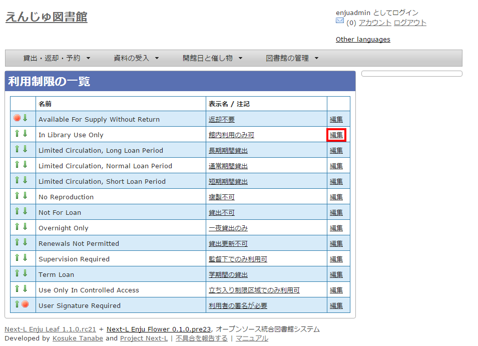  

   
【Memo】一覧の表示順序を変更するには，表の1列目に表示されている↑または↓をクリックして行を入れ替えます。

4. 設定項目に必要事項を入力します。
5. ［利用制限を更新］ボタンをクリックして，設定内容を更新します。  
     

5-5 発行頻度を編集する
----------------------

### ■設定項目

* 名前：発行頻度を入力します。
* 表示名：画面に表示する名称を入力します。
* 注記：注意事項や特記事項などを入力します。

### ■設定方法

1. ［図書館の管理］メニューから［システムの設定］を選択します。  
   
2. ［発行頻度］をクリックします。  
   
3. 設定したい項目の［編集］をクリックします。  
   

   
【Memo】一覧の表示順序を変更するには，表の1列目に表示されている↑または↓をクリックして行を入れ替えます。

4. 設定項目に必要事項を入力します。
5. ［発行頻度を更新］ボタンをクリックして，設定内容を更新します。
     

   
【Memo】設定のない発行頻度は，［Other］を利用します。

5-6 資料の関係の種類を作成する
------------------------------

### ■設定項目

* 名前：資料の関係の種類を入力する。
* 表示名：画面に表示する名称を入力します。
* 注記：注意事項や特記事項などを入力します。

### ■設定方法

1. ［図書館の管理］メニューから［システムの設定］を選択します。  
   
2. ［資料の関係の種類］をクリックします。  
   
3. 右メニューの［資料の関係の種類の新規作成］をクリックします。  
   

   

   【Memo】入力済みの設定内容を変更する場合は［編集］を，削除する場合は［削除］をクリックします。  
   一覧の表示順序を変更するには，表の1列目に表示されている↑または↓をクリックして行を入れ替えます。

4. 設定項目に必要事項を入力します。
5. ［資料の関係の種類を作成］ボタンをクリックして，設定内容を登録します。  
   

5-7 その他の機能
----------------

Enjuでは形態の設定として，その他，次の機能を利用できます。

### ■書いた資料の形態を作成する

* ［図書館の管理］メニューから［システムの設定］を選択します。
* ［書いた資料の形態］をクリックして，設定します。

### ■内容の種類を作成する

* ［図書館の管理］メニューから［システムの設定］を選択します。
* ［内容の種類］をクリックして，設定します。

### ■国と地域を作成する

* ［図書館の管理］メニューから［システムの設定］を選択します。
* ［国と地域］をクリックして，設定します。
