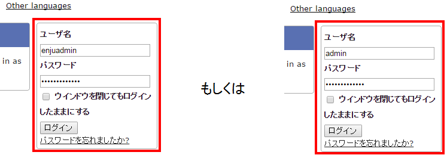
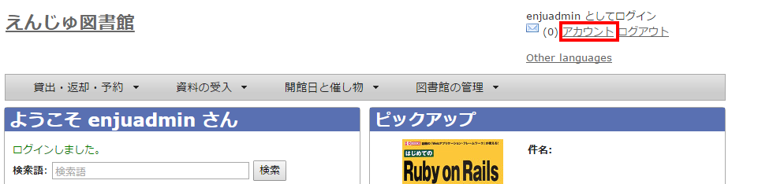
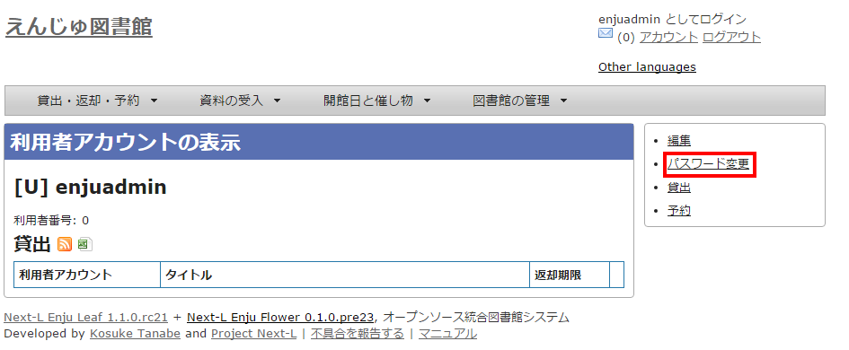
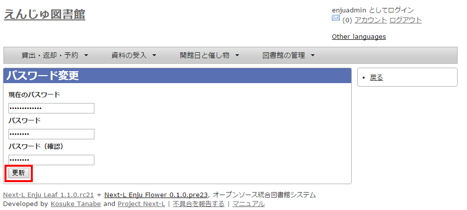

第2章 Enjuを利用する
====================

Enjuの利用を始めるには，次の作業をします。

* ユーザーアカウントの作成
* ログイン／ログアウト
* ユーザーアカウントの編集

Enjuは，利用者同士のコミュニケーション機能も搭載されています。

* メッセージの送信
* メッセージのログの一覧表示・印刷

{::comment}2-1 enju_setup/role.md{:/comment}

{::comment}2-2 enju_setup/login.md{:/comment}
 
{::comment}2-3 enju_setup/message.md{:/comment}

<a name="2-1" />

2-1 ユーザーアカウントの種類を知る
----------------------------------

<a name="2-1-1" />

### 2-1-1 アカウント（ユーザー）の種類

Enjuを利用するには，アカウントを取得し，ログインします。アカウント（ユーザー）には次の3種類があります。

* Administrator（管理者）
* Librarian（図書館員）
* User（図書館利用者）

<a name="2-1-2" />

### 2-1-2 Administrator（管理者）の権限で利用できる機能

Administrator（管理者）の権限を持つアカウントでログインすると，Enjuで次の機能を利用することができます。

* 図書館利用者としてのすべての機能
* 図書館利用者の登録
* 資料の受入
* 資料の貸出／返却／予約
* 催し物（お知らせ）の登録
* 開館日（休館日）の登録
* レファレンスの処理
* 統計機能
* 印刷その他の機能
* アカウントの権限の変更

<a name="2-1-3" />

### 2-1-3 アカウントを編集する

アカウントの権限以外の項目の編集は，Librarian（図書館員）でも行うことができます。操作の方法については，「[運用マニュアル　3-3　利用者のアカウント情報を変更する](enju_operation_3.html#3-3)」を参照してください。

<a name="2-2" />

2-2 ログイン／ログアウトする
----------------------------

Enjuを利用するには，まずシステムにログインします。インストール直後の場合には，Enjuのユーザとしては 「 admin 」 だけが登録されており，その初期パスワードは「 adminpassword 」です。

<a name="2-2-1" />

### 2-2-1 ログインする

1. Enjuにアクセスし，［ログイン］をクリックします。  
   

2. ユーザ名とパスワードを入力し［ログイン］をクリックします。  
   

   

   【Memo】ブラウザを閉じてもログイン状態を保持したい場合は，［ウィンドウを閉じてもログインしたままにする］をオンにします。
   

3. 自分のアカウントでログインされていることを確認します。  
   

<a name="2-2-2" />

### 2-2-2 パスワードを変更する

1. ［アカウント］をクリックします。  
   
2. ［編集］をクリックします。  
   
3. ［現在のパスワード］と「パスワード」「パスワード(確認)」を入力します。パスワードは画面には表示されません。また「パスワード」と「パスワード(確認)」は同じものを入れてください。  
   
4. ［更新する］ボタンを押します。  
   

<a name="2-2-3" />

### 2-2-3 ログアウトする

1. ［ログアウト］をクリックします。
   

2. ログアウトされたこと（［ログイン］の表示に変わったこと）を画面で確認します。
   

   

   【Memo】時間の経過にともなって自動ログアウトする機能は用意されていません。Administrator（管理者）は利用者の個人情報などを閲覧できる権限を持っているので，パソコンを共有する時や離席時などには，必ずログアウトしてください。
   

<a name="2-3" />

2-3 メッセージをやり取りする
----------------------------

Enjuのメッセージ機能を利用して，利用者にメッセージを送信することができます。やり取りしたメッセージは，ログとして一覧表示したり，印刷したりすることもできます。

<a name="2-3-1" />

### 2-3-1 メッセージを送信する

1. ［図書館の管理］メニューから［利用者の管理］を選択します。
   

2. メッセージを送りたいユーザのユーザ名をクリックします。
   

   

   【Memo】［検索語］にユーザ名や利用者番号を入力して，ユーザを検索することもできます。
   

3. 右メニューの［メッセージを送信する］をクリックします。
   

4. 件名，本文を入力し，［メッセージを送信する］ボタンをクリックします。
   

<a name="2-3-2" />

### 2-3-2 受信したメッセージを読む

1. ［アカウント］の左にあるメールアイコンをクリックします。
   

   

   【Memo】未読メッセージがある場合は，メールアイコンの右に未読のメッセージ数が表示されるので，それをクリックすることもできます。
   

2. 読みたいメッセージの件名をクリックします。
   

3. メッセージの内容が表示されます。返信したい場合は，右メニューの［メッセージに返信する］をクリックします。
   

<a name="2-3-3" />

### 2-3-3 メッセージを削除する
1. ［アカウント］の左にあるメールアイコンをクリックします。
   
2. 削除したいメッセージのチェックボックスにチェックを入れ，［メッセージを削除する］ボタンをクリックします。
   

   

   【Memo】削除できるのは自分宛のメッセージだけです。削除可能なメッセージにのみ，チェックボックスが表示されます。
   


