* Contents
{:toc}

第3章　図書館のシステム設定を行う {#section3}
=============================================

Enjuの利用を始めるにあたり，図書館のシステム設定として，次のような設定作業を行います。入力にはひらがな，カタカナ，漢字，英数字などの文字が利用できます。ただし，半角カナは使用できません。

* 図書館全体の設定
* 個々の図書館の設定
* 本棚
* 利用者情報・貸出区分とその関係
* 資料の種類と貸出区分との関係
* 催し物の種類
* 書店
* 検索エンジン

{::comment}3-1 enju_setup/library_group.md %}{:/comment}

{::comment}3-2 enju_setup/library.md %}{:/comment}

{::comment}3-3 enju_setup/shelf.md %}{:/comment}

{::comment}3-4 enju_setup/user_group.md %}{:/comment}

{::comment}3-5 enju_setup/checkout_type.md %}{:/comment}

{::comment}3-6 enju_setup/user_group_checkout_type.md %}{:/comment}

{::comment}3-7 enju_setup/carrier_type_has_checkout_type.md %}{:/comment}

{::comment}3-8 enju_setup/event_category.md %}{:/comment}

{::comment}old 3-9 enju_setup/event_import.md {:/comment}

{::comment}3-9 enju_setup/budget_type.md %}{:/comment}

{::comment}3-10 enju_setup/bookstore.md %}{:/comment}

{::comment}3-11 enju_setup/message_template.md %}{:/comment}

{::comment}3-12 enju_setup/search_engine.md %}{:/comment}

{::comment} enju_setup/barcode.md {:/comment}

{::comment}3-13 enju_setup/config_misc.md %}{:/comment}

3-1 図書館全体の設定をする {#section3-1}
----------------------------------------

### 3-1-1 設定項目 {#section3-1-1}

* __名前__ ：図書館の全体名称を入力します。図書館からのお知らせメールのFromなどに使用されます。
* __表示名__ ：画面に表示する名称を入力します。本システムのヘッダなどに表示されます。
* __メール__ ：図書館のメールアドレスを入力します。図書館からのお知らせメールのFromなどに使用されます。
* __URL__ ：図書館のURLを入力します。資料の表示画面のURLなどに使用します。
* __ログイン画面でのメッセージ__ ：表示したいメッセージを入力します。
* __検索結果の最大件数__ ：検索したときに表示する最大の件数を表します。「0」と入力したときは上限なしを表します。検索結果の全レコードIDをブラウザに保存するため、上限を設定できるようにしてます（ブラウザによって5MBや10MBなどと異なりますが、いずれにしても上限が決まっているため）。<!-- 関連 issue  #605  -->
* __書影の取得元__ ：書影を取得するサービス（例：「Google」）を選択します。（※現在は、GoogleBooksの みですが、将来的には、amazon.com、紀伊国屋書店等から選べるようにする予定です）<!-- 関連 issue #712 -->
* __色__ : タイトルの色（標準では青）などを変更する場合に入力します。値はRGBで指定します。
  * Enjuの標準設定の色
    * table_border（表の枠線）: 2779aa 
    * table_line1（表のセルの塗りつぶし色1）: ffffff
    * table_line0（表のセルの塗りつぶし色2）: d7ebf9
    * header_title（タイトルの色）: 5970B2
  * オレンジ基調の例
    * table_border: f8ad6f
    * table_line1: ffffff
    * table_line0: fdefe9
    * header_title: f79646
* __LANとして扱うネットワーク__ ：ネットワークの名称を入力します。ここで指定することによってこのEnjuにアクセスできるIPアドレスを制限することができるようになります。
* __管理用として扱うネットワーク__ ：ネットワークの名称を入力します。ここで指定することによって特定のIPアドレスからのアクセスのみAdministrator権限やLibrarian権限での作業ができるように制限ができるようになります。
* __注記__ ：注意事項や特記事項などを入力します。
* __国と地域__ ：▼をクリックし，リストから選択します。利用者の住所の国と地域のデフォルトを指定できます。※現在この値は使用していません（Next-L Enju Leaf 1.1.0.rc9）。

### 3-1-2 設定方法 {#section3-1-2}

#### 1. ［図書館の管理］メニューから［システムの設定］を選択します。  

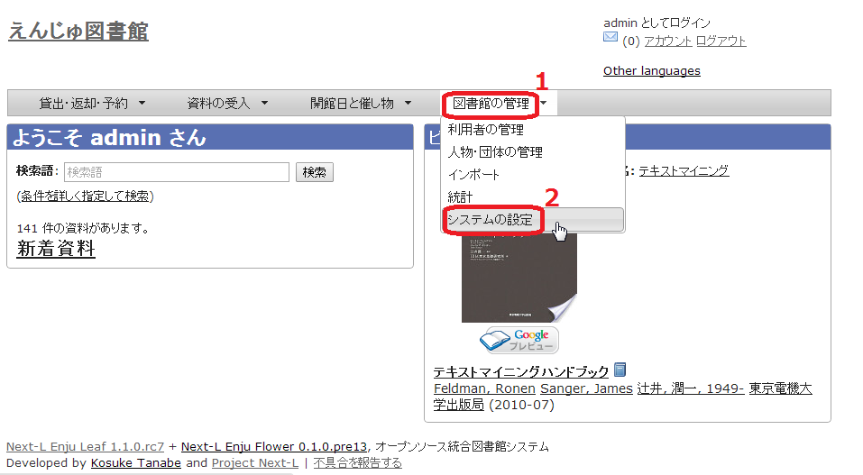

#### 2. ［図書館全体の設定］をクリックします。
  
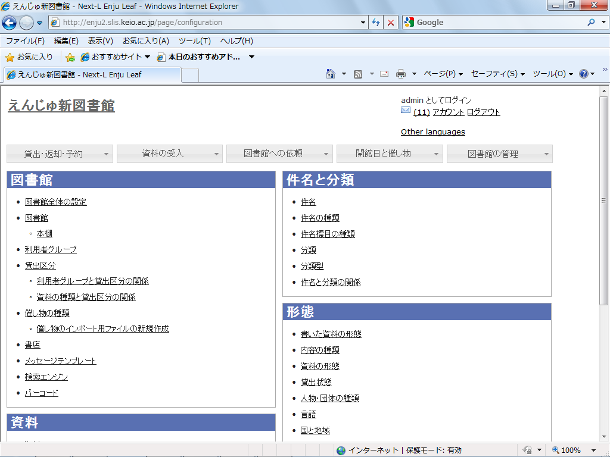

#### 3. ［編集］をクリックします。
  
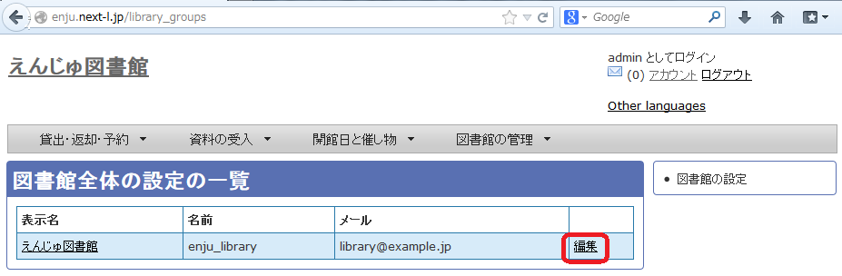

【Memo】インストール直後は，仮の図書館名が入っています。［編集］をクリックして，情報を変更します。

#### 4. [メール]以外のすべての設定項目に必要事項を入力し、［更新］ボタンをクリックして，設定内容を更新します。

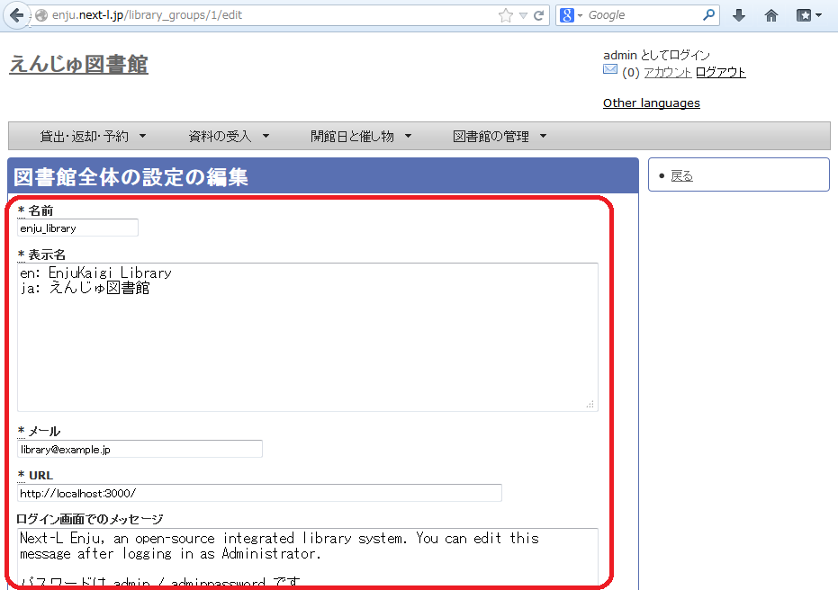  

【Memo】［表示名］の前には，日本語名ならば「ja:」，英語名ならば「en:」というように，言語がわかるように先頭に文字を付記します。

#### 5. 設定が登録され，［図書館全体の設定の表示］画面が表示されます。[メール]を編集するため、右メニューの[編集]をクリックします。  

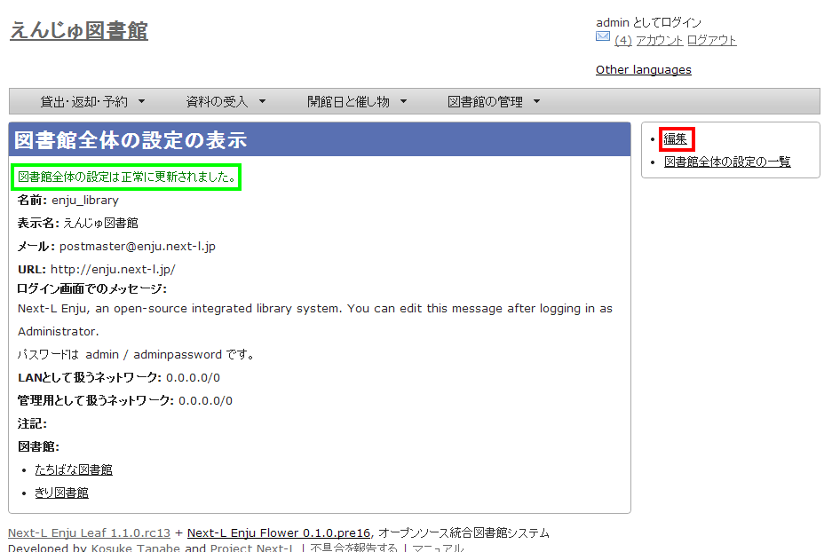

#### 6. メールの[編集]リンクをクリックします。

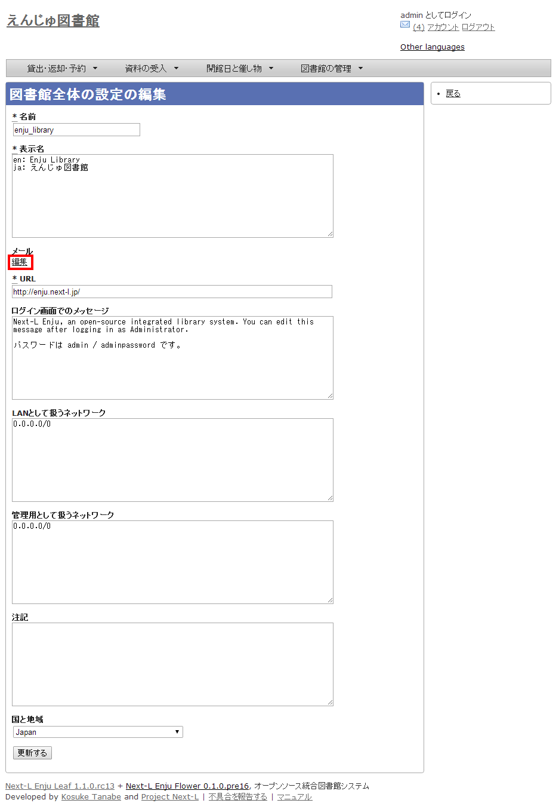

#### 7. メールアドレスを修正し、[更新する]ボタンをクリックします。

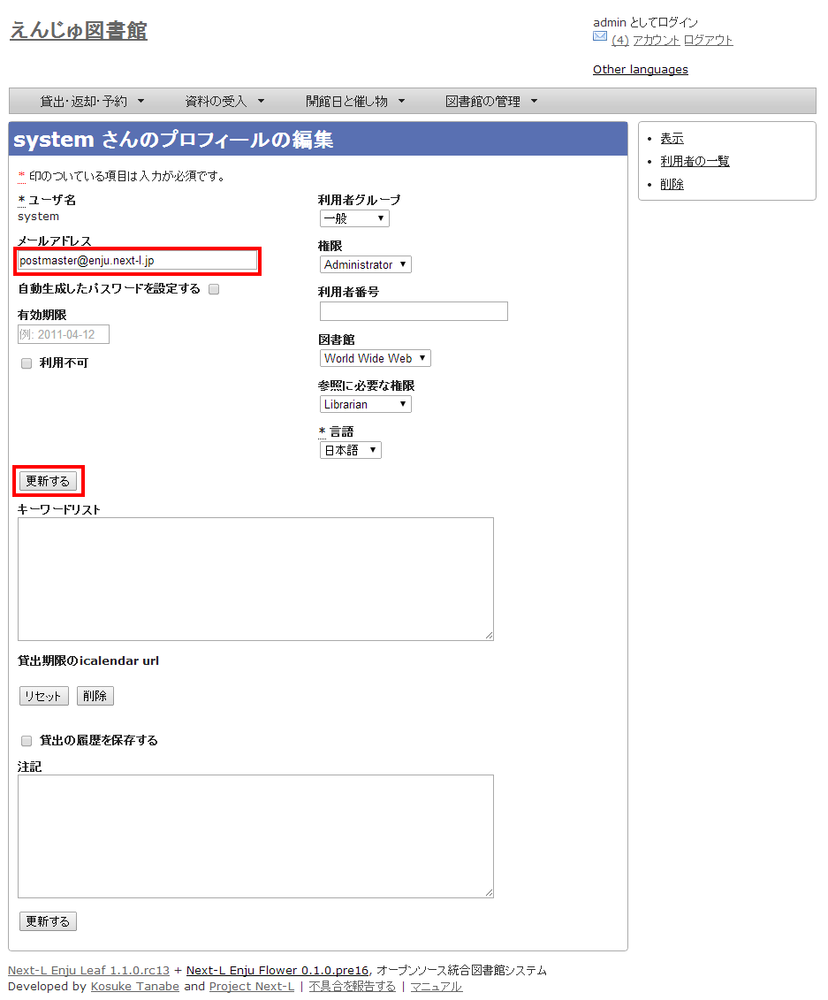

3-2 個々の図書館を設定する {#section3-2}
----------------------------------------

### 3-2-1 設定項目 {#section3-2-1}

* 名前：図書館の名称を入力します。
* 短縮表示名：短縮した名称を入力します。
* 表示名：画面に表示する名称を入力します。
* 国と地域：▼をクリックし，リストから選択します。
* 郵便番号：図書館の所在地の郵便番号を入力します。
* 都道府県：図書館の所在地の都道府県名を入力します。
* 市町村：図書館の所在地の市町村名を入力します。
* 番地：図書館の所在地の番地を入力します。
* 電話番号１：図書館の電話番号を入力します。
* 電話番号２：図書館の電話番号を入力します。
* ファックス番号：図書館のファックス番号を入力します。
* 請求記号の列数：請求記号で利用する列数を入力します
* 請求番号の区切り文字：請求記号に利用する区切り文字を入力します。
* 開館時間：図書館の開館時間を選択します。
* 注記：注意事項や特記事項などを入力します。

### 3-2-1 設定方法 {#section3-2-1}

#### 1. ［図書館の管理］メニューから［システムの設定］を選択します。  

  

#### 2. ［図書館］をクリックします。  

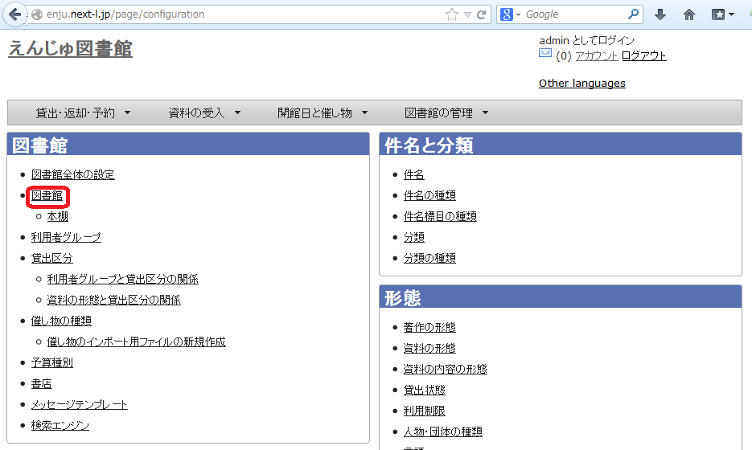  

#### 3. ［図書館の新規作成］をクリックします。  

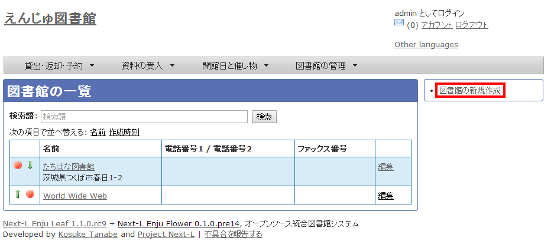

【Memo】入力済みの図書館の設定内容を変更する場合は，［編集］をクリックします。

#### 4. 設定項目に必要事項を入力し、[登録する]ボタンをクリックして，設定内容を登録します。  

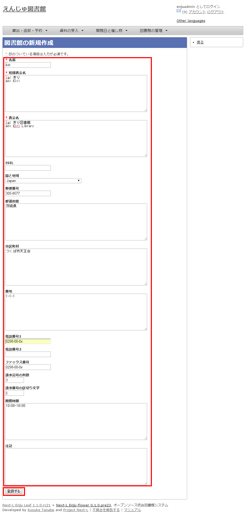

【Memo】「＊」のマークが付いた項目は入力必須項目です。[名前]は3文字以上、256文字以内で、半角である必要があります。使用できる文字はアルファベットの小文字、数字、-（ハイフン）、_（アンダースコア）です。ただし、名前の最初はアルファベットの小文字のみが使用でき、名前の最後にはハイフンとアンダースコアは使用できません。

#### 5. 「図書館は正常に作成されました」と表示され、図書館が作成されます。

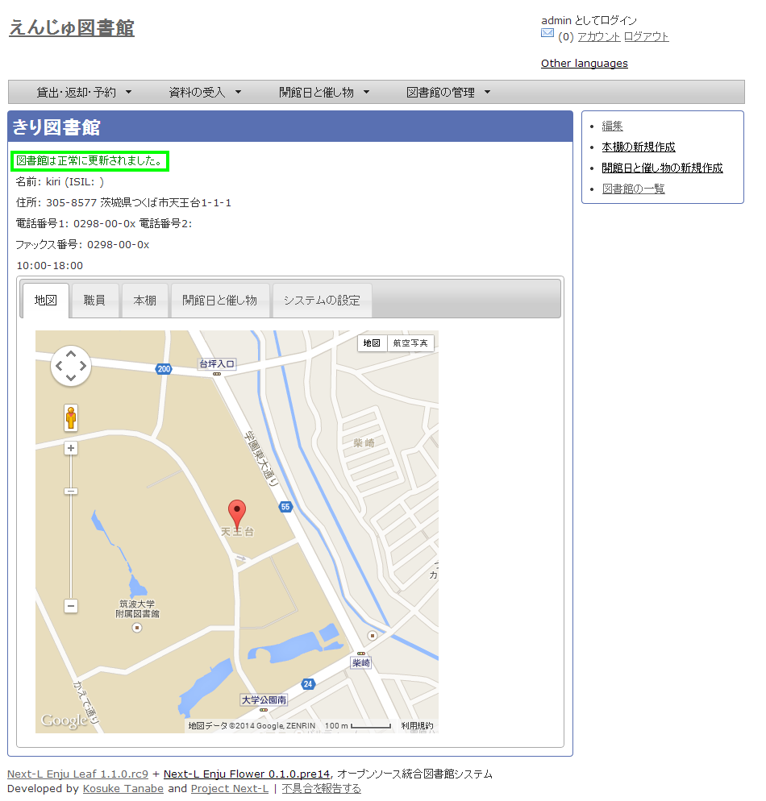

【Memo】 [請求記号の列数]、[請求記号の区切り文字]を設定すると
「資料の表示」の右に請求記号が背ラベルのように表示されます。
次は、請求記号の列数を **3** 、請求記号の区切り文字を **||** とし、
請求記号「015.2||ハ||1」を表示した例です。

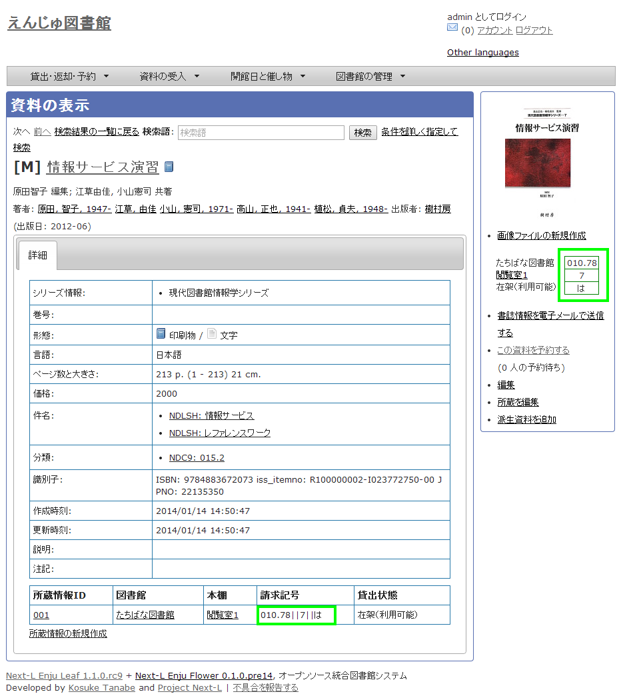

注：次のような場合、背ラベルは表示されません。 [請求記号の列数]が設定されていない、[請求記号の区切り文字]が設定されていない、ログインしていない、当該資料の[所蔵情報ID]が登録されていない、当該資料の[請求記号]が登録されていない、当該資料の[請求記号]が [請求記号の列数]と[請求記号の区切り文字]のルールとは異なっている、貸出状態が「作業中」となっている、ログインユーザの所属図書館に当該資料の所蔵がない。

3-3 本棚を設定する {#section3-3}
------------------

### 3-3-1 設定項目 {#section3-3-1}

* 名前：本棚の名称を入力します。
* 表示名：画面に表示する名称を入力します。
* 注記：注意事項や特記事項などを入力します。
* 図書館：▼をクリックし，リストから選択します。

ここで表示されるリストは，「[3-2 個々の図書館を設定する](#section3-2)」で設定します。

### 3-3-2 設定方法 {#section3-3-2}

#### 1. ［図書館の管理］メニューから［システムの設定］を選択します。  

#### 2. ［本棚］をクリックします。  

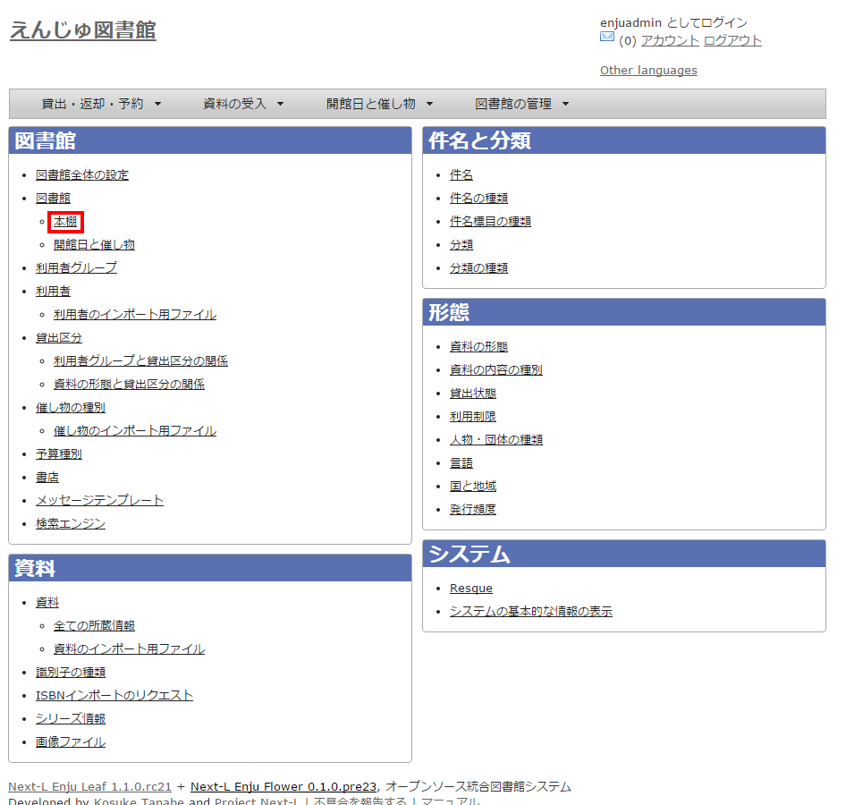

#### 3. ［本棚の新規作成］をクリックします。  

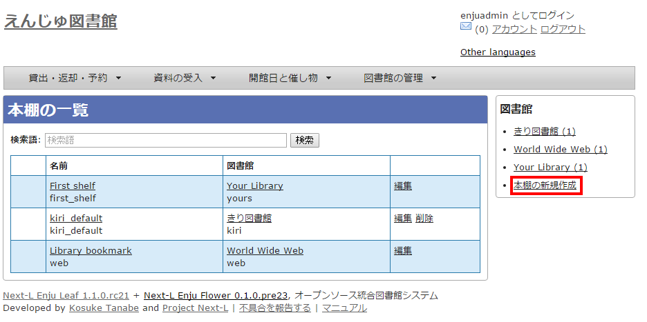

【Memo】入力済みの本棚の設定内容を変更する場合は，［編集］をクリックします。

#### 4. 設定項目に必要事項を入力し，［登録する］ボタンをクリックして，設定内容を登録します。  

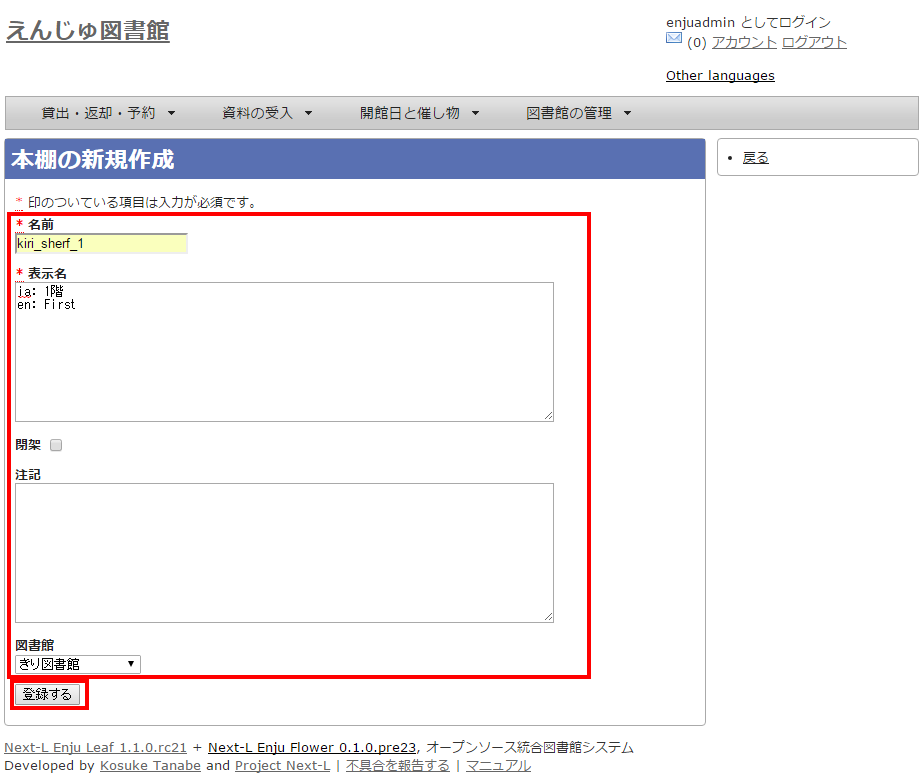

【Memo】「＊」のマークが付いた項目は入力必須項目です。[名前]は3文字以上、256文字以内で、半角である必要があります。使用できる文字はアルファベットの小文字、数字、-（ハイフン）、_（アンダースコア）です。ただし、名前の最初はアルファベットの小文字のみが使用でき、名前の最後にはハイフンとアンダースコアは使用できません。 
 

3-4 利用者グループを設定する {#section3-4}
------------------------------------------

### 3-4-1 設定項目 {#section3-4-1}

* 名前：利用者グループ名を入力します。
  * 「[3-6 利用者グループと貸出区分の関係を設定する](#section3-6)」で，利用者グループごとに貸出の設定などを設定することができます。  
  * 貸出については「[3-5 貸出区分を設定する](#section3-5)」「[5-2 貸出状態を作成する](enju_setup_5.html#section5-2)」などで設定します。
* 表示名：画面に表示する名称を入力します。
* 新規ユーザの有効日数：図書館カードの有効日数を数値で入力します。
* Number of day to notify due date：「何日後に返却日を通知するか」を数値で入力します。
* Number of day to notify overdue：「返却日を何日過ぎたら通知するか」を数値で入力します。
* Number of time to send overdue notification：「返却日を過ぎた通知を何回送るか」を数値で入力します。
* 注記：注意事項や特記事項などを入力します。

### 3-4-2 設定方法 {#section3-4-2}

#### 1. ［図書館の管理］メニューから［システムの設定］を選択します。  

#### 2. ［利用者グループ］をクリックします。  

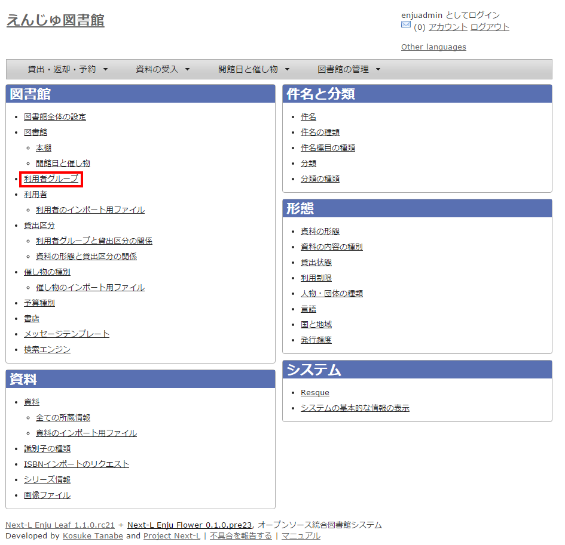

#### 3. ［利用者グループの新規作成］をクリックします。  

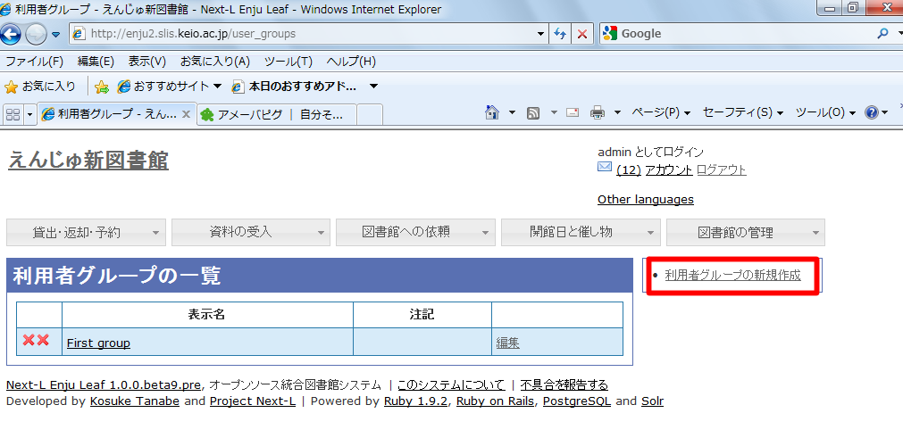

【Memo】入力済みの利用者グループの設定内容を変更する場合は，［編集］をクリックします。

#### 4. 設定項目に必要事項を入力し，［登録する］ボタンをクリックして，設定内容を登録します。  

3-5 貸出区分を設定する {#section3-5}
------------------------------------

### 3-5-1 設定項目 {#section3-5-1}

* 名前：貸出区分名を入力します。
* 表示名：画面に表示する名称を入力します。
* 注記：注意事項や特記事項などを入力します。

### 3-5-2 設定方法 {#section3-5-2}

#### 1. ［図書館の管理］メニューから［システムの設定］を選択します。  

#### 2. ［貸出区分］をクリックします。  

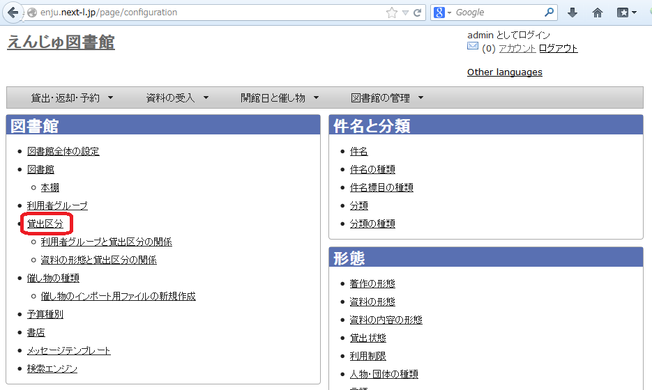

#### 3. 右メニューの［貸出区分の新規作成］をクリックします。  

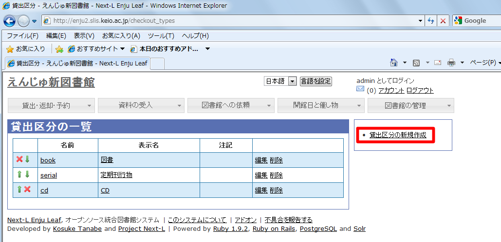  

【Memo】入力済みの貸出区分の設定内容を変更する場合は［編集］を，削除する場合は［削除］をクリックします。一覧表示の表示順序を変更するには，表の1列目に表示されている↑または↓をクリックして行を入れ替えます。

#### 4. 設定項目に必要事項を入力、［登録する］ボタンをクリックして，設定内容を登録します。  

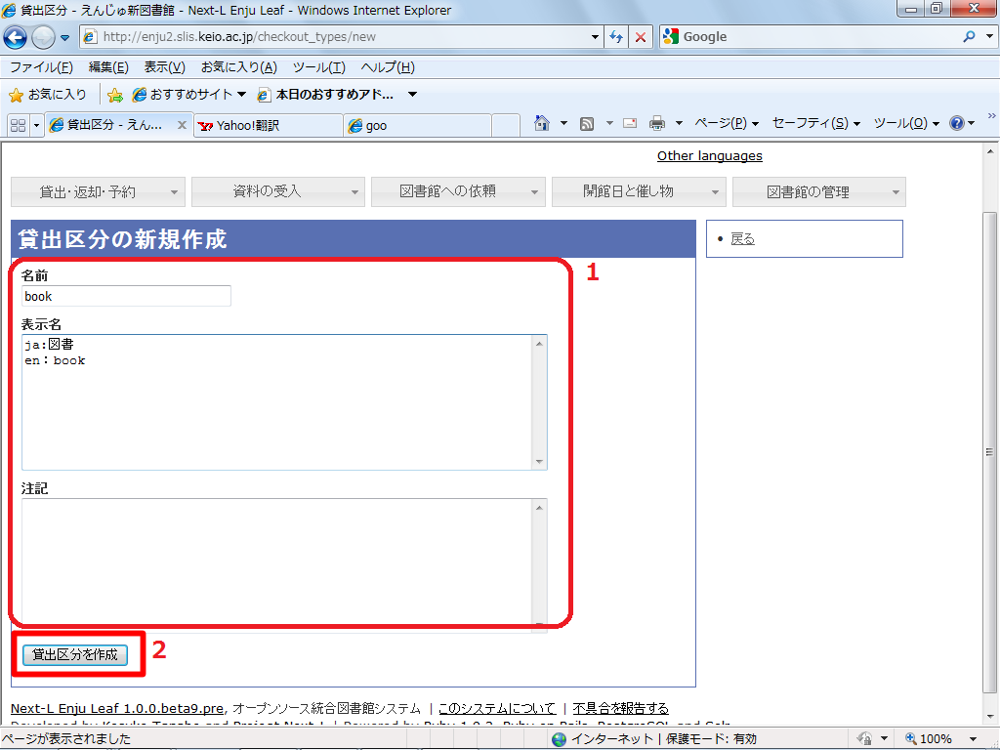

3-6 利用者グループと貸出区分の関係を設定する {#section3-6}
----------------------------------------------------------

### 3-6-1 設定項目 {#section3-6-1}

* 利用者グループ：▼をクリックし，リストから選択します。ここで表示されるリストは，「[3-4 利用者グループを設定する](#section3-4)」で設定します。
* 貸出区分：▼をクリックし，リストから選択します。ここで表示されるリストは，「[3-5 貸出区分を設定する](#section3-5)」で設定します。
* 貸出数の上限：貸出数を数値で設定します。
* 貸出期間：期間を数値で設定します。
* 貸出更新回数の上限：回数を数値で設定します。
* 予約冊数の上限：冊数を数値で設定します。
* 予約の期限切れまでの期間：期間を数値で設定します。
* 返却日を閉館日の前日にする：クリックしてon/offを切り替えます。この項目がオンになっている場合、返却日は通常返却日の前日になり、オフになっている場合は通常返却日の翌日に設定されます。
* 注記：注意事項や特記事項などを入力します。

### 3-6-2 設定方法 {#section3-6-2}

#### 1. ［図書館の管理］メニューから［システムの設定］を選択します。  

#### 2. ［利用者グループと貸出区分の関係］をクリックします。  

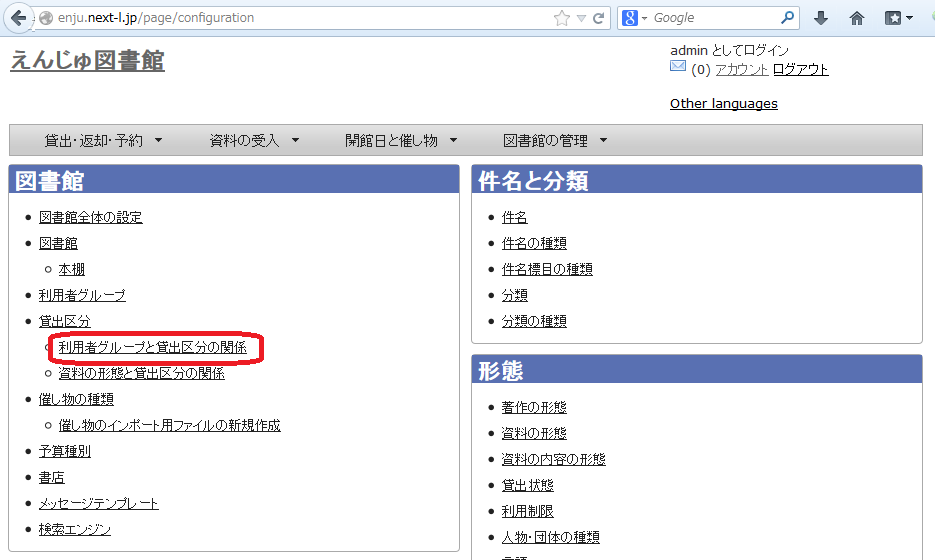

#### 3. 右メニューの［利用者グループと貸出区分の関係の新規作成］をクリックします。  

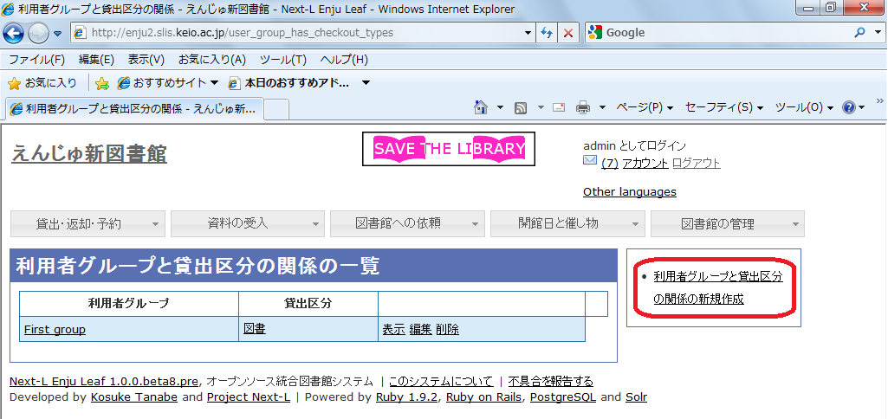

【Memo】入力済みの設定内容を変更する場合は［編集］を，削除する場合は［削除］をクリックします。

### 4. 設定項目に必要事項を入力し、［登録する］ボタンをクリックして，設定内容を登録します。  

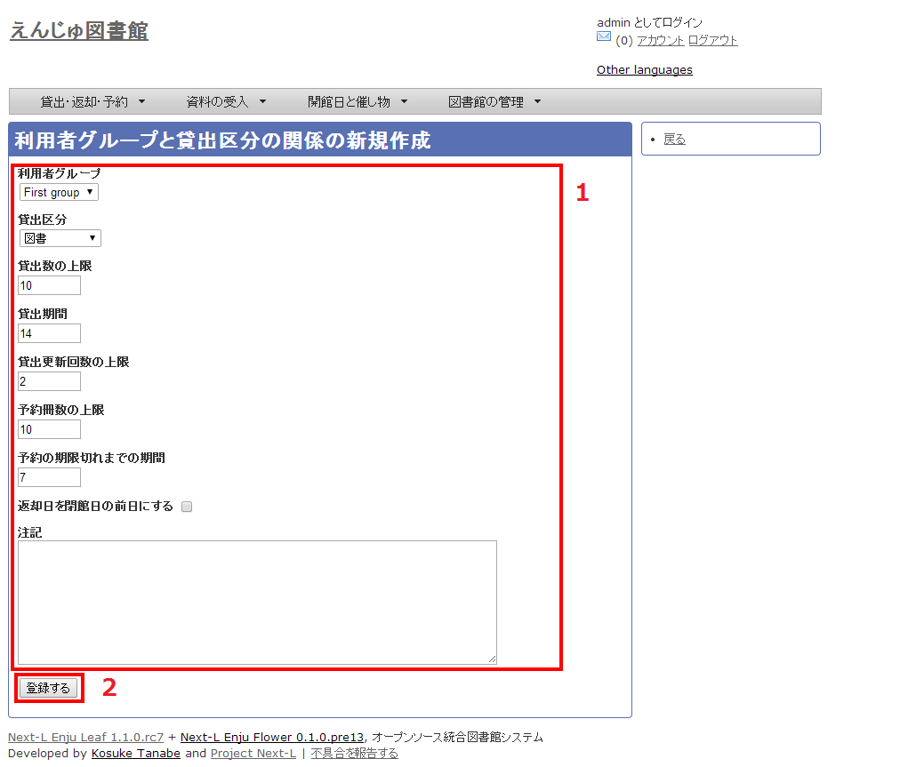

3-7 資料の形態と貸出区分の関係を設定する {#section3-7}
------------------------------------------------------

### 3-7-1 設定項目 {#section3-7-1}

* 資料の形態：▼をクリックし，リストから選択します。ここで表示されるリストは，「[5-1 資料の形態を作成する](enju_setup_5.html#section5-1)」で設定します。
* 貸出区分：▼をクリックし，リストから選択します。ここで表示されるリストは，「[3-5 貸出区分を設定する](#section3-5)」で設定します。
* 注記：注意事項や特記事項などを入力します。

### 3-7-2 設定方法 {#section3-7-2}

#### 1. ［図書館の管理］メニューから［システムの設定］を選択します。  

#### 2. ［資料の形態と貸出区分の関係］をクリックします。  

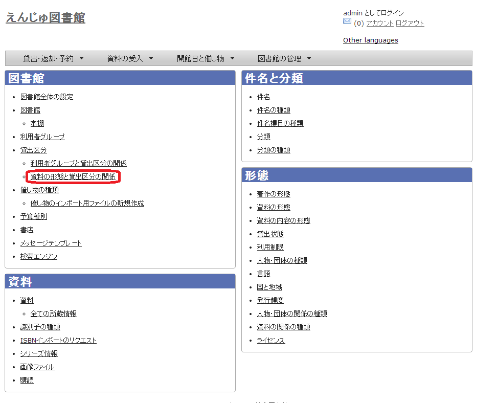

#### 3. 右メニューの［資料の形態と貸出区分の関係の新規作成］をクリックします。  
   
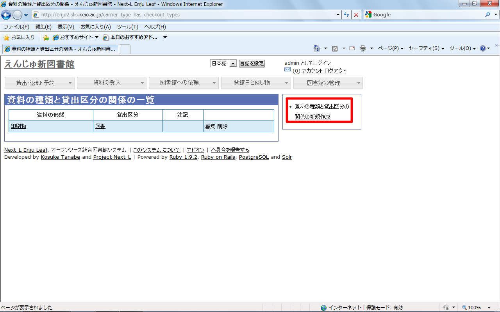

【Memo】入力済みの設定内容を変更する場合は［編集］を，削除する場合は［削除］をクリックします。

#### 4. 設定項目に必要事項を入力し、［登録する]ボタンをクリックして，設定内容を登録します。  

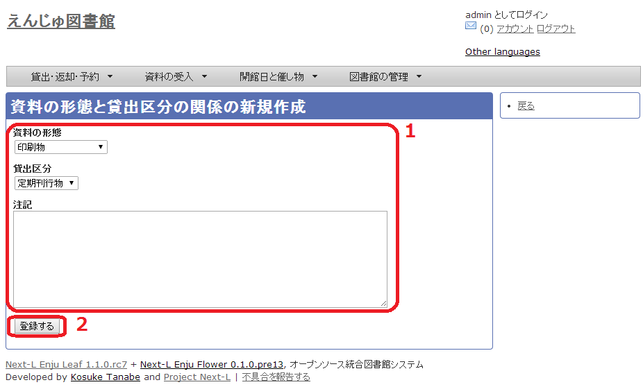

3-8 催し物の種類を設定する {#section3-8}
-----------------------------------------

### 3-8-1 設定項目 {#section3-8-1}

* 名前：催し物名を入力します。
* 表示名：画面に表示する名称を入力します。
* 注記：注意事項や特記事項などを入力します。  
  ＊催し物については，既存のデータファイルを指定して読み込むインポート機能が利用できます。「運用マニュアルの[7-2-2 催し物のデータをインポートする](enju_operation_7.html#section7-2-2)」を参照してください。

### 3-8-2 設定方法 {#section3-8-2}

#### 1. ［図書館の管理］メニューから［システムの設定］を選択します。  

#### 2. ［催し物の種類］をクリックします。  

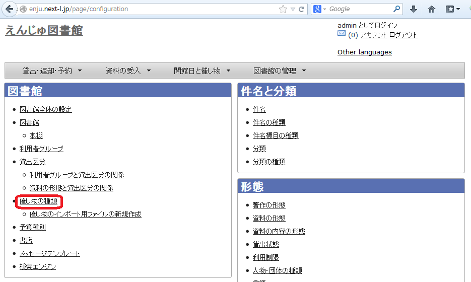

#### 3. 右メニューの［催し物の種類の新規作成］をクリックします。  

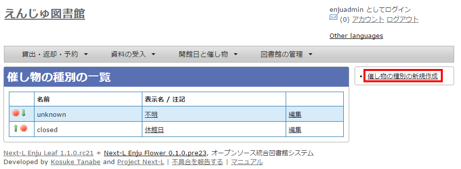  

【Memo】入力済みの設定内容を変更する場合は［編集］を、削除する場合は［削除］をクリックします。ただし、"unknown"、 "closed"は標準カテゴリとなっており、削除できないため削除リンクはありません。  
一覧表示の表示順序を変更するには，表の1列目に表示されている↑または↓をクリックして行を入れ替えます。

#### 4. 設定項目に必要事項を入力し、［登録する］ボタンをクリックして，設定内容を登録します。  

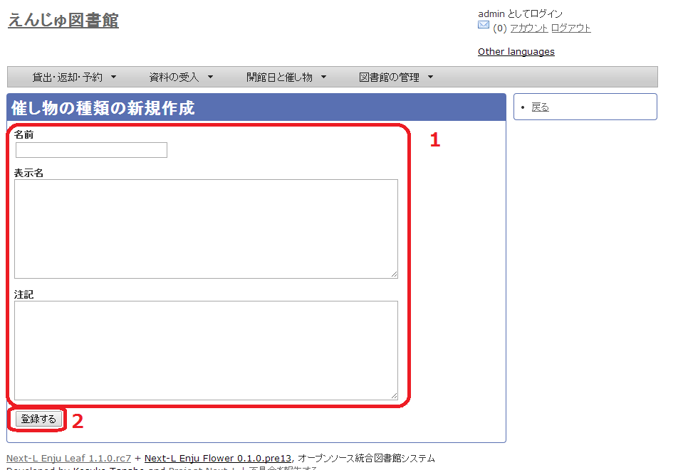

#### 5. 「催し物の種類は正常に作成されました。」と表示され、催し物の種類の作成が完了します。

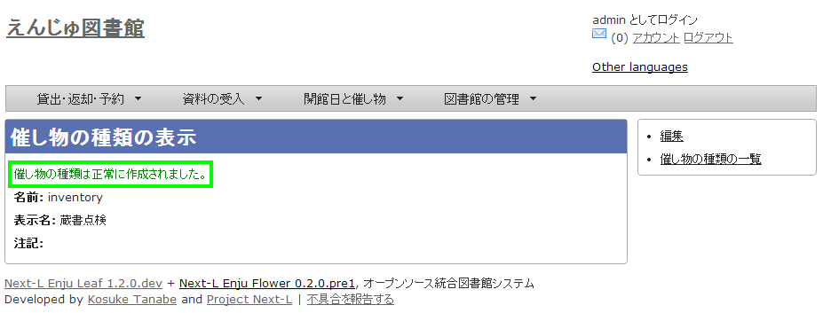

3-9 予算種別を設定する {#section3-9}
------------------------------------

### 3-9-1 設定項目 {#section3-9-1}

* 名称：予算種別の名称を入力します。
* 表示名：表示名を入力します。
* 注記：注意事項や特記事項などを入力します。

### 3-9-2 設定方法 {#section3-9-2}

#### 1. ［図書館の管理］メニューから［システムの設定］を選択します。  

#### 2. ［予算種別］をクリックします。  

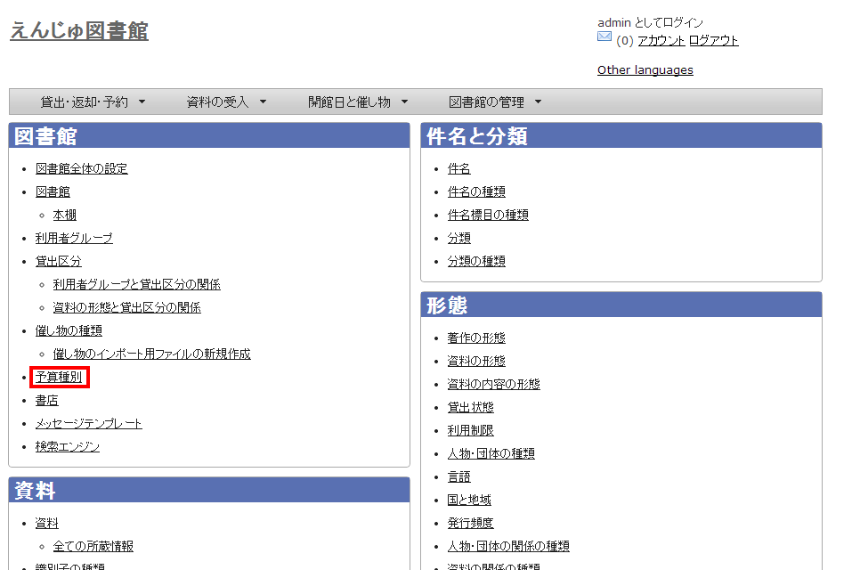

#### 3. 右メニューの［予算種別の新規作成］をクリックします。  

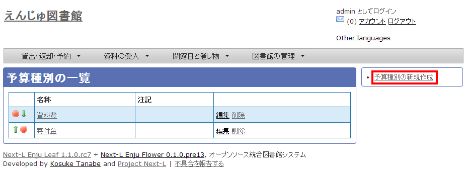

【Memo】入力済みの設定内容を変更する場合は，表の最終列に表示されている「編集」を，削除する場合は「削除」をクリックします。
一覧表示の表示順序を変更するには，表の1列目に表示されている↑または↓をクリックして行を入れ替えます。

#### 4. 設定項目に必要事項を入力し、［登録する］ボタンをクリックして，設定内容を登録します。  

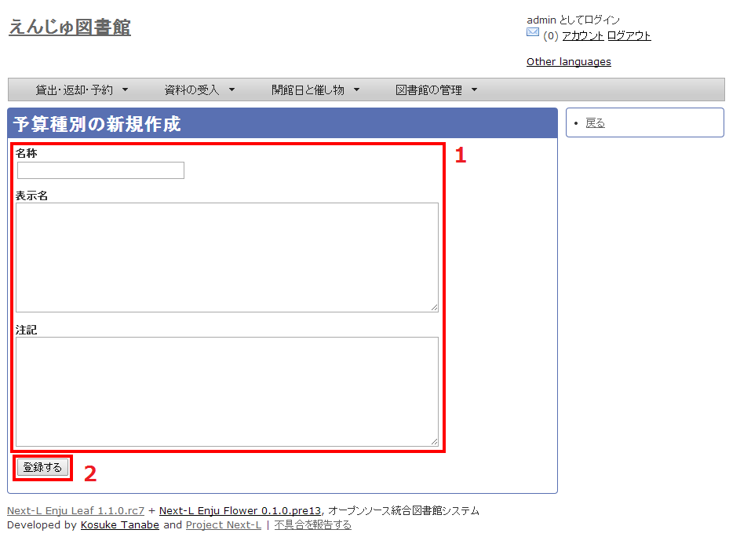

3-10 書店を設定する {#section3-10}
----------------------------------

### 3-10-1 設定項目 {#section3-10-1}

* 名前：書店名を入力します。
* 郵便番号：書店の所在地の郵便番号を入力します。
* 住所：書店の所在地の住所を入力します。
* 電話番号：書店の電話番号を入力します。
* ファックス番号：書店のファックス番号を入力します。
* URL：書店のWebサイトのURLを入力します。
* 注記：注意事項や特記事項などを入力します。

### 3-10-2 設定方法 {#section3-10-2}

#### 1. ［図書館の管理］メニューから［システムの設定］を選択します。  

#### 2. ［書店］をクリックします。  

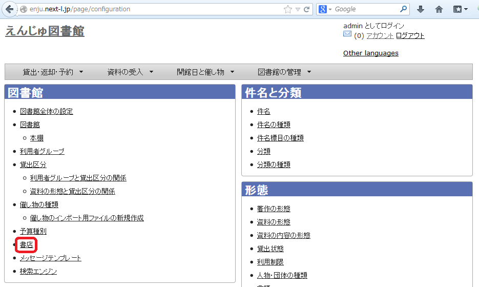

#### 3. 右メニューの［書店の新規作成］をクリックします。  

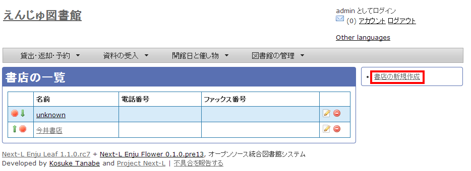

【Memo】入力済みの設定内容を変更する場合は，表の最終列に表示されている[編集]を，削除する場合は[削除]をクリックします。
一覧表示の表示順序を変更するには，表の1列目に表示されている↑または↓をクリックして行を入れ替えます。

#### 4. 設定項目に必要事項を入力し、［登録する］ボタンをクリックして，設定内容を登録します。  

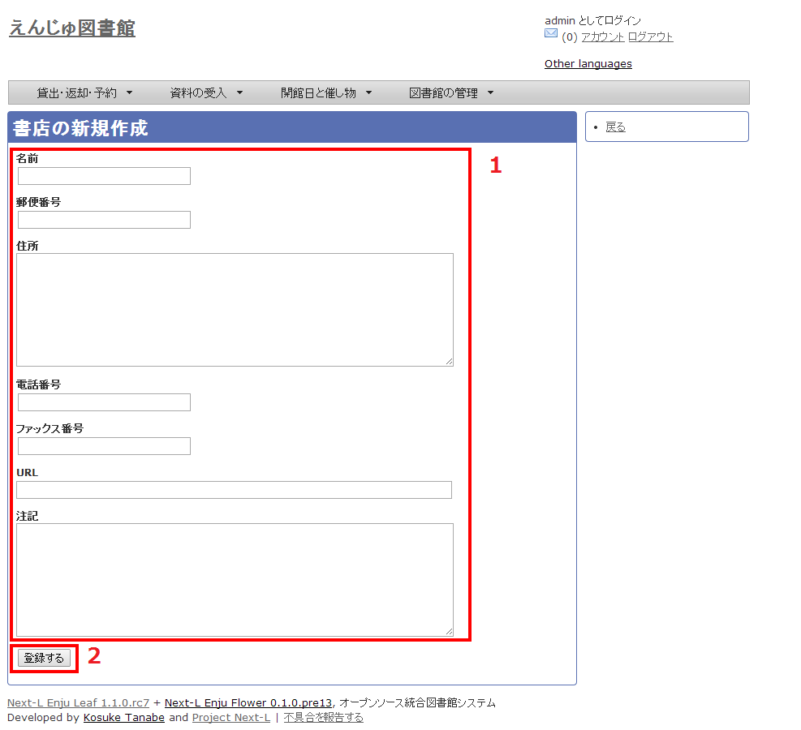

3-11 メッセージテンプレートを設定する {#section3-11}
----------------------------------------------------

### 3-11-1 設定項目 {#section3-11-1}

* 状態：メッセージの内容を示す状態を入力します。
* 言語：▼をクリックし，リストから選択します。
* タイトル：メッセージを表示するときのタイトルを入力します。
* 本文：メッセージの本文を入力します。

＊メッセージの本文には資料名やユーザー名などの変数を組み込み，送信時に本文中の変数に値を代入して送信できます。

### 3-11-2 設定方法 {#section3-11-2}

#### 1. ［図書館の管理］メニューから［システムの設定］を選択します。  

#### 2. ［メッセージテンプレート］をクリックします。  

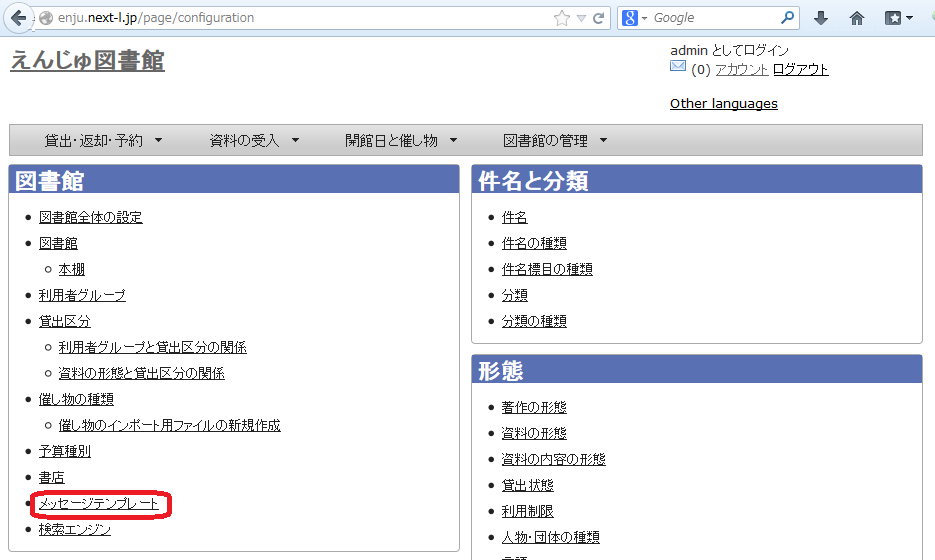

#### 3. 設定したい項目の［編集］をクリックします。  

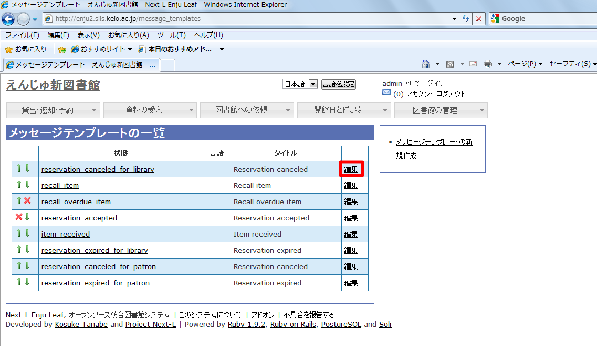  

【Memo】一覧表示の表示順序を変更するには，表の1列目に表示されている↑または↓をクリックして行を入れ替えます。

#### 4. 設定項目に必要事項を入力し、［更新する］ボタンをクリックして，設定内容を更新します。  

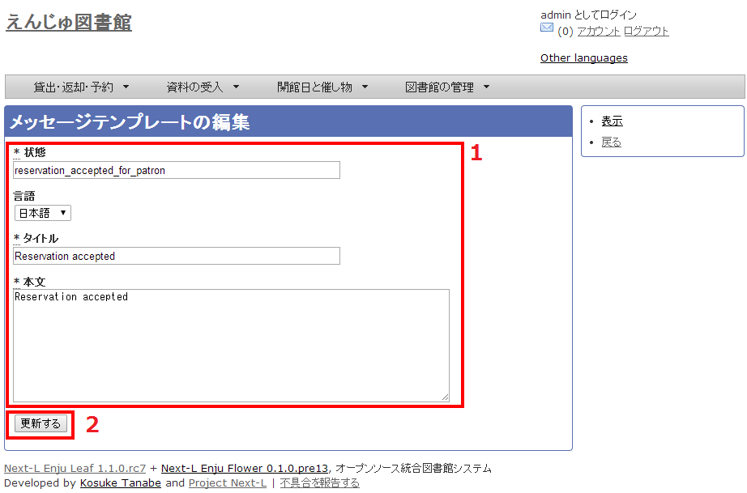  

3-12 検索エンジンを設定する {#section3-12}
------------------------------------------

検索エンジンを設定すると、資料を検索したときにヒット件数が0件だった場合に、同じ検索語で別のデータベース（検索エンジン）に検索をすることができるようになります。
次の図は、ヒット件数が0件だったときの画面を表しています。ここでは、3つの検索エンジン（NDL Search, amazon.co.jp, CiNii Books）を表示しています。

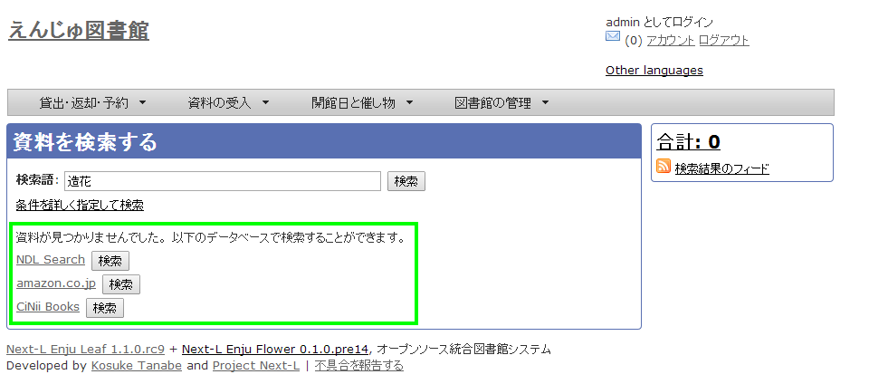

### 3-12-1 設定項目 {#section3-12-1}

* 名前：検索エンジンの名称を入力します。
* URL：URLを入力します。（入力必須）
* ベースURL：ベースURLを入力します。
* HTTPメソッド：▼をクリックし，リストから選択します。
* クエリパラメータ：URLに追加するパラメータを入力します。
* 追加のパラメータ：URLに追加するパラメータを入力します。
* 注記：注意事項や特記事項などを入力します。

### 3-12-2 設定方法 {#section3-12-2}

#### 1. ［図書館の管理］メニューから［システムの設定］を選択します。  

#### 2. ［検索エンジン］をクリックします。  

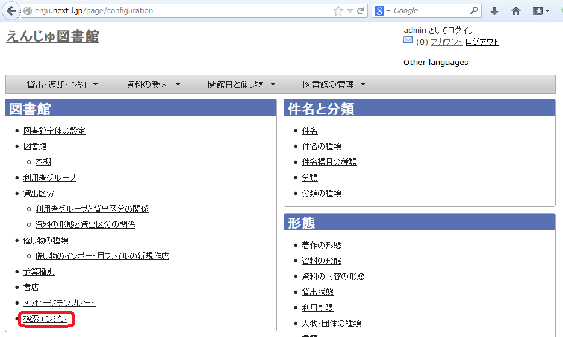

#### 3. 右メニューの［検索エンジンの新規作成］をクリックします。

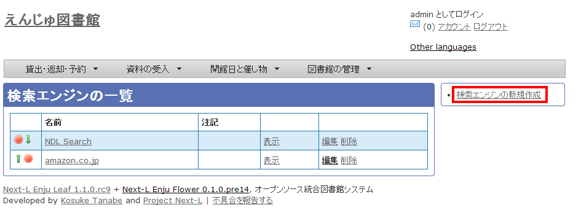

#### 4. 設定項目に必要事項を入力し、［登録する］ボタンをクリックして，設定内容を登録します。

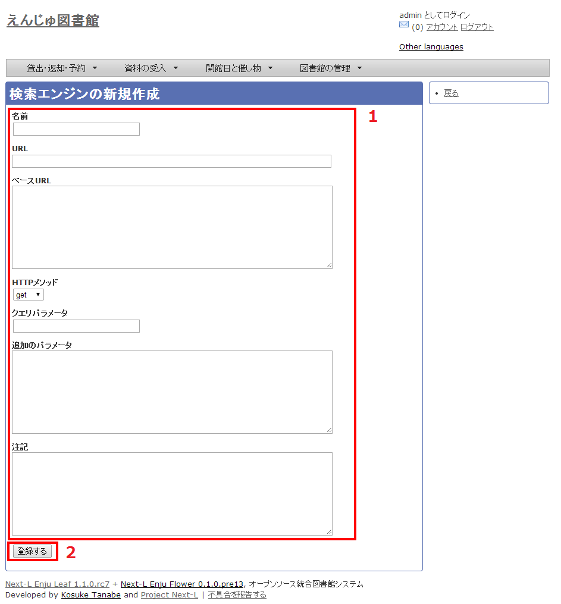

【Memo】CiNii Booksの登録例（検索語がflowerであれば：http://ci.nii.ac.jp/books/search?q=flower&format=html というリクエストになる）を示しています。

#### 5. 以下はその他の検索エンジンの設定例です。

* 名前: NDL Search
    * URL: http://iss.ndl.go.jp/
    * ベースURL: http://iss.ndl.go.jp/books
    * HTTPメソッド: get
    * クエリパラメータ: any
* 名前: amazon.co.jp
    * URL: http://www.amazon.co.jp/
    * ベースURL: http://www.amazon.co.jp/s?
    * HTTPメソッド: get
    * クエリパラメータ: field-keywords
    * 追加のパラメータ: url=search-alias=aps

3-13 その他の機能 {#section3-13}
--------------------------------

Enjuでは，システムの設定は管理者権限を持つアカウントで設定します。システムの設定以外にも，個人情報に関わることなどは，管理者権限で行うように設定されています。

管理者権限では，次のような設定・閲覧機能を持っています。

### 3-13-1 システムの設定以外でも管理者権限で設定・閲覧する機能 {#section3-13-1}

* 返却済み貸出履歴の一覧
* 図書館員のプロフィール変更
* 権限変更
* 操作履歴一覧の表示


