* Contents
{:toc}

第4章　件名のシステム設定を行う
===============================
Enjuの利用を始めるにあたり，件名のシステム設定として，次のような設定作業を行います。

* 件名
* 件名の種類
* 件名標目
* 分類
* 分類型

{::comment}4-1 enju_setup/subject.md {:/comment}

{::comment}4-2 enju_setup/subject_type.md {:/comment}

{::comment}4-3 enju_setup/subject_heading_type.md {:/comment}

{::comment}4-4 enju_setup/classification.md {:/comment}

{::comment}4-5 enju_setup/classification_type.md {:/comment}

4-1 件名を設定する {#section4-1}
--------------------------------

### 4-1-1 設定項目 {#section4-1-1}

* 件名の種類：▼をクリックして一覧から選びます。
ここで表示されるリストは，「[4-2 件名の種類を設定する](#4-2)」で設定します。
* 用語：件名に利用する用語を入力します。
* 注記：注意事項や特記事項などを入力します。

### 4-1-2 設定方法 {#section4-1-2}

#### 1. ［図書館の管理］メニューから［システムの設定］を選択します。  

#### 2. ［件名］をクリックします。  

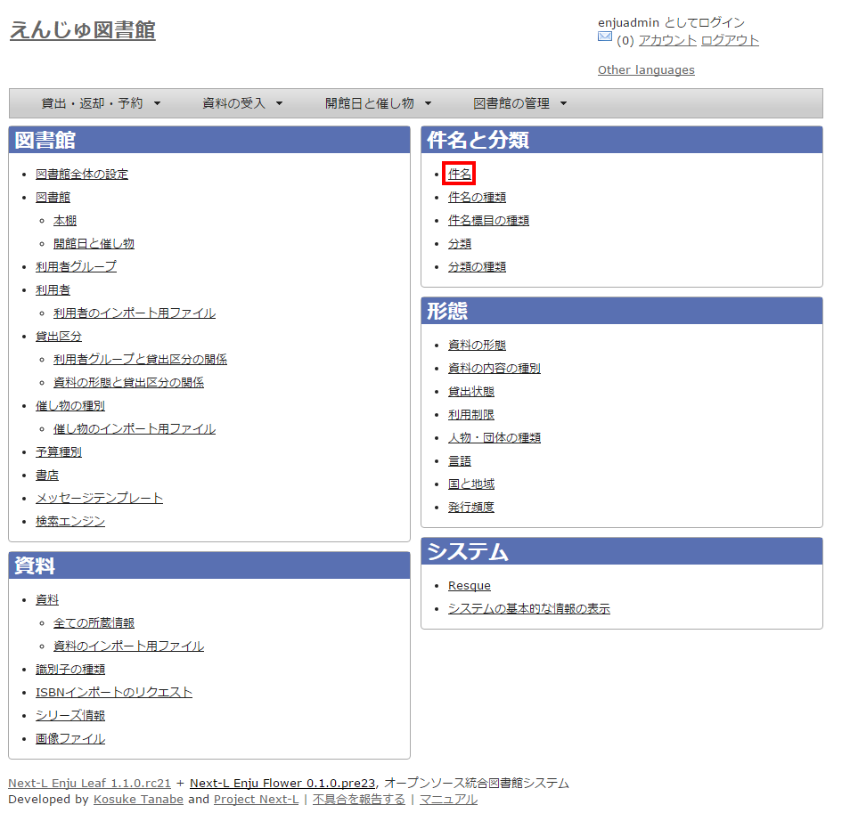

#### 3. 右メニューの［件名の新規作成］をクリックします。  

  

【Memo】入力済みの設定内容を変更する場合は，［編集］をクリックします。

#### 4. 設定項目に必要事項を入力し、［登録する］ボタンをクリックして，設定内容を登録します。  

  

#### 5. 「件名は正常に作成されました」と表示され、件名が作成されます。   

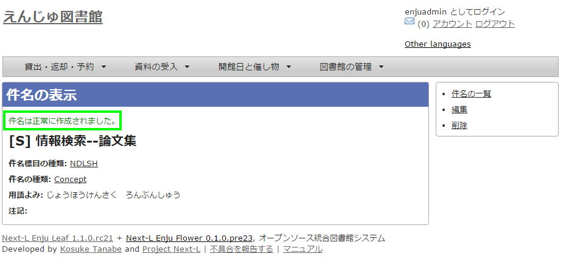  

4-2 件名の種類を設定する {#section4-2}
--------------------------------------

### 4-2-1 設定項目 {#section4-2-1}

* 名前：件名の名称を入力します。
* 表示名：画面に表示する名称を入力します。
* 注記：注意事項や特記事項などを入力します。

### 4-2-2 設定方法 {#section4-2-2}

#### 1. ［図書館の管理］メニューから［システムの設定］を選択します。  

#### 2. ［件名の種類］をクリックします。  

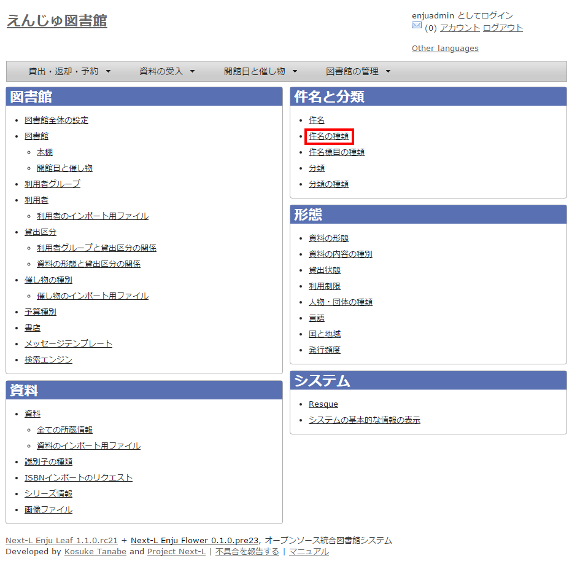

#### 3. 右メニューの［件名の種類の新規作成］をクリックします。  

  

【Memo】入力済みの設定内容を変更する場合は［編集］を，削除する場合は［削除］をクリックします。  
一覧の表示順序を変更するには，表の1列目に表示されている↑または↓をクリックして行を入れ替えます。

#### 4. 設定項目に必要事項を入力し、［登録する］ボタンをクリックして，設定内容を登録します。  

  

4-3 件名標目の種類を設定する {#section4-3}
------------------------------------------

### 4-3-1 設定項目 {#section4-3-1}

* 名前：件名標目を入力します。
* 表示名：画面に表示する名称を入力します。
* 注記：注意事項や特記事項などを入力します。

### 4-3-2 設定方法 {#section4-3-2}

#### 1. ［図書館の管理］メニューから［システムの設定］を選択します。  

#### 2. ［件名標目の種類］をクリックします。  

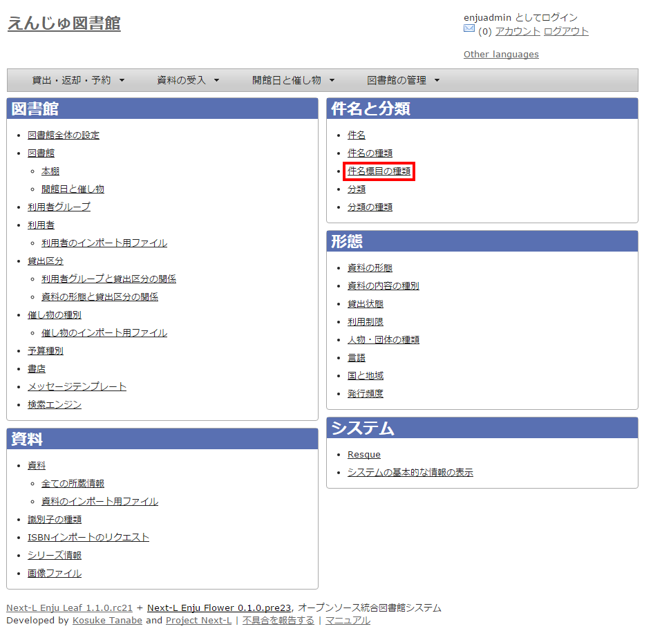

#### 3. 右メニューの［件名標目の種類の新規作成］をクリックします。  

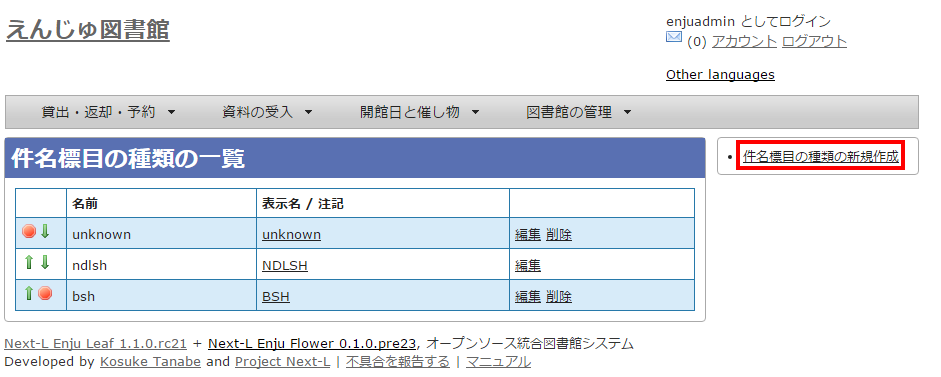  

【Memo】入力済みの設定内容を変更する場合は［編集］を，削除する場合は［削除］をクリックします。  
一覧の表示順序を変更するには，表の1列目に表示されている↑または↓をクリックして行を入れ替えます。

#### 4. 設定項目に必要事項を入力し、［登録する］ボタンをクリックして，設定内容を登録します。  

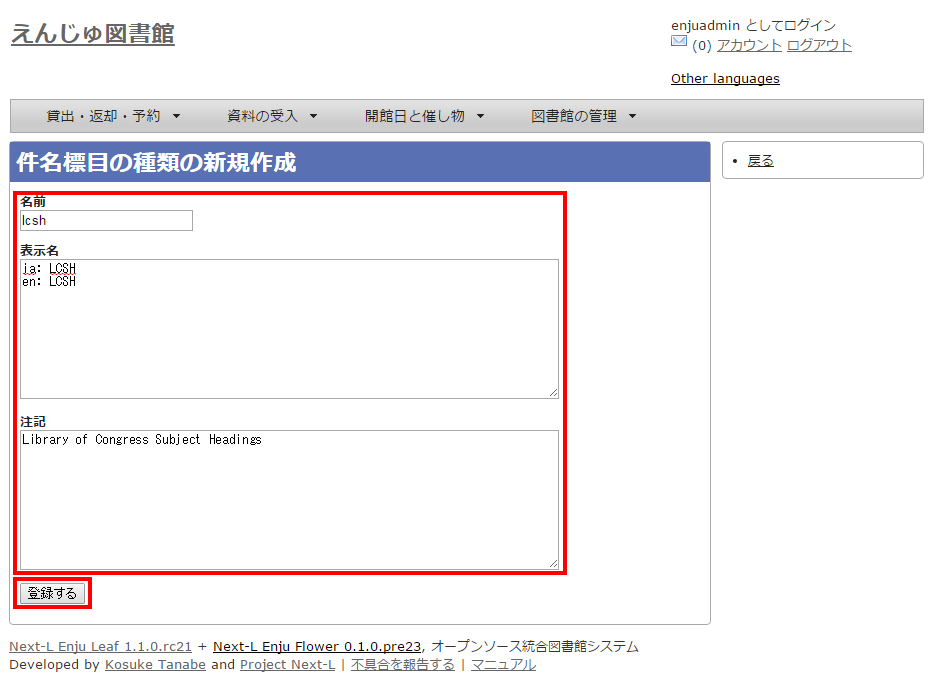  

4-4 分類を設定する {#section4-4}
--------------------------------

### 4-4-1 設定項目 {#section4-4-1}

* カテゴリー：カテゴリーを入力します。
* 注記：注意事項や特記事項などを入力します。
* 分類：▼をクリックし，リストから選択します。  ここで表示されるリストは，「[4-5 分類の種類を設定する](#4-5)」で設定します。

### 4-4-2 設定方法 {#section4-4-2}

#### 1. ［図書館の管理］メニューから［システムの設定］を選択します。  

#### 2. ［分類］をクリックします。  

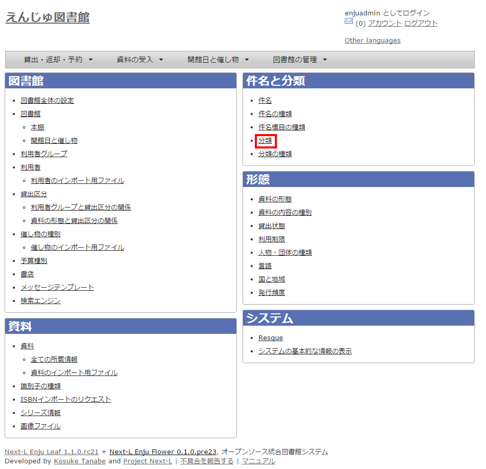

#### 3. 右メニューの［分類の新規作成］をクリックします。  

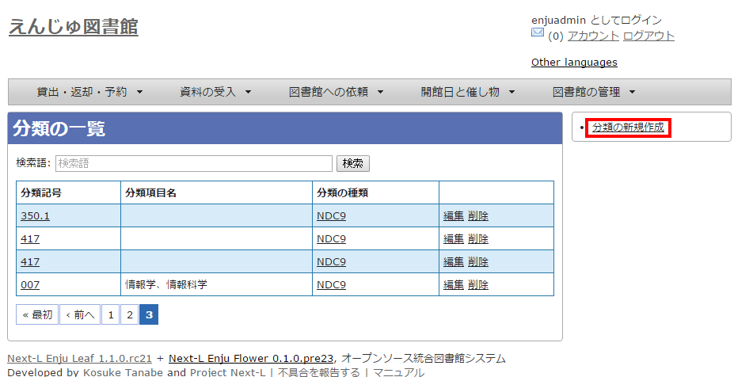  

【Memo】入力済みの設定内容を変更する場合は［編集］を，削除する場合は［削除］をクリックします。

#### 4. 設定項目に必要事項を入力し、［登録する］ボタンをクリックして，設定内容を登録します。  

  

4-5 分類の種類を設定する {#section4-5}
--------------------------------------

### 4-5-1 設定項目 {#section4-5-1}

* 名前：分類の種類を入力します。
* 表示名：画面に表示する名称を入力します。
* 注記：注意事項や特記事項などを入力します。

### 4-5-2 設定方法 {#section4-5-2}

#### 1. ［図書館の管理］メニューから［システムの設定］を選択します。  

#### 2. ［分類の種類］をクリックします。  

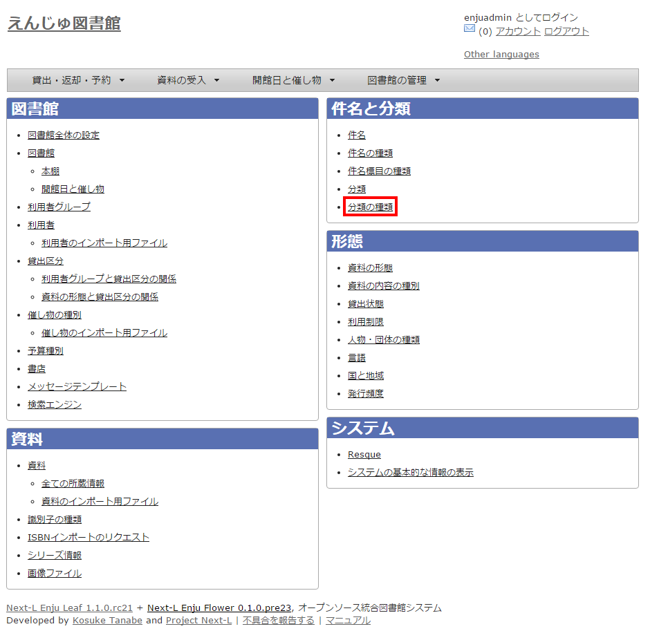

#### 3. 右メニューの［分類型の新規作成］をクリックします。  

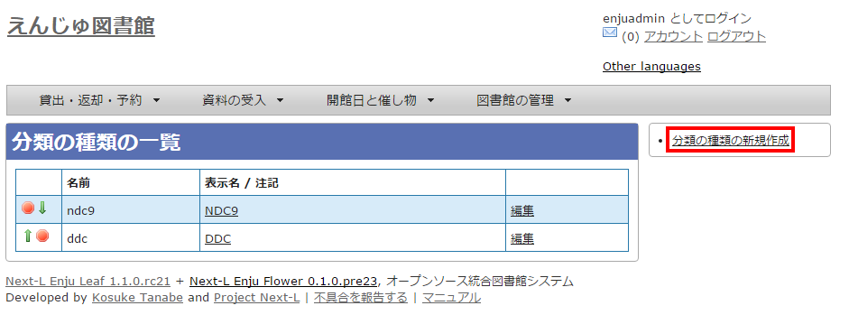  

【Memo】入力済みの設定内容を変更する場合は［編集］を，削除する場合は［削除］をクリックします。
一覧の表示順序を変更するには，表の1列目に表示されている↑または↓をクリックして行を入れ替えます。

#### 4. 設定項目に必要事項を入力し、［登録する］ボタンをクリックして，設定内容を登録します。  

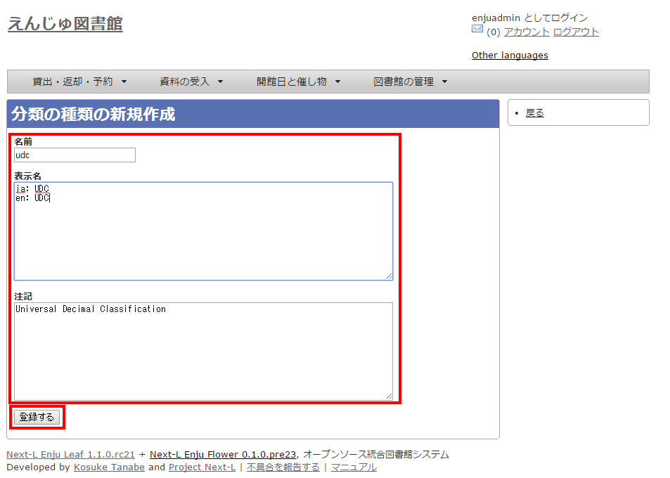  

4-6 その他の機能 {#section4-6}
------------------------------

Enjuでは，その他，次の機能が利用できます。

### 4-6-1 件名と分類の関係を設定する {#section4-6-1}

* ［図書館の管理］メニューから［システムの設定］を選択します。
* ［件名と分類の関係］をクリックして，設定します。


