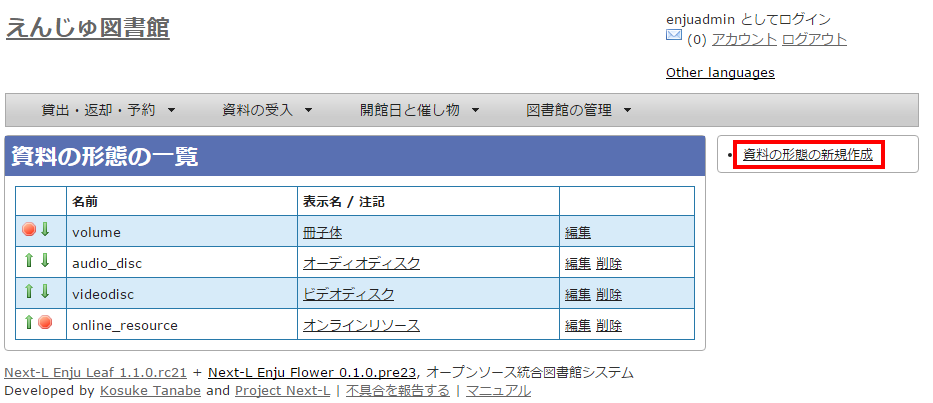
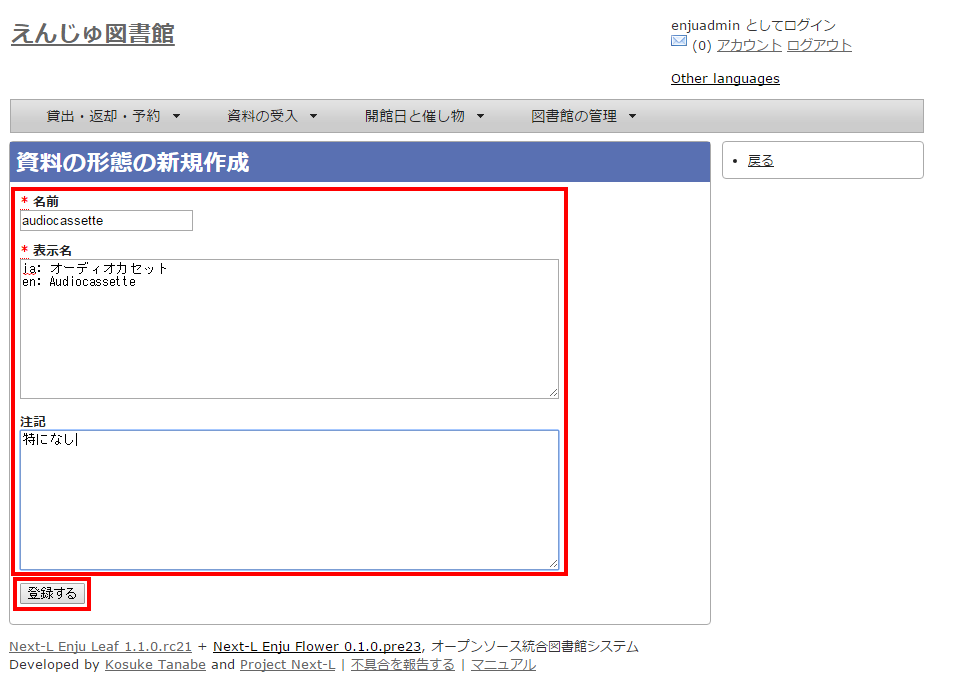
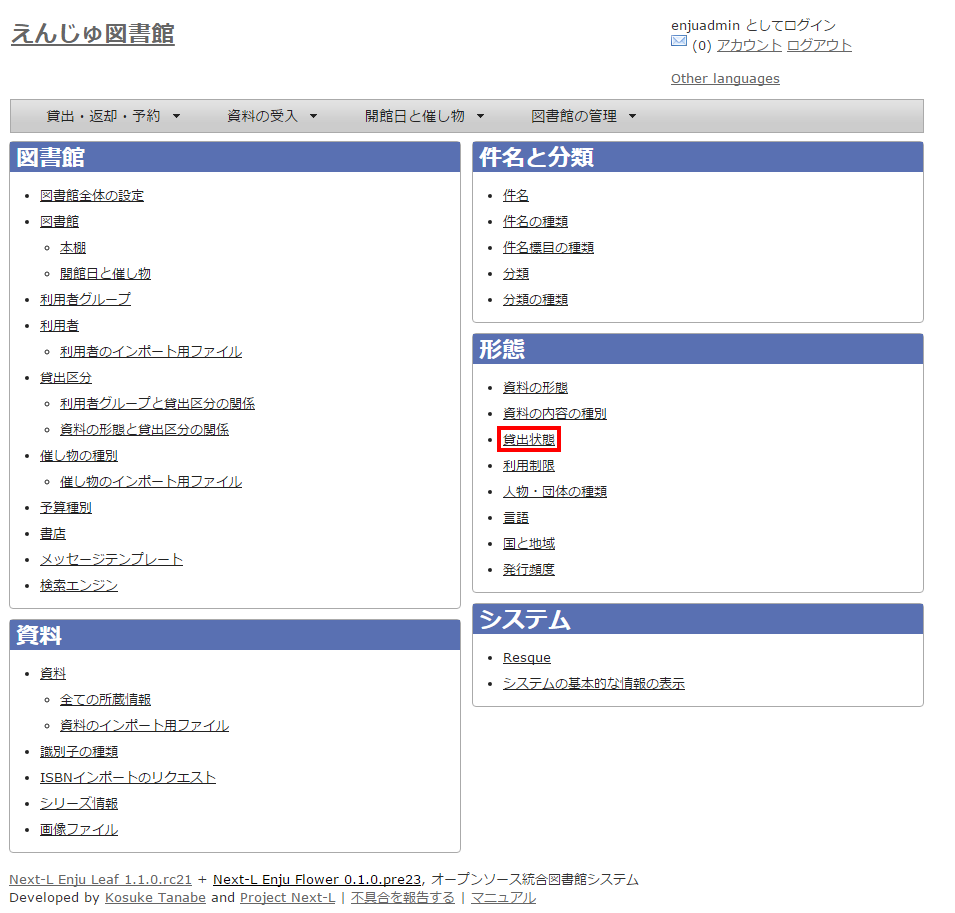
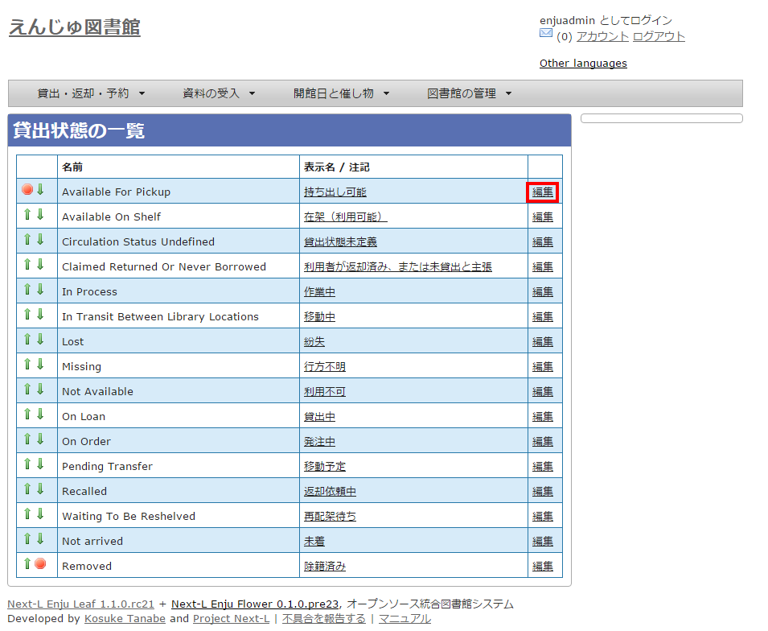
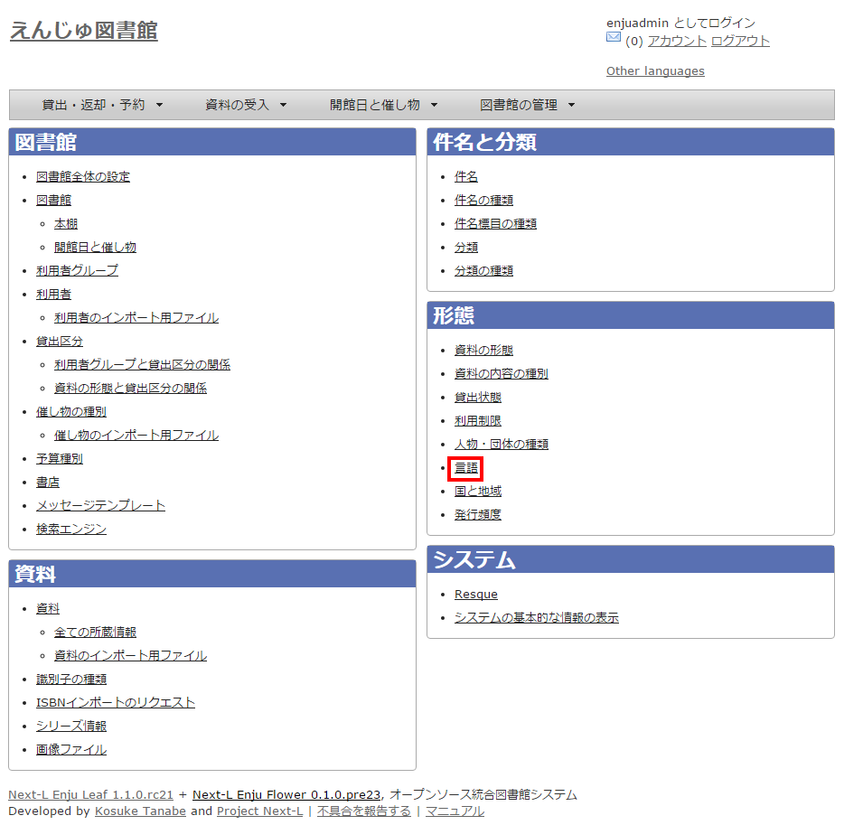
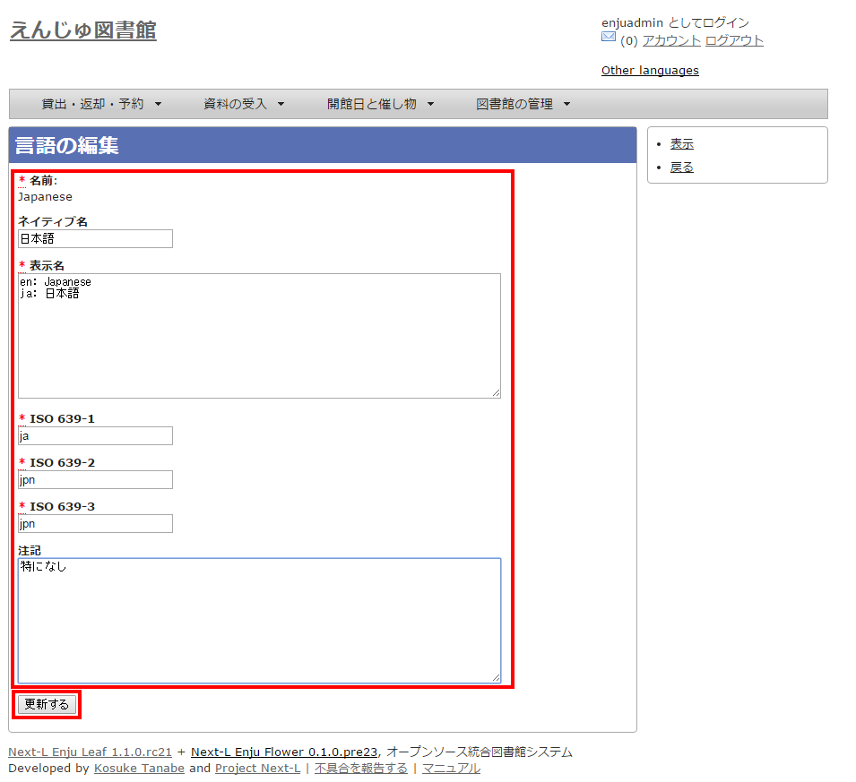

第5章 各種形態や状態等に関するシステム設定を行う {#section5}
============================================================

Enjuの利用を始めるにあたり，形態・状態等に関するシステム設定として，次のような設定作業を行います。

* 資料の形態の作成
* 貸出状態の編集
* 言語の編集
* 利用制限の編集作成
* 発行頻度の編集作成
* 資料の関係の種類の作成

{::comment}5-1 enju_setup/carrier_type.md {:/comment}

{::comment}5-2 enju_setup/ciculaion_status.md {:/comment}

{::comment}5-3 enju_setup/language.md {:/comment}

{::comment}5-4 enju_setup/use_restriction.md {:/comment}

{::comment}5-5 enju_setup/frequency.md {:/comment}

{::comment}5-6 enju_setup/manifestation_relationship_type.md {:/comment}

5-1 資料の形態を作成する {#section5-1}
--------------------------------------

### 5-1-1 設定項目 {#section5-1-1}

* 名前：資料の形態を入力します。
* 表示名：画面に表示する名称を入力します。
* 注記：注意事項や特記事項などを入力します。

### 5-1-2 設定方法 {#section5-1-2}

#### 1. ［図書館の管理］メニューから［システムの設定］を選択します。  

#### 2. ［資料の形態］をクリックします。  

#### 3. 右メニューの［資料の形態の作成］をクリックします。

#### 4. 設定項目に必要事項を入力し、［登録する］ボタンをクリックして，設定内容を登録します。

5-2 貸出状態を編集作成する {#section5-2}
----------------------------------------

### 5-2-1 設定項目 {#section5-2-1}

* 名前：資料の形態を入力します。
* 表示名：画面に表示する名称を入力します。
* 注記：注意事項や特記事項などを入力します。

### 5-2-2 設定方法 {#section5-2-2}

#### 1. ［図書館の管理］メニューから［システムの設定］を選択します。  

#### 2. ［貸出状態］をクリックします。  

#### 3. 設定したい項目の［編集］をクリックします。  

  

【Memo】一覧の表示順序を変更するには，表の1列目に表示されている↑または↓をクリックして行を入れ替えます。

#### 4. 設定項目に必要事項を入力し、［更新する］ボタンをクリックして，設定内容を更新します。  

  

5-3 言語を編集する {#section5-3}
--------------------------------

### 5-3-1 設定項目 {#section5-3-1}

* ネイティブ名：ネイティブ名を入力します。
* 表示名：画面に表示する名称を入力します。
* 注記：注意事項や特記事項などを入力します。

### 5-3-2 設定方法 {#section5-3-2}

#### 1. ［図書館の管理］メニューから［システムの設定］を選択します。  

#### 2. ［言語］をクリックします。  

#### 3. 設定したい項目の［編集］をクリックします。  

  

【Memo】一覧の表示順序を変更するには，表の1列目に表示されている↑または↓をクリックして行を入れ替えます。

#### 4. 設定項目に必要事項を入力し、［更新する］ボタンをクリックして，設定内容を更新します。  

  

5-4 利用制限を編集する {#section5-4}
------------------------------------

システムの標準設定を変更する必要がでることは基本的にはありません。
所蔵情報登録の際に表示される[利用制限]のメニューで表示される文言や、メニューの表示順序を変更したいときのみ編集の必要がでます。

### 5-4-1 設定項目 {#section5-4-1}

* 名前：利用制限を入力します。
* 表示名：画面に表示する名称を入力します。（入力必須）
* 注記：注意事項や特記事項などを入力します。

### 5-4-2 定方法 {#section5-4-2}

#### 1. ［図書館の管理］メニューから［システムの設定］を選択します。  

#### 2. ［利用制限］をクリックします。  

#### 3. 設定したい項目の［編集］をクリックします。  

  

【Memo】一覧の表示順序を変更するには，表の1列目に表示されている↑または↓をクリックして行を入れ替えます。

【Memo】多くの利用制限が登録されてはいますが、Enju Leaf 1.1.0以下では「通常期間貸出」と「貸出不可」のみが利用できます。

#### 4. 設定項目に必要事項を入力し、［更新する］ボタンをクリックして，設定内容を更新します。  

  

5-5 発行頻度を編集する {#section5-5}
----------------------

### 5-5-1 設定項目 {#section5-5-1}

* 名前：発行頻度を入力します。
* 表示名：画面に表示する名称を入力します。
* 注記：注意事項や特記事項などを入力します。

### 5-5-2 設定方法 {#section5-5-2}

#### 1. ［図書館の管理］メニューから［システムの設定］を選択します。  

#### 2. ［発行頻度］をクリックします。  

#### 3. 設定したい項目の［編集］をクリックします。  

【Memo】一覧の表示順序を変更するには，表の1列目に表示されている↑または↓をクリックして行を入れ替えます。

#### 4. 設定項目に必要事項を入力し、［更新する］ボタンをクリックして，設定内容を更新します。

  

【Memo】設定のない発行頻度は，［Other］を利用します。

5-6 資料の関係の種類を作成する {#section5-6}
--------------------------------------------

### 5-6-1 設定項目 {#section5-6-1}

* 名前：資料の関係の種類を入力する。
* 表示名：画面に表示する名称を入力します。
* 注記：注意事項や特記事項などを入力します。

### 5-6-2 設定方法 {#section5-6-2}

#### 1. ［図書館の管理］メニューから［システムの設定］を選択します。  

#### 2. ［資料の関係の種類］をクリックします。  

#### 3. 右メニューの［資料の関係の種類の新規作成］をクリックします。  

【Memo】入力済みの設定内容を変更する場合は［編集］を，削除する場合は［削除］をクリックします。  
一覧の表示順序を変更するには，表の1列目に表示されている↑または↓をクリックして行を入れ替えます。

#### 4. 設定項目に必要事項を入力し、［登録する］ボタンをクリックして，設定内容を登録します。  

5-7 その他の機能 {#section5-7}
------------------------------

Enjuでは形態の設定として，その他，次の機能を利用できます。

### 5-7-1 国と地域を作成する {#section5-7-1}

* ［図書館の管理］メニューから［システムの設定］を選択します。
* ［国と地域］をクリックして，設定します。


