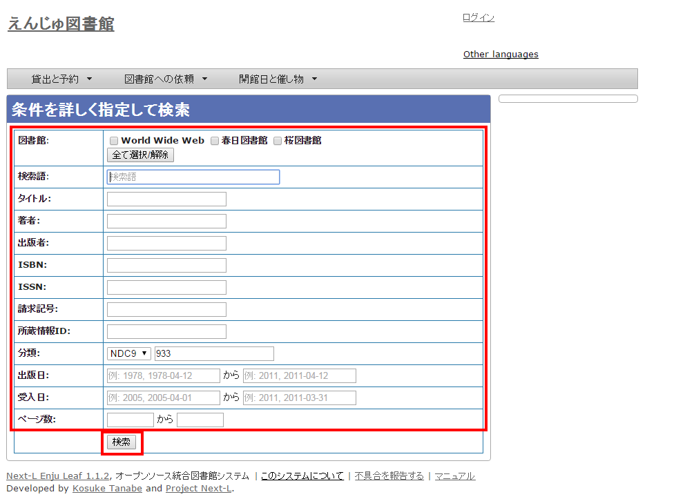
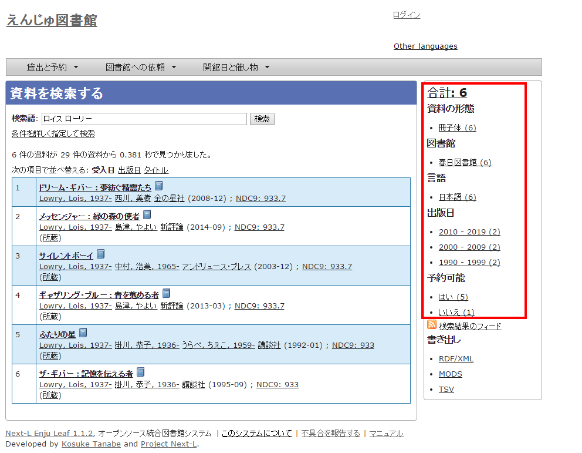

* Contents
{:toc}

第1章 資料を検索する {#section1}
================================

Enjuを利用した資料の検索方法には、演算子やフィールド名を直接入力して検索する方法と、該当のテキストボックスに検索語入力する方法があります。

* キーワードで検索する
* 条件を詳しく指定して検索する
* 演算子やフィールド名を使って検索をする

1-1 キーワードで検索する {#section1-1}
---------------------------------------

資料を指定したキーワードで検索できます。

#### 1. トップページの検索語にキーワードを入力し、［検索］ボタンをクリックします。  

【Memo】スペースで区切りながらキーワードを入力すると、複数のキーワードに一致する資料を検索でき
ます。

#### 2. キーワードに該当する資料が検索されます。詳細を知りたい資料のタイトルをクリックします。  

#### 3. 資料の詳細が表示されます。

1-2 条件を詳しく指定して検索する {#section1-2}
----------------------------------------------

条件を詳しく指定して、資料を検索することもできます。

#### 1. トップページの［（条件を詳しく指定して検索）］をクリックします。  

#### 2. 複数の条件を指定して［検索］ボタンをクリックします。  

【Memo】

* ISBN はハイフンありでもハイフンなしでも検索できます
* 請求記号は前方一致検索します。
* 分類は前方一致検索します。 

1-3 フィールド名や演算子を使って検索する {#section1-3}
-------------------------------------------------------

「and」や「or」や 「()」 などの演算子と、フィールド名を組み合わせた検索式を作成できます。

検索式の例：ruby and (Web or ライブラリ)

より詳しい説明については、 [issue #130](https://github.com/next-l/enju_leaf/issues/130)　を参照してください。

1-4 検索結果を絞り込む {#section1-4}
------------------------------------

検索結果の画面に表示された資料の情報は、画面右側のメニューにある絞込みメニュー（ファセット）を使って絞り込めます。
絞り込める項目は標準では以下の5つが用意されています：

* 資料の形態
* 所蔵する図書館
* 資料の言語
* 出版年
* 予約可能の可否

#### 1. 検索結果を表示する。

#### 2. 出版日の項目から「2010 - 2019」と書かれたリンクをクリックします。

【Memo】それぞれの絞り込みリンクの表記、たとえば「2010 - 2019 (7)」のうち、カッコ内の数字（7）は、この絞り込みにより該当する資料のヒット件数を示しています。参考にしてみてください。

#### 3. 出版年が2010年以降の範囲に絞り込まれた検索結果に移ります。

右側の絞り込みリンクが選択した部分（出版日: 2010 - 2019）だけになり、「この絞り込みを解除する」というリンクが付きます。
絞込みを解除したい場合はこの解除するリンクをクリックしてください。
さらに、別の項目も使って絞り込みたい場合は他のファセットを選択することも可能です。

絞り込んだ中から、詳しく見たい資料を選択してクリックします。


