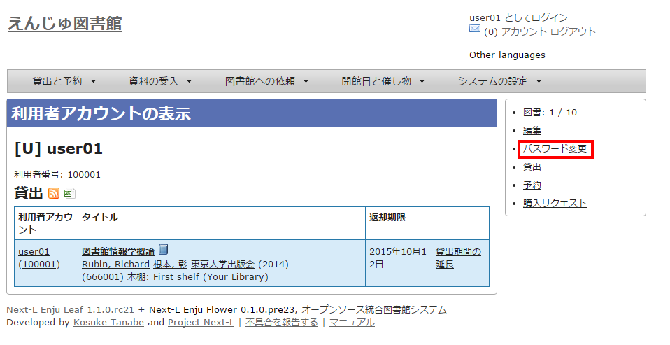
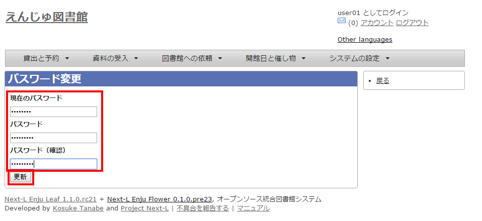
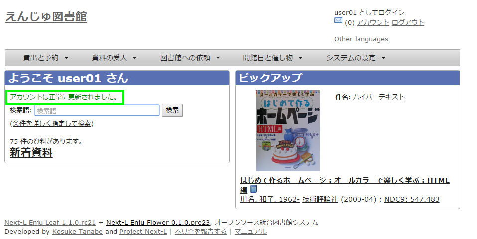

* Contents
{:toc}

第3章 パスワード/ユーザアカウント情報を変更する {#section3}
===========================================================

3-1 パスワードを変更する {#section3-1}
--------------------------------------

#### 1. 右上の[アカウント]リンクをクリックします。

#### 2. 右メニューの[パスワード変更]リンクをクリックします。

#### 3. ［現在のパスワード］と「パスワード」「パスワード(確認)」を入力します。パスワードは画面には表示されません。また「パスワード」と「パスワード(確認)」は同じものを入れてください。[更新]ボタンを押します。

#### 4. 「アカウントは正常に更新されました。」と表示されます。パスワードは変更されました。


