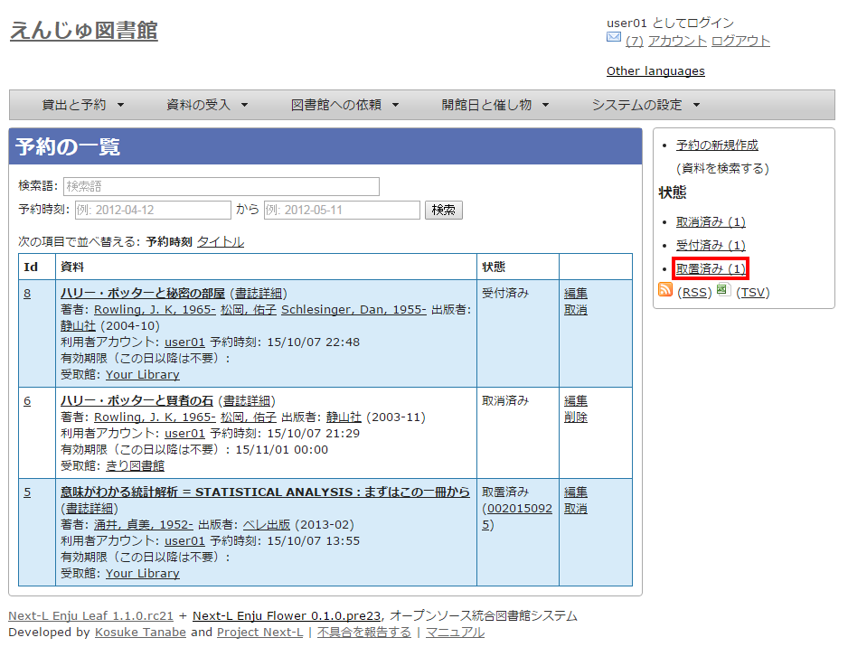
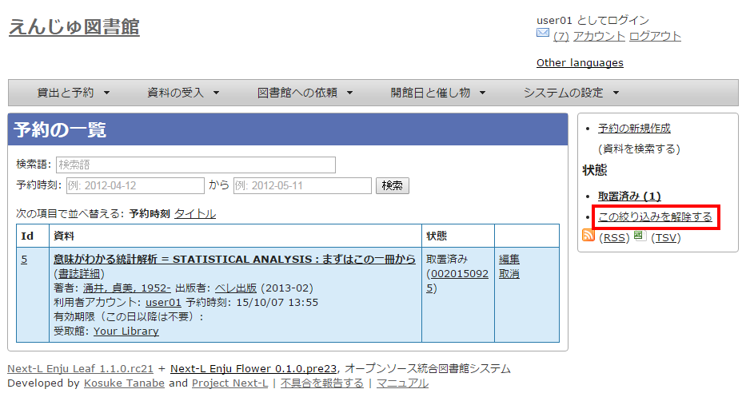

* Contents
{:toc}

第4章 資料を予約する {#section4}
=================================

予約の機能には次のようなものがあります。

* 資料の予約をする
* 予約した資料を確認する
* 予約の変更・取消をする
* 予約した資料が用意されたことを知る
* 予約の一覧をTSVでダウンロードする
* 予約の一覧のRSSを取得する

4-1 資料の予約をする {#section4-1}
----------------------------------

#### 1. 予約したい本の名前を検索語に入力し、［検索］をクリックします。  

#### 2. 予約したい本が検索されたら、［予約］をクリックします。  

※ ログインしていないと[予約]リンクは表示されません

#### 3. 必要ならば、「有効期限（この日以降は不要）」と「受け取り館」を入力し、［登録する］ボタンをクリックします。  

「有効期限（この日以降は不要）」を設定すると、その日を過ぎた予約はキャンセルされます。

#### 4. 「予約が正常に作成されました」と表示され、予約が作成されます。

4-2 予約した資料を確認する {#section4-2}
----------------------------------------

#### 1. ［貸出と予約］メニューから［予約の一覧］を選択します。

#### 2. 予約の一覧が表示されます。右メニュー[取置済み]リンクをクリックします。

「状態」の列をみれば、「取置済み」や「受付済み」が分かります。「取置済み」や「受付済み」になった場合は、メッセージ機能やメールでお知らせがあります。
予約の詳細な情報を知りたい場合は、Id列のリンクか、資料のタイトルのリンクをクリックします。

#### 3. [取置済み]の予約だけが表示されます。右メニューの[この絞り込みを解除する]をクリックします。

#### 4. 最初に表示したように、すべての予約が表示されます。

4-3 予約の変更をする {#section4-3}
----------------------------------------

受取館を変えたり、有効期限を変えたりします。

#### 1. ［貸出と予約］メニューから［予約の一覧］を選択します。

#### 2. [編集]をクリックします。

#### 3. 有効期限（この日以降は不要）や受取館を修正します。

※現在、取置済みの予約でも編集できますが、いずれはできないようにする予定です

4-4 予約の取消をする {#section4-4}
----------------------------------------

（準備中）

4-5 予約した資料が用意されたことを知る {#section4-5}
----------------------------------------------------

（準備中）

4-6 予約の一覧をTSVでダウンロードする {#section4-6}
----------------------------------------------------

（準備中）

4-7 予約の一覧のRSSを取得する {#section4-7}
----------------------------------------------------

（準備中）

