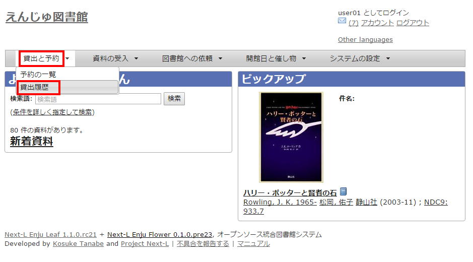
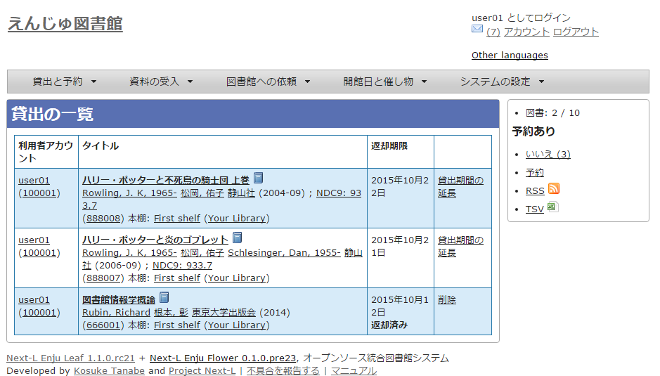

* Contents
{:toc}

第5章 資料の貸出状況を確認する/貸出延長をする {#section5}
=================================

この章では、以下の貸出に関係する機能について説明します。

* 資料の貸出状況を確認する
* 貸出延長をする

5-1 資料の貸出状況を確認する {#section5-1}
----------------------------------------

現在借りている本を確認することができます。
また、[貸出の履歴を保存する](enju_user_3.html#section3-2)にチェックを入れておくと、返却した本も記録され、閲覧できるようになります。
ただし、チェックを入れるまえに返却した本は記録されていないので表示できません。

#### 1. ［貸出と予約］メニューから［貸出履歴］を選択します。

#### 2. 貸出履歴が表示されます

5-2 貸出延長をする {#section5-2}
--------------------------------

（準備中です）

